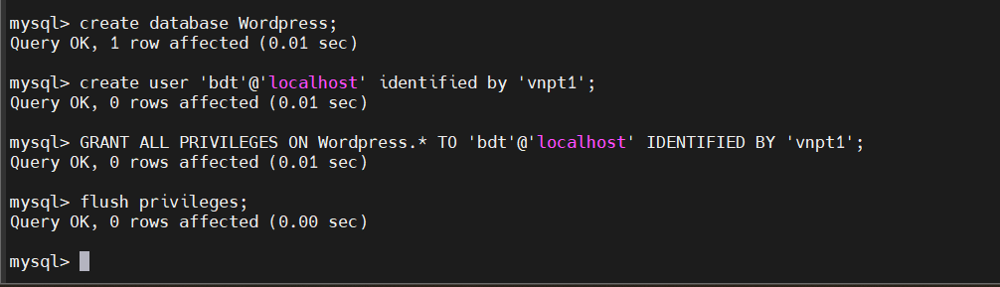
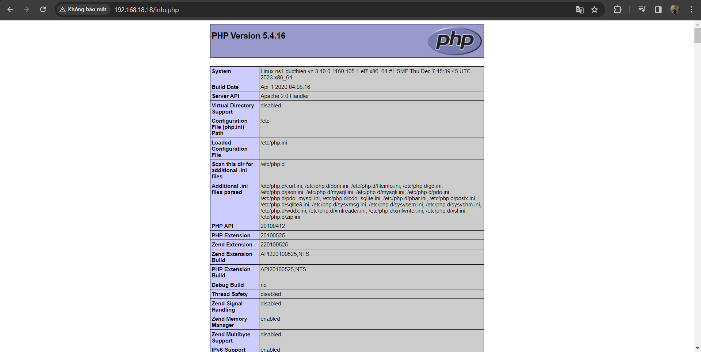

# Cài đặt Wordpress trên CentOS7

WordPress là một phần mêm mã nguồn mở được sử dụng để hỗ trợ việc tạo blog viết bằng ngôn ngữ lập trình PHP và sử dụng hệ quản trị cơ sở dữ liệu MySQL. Nó được rất nhiều người ủng hộ vì dễ sử dụng và nhiều tính năng hữu ích.

**Chuẩn bị**
*Cấu hình máy Web Server*

- 1 CPU
- 512M RAM
- 2 interface


*Cấu hình máy MySQL*

- 1 CPU
- 512M RAM
- 1 interface

Vì đây là môi trường lab nên tôi tiến hành stop firewalld trên cả 2 máy và SElinux trên Web Server.

Sử dụng lệnh

```
setenforce 0

systemctl stop firewalld

```
Thêm network interface mới 

```
vi /etc/sysconfig/network-scripts/ifcfg-ens33:0
```

Sau đó thêm nội dung phía dưới vào file vừa tạo và restart lại mạng

```
DEVICE=ens33:0
TYPE=Ethernet
ONBOOT=yes
BOOTPROTO=static
DEFROUTE=no
PEERDNS=no
PEERROUTES=yes
NAME=ens33:0
IPADDR=192.168.36.36
NETMASK=255.255.255.0
```

# Cấu hình

## 1.Trên Máy SQL

1. Cài đặt MySQL server

**Chạy lần lượt các lệnh sau:**

```
wget http://repo.mysql.com/mysql-community-release-el7-5.noarch.rpm

rpm -ivh mysql-community-release-el7-5.noarch.rpm

yum install mysql-server

```

Trong trường hợp không chạy được lệnh `wget` thì chạy lệnh dưới đây để cài đặt `wget`

```
yum search wget
yum list wget
yum info wget
sudo yum install wget
```

**Khởi động MySQL**

```
systemctl start mysqld
```
**Chạy lệnh sau để thiết lập tài khoản root cho MySQL**

```
mysql_secure_installation
```


2. Tạo Database cho wordpress

Đăng nhập vào MySQL với user root

```
mysql -u root -p
```

Tạo user và database để sử dụng cho wordpress
```
create database WordPress;
create user 'user1'@'192.168.136.126' identified by 'vnpt1';
GRANT ALL PRIVILEGES ON wordpress.* TO 'admin'@'%' IDENTIFIED BY 'vnpt1';
flush privileges;
```

Trong đó

- `tên-database` là tên database sử dụng cho wordpress.
- `user` là tên user sử dụng để wordpress kết nối vào MySQL.
- `IP` là địa chỉ của máy Web Server để truy cập MySQL




# 2.Trên máy Web server

1. Cài đặt Apache

```
yum install httpd -y
```

Khởi động Apache và cho phép khởi động cùng hệ thống

```
systemctl start httpd

systemctl enable httpd
```

Để kiểm tra ta mở trình duyệt và truy cập vào địa chỉ IP của web server

```
http://địa-chỉ-IP
```

2. Cài PHP

Sử dụng `yum` để cài PHP
```
yum install php php-mysql php-gd php-pear –y
```

Để test PHP đã cài đặt thành công chưa, thực hiện lệnh

```
echo "<?php phpinfo(); ?>" > /var/www/html/info.php
```

Sau đó restart lại httpd

```
systemctl restart httpd
```

Mở trình duyệt web truy cập địa chỉ `http://địa chỉ Ip/info.php`



3. Cài wordpress

Truy cập vào thư mục html
```
cd /var/www/html
```

Dowload file để cài wordpress từ internet

```
wget https://wordpress.org/latest.tar.gz
```

Giải nén tập tin

```
tar xzvf latest.tar.gz
```

Cấu hình wordpress để kết nối với MySQL

```
cd /var/www/html/

mv wordpress/* /var/www/html/

mv wp-config-sample.php wp-config.php
```


**Sửa file**

```
vi wp-config.php
```

Sau đó tìm các dòng sau để sửa thông tin
```
define('DB_NAME', 'database_name_here');    

define('DB_USER', 'username_here');    

define('DB_PASSWORD', 'password_here');      

define('DB_HOST', 'localhost'); 
```

Trong đó:

- database_name_here : tên của database
- username_here : tên user login vào mysql
- username_here : password của user login vào mysql
- localhost : địa chỉ cuả máy MySQL Sever


Sau đó lưu các thay đổi

Mở kết nối sang MySQL server

Bây giờ mở trình duyệt và truy cập địa chỉ của bạn để tiến hành cấu hình wordpress.

Sau khi cấu hình và đăng nhập vào sẽ có được giao diện như sau