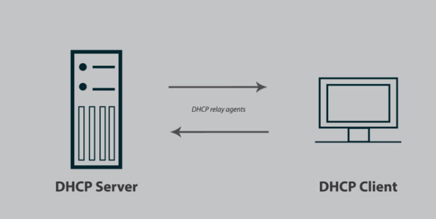

# Tìm hiểu giao thức DHCP

# 1.DHCP là gì 

## 1.1.DHCP là gì?

DHCP (Dynamic Host Configuration Protocol) là giao thức cấu hình host động. Nó cung cấp cho máy tính địa chỉ ip ; subnet mask; default gateway. Và nó thường được cấp phát bởi DHPC server được tích hợp sẵn trên router.

DHCP giao tiếp bằng UDP và sử dụng port 67 và 68. DHCP server sử dụng port 67 để nghe thông tin từ các client và sử dụng port 68 để reply thông tin

## 1.2.DHCP Server là gì?

DHCP server là máy chủ có chức năng kết nối mạng và trả về thông tin khi máy trạm DHCP (DHCP Client) gửi yêu cầu. Ngoài việc trả thông tin hợp lý đến các thiết bị kết nối thì DHCP Server còn có nhiệm vụ thực hiện cấu hình cổng mắc định Default gateway cũng như Subnet Mask.

# 2.Ưu-Nhược điểm
## 2.1.Ưu điểm khi sử dụng DHCP

- Tập trung quản trị thông tin cấu hình host
- Cấu hình động các máy
- Cấu hình IP cho các máy một cách liền mạch.
- Sự linh hoạt
- Đơn giản hóa vài trò quản trị của việc cauas hình địa chỉ IP của client.
- Sự linh hoạt

## 2.2.Nhược điểm khi sử dụng DHCP

Mặc dù DHCP mang đến nhiều ưu điểm trong việc tăng tốc độ truy cập mạng và quản lý hệ thống mạng nhưng cũng tồn tại nhược điểm khi sử dụng dịch vụ này trên những thiết bị cố định như máy in, file server. 
Chính vì thế DHCP phù hợp hơn cho các hệ thống mô hình mạng nhỏ hoặc trong các hộ gia đình sử dụng.

# 3.Công dụng của DHCP

Dịch vụ DHCP mang đến nhiều tiện ích cho người dùng trong quá trình quản trị cấu hình mạng TCP/IP. Nhờ có dịch vụ DHCP sẽ giảm được các tình trạng lỗi IP như gán trùng, gán sai địa chỉ,… Sự xung đột IP sẽ được hạn chế tối đa khi DHCP xác định đúng địa chỉ IP từ máy chủ DHCP là gì và truyền đến thiết bị yêu cầu. Ngoài ra, sự đơn giản hóa và khả năng linh hoạt của DHCP giúp đơn giản hóa công tác quản trị và tạo ra sự kết nối liền mạch, tránh gián đoạn.

Dịch vụ DHCP còn có chức năng cấp phát địa chỉ động trong các trường hợp DHCP không được phép cấp IP cho máy DHCP Client.

Vậy địa chỉ IP động đặc biệt là gì? Đây là thuật ngữ dịch từ Automatic private IP Addressing (APIPA) có trên hệ điều hành Windows. APIPA cho phép gán tự động địa chỉ IP động có giá trị từ 169.254.0.0 đến 169.254.255.255 khi DHCP Server không thể cấp IP cho thiết bị.

Cách thức cấp phát địa chỉ IP động của dịch vụ DHCP là gì? Dịch vụ DHCP thực hiện hợp đồng thuê địa chỉ IP và gia hạn hợp đồng để cấp phát địa chỉ IP theo phương thức động cho máy DHCP Client.

# 4.Các thành phần của DHCP

Khi làm việc với DHCP, bạn cần hiểu tất cả thành phần của nó. Dưới đây là danh sách các thành phần của DHCP.

- DHCP server 
Một thiết bị mạng chạy dịch vụ DHCP chứa địa chỉ IP và thông tin cấu hình liên quan. Đây thường là máy chủ hoặc router nhưng có thể là bất cứ thứ gì hoạt động như máy chủ chẳng hạn như thiết bị SD-WAN.

- DHCP client 
Thiết bị nhận thông tin cấu hình từ máy chủ DHCP. Đây có thể máy tính, thiết bị di động, thiết bị IoT (Internet of Things) hoặc bất cứ thiết bị gì khác yêu cầu kết nối mạng. Hầu hết các thiết bị này được cấu hình để nhận thông tin DHCP theo mặc định.

- IP address pool 
Dãy địa chỉ có sẵn cho client DHCP. Những địa chỉ này thường được truyền tuần tự từ thấp nhất đến cao nhất.

- Subnet 
Mạng IP có thể được phân thành các phân đoạn được gọi là subnet (mạng con). Mạng con giúp mạng được quản lý dễ dàng hơn.

- Lease 
Khoảng thời gian client DHCP giữ thông tin địa chỉ IP. Khi khoảng thời gian này hết hạn, client phải làm mới nó.

- DHCP relay 
Router hoặc máy chủ nghe tin nhắn được phát trên mạng đó và sau đó chuyển chúng đến một máy chủ được cấu hình. Máy chủ này sau đó phản hồi lại relay agent để truyền chúng đến client. Nó được sử dụng để tập trung máy chủ DHCP thay vì để máy chủ trên mỗi mạng con.

# 5.Cách thức hoạt động 

DHCP tự động quản lý các địa chỉ IP và loại bỏ được các lỗi có thể làm mất liên lạc. Nó tự động gán lại các địa chỉ chưa được sử dụng. DHCP cho thuê địa chỉ trong một khoảng thời gian, có nghĩa là những địa chỉ này sẽ còn dùng được cho các hệ thống khác. Bạn hiếm khi bị hết địa chỉ. DHCP tự động gán địa chỉ IP thích hợp với mạng con chứa máy trạm này. Cũng vậy, DHCP tự động gán địa chỉ cho người dùng di động tại mạng con họ kết nối

Trình tự thuê Địa chỉ IP DHCP là một giao thức Internet có nguồn gốc ở BOOTP (bootstrap protocol), được dùng để cấu hình các trạm không đĩa. DHCP khai thác ưu điểm của giao thức truyền tin và các kỹ thuật khai báo cấu hình được định nghĩa trong BOOTP, trong đó có khả năng gán địa chỉ. Sự tương tự này cũng cho phép các bộ định tuyến hiện nay chuyển tiếp các thông điệp BOOTP giữa các mạng con cũng có thể chuyển tiếp các thông điệp DHCP. Vì thế, máy chủ DHCP có thể đánh địa chỉ IP cho nhiều mạng con.

Quá trình đạt được địa chỉ IP được mô tả dưới đây

Bước 1: Máy trạm khởi động với "địa chỉ IP rỗng" cho phép liên lạc với máy chủ DHCP bằng giao thức UDP. Nó chuẩn bị một thông điệp (DHCP Discover) chứa địa chỉ MAC (ví dụ địa chỉ của card Ethernet) và tên máy tính. Thông điệp này có thể chứa địa chỉ IP trước đây đã thuê. Máy trạm phát tán liên tục thông điệp này lên mạng cho đến khi nhận được phản hồi từ máy chủ.

Bước 2: Mọi máy chủ DHCP có thể nhận thông điệp và chuẩn bị địa chỉ IP cho máy trạm. Nếu máy chủ có cấu hình hợp lệ cho máy trạm, nó chuẩn bị thông điệp đề nghị (DHCP Offer) chứa địa chỉ MAC của khách, địa chỉ IP đề nghị, mặt nạ mạng con (subnet mask), địa chỉ IP của máy chủ và thời gian cho thuê. Địa chỉ đề nghị được đánh dấu là "reserve" (để dành). Máy chủ DHCP phát tán thông điệp đề nghị này lên mạng.

Bước 3: Khi khách nhận thông điệp đề nghị và chấp nhận một trong các địa chỉ IP, máy trạm phát tán thông điệp này để khẳng định nó đã chấp nhận địa chỉ IP và từ máy chủ DHCP nào.

Bước 4: Cuối cùng, máy chủ DHCP khẳng định toàn bộ sự việc với máy trạm. Để ý rằng lúc đầu máy trạm phát tán yêu cầu về địa chỉ IP lên mạng, nghĩa là mọi máy chủ DHCP đều có thể nhận thông điệp này. Do đó, có thể có nhiều hơn một máy chủ DHCP tìm cách cho thuê địa chỉ IP bằng cách gửi thông điệp đề nghị. Máy trạm chỉ chấp nhận một thông điệp đề nghị, sau đó phát tán thông điệp khẳng định lên mạng. Vì thông điệp này được phát tán, tất cả máy chủ DHCP có thể nhận được nó. Thông điệp chứa địa chỉ IP của máy chủ DHCP vừa cho thuê, vì thế các máy chủ DHCP khác rút lại thông điệp chào hàng của mình và hoàn trả địa chỉ IP vào vùng địa chỉ, để dành cho khách hàng khác.

*Tài liệu tham khảo* 

[1] [https://blog.cloud365.vn/ccna/dhcp-tong-quan/](https://blog.cloud365.vn/ccna/dhcp-tong-quan/)

[2] [https://vi.wikipedia.org/wiki/DHCP](https://vi.wikipedia.org/wiki/DHCP)

[3] [https://bizflycloud.vn/tin-tuc/dhcp-la-gi-2018100909553575.htm](https://bizflycloud.vn/tin-tuc/dhcp-la-gi-2018100909553575.htm)

[4] [https://fptcloud.com/dhcp-la-gi/](https://fptcloud.com/dhcp-la-gi/)