# Cấu hình DHCP trên Centos 7

Dynamic Host Configuration Protocol (DHCP) là một network protocol có chức năng tự động cung cấp các thông số TCP/IP (Địa chỉ IP, gateway, DNS Server,...) cho các máy client

Điểm mạnh của DHCP là giúp ta cấu hình địa chỉ IP của hàng loạt các máy client chỉ bằng việc thay đổi cấu hình file config. Thay đổi sẽ có hiệu lực khi restart mạng hoặc reboot các máy client

# 1.Cấu hình DHCP Server
# 1.1.Cài đặt DHCP

Kiểm tra xem DHCP đã được cài đặt trên server hay chưa:
```
rpm -q dhcp
```


Cài đặt DHCP:

```
yum install dhcp
```

## 1.2. File cấu hình


**Thành phần file cấu hình**

- Cấu hình toàn cục ( `global` ) : quy định những thông tin giá trị mặc định cho các khai báo lớp mạng ( `subnet` ) cấp pháp IP động DHCP .
- Cấu hình lớp mạng cấp phát IP động ( `scope` ) : quy định những giá trị thông tin cho việc cấp phát IP động thông qua DHCP .

**File cấu hình dhcp nằm tại:**

```
cat /etc/dhcp/dhcpd.conf
```

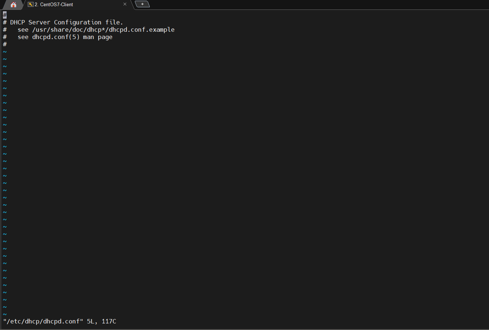


File cấu hình ban đầu sẽ không có thông số cấu hình nên ta copy file mẫu và chỉnh sửa theo nhu cầu:

```
cp /usr/share/doc/dhcp*/dhcpd.conf.example /etc/dhcp/dhcpd.conf
```

Chỉnh sửa file cấu hình DHCP:

```
vi /etc/dhcp/dhcpd.conf
```
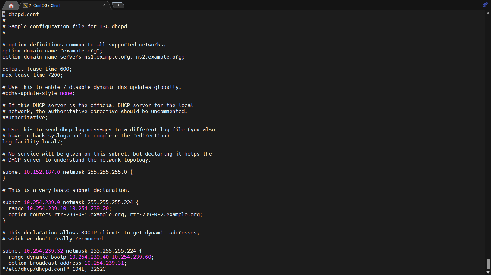

**Cấu hình Global:**

Cấu hình `domain name` và `domain name-server`:


Thời gian mặc định cấp IP cho 1 Client và Thời gian tối đa cấp IP cho 1 Client. (đơn vị: giây)

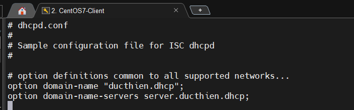


Nếu máy chủ là máy chủ chính thức trong mạng nội bộ, bạn hãy bỏ comment tùy chọn `authoritative`:

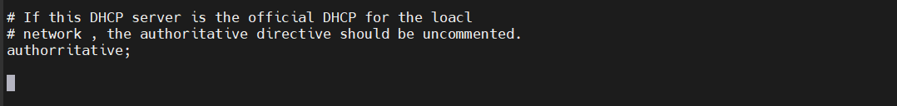

Log của DHCP tại `/var/log/boot.log:`

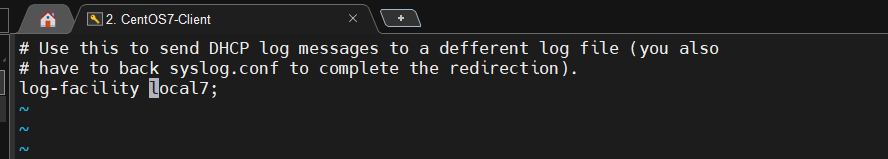

**Cấu hình Scope:**

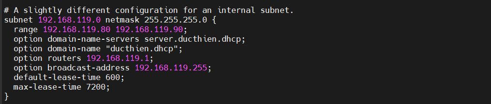


**Trong đó** 
- range : vùng địa chỉ IP được dùng để cấp phát cho Client
- option domain-name-servers: DNS Server
- option domain-name : Tên Domain
- option routers : Default gateway
- option broadcast-address : Địa chỉ broadcast của dải mạng
- default-lease-time : Thời gian mặc định cấp IP cho một Client (ưu tiên hơn global) (đơn vị: giây)
- max-lease-time : Thời gian tối đa cấp IP cho một Client (ưu tiên hơn global) (đơn vị: giây)


## 1.3.Khởi động dịch vụ dhcp và kích hoạt tự khởi động:

```
systemctl start dhcpd
systemctl enable dhcpd
```

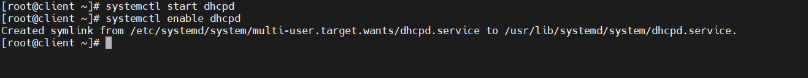

## 1.4.Cấu hình Firewall cho dịch vụ dhcp:

```
firewall-cmd --add-service=dhcp --permanent
firewall-cmd --reload
```


## 1.5.Kiểm tra trạng thái dịch vụ:

```
systemctl status dhcpd
```
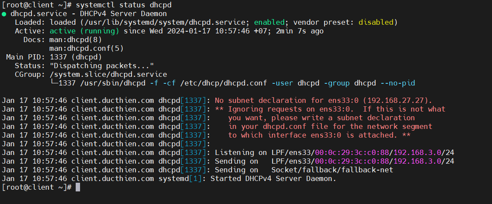


# 2.Cấu hình trên DHCP Client
## 2.1.Trên Client CentOS-7

Cài đặt Interface mạng nhận DHCP của Server ta tạo ở trên:

```
[root@localhost ~]# cat /etc/sysconfig/network-scripts/ifcfg-ens37
```
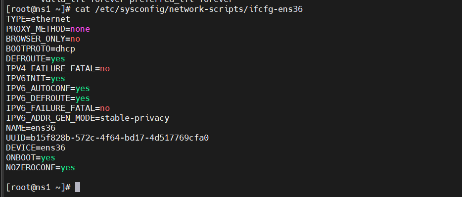

Sau đó khởi động lại dịch vụ mạng:

Ip ban đầu 

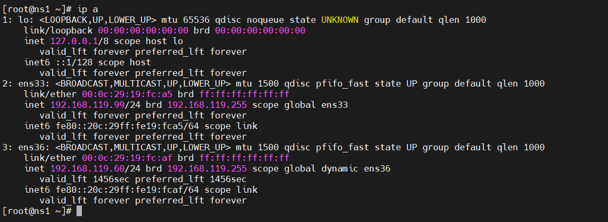

IP sau khi cấp phát DHCP

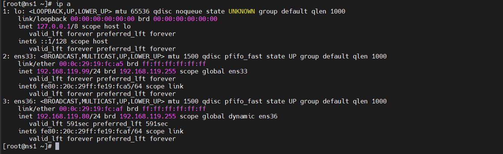

## 2.2.Trên Client Window 10

Vào Run gõ `ncpa.cpl` để mở cửa sổ Network Connections

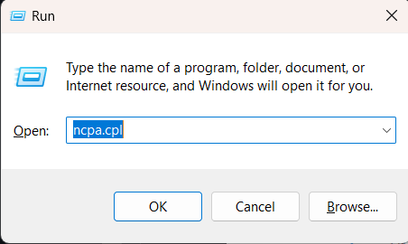

Ta vào cài đặt để set DHCP :

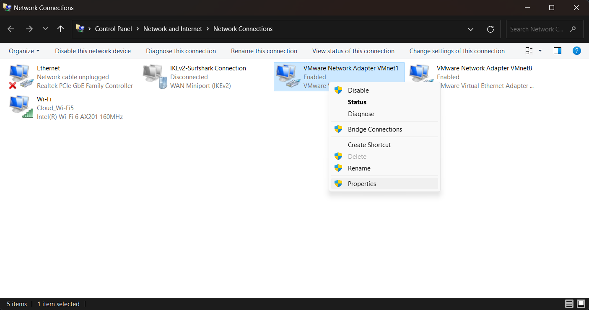

Chọn 'IPv4' - > 'Properties':

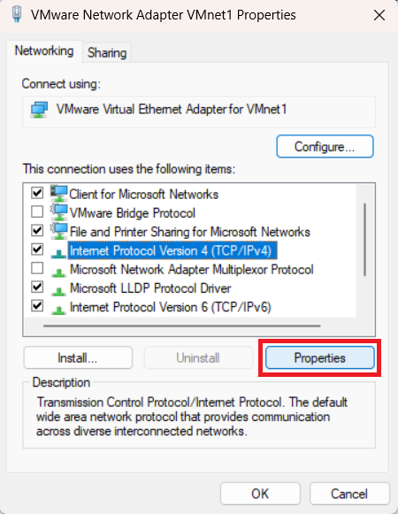

Thiết lập như hình:

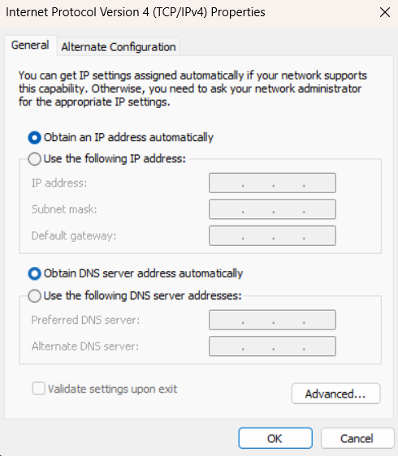

Vào `cmd` thực hiện các lệnh sau:

```
> ipconfig /release
> ipconfig /renew
> ipconfig
```

Ta được kết quả IP của Client Window 10 :

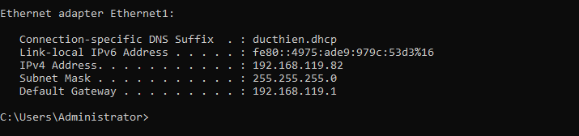


