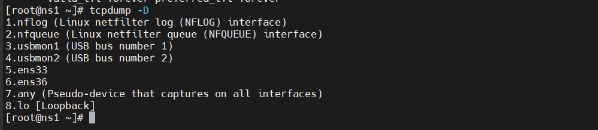
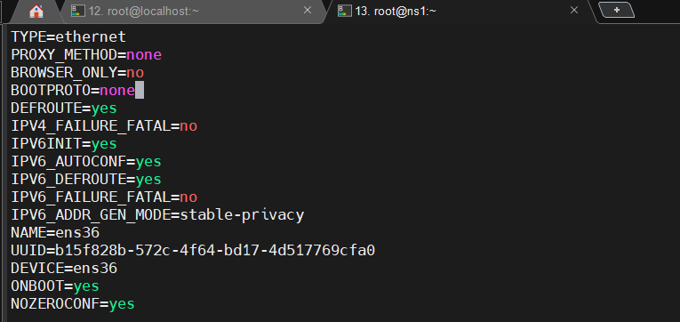
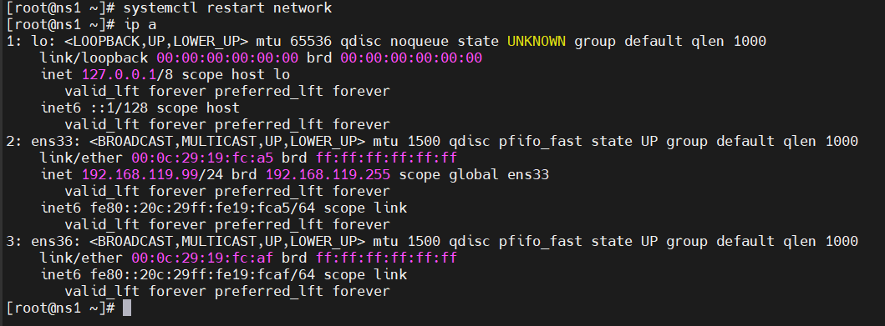

# Phân tích gói tin khi Client nhận ip của DHCP Server
# 1.Phân tích gói tin sử dụng TCPdump(trên centos7)

## 1.1.Lệnh tcpdump

`tcpdump` là 1 câu lệnh dùng để bắt và phân tích gói của 1 giao thức trong máy tính.
Kiểm tra và cài đặt `tcpdump`:
```
[root@ns1 ~]# tcpdump -D
-bash: tcpdump: command not found
[root@ns1 ~]# yum install tcpdump
```


Các option lệnh `tcpdump`

- Hiển thị các giao diện mạng: `# tcpdump -D`
- Bắt gói tin ở các giao diện mạng: `# tcpdump -i <giao_diện_mạng(ens33, ens37,...)>`
- Bắt gói tin với n gói tin: `# tcpdump -i <giao_diện_mạng> -c <n>`
- Hiển thị gói tin dưới dạng HEX và ASCII: `# tcpdump -xx -i <giao_diện_mạng> -c 2`
- Bắt gói tin với địa chỉ IP: `# tcpdump -i <giao_diện_mạng> -n`
- Thêm trường ngày khi bắt gói tin: `# tcpdump -i <giao_diện_mạng> -tttt`
- Bắt gói tin với 1 kiểu giao thức cụ thể: `# tcpdump -i <giao_diện_mạng> tcp`
- Bắt gói tin với 1 port cụ thể: `# tcpdump -i <giao_diện_mạng> port <số_hiệu_port>`
- Bắt gói tin lưu vào 1 file: `# tcpdump -i <giao_diện_mạng> -c 5 -w tcpdump_test.pcap`


Để bắt được gói DHCP cấp độ đầu tiên, chúng ta phải thiết lập lại Máy khách không nhận IP từ Máy chủ DHCP. Chỉnh sửa tập tin sau:`/etc/sysconfig/network-scripts/ifcfg-ens36`




Sau đó khởi động lại. Kiểm tra lại giao diện `ens36`:



Hiện tại, giao diện `ens36` chưa được đặt địa chỉ IP. Ta sẽ mở 2 terminal. 1 bên chỉnh sửa giao diện cấu hình tệp ens36 - ta set BOOTPROTO = "dhcp", 1 bên sử dụng tcpdumpđể bắt gói khi DHCP cung cấp IP

# 2.Phân tích gói tin sử dụng WireShark(trên window)