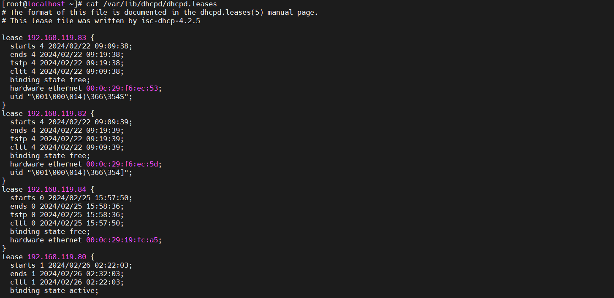
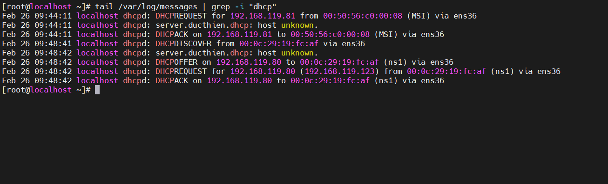
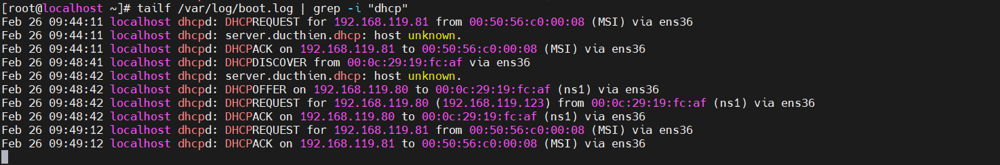

# File DHCP Log

## 1.Danh sách địa chỉ IP đã cấp phát bởi DHCP

Để xem những địa chỉ IP đã được cấp phát bởi DHCP Server trên CentOS ta có thể xem ở file: `/var/lib/dhcpd/dhcpd.leases`




## 2.Quá trình cấp phát của dịch vụ DHCP

File log qúa trình cấp phát của dịch vụ DHCP thì xem log tại file log message:

```
tail /var/log/messages | grep -i "dhcp"
```



## 3.Log của DHCP

Có thể xem Log của DHCP tại `/var/log/boot.log`
Sử dụng lệnh `tailf` để theo dõi sự thay đổi của file log

```
tailf /var/log/boot.log | grep -i "dhcp"
```

