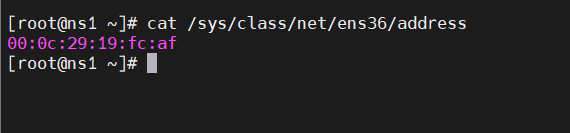
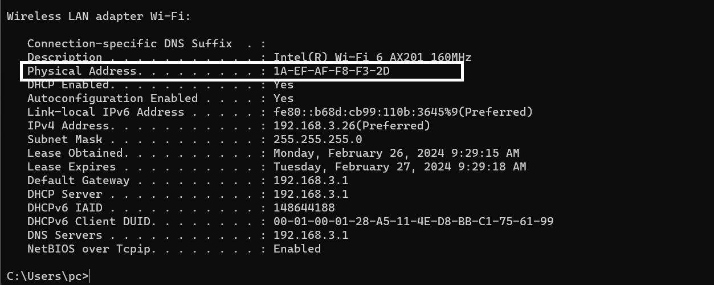
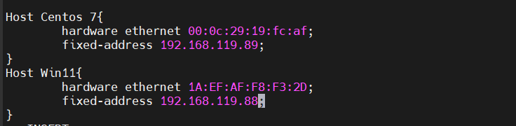

# DHCP cấp phát IP theo địa chỉ MAC(Bind IP to MAC)

## 1.Xác định địa chỉ MAC của Client

**Trên Client CentOS-7:**
- Ta dùng lệnh dưới đây để kiểm tra địa chỉ MAC
```
cat /sys/class/net/ens36/address
```



**Trên Window:**

Mở `cmd` gõ lệnh `ipconfig/all`



Ta được địa chỉ MAC của interface Ethernet1:

*Lưu ý: Đổi các dấu - thành dấu : để tránh lỗi DHCP Server*

`1A:EF:AF:F8:F3:2D`


## 2.Cấp IP theo địa chỉ MAC

Trên DHCP Server: ta chỉnh sửa file cấu hình DHCP trên DHCP Server

```
vi /etc/dhcp/dhcpd.conf
```

Sau đó thêm

host centos7 { hardware ethernet 08:00:27:7a:5b:98; fixed-addres 192.168.3.137; }

host win11 { hardware ethernet 18:26:49:51:6D:00; fixed-address 192.168.3.178; } Trong đó

- Hardware ethernet: địa chỉ MAC của client
- Fixed-address: địa chỉ cấp phát cho Client đó.



Sau đó restart lại dịch vụ `dhcp`

**Trên Client Centos_7**

Ta xin cấp lại địa chỉ IP từ DHCP server

```
dhclient -r
dhclient -v
```


**Trên client Window11**

Ta xin cấp lại địa chỉ IP từ DHCP Server Nhấn window+r và nhập cmd và nhập các lệnh

```
ipconfig /release
ipconfig /renew
ipconfig
```