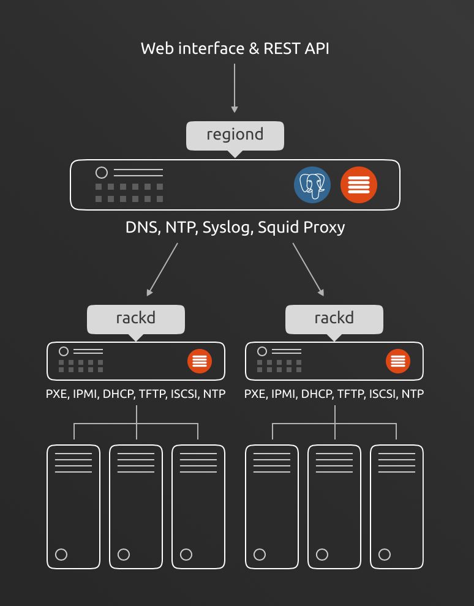

# Tổng quan về MaaS (Metal as a Service)

## 1. MaaS là gì 
MAAS (Metal as a Service) là một giải pháp quản lý phần cứng đám mây mạnh mẽ, cung cấp tự động hóa từ xa cho phần cứng trần. MAAS cho phép bạn cung cấp các máy chủ vật lý, máy ảo và các thiết bị mạng cho các ứng dụng của mình, cung cấp một cách tiếp cận hiện đại cho việc quản lý cơ sở hạ tầng của bạn.

MAAS là một phần của hệ sinh thái OpenStack, nhưng nó cũng có thể được sử dụng độc lập. MAAS có thể được sử dụng để quản lý các máy chủ vật lý, máy ảo và các thiết bị mạng, cung cấp một cách tiếp cận hiện đại cho việc quản lý cơ sở hạ tầng của bạn

## 2.Các tính năng chính của MAAS
- Quản lý phần cứng đám mây
- Quản lý máy chủ vật lý
- Quản lý máy ảo
- Quản lý thiết bị mạng
- Quản lý cơ sở hạ tầng

## 3.Các thành phần của MAAS

MAAS có 3 thành phần chính:

- `MAAS Server`: Đây là máy chủ chính chứa cài đặt MAAS. Nó chứa cả Region Controller và Rack Controller.

- `MAAS Region Controller`: Đây là thành phần chính của MAAS. Nó cung cấp giao diện người dùng, API, và nó quản lý quá trình cung cấp và phân phối hệ điều hành.

- `MAAS Rack Controller`: Rack Controller cung cấp các dịch vụ mạng cục bộ (như DHCP, TFTP, HTTP) cho các máy chủ vật lý. Mỗi Rack Controller kết nối với một Region Controller và cung cấp dịch vụ cho một “rack” máy chủ cụ thể.

## 4. Ưu - Nhược điểm 

**Ưu điểm**

- Hiệu suất rất tốt
- Khả năng truy cập tài nguyên GPU
- Khả năng chỉ định các tài nguyên phù hợp nhất cho tải dự kiến
- Không, hoặc chi phí trả trước thấp và lợi ích về thuế tốt hơn

**Nhược điểm**

- Các vấn đề về lỗi duy nhất giống như bất kỳ hộp vật lý nào khác. Quạt CPU bị lỗi sẽ khiến hệ thống của bạn ngoại tuyến.
- Mức độ hỗ trợ công nghệ dự kiến ​​có thể thiếu khi thực sự cần thiết
- Bạn phải tốn nhiều công sức và nguồn lực hơn trong việc lập kế hoạch cho thảm họa/thời gian ngừng hoạt động
- Chi phí ẩn có thể cao đến mức đáng kinh ngạc