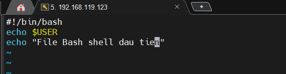
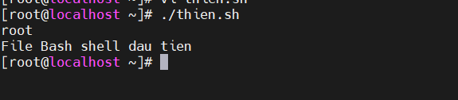
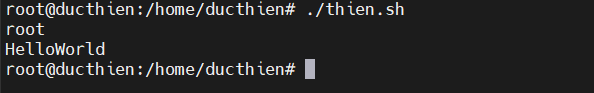
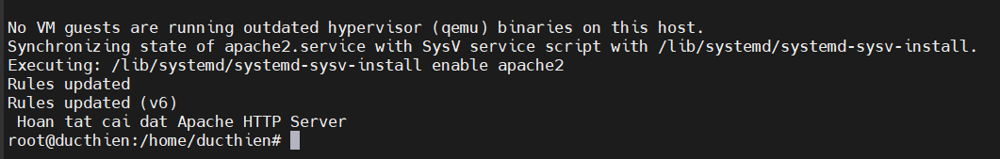

# TÌM HIỂU VỀ BASH SHELL 

# 1.Bash shell là gì 

**Shell**
Shell là chương trình (phần mềm) phát triển dành cho các máy tính chạy hệ điều hành Unix và Linux. Shell cung cấp giao diện cho phép người dùng nhập và chạy các câu lệnh dưới (dạng văn bản) trên máy tính.
Trên các máy tính Mac OS X hay Ubuntu thì chương trình Shell có tên là Terminal. Hoặc khi bạn tạo kết nối SSH tới máy chủ thì bạn cũng đang sử dụng chương trình Shell trên remote server (thường gọi là Console).

**Bash** 
Bash là ngôn ngữ máy tính dùng để biên dịch câu lệnh được nhập trên Shell để máy tính có thể hiểu được.

**Bashshell**
Bashshell là một shell (môi trường thực thi lệnh) dòng lệnh phổ biến trên các hệ điều hành như Linux và macOS. Bashshell cho phép người dùng thực thi các lệnh và chương trình, tạo và quản lý các tập tin và thư mục, và thực hiện các tác vụ hệ thống khác.

# 2.Cách tạo 1 file bashshell

Để tạo một file mới có phần mở rộng là `.sh` . Bạn có thể sử dụng lệnh `touch`

```
touch thien.sh
```

Chỉnh sửa file bằng lệnh vi 

```
vi thien.sh
```

Viết một file bashshell cũng như việc thêm nội dung vào văn bản, tuy nhiên cần biết cách viết hợp lệ để lệnh shell có thể đọc được

*Ví dụ*

```
#!/bin/bash
echo $USER
echo "File Bash shell dau tien"
```

Một file bash script phải luôn bắt đầu bằng #!/bin/bash để biểu thị rằng tập lệnh sẽ chạy với bash script chứ không phải bất kỳ shell nào khác. #!/bin/bash được gọi là "shebang". Để biết được bash script của bạn được thực thi ở đâu bằng cách chạy lệnh

Sau khi viết xong các lệnh , hãy lưu và thoát khỏi tệp để tiếp tục

# 3.Cách chạy 1 file bashshell

Mọi bản Linux đều có Bash shell theo mặc định nên ta có mọi thứ để thực thi tập lệnh của mình

Để chạy được tập lệnh của mình ta cần cấp quyền thực thi cho nó bằng lệnh `chmod`

```
sudo chmod +x thien.sh
```
Để thực thi tập lệnh ta chạy lệnh 

```
./thien.sh
```



# 4.Viết 1 script bashshell “Hello World”
Ta tạo 1 file bash shell bằng lệnh touch và sửa nội dung bên trong 
```
#!/bin/bash
echo Hello, World!
```

Chạy lệnh cấp quyền thực thi và ta có kết quả




# 5.Viết 1 script bashshell thực hiện cài đặt tự động HTTP trên Ubuntu 22.04

Thêm các thông tin sau vào file `autoinstallhttp.sh`

```

#!/bin/bash

# Cap nhat va nang cap he thong

sudo apt update -y
sudo apt upgrade -y

# Cai dat Apache HTTP server

sudo apt install apache2 -y

# Khoi dong Apache va cau hinh tu dong  khoi dong cung he thong

sudo systemctl start apache2
sudo systemctl enable apache2

# Cau hinh tuong lua cho phep truy cap Http qua cong 80
sudo ufw allow 80/tcp

# Hien thi thong bao cai dat hoan tat

echo " Hoan tat cai dat Apache HTTP Server "

```

Cấp quyền thực thi cho file bash shell

```
sudo chmod +x autoinstallhttp.sh

```

Chạy file bash shell

```
./autoinstallhttp.sh
```




# 6.Viết 1 script bashshell thực hiện cài đặt tự động wordpress

## 6.1. Trên Centos 7

```
#!/bin/bash
#-----Cai dat mariadb-----
echo "install mariadb"
cd
systemctl stop firewalld
setenforce 0
yum install MariaDB-server MariaDB-client -y
systemctl enable mariadb
systemctl start mariadb

echo " Hoan tat cai dat mariadb"

mysql_secure_installation <<SECURESQL
y
vnpt1
vnpt1
y
n
y
y
SECURESQL
echo "Hoan thanh cai lai mat khau va quyen root"

mysql -u root -pvnpt1<<SECURESQL
create database iwpos7;
create user 'bdt18'@'localhost' identified by 'vnpt1';
GRANT ALL PRIVILEGES ON iwpos7.* TO 'bdt18'@'localhost';
flush privileges;
exit
SECURESQL
echo "Hoan thanh tao databases va user"
#-----Cai dat apache2-----
echo "install Apache"

yum install -y httpd 
systemctl start httpd
systemctl enable httpd
#-----Cai dat php-----
echo "install php 7x"

yum install -y epel-release yum-utils
yum install -y http://rpms.remirepo.net/enterprise/remi-release-7.rpm
yum-config-manager --enable remi-php73
yum install -y php php-common php-opcache php-mcrypt php-cli php-gd php-curl php-mysqlnd
php -v
echo "<?php phpinfo(); ?>" > /var/www/html/info.php
systemctl restart httpd

#-----Cai dat wordpress-----
echo "install wordpress"

cd /var/www/html
wget https://wordpress.org/latest.tar.gz
tar xzvf latest.tar.gz
mv wordpress/* /var/www/html/
mv wp-config-sample.php wp-config.php
sed -i -e "s/database_name_here/"iwpos7"/g" /var/www/html/wp-config.php
sed -i -e "s/username_here/"root"/g" /var/www/html/wp-config.php
sed -i -e "s/password_here/"vnpt1"/g" /var/www/html/wp-config.php
chown -R apache:apache /var/www/html/*
chmod -R 755 /var/www/html/*
systemctl restart httpd

        echo  "xxxxxxxxxxxxxxxxxxxxxxxxxxxxxxxxxxxxxxxxxxxxxxxxxxxxxxxxxxxxxxxx$"
        echo  "x                                                              x$"
        echo  "x   >>>>>>>>> QUA TRINH CAI DAT WORDPRESS HOAN TAT <<<<<<<<<   x$"
        echo  "x                                                              x$"
        echo  "xxxxxxxxxxxxxxxxxxxxxxxxxxxxxxxxxxxxxxxxxxxxxxxxxxxxxxxxxxxxxxxx$"

```