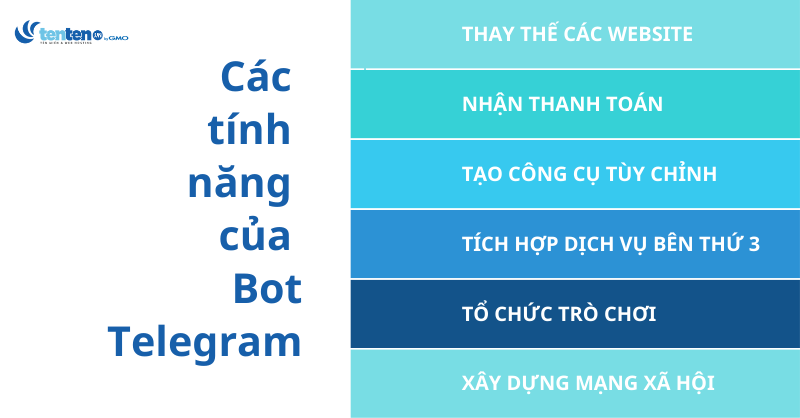
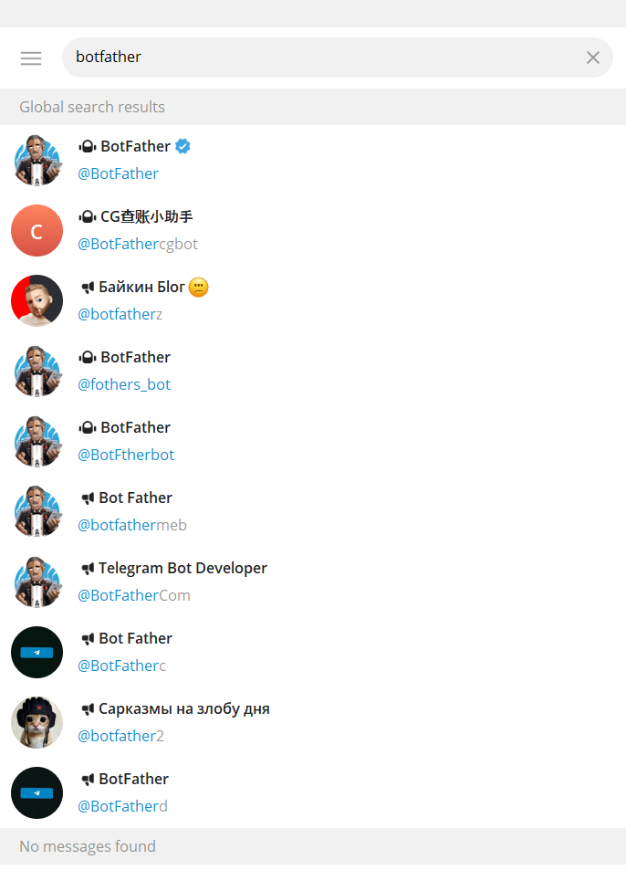
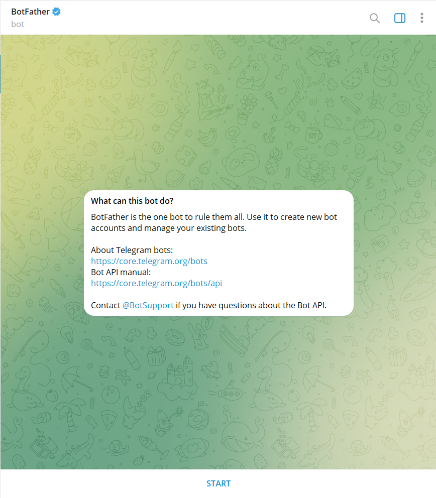
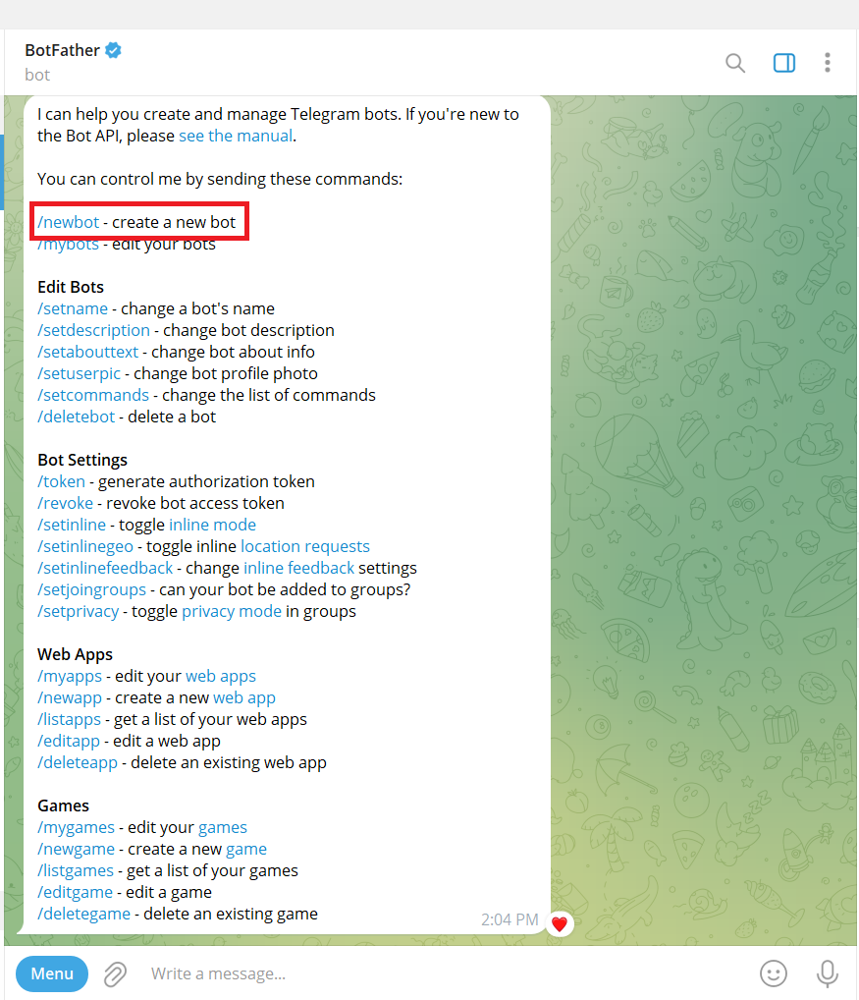
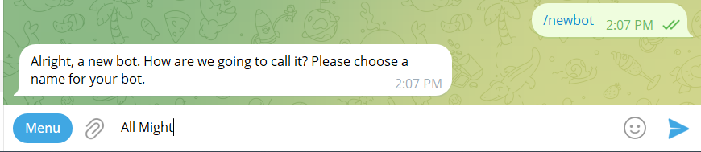
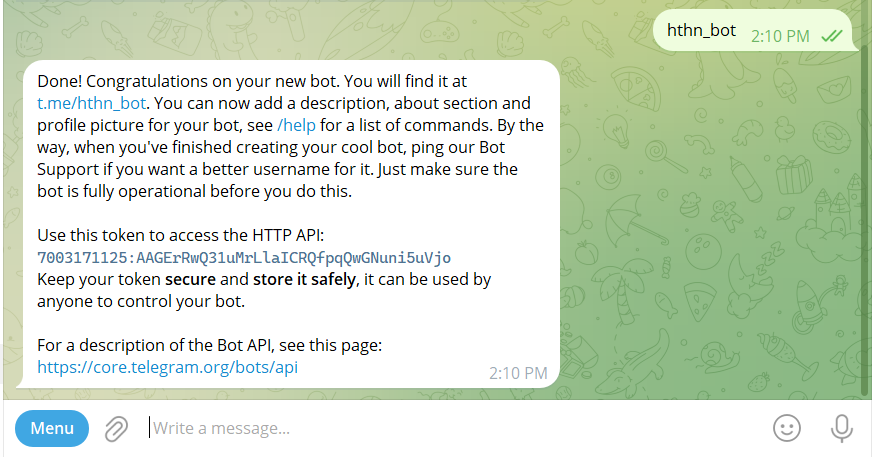

# TÌM HIỂU CÁCH KHỞI TẠO VÀ SỬ DỤNG TELEGRAM BOT
# 1.Telegram bot là gì 
Telegram bot là phần mềm tự động tương tác với người dùng trong ứng dụng Telegram. Dễ hiểu hơn thì đây là một loại tài khoản đặc biệt của ứng dụng Telegram. Về cở bản ,chúng là những chatbot có thể thực hiện nhiều tác vụ và mục đích khác nhau , chẳng hạn như gửi tin nhắn , cung cấp thông tin và thậm chí là chơi trò chơi

# 2.Các tính nắng
- Thay thế website : Bot telegram có thể chạy các ứng dụng web được xây dựng bằng JavaScript giúp tạo ra các giao diện đa dạng phong phú , đáp ứng được mọi loại nhu cầu và dịch vụ
- Nhận thanh toán : Có thể nhận thanh toán từ hơn 200 quốc gia qua hơn 20 nhà cung cấp thanh toán tích hợp ( Gồm cả Apple pay và google pay) .Những giao dịch được xử lý an toàn bởi các nhà cung cấp .Đặc biệt telegram kông thu một loại chi phí nào cho việc này 
- Tạo công cụ tùy chỉnh : Hỗ trợ tăng năng suất thông qua việc tạo ra các bot cho từng nhiệm vụ cụ thể ( chuyển đổi file , quản lý chat hoặc lấy dự báo thời tiết ). Người dùng có thể trò chuyện trực tiếp , thêm chúng vào các nhóm và kênh để giới thiệu các tính năng bổ sung 

- Tích hợp dịch vụ bên thứ 3 : Có không ít nền tảng phổ biến đã có Bot telegram chính thức, cho phép người dùng truy cập nội dung một cách thoải mái trong một ứng dụng, hoặc thực hiện các tìm kiếm nhanh chóng bằng chế độ inline
- Tổ chức trò chơi: Sử dụng HTML5 , các nhà phát triển có thể tạo ra các trò chơi đơn hoặc đa người chơi hấp dẫn , cho phép người dùng hơp tác hoặc cạnh tranh để đạt được điểm số cao nhất 
Xây dựng mạng xã hội : Bot telegram đóng vai trò trung gian kết nối người dùng dựa trên sở thích chung , vị trí và nhiều yếu tố khác 
# 3. Ưu điểm
- Khả năng tương tác : Bot có thể gửi tin nhắn cho người dùng và người dùng có thể gửi tin nhắn cho Bot. Các Bot Telegram hỗ trợ giao tiếp hai chiều, điều này có nghĩa là Bot có thể trả lời người dùng khi nhận được tin nhắn. Tính năng này hữu ích cho các doanh nghiệp và tổ chức muốn cung cấp dịch vụ hỗ trợ khách hàng cũng như cho các cá nhân muốn tự động hóa các công việc hàng ngày của họ.
- Khả năng tùy chỉnh : Các Bot Telegram có thể được lập trình để thực hiện các tác vụ cụ thể, chẳng hạn như gửi lời nhắc hoặc cung cấp hỗ trợ khách hàng. Điều này làm cho chúng cực kỳ linh hoạt và chúng có thể được sử dụng cho nhiều mục đích khác nhau. Người dùng cũng có thể tùy chỉnh giao diện của Bot, thay đổi tên, ảnh hồ sơ và hình nền của Bot.
- Dễ sử dụng :Người dùng có thể tương tác với Bot bằng các lệnh đơn giản, chẳng hạn như gõ “/help” để xem danh sách các lệnh có sẵn. Các Bot Telegram có giao diện thân thiện với người dùng giúp người dùng dễ dàng bắt đầu với các Bot Telegram, ngay cả khi họ không có kinh nghiệm về lập trình hoặc tự động hóa.

# 4.Cách khởi tạo Telegram bot

- Nhập Botfather tại thanh tìm kiếm trên telegram

- Chọn Botfather có tích xanh.

- Nhấn start

- Hệ thống sẽ hiển thị ra đoạn chat, sau đó bạn nhấn vào mục /newbot - create a new bot.

- Và bạn nhập tên cho Bot bạn mong muốn và ấn gửi

- Nhập tên người dùng cho Bot.
*Lưu ý: Tên bạn muốn tạo phải có đuôi kết thúc bằng chữ "bot", chẳng hạn như ThienBot hoặc thien_bot.*

- Lúc này hệ thống sẽ gửi thông tin xác nhận bạn tạo Bot thành công.

*Lưu ý: Thông báo này sẽ bao gồm đường link dẫn đến bot mới và mã HTTP API Telegram. Mã API rất quan trọng trong việc sử dụng Bot Telegram, vì vậy bạn hãy giữ cẩn thận tránh để cho người khác biết ảnh hưởng đến bảo mật người dùng.*