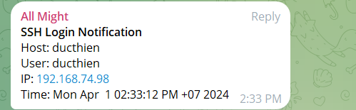

# GIÁM SÁT TRUY CẬP SSH VÀO HỆ THỐNG BẰNG TELEGRAM BOT

**Set up**

- Máy chủ với IP Public có kết nối với internet
- Đã có tài khoản telegram
- Thao tác với user root

# 1.Cài đặt jq

`jq` là ứng dụng để đọc thông tn file `Json` trên Linux
Câu lệnh cài đặt

**Trên Ubuntu**
```
apt-get -y install jq
```

**Trên CentOS7**
```
yum install epel-release -y
yum install jq -y
```

# 2.Tạo file script

Ta sẽ tạo file script tại thư mục `/etc/profile.d/` . Để khi đăng nhập vào hệ thống thì script sẽ thực hiện ngay lập tức 

Tạo file script `ssh-telegram.sh`

```
vi /etc/profile.d/ssh-telegram.sh
```

Nội dung script

```
#!/bin/bash

#CHAT ID information
TELEGRAM_CHAT_ID="XXXXXXXXXXXXXX"
#BOT Token information
TELEGRAM_BOT_TOKEN="XXXXXXXXXXXXXXXXXXXXXXXXXXXXXXXXXXXXXXXXXXXX"

#Khai bao thong tin.
LOGGED_USER="$(whoami)"
LOGGED_HOST="$(hostname -f)"
LOGGED_IP="$(echo $SSH_CONNECTION | cut -d " " -f 1)"
NOW="$(date)"

#Noi dung gui den telegram
MESSAGE="$(echo -e "<strong>SSH Login Notification</strong>\nHost: $LOGGED_HOST\nUser: $LOGGED_USER\nIP: $LOGGED_IP\nTime: $NOW")"

#cau hinh khi goi den api cua telegram bot
/usr/bin/curl --silent --output /dev/null \
    --data-urlencode "chat_id=${TELEGRAM_CHAT_ID}" \
    --data-urlencode "text=${MESSAGE}" \
    --data-urlencode "parse_mode=HTML" \
    --data-urlencode "disable_web_page_preview=true" \
    "https://api.telegram.org/bot${TELEGRAM_BOT_TOKEN}/sendMessage?"

```
Cấp quyền thực thi 

```
chmod +x /etc/profile.d/ssh.telegram.sh
```
# 3.Kết quả 
Sau khi ssh vào server ta sẽ nhận thông báo như sau 




*Tài liệu tham khảo* 

[1] [https://github.com/longbao87/linuxtips/blob/main/centos-notification-login](https://github.com/longbao87/linuxtips/blob/main/centos-notification-login)

[2] [https://www.youtube.com/watch?v=o482pX5XJKo](https://www.youtube.com/watch?v=o482pX5XJKo)