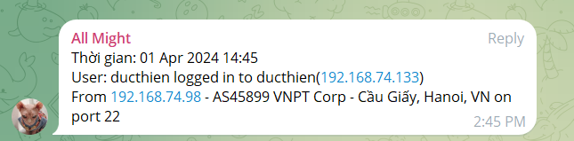

# GIÁM SÁT TRUY CẬP SSH VÀO HỆ THỐNG BẰNG TELEGRAM BOT

**Set up**

- Máy chủ với IP Public có kết nối với internet
- Đã có tài khoản telegram
- Thao tác với user root

# 1.Cài đặt jq

`jq` là ứng dụng để đọc thông tn file `Json` trên Linux
Câu lệnh cài đặt

**Trên Ubuntu**
```
apt-get -y install jq
```

**Trên CentOS7**
```
yum install epel-release -y
yum install jq -y
```

# 2.Tạo file script

Ta sẽ tạo file script tại thư mục `/etc/profile.d/` . Để khi đăng nhập vào hệ thống thì script sẽ thực hiện ngay lập tức 

Tạo file script `ssh-telegram.sh`

```
vi /etc/profile.d/ssh-telegram.sh
```

Nội dung script 

```
#!/bin/bash
#ID chat Telegram
USERID="chat id"

# API token bot
TOKEN="bot-private-token"
TIMEOUT="1"

# URL gui tin nhan cua bot
URL="https://api.telegram.org/bot$TOKEN/sendMessage"

# Thoi gian he thong 
DATE_EXEC="$(date "+%d %b %Y %H:%M)"

#File temp
TMPFILE='/tmp/ipinfo.txt'

if [ -n "$SSH_CLIENT"]; then
    IP=$(echo $SSH_CLIENT | awk '{print $1}')
    PORT=$(echo $SSH_CLIENT | awk '{print $3}')
    HOSTNAME=$(hostname -f)
    IPADDR=$(echo $SSH_CONNECTION | awk '{print $3}')

    # Lấy các thông tin từ IP người truy cập theo trang ipinfo.io
    curl http://ipinfo.io/$IP -s -o $TMPFILE
    CITY=$(cat $TMPFILE | jq '.city' | sed 's/"//g')
    REGION=$(cat $TMPFILE | jq '.region' | sed 's/"//g')
    COUNTRY=$(cat $TMPFILE | jq '.country' | sed 's/"//g')
    ORG=$(cat $TMPFILE | jq '.org' | sed 's/"//g')

    # Nội dung cảnh báo
    TEXT=$(echo -e "Thời gian: $DATE_EXEC\nUser: ${USER} logged in to $HOSTNAME($IPADDR) \nFrom $IP - $ORG - $CITY, $REGION, $COUNTRY on port $PORT")

    # Gửi cảnh báo
    curl -s -X POST --max-time $TIMEOUT $URL -d "chat_id=$USERID" -d text="$TEXT" > /dev/null

    # Xóa file temp khi script thực hiện xong
    rm $TMPFILE
fi

```

Cấp quyền thực thi 

```
chmod +x /etc/profile.d/ssh.telegram.sh
```


# 3.Kết quả 
Sau khi ssh vào server ta sẽ nhận thông báo như sau 




*Tài liệu tham khảo*

[1] [https://news.cloud365.vn/script-3-giam-sat-truy-cap-ssh-vao-he-thong/](https://news.cloud365.vn/script-3-giam-sat-truy-cap-ssh-vao-he-thong/)