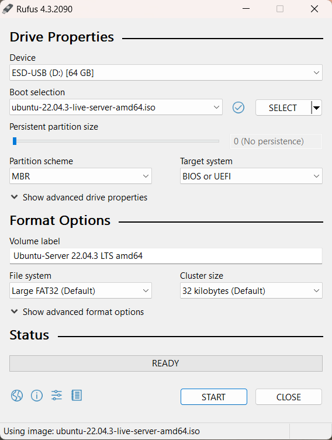
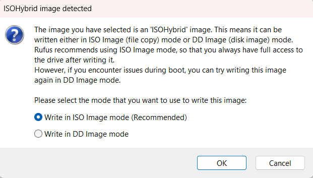
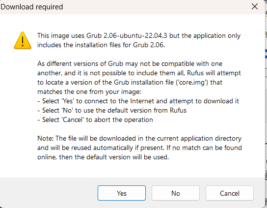
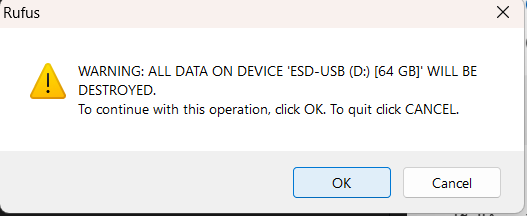
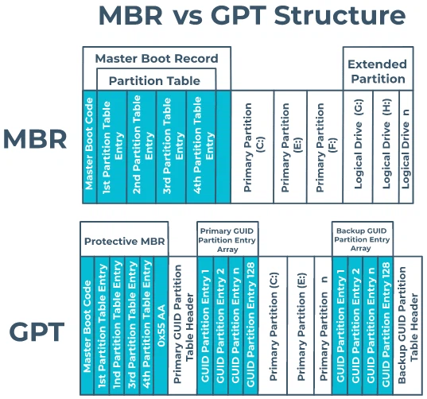

# 1.Tạo USB Boot bằng phần mềm Rufus

- Sau khi cài đặt Rufus , tại mục Device, chọn đúng ổ USB của bạn nếu trên máy đang có cắm nhiều USB khác nhau.
- Tại mục Boot selection, click vào Select để chọn file ISO (bộ cài Ubuntu mà bạn đã tải ở bước 1).
- Tại mục Partition Scheme:Tùy vào máy bạn đang theo chuẩn UEFI hay LEGACY mà chọn MBR hoặc GPT.
- 

Xong, click vào Start.

Hộp thoại ISOHybrid image detected sẽ xuất hiện. Click chọn mục Write in ISO image mode (Recommended) rồi click OK.

Thao tác này sẽ xóa toàn bộ dữ liệu đang có trong USB, nên nếu trong USB có dữ liệu gì quan trọng thì bạn hãy sao lưu nó ra ổ đĩa khác để lưu trữ. Click OK lần nữa để xóa và tiếp tục.

Đợi đến khi chương trình chạy xong (khoảng 10 phút) là bạn đã có một chiếc USB cài Ubuntu.

# 2.Đặc điểm của MBR và GPT

## 2.1. Định nghĩa 

- MBR:MBR là viết tắt của Master Boot Record, là một tiêu chuẩn quản lý thông tin ổ cứng được hãng IBM phát minh vào năm 1983. MBR sẽ có một phân vùng nhỏ trên ổ cứng chứa đựng các thông tin để hệ điều hành boot được 
- GPT là viết tắt của Giao thức phân vùng GUID, là một tiêu chuẩn quản lý thông tin ổ cứng được phát triển bởi Intel và Microsoft. GPT được giới thiệu lần đầu tiên vào năm 2009 và dần thay thế MBR, một tiêu chuẩn quản lý thông tin ổ cứng cũ hơn.

 

## 2.2. Đặc điểm 

**MBR**
- Ta dùng chuẩn ổ cứng MBR khi ổ cứng có dung lượng thấp hơn 2TB , trong trường hợp ổ cứng lớn hơn 2TB , ta vẫn có thể sử dụng nhưng cần có phần mềm hỗ trợ 
- Không cần thiết phải chia nhiều phân vùng ( ổ đĩa )
- Hệ điều hành cần thiết là Window 32 bit

**GPT**
- Ta dùng chuẩn ổ cứng GPT khi ổ cứng có dung lượng lớn hơn 4TB
- Máy tính khởi động ở chuẩn UEFI
- Phù hợp chạy trên hệ điều hành Window  và chỉ chạy được trên Window 64bit

# 3.So sánh giữa MBR và GPT

**MBR**
*Ưu điểm* : 
- Hoạt động tốt trên tất cả nền tảng Window, đồng nghĩa với việc tương thích với nhiều dòng máy tính mới và cũ 
*Nhược điểm* :
- Dữ liệu trên ổ MBR được duy nhất trên một phân vùng nhất định,vì thế dễ bị lỗi và không có khả năng khôi phục 
- Hỗ trợ tối đa 4 phân vùng chính. Nếu muốn chia ổ cứng ra thành nhiều phân vùng, thì phải tạo phân vùng kiểu Logical (Extended Partition – phân vùng mở rộng), nhưng cách này lại bị hạn chế vài tính năng (như không thể boot, không thể cài Win,…).

**GPT**
*Ưu điểm* :
- Dễ dàng khôi phục dữ liệu nếu có sự cố, vì định dạng GPT cho phép lưu trữ dữ liệu khởi động ở nhiều vị trí trên ổ cứng.
- Có cơ chế tự động phát hiện và khắc phục lỗi (CRC32) từ một vị trí khác trên ổ cứng.
- Hỗ trợ đến 128 phân vùng chính, với kích thước phân vùng cực lớn (lên đến 256 TB).
- Sử dụng trên nhiều hệ điều hành: Windows, Linux,… kể cả MAC OS X của Apple.

*Nhược điểm* :
- Chỉ hỗ trợ trên Windows 64-bit.