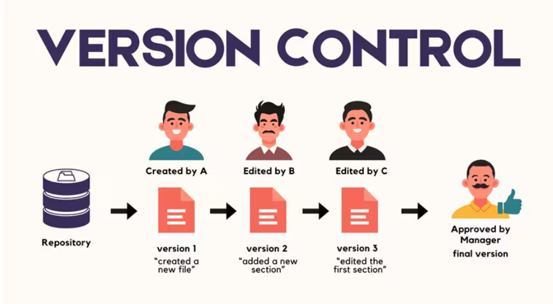
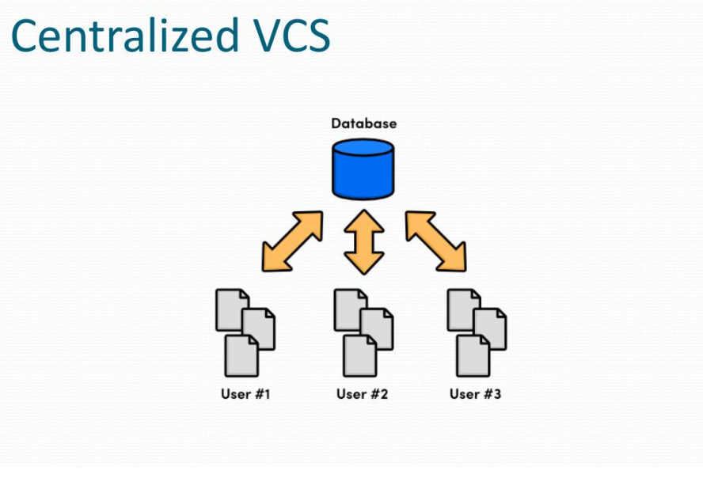
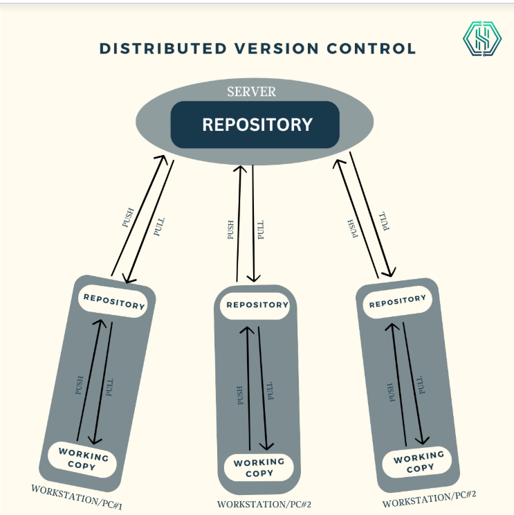
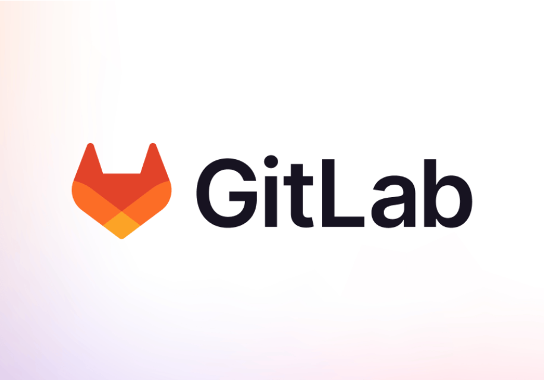
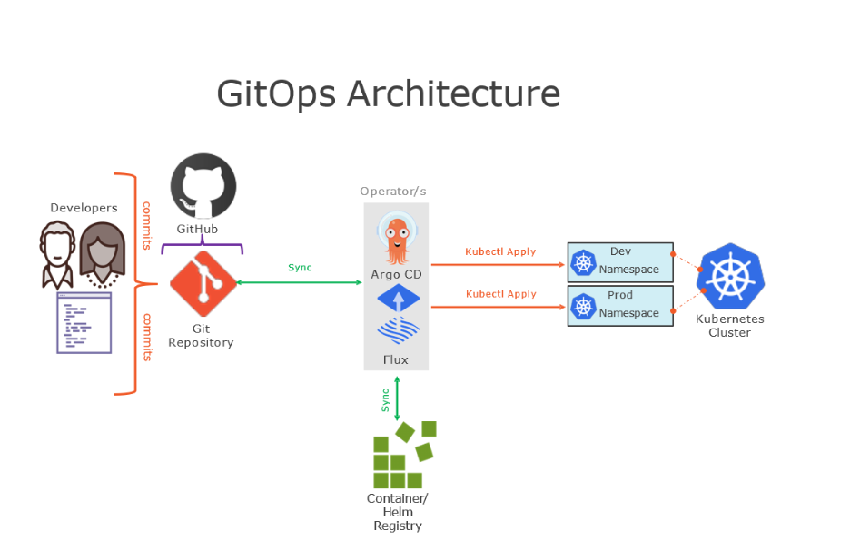

# CÁC KHÁI NIỆM CƠ BẢN VỀ GIT (GITLAB, GITHUB, GITOPS, VERSION CONTROL)

Tài liệu này cung cấp cái nhìn tổng quan và chi tiết về hệ thống quản lý phiên bản (Version Control), tập trung vào Git và các nền tảng, phương pháp luận liên quan.

## 1. Version Control System (VCS) - Hệ Thống Quản Lý Phiên Bản

### 1.1. Khái niệm

Version Control là hệ thống ghi lại mọi thay đổi của một tệp hoặc bộ tệp theo thời gian, cho phép bạn quay lại một phiên bản cụ thể sau này.

### 1.2. Phân loại

**Centralized VCS (CVCS):** Sử dụng một máy chủ trung tâm duy nhất để lưu trữ toàn bộ các tệp đã được phân bản (Ví dụ: SVN, Perforce). Nếu máy chủ gặp sự cố, mọi người không thể cộng tác.

**Distributed VCS (DVCS):** Mỗi người dùng đều có một bản sao đầy đủ của kho lưu trữ (Repository) trên máy cá nhân của họ (Ví dụ: Git, Mercurial). Nếu máy chủ gặp sự cố, bất kỳ bản sao nào của người dùng cũng có thể được sử dụng để khôi phục.

## 2. Git - Trái Tim Của Phát Triển Phần Mềm Hiện Đại

### 2.1. Git là gì?

Git là một hệ thống quản lý phiên bản phân tán (DVCS) mã nguồn mở, được tạo ra bởi Linus Torvalds vào năm 2005. Nó nổi tiếng với tốc độ, tính toàn vẹn dữ liệu và hỗ trợ mạnh mẽ cho các quy trình làm việc phi tuyến tính (branching/merging).

### 2.2. Các khái niệm cốt lõi trong Git

**Repository (Repo):** Kho lưu trữ chứa toàn bộ mã nguồn và lịch sử thay đổi của dự án.

**Commit:** Một "ảnh chụp" (snapshot) của toàn bộ dự án tại một thời điểm nhất định. Mỗi commit có một mã băm (SHA-1) duy nhất.

**Branch (Nhánh):** Cho phép bạn tách khỏi luồng chính để phát triển tính năng mới hoặc sửa lỗi mà không ảnh hưởng đến mã nguồn ổn định.

**Merge (Hợp nhất):** Kết hợp các thay đổi từ nhánh này vào nhánh khác.

**Clone:** Sao chép một kho lưu trữ từ máy chủ (remote) về máy cá nhân (local).

**Pull/Push:**

- **Pull:** Lấy mã mới nhất từ remote repo về local repo.

- **Push:** Đẩy các commit từ local repo lên remote repo.

### 2.3. Quy trình làm việc (Git Workflow)

Git hoạt động dựa trên 4 khu vực chính:

- **Working Directory:** Thư mục làm việc trên máy tính (nơi bạn sửa code).

- **Staging Area (Index):** Nơi chuẩn bị các thay đổi trước khi commit.

- **Local Repository (`.git`):** Nơi lưu trữ các commit chính thức trên máy bạn.

- **Remote Repository:** Kho lưu trữ trực tuyến (GitHub, GitLab) để chia sẻ với mọi người.

## 3. GitHub và GitLab - Nền Tảng Lưu Trữ Code

Cả hai đều là **dịch vụ lưu trữ kho lưu trữ Git dựa trên đám mây**, nhưng có những đặc điểm riêng:

### 3.1. GitHub

**Đặc điểm:** Cộng đồng lớn nhất thế giới, cực kỳ phổ biến cho mã nguồn mở.

**Thế mạnh:** Giao diện thân thiện, hệ sinh thái **GitHub Actions** mạnh mẽ, **tích hợp tốt với nhiều công cụ bên thứ ba**.

### 3.2. GitLab

**Đặc điểm:** Tập trung vào giải pháp "All-in-one" cho DevOps.

**Thế mạnh:** **Tích hợp sẵn CI/CD** (Continuous Integration/Deployment) cực kỳ mạnh mẽ, hỗ trợ tốt cho việc cài đặt trên máy chủ riêng (Self-hosted) của doanh nghiệp.

| Đặc điểm         | GitHub                  | GitLab                            |
| :--------------  | :---------------------  | :-------------------------------- |
| **Trọng tâm**    | Cộng đồng & Mã nguồn mở | DevOps & Doanh nghiệp             |
| **CI/CD**        | GitHub Actions          | GitLab CI/CD (Rất sâu)            |
| **Self-hosted**  | Có (Enterprise)         | Rất phổ biến & Linh hoạt          |

## 4. GitOps - Vận Hành Dựa Trên Git

### 4.1. Khái niệm

GitOps là một mô hình vận hành hạ tầng và ứng dụng, trong đó **Git là "Nguồn sự thật duy nhất" (Single Source of Truth)**. Mọi cấu hình hạ tầng (Infrastructure as Code - IaC) đều được lưu trữ trong Git.

### 4.2. Nguyên tắc hoạt động

- **Mô tả khai báo (Declarative):** Toàn bộ hệ thống được mô tả bằng code (YAML, JSON).

- **Phiên bản hóa và Bất biến (Versioned):** Mọi thay đổi đều thông qua Git Commit.

- **Tự động cập nhật (Automated):** Khi Git thay đổi, một công cụ (như ArgoCD hoặc Flux) sẽ tự động đồng bộ hóa trạng thái hiện tại của hệ thống với trạng thái được mô tả trong Git.

## 5. Tóm lược các lệnh Git cơ bản

- `git init`: Khởi tạo một repo mới.
- `git add .`: Đưa tất cả thay đổi vào Staging Area.
- `git commit -m "nội dung"`: Lưu thay đổi vào local repo.
- `git status`: Kiểm tra trạng thái các tệp.
- `git log`: Xem lịch sử commit.
- `git branch`: Quản lý các nhánh.
- `git checkout -b <name>`: Tạo và chuyển sang nhánh mới.
- `git remote add origin <url>`: Kết nối với kho lưu trữ từ xa.
