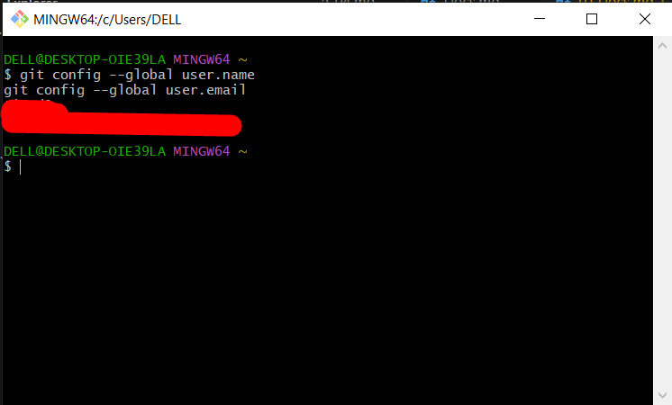
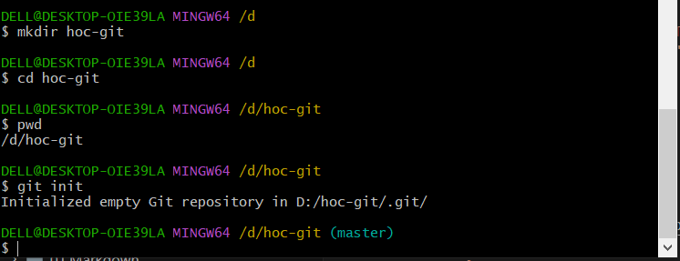
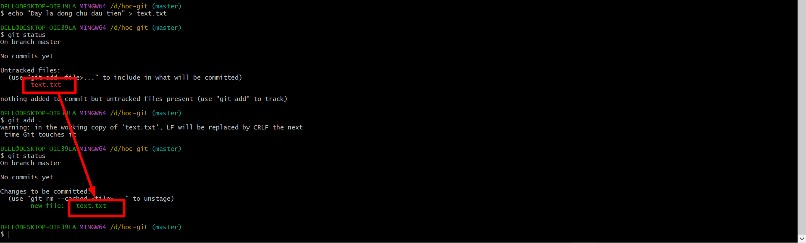
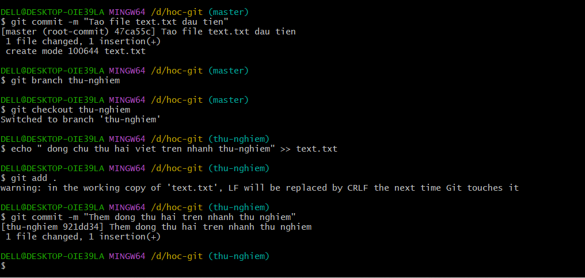
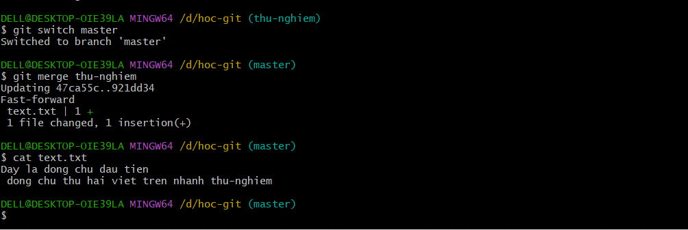
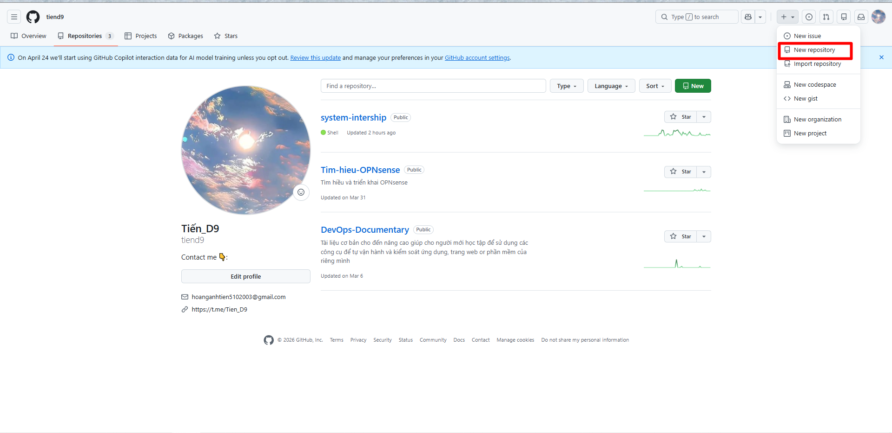
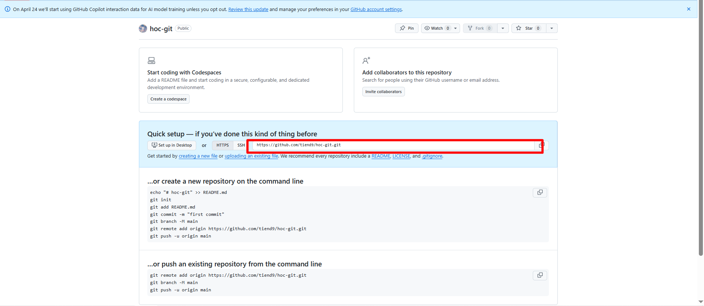
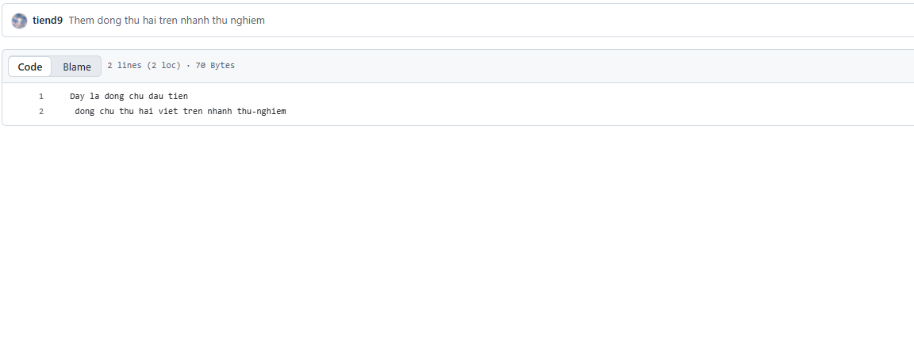

# HƯỚNG DẪN GIT 

## I. 3 KHÁI NIỆM QUAN TRỌNG NHẤT

### 1. Snapshot và Commit (Chụp ảnh và Lưu trữ)

- **Snapshot (Ảnh chụp):** Là trạng thái toàn bộ dự án của bạn tại một thời điểm.

- **Commit:** Là hành động "bấm máy chụp". Mỗi khi bạn thực hiện một **Commit**, **Git** sẽ lưu lại một **Snapshot**. Mỗi Commit đều đi kèm với một lời nhắn (Message) để bạn nhớ lúc đó mình đã làm gì.

### 2. Ba Khu Vực Của Git (Quy trình làm việc)

Hãy tưởng tượng quá trình đóng gói hàng đi gửi:

- **Working Directory (Bàn làm việc):** Nơi bạn viết code, gõ phím. Đây là các file bạn đang chỉnh sửa trực tiếp.

- **Staging Area (Khu vực đóng gói):** Sau khi sửa xong, bạn nhặt những file ưng ý bỏ vào đây. Hành động này gọi là `add`. Bạn có thể thêm, bớt tùy ý.

- **Repository (Kho lưu trữ):** Khi Staging Area đầy và sẵn sàng, bạn đóng gói và gửi đi. Hành động này gọi là `commit`. Lúc này, lịch sử đã được lưu chính thức.

### 3. Branch (Nhánh)

**Branch (Nhánh)**: như một "vũ trụ song song". Bạn nhảy sang nhánh mới, chỉnh, sửa lỗi. Sửa xong, bạn có thể gộp (Merge) nó vào nhánh chính (thường gọi là nhánh `main` hoặc `master`). Mã nguồn ở nhánh chính không hề bị ảnh hưởng trong lúc bạn làm ở nhánh khác.

## II. LAB

Mở ứng dụng **Git Bash** hoặc **Terminal (PowerShell)** trên máy tính lên.

### `BƯỚC 1`: Khai báo danh tính (Chỉ làm 1 lần duy nhất)

**Git** cần biết ai là người thực hiện thay đổi. Hãy nhập tên và email của bạn.

```bash
git config --global user.name "Tên Của Bạn"
git config --global user.email "email_cua_ban@example.com"

# Check lại
git config --global user.name
git config --global user.email
```



### `BƯỚC 2`: Khởi tạo dự án

Hãy tạo một thư mục mới để làm nháp và biến nó thành một kho Git.

```bash
# Di chuyển đến vị trí bạn muốn tạo thư mục
cd d:

# 1. Tạo thư mục mới có tên la hoc-git
mkdir hoc-git

# 2. Đi vào thư mục đó
cd hoc-git

# 3. Kích hoạt Git (Hô biến thư mục thường thành kho Git)
git init
```



=> Lúc này Git đã bắt đầu âm thầm theo dõi thư mục này.

### `BƯỚC 3`: Quy trình Add và Commit cơ bản

```bash
# 1. Tạo ra một file nội dung đơn giản (Bạn có thể dùng Notepad để tạo file text.txt)
echo "Day la dong chu dau tien" > text.txt

# 2. Kiểm tra xem Git đang thấy gì? (Lệnh này dùng RẤT NHIỀU, nó báo cáo tình hình hiện tại)
git status
# Bạn sẽ thấy file text.txt màu đỏ (Tức là đang ở Bàn Làm Việc - Working Directory)

# 3. Đưa file vào Staging Area
git add text.txt
# Hoặc gõ "git add ." để đưa toàn bộ file vào Staging Area

# 4. Kiểm tra lại tình hình
git status
# Bạn sẽ thấy file text.txt chuyển sang màu xanh lá!

# 5. Đóng gói và lưu vào kho (Commit)
git commit -m "Tao file text.txt dau tien"
# Phần trong ngoặc kép "..." là lời nhắn để sau này bạn đọc lại hiểu mình đã làm gì.
```



### BƯỚC 4: Branch

Bây giờ, giả sử chúng ta muốn thử nghiệm viết thêm một đoạn nhưng sợ làm hỏng nội dung cũ.

```bash
# 1. Tạo một nhánh mới tên là "thu-nghiem"
git branch thu-nghiem

# 2. Nhảy sang branch thu-nghiem đó
git checkout thu-nghiem
# (Hoặc dùng lệnh mới hơn: git switch thu-nghiem)

# 3. Mở file text.txt lên (bằng Notepad hoặc Code), thêm một dòng mới. Hoặc dùng lệnh sau:
echo "Dong chu thu hai viet tren nhanh thu-nghiem" >> text.txt

# 4. Lưu lại sự thay đổi này vào nhánh thu-nghiem (Lặp lại quy trình Add -> Commit)
git add .
git commit -m "Them dong thu hai tren nhanh thu nghiem"
```



### BƯỚC 5: Gộp Nhánh (Merge)

Mọi thứ ở nhánh `thu-nghiem` rất tốt, bạn muốn gộp nó vào nhánh chính (`main` hoặc `master`).

```bash
# 1. Bắt buộc phải quay về nhánh chính (master) trước tiên
git checkout master

# 2. Tiến hành kéo nhánh "thu-nghiem" gộp vào đây
git merge thu-nghiem

# 3. Giờ bạn mở file text.txt ra xem lại, dòng thứ hai đã xuất hiện!
```



### BƯỚC 6: Đẩy Lên GitHub (Push)

Bước này để đẩy code từ máy tính lên GitHub, giống như lưu file lên Google Drive vậy.

#### 6.1. Tạo Repository trên GitHub

1. Mở trình duyệt, đăng nhập vào <https://github.com>
2. Ở góc trên bên phải, bấm dấu **`+`** → chọn **"New repository"**
3. Điền thông tin:

   - **Repository name:** `hoc-git` (đặt trùng tên thư mục trên máy cho dễ nhớ)
   - **Description:** `Bài tập thực hành Git` (không bắt buộc)
   - **Chọn Public** (để ai cũng xem được) hoặc **Private** (chỉ mình bạn xem)
   - **KHÔNG tick** vào "Add a README file" (vì mình đã có file trên máy rồi)

4. Bấm nút **"Create repository"**
5. GitHub sẽ hiện ra một trang với các lệnh hướng dẫn. Hãy **copy đường link HTTPS** của repo, nó sẽ có dạng:

   ```bash
   https://github.com/TEN-GITHUB-CUA-BAN/hoc-git.git
   ```

#### 6.2. Kết nối máy tính với GitHub

Quay lại Terminal (đang ở trong thư mục `hoc-git`), gõ lần lượt:

```bash
# 1. Kết nối thư mục trên máy với repo trên GitHub
#    (Thay link bên dưới bằng link repo của bạn)
git remote add origin https://github.com/TEN-GITHUB-CUA-BAN/hoc-git.git

# 2. Kiểm tra xem đã kết nối thành công chưa
git remote -v
# Nếu thấy hiện ra 2 dòng có chữ "origin" và link GitHub → Thành công!
```






#### 6.3. Đẩy code lên GitHub (Push)

```bash
# Đẩy toàn bộ code và lịch sử commit lên GitHub
# "-u" nghĩa là "ghi nhớ", lần sau chỉ cần gõ "git push" là đủ
git push -u origin master
```

- Lần đầu tiên push, Git có thể **yêu cầu đăng nhập** GitHub.

- Nếu được hỏi username/password: nhập **username GitHub** và **Personal Access Token** (không phải mật khẩu GitHub).

- Cách tạo Token: Vào **GitHub** → Settings → Developer settings → Personal access tokens → Generate new token → tick vào quyền `repo` → Generate → **Copy token lại ngay** (chỉ hiện 1 lần).

#### 6.4. Kiểm tra kết quả

- Mở trình duyệt, vào lại repo GitHub của bạn: `https://github.com/TEN-GITHUB-CUA-BAN/hoc-git`

- Bạn sẽ thấy file `text.txt` và `README.md` (nếu có) đã xuất hiện trên đó!



#### 6.5. Từ giờ trở đi - Quy trình hàng ngày

Mỗi khi bạn sửa code xong, chỉ cần chạy 3 lệnh này:

```bash
git add .                          # Bỏ tất cả file đã sửa vào Staging
git commit -m "Mô tả thay đổi"    # Lưu snapshot
git push                           # Đẩy lên GitHub
```

#### 6.6. Các lệnh bổ sung hay dùng

| Lệnh | Ý nghĩa |
| :--- | :--- |
| `git clone <link>` | Tải một repo từ GitHub về máy (dùng khi bạn muốn lấy code của người khác) |
| `git pull` | Lấy code mới nhất từ GitHub về máy (khi có người khác push code mới lên) |
| `git push` | Đẩy code từ máy lên GitHub |
| `git remote -v` | Xem repo đang kết nối với GitHub nào |
| `git log --oneline` | Xem lịch sử commit ngắn gọn |

### 7. Hướng dẫn cài đặt Gitcommand trên Linux

#### Trên Debian/Ubuntu

```bash
sudo apt update
sudo apt install git -y

# For Ubuntu, this PPA provides the latest stable upstream Git version
add-apt-repository ppa:git-core/ppa
apt update; apt install git
```

#### Trên Fedora

```bash
sudo dnf update
sudo dnf install git -y
```

#### Trên CentOS/RHEL

```bash
sudo yum update
sudo yum install git -y
```

#### Trên Arch Linux

```bash
sudo pacman -Syu
sudo pacman -S git
```