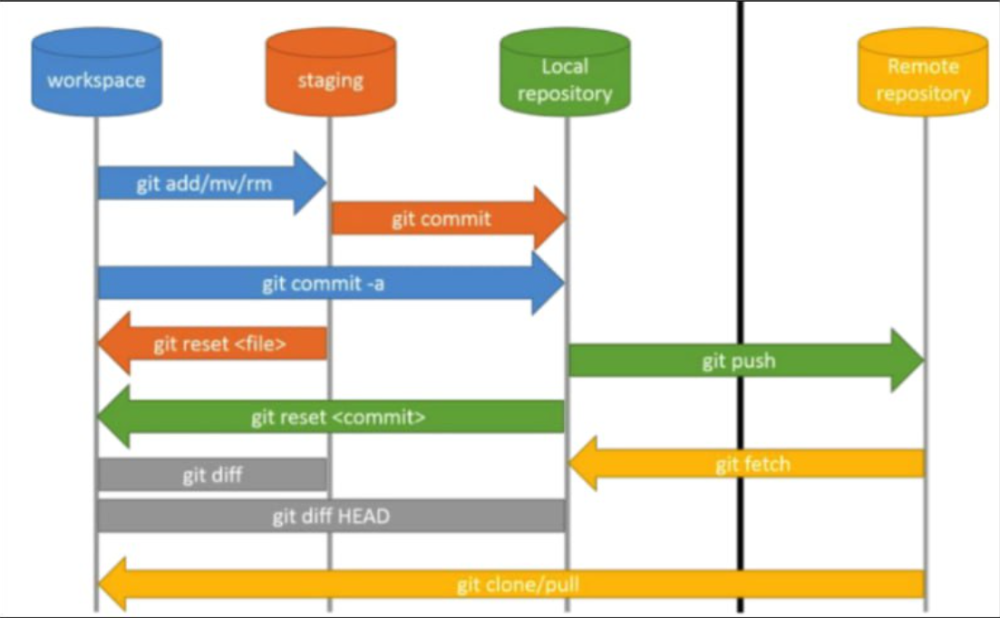

# Giải thích về mô hình workflow trong git

## I. Mô hình

## II. Giải thích chi tiết

**Workspace(Working Directory):**

- Là thư mục trên máy nơi lưu các file làm việc

**Staging:**

- Đây là nơi bạn chọn những thay đổi nào sẽ được commit.

**Local repository:**

- Là kho lưu trữ commit nằm trên máy của bạn
- Nó nằm trong thư mục `.git`
- Chứa:
  - Toàn bộ lịch sử commit
  - branch
  - HEAD

**Remote repository:**

- Là kho chứa code nằm trên server (internet hoặc mạng nội bộ)
- Không nằm trên máy của bạn
- Dùng để:
  - Chia sẻ code
  - làm việc nhóm
- Ví dụ các remote repo phổ biến: **Github**, **Gitlab**, **Bitbucket**
