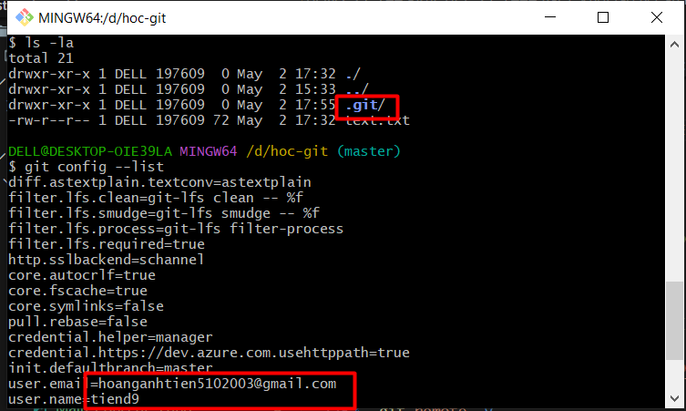
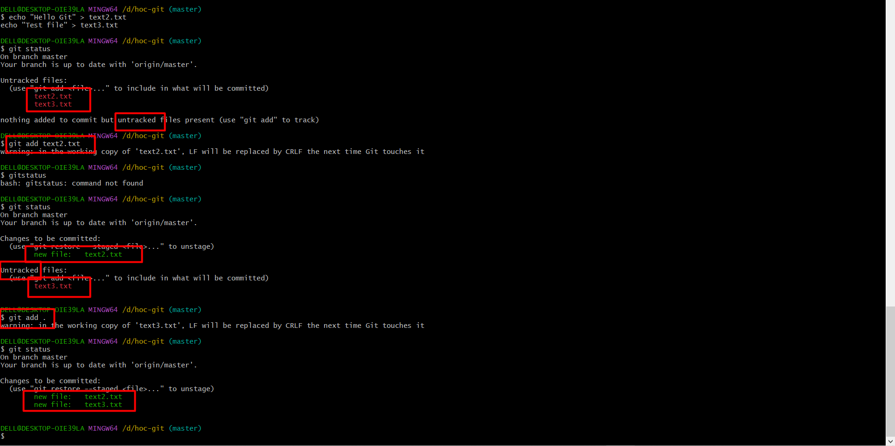
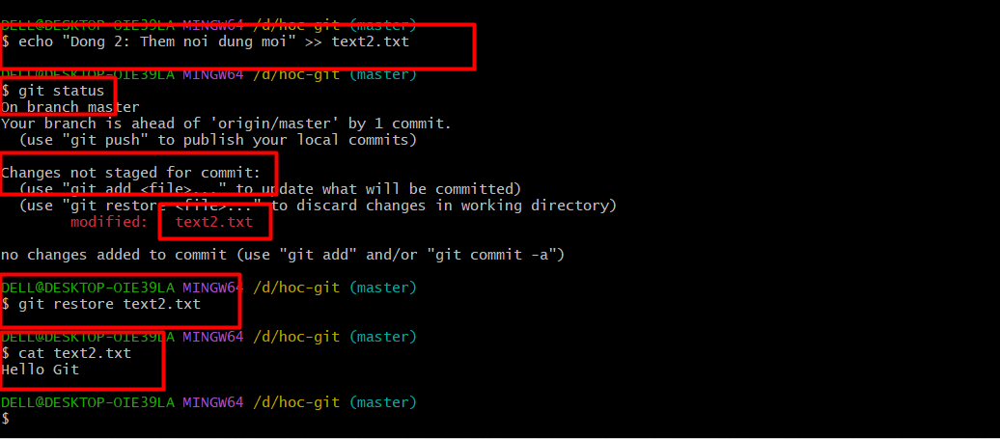
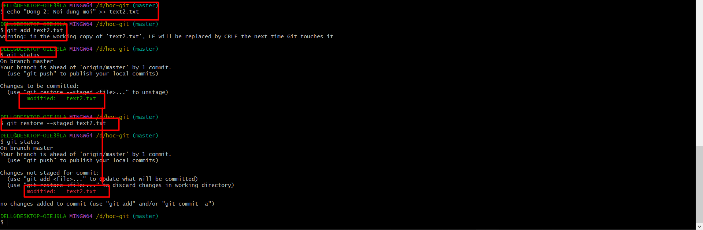
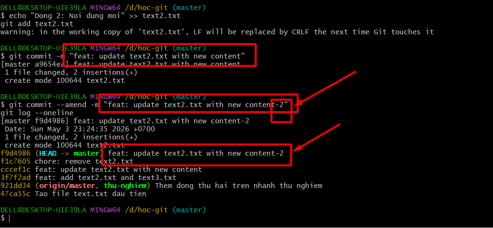
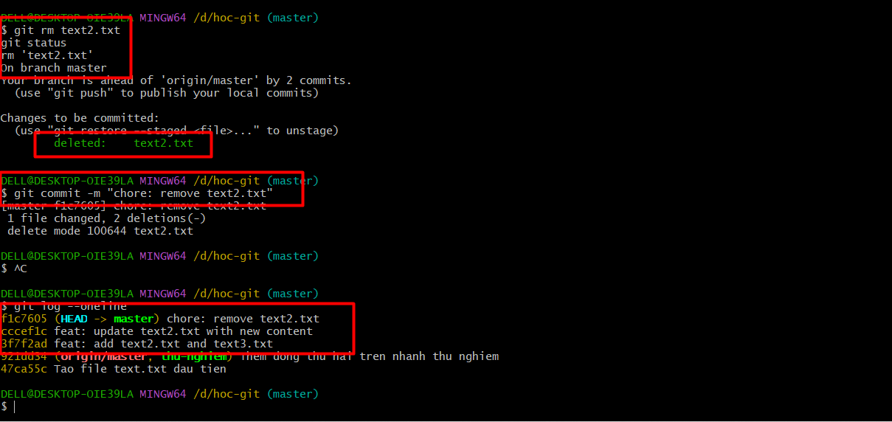
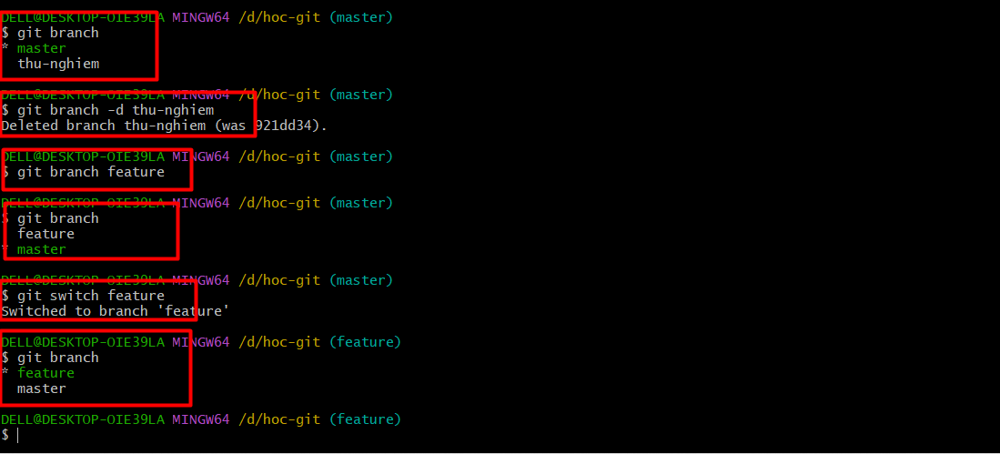
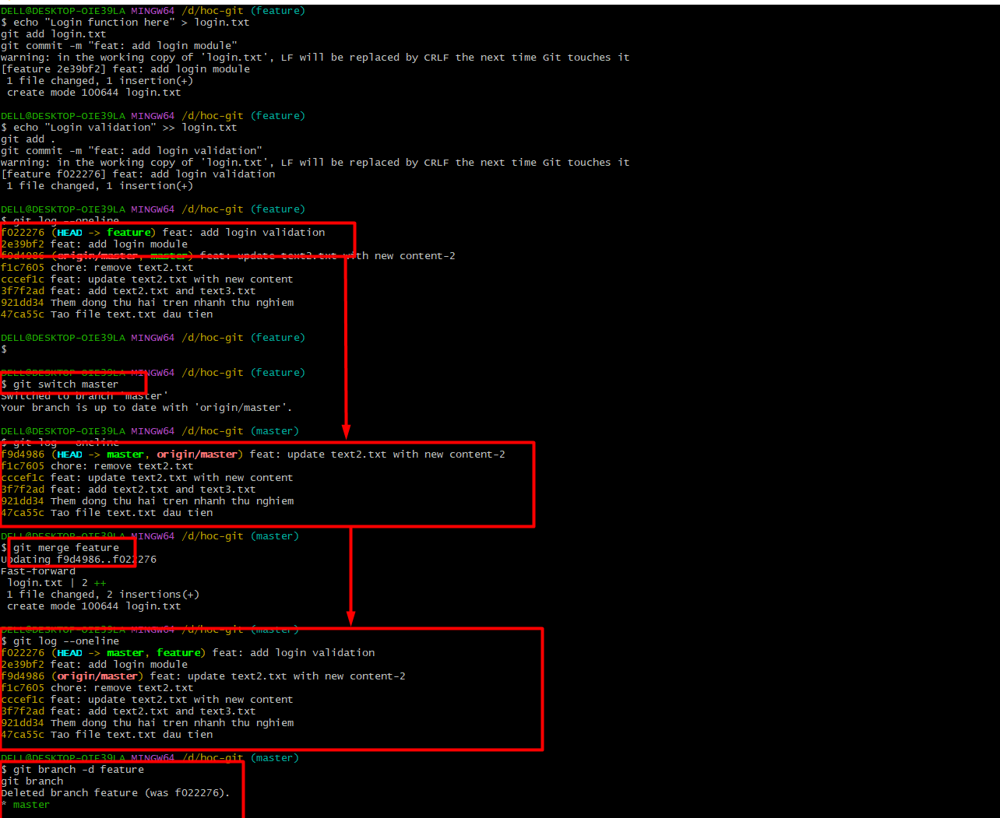

# CÁC CÂU LỆNH GIT VÀ OPTIONS

## SUMMARY

### 1. Khởi tạo & Cấu hình

| Command | Description |
| :--- | :--- |
| `git init` | Khởi tạo một kho lưu trữ Git mới trong thư mục hiện tại. |
| `git clone <url>` | Sao chép toàn bộ kho lưu trữ từ xa về máy (bao gồm cả lịch sử). |
| `git config --global user.name "Tên"` | Cấu hình tên người dùng (toàn hệ thống). |
| `git config --global user.email "Email"` | Cấu hình email người dùng (toàn hệ thống). |
| `git config --list` | Xem toàn bộ cấu hình Git hiện tại. |

### 2. Lệnh cập nhật thường xuyên(Add, Commit, Status)

| Command | Description |
| :--- | :--- |
| `git status` | Kiểm tra trạng thái các tệp (đã sửa, đã staging, chưa track). |
| `git add <file>` | Đưa file cụ thể vào Staging Area. |
| `git add .` | Đưa **tất cả** thay đổi vào Staging Area. |
| `git commit -m "msg"` | Lưu snapshot vào kho lưu trữ kèm lời nhắn. |
| `git commit --amend` | Sửa lại commit gần nhất (đổi message hoặc thêm file quên). |
| `git rm -r <file_name>` | Xóa file khỏi Git và khỏi thư mục làm việc. |
| `git restore <file>` | Hủy thay đổi ở Working Directory (quay về trạng thái của commit gần nhất). |
| `git restore --staged <file>` | Bỏ file ra khỏi Staging Area (ngược lại của `git add`). |

### 3. Nhánh (Branch) & Gộp (Merge)

| Command | Description |
| :--- | :--- |
| `git branch` | Liệt kê tất cả các nhánh local. |
| `git branch <name>` | Tạo nhánh mới. |
| `git branch -d <name>` | Xóa nhánh đã merge xong. |
| `git branch -D <name>` | Xóa nhánh cưỡng bức (chưa merge cũng xóa). |
| `git branch -a` | Liệt kê tất cả nhánh (cả local và remote). |
| `git checkout <branch>` | Chuyển sang nhánh khác. |
| `git checkout -b <name>` | Tạo nhánh mới **và** chuyển sang luôn. |
| `git switch <branch>` | Chuyển nhánh (lệnh mới, thay thế `checkout`). |
| `git switch -c <name>` | Tạo và chuyển sang nhánh mới (lệnh mới). |
| `git merge <branch>` | Gộp nhánh chỉ định vào nhánh hiện tại. |
| `git merge --abort` | Hủy bỏ quá trình merge khi bị conflict. |

### 4. Làm việc với Remote (GitHub/GitLab)

| Command | Description |
| :--- | :--- |
| `git remote -v` | Xem danh sách các remote đang kết nối. |
| `git remote add origin <url>` | Kết nối local repo với remote repo. |
| `git remote remove origin` | Xóa kết nối remote. |
| `git push -u origin <branch>` | Đẩy nhánh lên remote lần đầu (và ghi nhớ). |
| `git push` | Đẩy commit lên remote (sau khi đã `-u` rồi). |
| `git push --force` | Đẩy lên remote cưỡng bức (**NGUY HIỂM** - ghi đè lịch sử remote). |
| `git pull origin <branch>` | Kéo code mới nhất từ remote về local (= fetch + merge). |
| `git fetch` | Tải thông tin mới từ remote nhưng **chưa gộp** vào code local. |

### 5. Xem lịch sử & So sánh

| Command | Description |
| :--- | :--- |
| `git log` | Xem lịch sử commit đầy đủ. |
| `git log --oneline` | Xem lịch sử commit dạng ngắn gọn (1 dòng/commit). |
| `git log --oneline --graph` | Xem lịch sử commit dạng sơ đồ nhánh (rất trực quan). |
| `git diff` | So sánh sự khác biệt giữa Working Directory và Staging Area. |
| `git diff --staged` | So sánh sự khác biệt giữa Staging Area và commit gần nhất. |
| `git diff <branch1> <branch2>` | So sánh sự khác biệt giữa 2 nhánh. |
| `git show <commit_hash>` | Xem chi tiết nội dung một commit cụ thể. |
| `git blame <file>` | Xem ai đã sửa từng dòng trong file (truy tìm thủ phạm). |
| `git shortlog -sn` | Thống kê số commit của từng người trong team. |

### 6. Quay lại / Hoàn tác (Quan trọng cho DevOps!)

| Command | Description |
| :--- | :--- |
| `git revert <commit_hash>` | Tạo một commit mới để **đảo ngược** một commit cũ (AN TOÀN - không xóa lịch sử). |
| `git reset --soft HEAD~1` | Quay lại 1 commit, giữ nguyên thay đổi ở Staging Area. |
| `git reset --mixed HEAD~1` | Quay lại 1 commit, giữ thay đổi ở Working Directory (mặc định). |
| `git reset --hard HEAD~1` | Quay lại 1 commit, **XÓA SẠCH** mọi thay đổi (**NGUY HIỂM**). |
| `git reflog` | Xem lịch sử TOÀN BỘ hành động của HEAD (dùng để cứu code khi lỡ reset --hard). |

### 7. Lưu tạm & Nâng cao (DevOps thường dùng)

| Command | Description |
| :--- | :--- |
| `git stash` | Lưu tạm các thay đổi chưa commit (giống "cất vào ngăn kéo" để làm việc khác). |
| `git stash pop` | Lấy thay đổi đã lưu tạm ra và tiếp tục làm việc. |
| `git stash list` | Xem danh sách các bản lưu tạm. |
| `git rebase <branch>` | Đặt lại base (gốc) của nhánh hiện tại lên đầu nhánh khác. Tạo lịch sử thẳng hàng hơn merge. |
| `git rebase -i HEAD~n` | Rebase tương tác: sắp xếp lại, gộp, sửa message của n commit gần nhất. |
| `git cherry-pick <commit_hash>` | Chọn lấy 1 commit cụ thể từ nhánh khác đưa vào nhánh hiện tại. |
| `git tag <tag_name>` | Đánh dấu (tag) một commit quan trọng, thường dùng để đánh version (v1.0, v2.0). |
| `git tag -a v1.0 -m "Release 1.0"` | Tạo tag có chú thích (annotated tag) - dùng cho release chính thức. |
| `git push origin --tags` | Đẩy tất cả tag lên remote. |
| `git bisect start` | Dùng tìm kiếm nhị phân để tìm commit gây lỗi (debug cực mạnh). |
| `git clean -fd` | Xóa tất cả file chưa được track (file rác, file tạm). |

## PRACTICE

> **Lưu ý:** Tất cả bài tập nên thực hành trên một thư mục riêng (ví dụ `D:\hoc-git`). **KHÔNG** thực hành trên repo thật của dự án.

---

### Bài 1: Khởi tạo & Cấu hình (git init, git config, git clone)

**Mục tiêu:** Tạo repo mới, cấu hình user, clone repo từ remote.

**Các bước thực hiện:**

```bash
# Bước 1: Tạo thư mục mới và khởi tạo Git
mkdir hoc-git
cd hoc-git
git init

# Bước 2: Kiểm tra thư mục .git đã được tạo
ls -la          # Linux/Mac
dir /a          # Windows CMD
Get-ChildItem -Force   # PowerShell

# Bước 3: Cấu hình tên và email
git config user.name "Tiend9"
git config user.email "[EMAIL_ADDRESS]"

# Bước 4: Kiểm tra cấu hình
git config --list
#Nhấn q để thoát

# Bước 5: Xem cấu hình global vs local
git config --global --list
git config --local --list
# Global là server(trên web ta muốn remote), Local là máy tính của bạn


# Bước 6: Clone một repo có sẵn (ví dụ)
cd ..
git clone https://github.com/tiend9/hoc-git.git
cd hoc-git
git remote -v
```

**Kiểm tra kết quả:**

- Thư mục `.git` tồn tại sau `git init`
- `git config --list` hiển thị đúng tên và email
- Repo clone về có đầy đủ lịch sử (`git log`)



### Bài 2: Add, Commit, Status, Restore (Workflow cơ bản)

**Mục tiêu:** Thành thạo quy trình Working **Dir** → **Staging** → **Commit**.

**Các bước thực hiện:**

```bash
# Bước 1: Quay lại thư mục practice
cd hoc-git

# Bước 2: Tạo file mới và kiểm tra trạng thái
echo "Hello Git" > text2.txt
echo "Test file" > text3.txt
git status
# => Sẽ thấy 2 file "Untracked"

# Bước 3: Add từng file một
git add text2.txt
git status
# => text2.txt ở "Changes to be committed", text3.txt vẫn "Untracked"

# Bước 4: Add tất cả
git add .
git status
# => Cả 2 file đều ở Staging Area

# Bước 5: Commit lần đầu
git commit -m "feat: add text2.txt and text3.txt"
git status
# => "nothing to commit, working tree clean"

# Bước 6: Sửa file và xem sự khác biệt
echo "Dong 2: Them noi dung moi" >> text2.txt
git status
# => file2.txt xuất hiện ở "Changes not staged for commit"

# Bước 7: Thử RESTORE - hủy thay đổi ở Working Directory
git restore text2.txt
cat text2.txt
# => File quay về trạng thái ban đầu (mất dòng 2)

# Bước 8: Sửa lại file, add, rồi thử RESTORE --staged
echo "Dong 2: Noi dung moi" >> text2.txt
git add text2.txt
git status
# => text2.txt ở Staging Area
git restore --staged text2.txt
git status
# => text2.txt quay lại "Changes not staged" (vẫn giữ nội dung)

# Bước 9: Add và commit lại
git add text2.txt
git commit -m "feat: update text2.txt with new content"

# Bước 10: Thử commit --amend (sửa message commit vừa rồi)
git commit --amend -m "feat: update text2.txt with new content-2"
git log --oneline
# => Chỉ có 2 commit, message đã thay đổi

# Bước 11: Xóa file bằng git rm
git rm text2.txt
git status
# => text2.txt ở "deleted" trong Staging
git commit -m "chore: remove text2.txt"
```

**Kiểm tra kết quả:**

- Hiểu sự khác nhau giữa `git add <file>` và `git add .`



- `git restore` hủy thay đổi ở Working Directory



- `git restore --staged` bỏ file khỏi Staging nhưng giữ thay đổi



- `git commit --amend` sửa được commit gần nhất hoặc thêm file vào commit trước.



- `git log --oneline` hiển thị 3 commit



### Bài 3: Branch & Merge (Nhánh và Gộp)

**Mục tiêu:** Tạo nhánh, chuyển nhánh, merge, xử lý conflict.

**Các bước thực hiện:**

```bash
# Bước 1: Xem nhánh hiện tại
git branch
# => * master (hoặc main) -> Đang ở master

# Bước 2: Tạo nhánh mới và chuyển sang
git branch feature
git branch
# => Thấy 2 nhánh, đang ở master

git checkout feature
# HOẶC dùng lệnh mới:
git switch feature
git branch
# => * feature

# Bước 3: Tạo commit trên nhánh feature
echo "Login function here" > login.txt
git add login.txt
git commit -m "feat: add login module"

echo "Login validation" >> login.txt
git add .
git commit -m "feat: add login validation"

git log --oneline
# => Thấy 2 commit mới + các commit cũ

# Bước 4: Quay lại master và merge
git switch master
git log --oneline
# => KHÔNG thấy commit của feature

git merge feature
git log --oneline
# => Bây giờ thấy tất cả commit

# Bước 5: Xóa nhánh đã merge
git branch -d feature
git branch
# => Chỉ còn master

# ============================================
# Bước 6: TẠO CONFLICT ĐỂ THỰC HÀNH XỬ LÝ
# ============================================

# Tạo nhánh feature/header
git checkout -b feature/header
echo "Header v2 - from feature branch" > header.txt
git add . && git commit -m "feat: add header v2"

# Quay lại main, tạo file CÙNG TÊN nhưng NỘI DUNG KHÁC
git switch main
echo "Header v1 - from main branch" > header.txt
git add . && git commit -m "feat: add header v1"

# Merge => SẼ BỊ CONFLICT!
git merge feature/header
# => CONFLICT (add/add): Merge conflict in header.txt

# Bước 7: Xem file bị conflict
cat header.txt
# Sẽ thấy:
# <<<<<<< HEAD
# Header v1 - from main branch
# =======
# Header v2 - from feature branch
# >>>>>>> feature/header

# Bước 8: Sửa file - chọn nội dung muốn giữ
# Mở file và sửa thành nội dung mong muốn:
echo "Header final - merged version" > header.txt

# Bước 9: Add và commit để hoàn tất merge
git add header.txt
git commit -m "fix: resolve merge conflict in header"

# Bước 10: Kiểm tra lịch sử dạng graph
git log --oneline --graph --all

# Bước 11: Thử merge --abort (tạo conflict mới rồi hủy)
git checkout -b feature/test
echo "Test abort" > abort.txt
git add . && git commit -m "test: abort feature"
git switch main
echo "Test abort main" > abort.txt
git add . && git commit -m "test: abort main"
git merge feature/test
# => Conflict!
git merge --abort
# => Hủy merge, quay về trạng thái trước khi merge
git status
```

**Kiểm tra kết quả:**

- Tạo, chuyển, xóa nhánh thành công



- Merge nhánh **không conflict** thành công



- Tạo được conflict và biết cách xử lý thủ công


- `git merge --abort` hủy merge thành công


- `git log --oneline --graph` hiển thị biểu đồ nhánh


### Bài 4: Làm việc với Remote (Push, Pull, Fetch)

**Mục tiêu:** Kết nối local repo với remote, push/pull code.

**Các bước thực hiện:**

```bash
# ============================================
# CHUẨN BỊ: Tạo repo trên GitHub/GitLab trước
# Tên repo: hoc-git
# KHÔNG tick "Initialize with README"
# ============================================

# Bước 1: Xem remote hiện tại (chưa có)
git remote -v
# => Không có gì

# Bước 2: Thêm remote
git remote add origin https://github.com/<username>/hoc-git.git
git remote -v
# => Thấy origin với URL

# Bước 3: Push lần đầu tiên
git push -u origin master
# -u: set upstream, lần sau chỉ cần "git push"

# Bước 4: Kiểm tra trên GitHub/GitLab - code đã lên!

# Bước 5: Tạo thay đổi và push
echo "New feature" > feature.txt
git add .
git commit -m "feat: add new feature"
git push
# => Không cần -u origin master nữa

# Bước 6: Giả lập thay đổi từ người khác
# Vào GitHub > Edit file1.txt > Thêm dòng mới > Commit trên web

# Bước 7: Fetch - tải thông tin nhưng CHƯA gộp
git fetch
git status
# => "Your branch is behind 'origin/master' by 1 commit"

git log --oneline --all
# => Thấy origin/master đi trước local master

# Bước 8: Pull - tải VÀ gộp luôn
git pull origin master
cat file1.txt
# => Thấy thay đổi từ GitHub

# Bước 9: Thử xóa remote
git remote remove origin
git remote -v
# => Trống

# Thêm lại
git remote add origin https://github.com/<username>/hoc-git.git
```

**Kiểm tra kết quả:**

- `git remote -v` hiển thị đúng URL và `git push` đẩy code lên remote thành công

![]

- Hiểu sự khác biệt giữa `fetch` (chỉ tải) và `pull` (tải + merge)
- `git pull` kéo được thay đổi từ remote

---

### Bài 5: Xem lịch sử & So sánh (Log, Diff, Blame)

**Mục tiêu:** Đọc lịch sử commit, so sánh thay đổi, tìm ai sửa dòng nào.

**Các bước thực hiện:**

```bash
# Bước 1: Xem log đầy đủ
git log
# => Thấy hash, author, date, message

# Bước 2: Xem log ngắn gọn
git log --oneline
# => Mỗi commit 1 dòng

# Bước 3: Xem log dạng graph (biểu đồ nhánh)
git log --oneline --graph --all
# => Trực quan thấy các nhánh merge

# Bước 4: Tạo thay đổi để test diff
echo "Dong 3: Test diff" >> file1.txt

# Bước 5: Diff giữa Working Dir và Staging
git diff
# => Thấy dòng mới được thêm (màu xanh lá +)

# Bước 6: Add rồi diff --staged
git add file1.txt
git diff
# => Không thấy gì (vì đã staging rồi)

git diff --staged
# => Thấy thay đổi giữa Staging và commit gần nhất

# Bước 7: Commit và xem show
git commit -m "test: add line 3 for diff practice"
git show HEAD
# => Xem chi tiết commit vừa tạo

# Bước 8: So sánh 2 commit
git log --oneline
# Lấy 2 hash bất kỳ, ví dụ abc1234 và def5678
git diff abc1234 def5678

# Bước 9: Blame - xem ai sửa từng dòng
git blame file1.txt
# => Mỗi dòng hiển thị: hash | author | date | nội dung

# Bước 10: Thống kê commit theo người
git shortlog -sn
# => Số commit của mỗi người
```

**Kiểm tra kết quả:**
- [ ] Đọc được `git log` với các format khác nhau
- [ ] Hiểu `git diff` vs `git diff --staged`
- [ ] Dùng `git show <hash>` xem chi tiết commit
- [ ] Dùng `git blame` tìm ai sửa dòng nào

---

### Bài 6: Quay lại / Hoàn tác (Revert, Reset, Reflog)

**Mục tiêu:** Hoàn tác commit bằng revert và reset, cứu code bằng reflog.

> ⚠️ **CẢNH BÁO:** Bài này có lệnh `reset --hard` - CHỈ thực hành trên repo test!

**Các bước thực hiện:**

```bash
# CHUẨN BỊ: Tạo vài commit để test
echo "commit 1" > revert-test.txt
git add . && git commit -m "revert: commit 1"

echo "commit 2" >> revert-test.txt
git add . && git commit -m "revert: commit 2"

echo "commit 3" >> revert-test.txt
git add . && git commit -m "revert: commit 3"

git log --oneline
# => 3 commit mới

# ============================================
# PHẦN A: GIT REVERT (An toàn)
# ============================================

# Bước 1: Revert commit gần nhất
git revert HEAD
# => Mở editor để viết message, lưu và thoát
# => Tạo commit MỚI đảo ngược commit cũ

cat revert-test.txt
# => Dòng "commit 3" đã biến mất

git log --oneline
# => Thấy commit revert mới, lịch sử KHÔNG bị xóa

# ============================================
# PHẦN B: GIT RESET (Nguy hiểm hơn)
# ============================================

# Bước 2: Reset --soft (giữ ở Staging)
git log --oneline
# Ghi nhớ hash hiện tại

git reset --soft HEAD~1
# => Quay lại 1 commit, thay đổi vẫn ở Staging
git status
# => Thấy file ở "Changes to be committed"
git log --oneline
# => Mất commit revert

# Bước 3: Commit lại
git commit -m "revert: re-commit after soft reset"

# Bước 4: Reset --mixed (giữ ở Working Dir)
git reset --mixed HEAD~1
git status
# => Thấy file ở "Changes not staged for commit"
git log --oneline

# Add và commit lại
git add . && git commit -m "revert: re-commit after mixed reset"

# Bước 5: Reset --hard (XÓA SẠCH - NGUY HIỂM!)
git log --oneline
# => Ghi nhớ vị trí hiện tại

git reset --hard HEAD~1
git status
# => "nothing to commit" - thay đổi đã BỊ XÓA
git log --oneline
# => Mất commit

# ============================================
# PHẦN C: REFLOG - CỨU CODE
# ============================================

# Bước 6: Xem reflog để tìm commit đã mất
git reflog
# => Thấy TẤT CẢ hành động, kể cả reset --hard
# Tìm dòng có commit muốn khôi phục, ví dụ: abc1234

# Bước 7: Khôi phục commit đã mất
git reset --hard abc1234
# => Thay abc1234 bằng hash thật từ reflog
git log --oneline
# => Commit đã quay lại!
```

**Kiểm tra kết quả:**
- [ ] `git revert` tạo commit mới để đảo ngược (KHÔNG xóa lịch sử)
- [ ] `git reset --soft` giữ thay đổi ở Staging
- [ ] `git reset --mixed` giữ thay đổi ở Working Directory
- [ ] `git reset --hard` xóa sạch thay đổi
- [ ] `git reflog` + `git reset --hard <hash>` cứu được code đã mất

---

### Bài 7: Stash, Rebase, Cherry-pick, Tag (Nâng cao)

**Mục tiêu:** Lưu tạm code, rebase nhánh, cherry-pick commit, đánh tag version.

**Các bước thực hiện:**

```bash
# ============================================
# PHẦN A: GIT STASH (Lưu tạm)
# ============================================

# Bước 1: Đang làm dở, cần chuyển nhánh gấp
echo "Feature dang lam do" > wip.txt
git add wip.txt
git status
# => Có thay đổi chưa commit

# Bước 2: Stash - cất vào "ngăn kéo"
git stash
git status
# => "nothing to commit" - sạch sẽ!

# Bước 3: Làm việc khác (ví dụ: fix bug trên main)
echo "hotfix" > hotfix.txt
git add . && git commit -m "fix: critical hotfix"

# Bước 4: Quay lại lấy code đang làm dở
git stash list
# => stash@{0}: WIP on main: ...

git stash pop
git status
# => wip.txt quay lại! Tiếp tục làm việc

git add . && git commit -m "feat: complete wip feature"

# ============================================
# PHẦN B: GIT REBASE
# ============================================

# Bước 5: Tạo nhánh feature với vài commit
git checkout -b feature/rebase-test
echo "rebase 1" > rebase1.txt
git add . && git commit -m "feat: rebase file 1"
echo "rebase 2" > rebase2.txt
git add . && git commit -m "feat: rebase file 2"

# Bước 6: Trong lúc đó, main có commit mới
git switch main
echo "main update" > main-update.txt
git add . && git commit -m "feat: main has new update"

# Bước 7: Rebase feature lên đầu main
git switch feature/rebase-test
git log --oneline --graph --all
# => Thấy 2 nhánh tách ra

git rebase main
git log --oneline --graph --all
# => Lịch sử THẲNG HÀNG, không có merge commit

# Bước 8: Merge fast-forward trên main
git switch main
git merge feature/rebase-test
# => Fast-forward merge, lịch sử sạch đẹp

# ============================================
# PHẦN C: CHERRY-PICK
# ============================================

# Bước 9: Tạo nhánh với nhiều commit
git checkout -b feature/many-commits
echo "cherry 1" > cherry1.txt
git add . && git commit -m "feat: cherry commit 1"
echo "cherry 2" > cherry2.txt
git add . && git commit -m "feat: cherry commit 2"
echo "cherry 3" > cherry3.txt
git add . && git commit -m "feat: cherry commit 3"

git log --oneline
# => Ghi nhớ hash của "cherry commit 2"

# Bước 10: Chỉ lấy 1 commit cụ thể về main
git switch main
git cherry-pick <hash_of_cherry_commit_2>
# => Chỉ lấy commit 2, không lấy 1 và 3

git log --oneline
# => Thấy commit "cherry commit 2" trên main

# ============================================
# PHẦN D: GIT TAG
# ============================================

# Bước 11: Tạo lightweight tag
git tag v0.1
git tag
# => v0.1

# Bước 12: Tạo annotated tag (dùng cho release)
git tag -a v1.0 -m "Release version 1.0 - first stable"
git tag
# => v0.1, v1.0

# Bước 13: Xem chi tiết tag
git show v1.0
# => Thấy thông tin tag + commit

# Bước 14: Push tag lên remote (nếu có)
git push origin --tags

# Bước 15: Xóa tag
git tag -d v0.1
git tag
# => Chỉ còn v1.0
```

**Kiểm tra kết quả:**
- [ ] `git stash` lưu tạm thành công, `git stash pop` lấy lại
- [ ] `git rebase` tạo lịch sử thẳng hàng (so sánh với merge)
- [ ] `git cherry-pick` chỉ lấy đúng 1 commit mong muốn
- [ ] Tạo tag và xem tag thành công

---

### Bài 8: Tổng hợp - Giả lập quy trình làm việc thực tế

**Mục tiêu:** Thực hành full workflow như trong dự án DevOps thực tế.

**Kịch bản:** Bạn đang làm dự án, cần tạo feature mới, xử lý conflict, release version.

```bash
# ============================================
# BƯỚC 1: KHỞI TẠO DỰ ÁN
# ============================================
mkdir devops-project && cd devops-project
git init
git config user.name "TienHA"
git config user.email "tien@example.com"

echo "# DevOps Project" > README.md
echo "version: 0.0.1" > config.yml
git add .
git commit -m "init: project setup with README and config"

# ============================================
# BƯỚC 2: TẠO FEATURE BRANCH
# ============================================
git checkout -b feature/deploy-script

cat > deploy.sh << 'EOF'
#!/bin/bash
echo "Deploying application..."
echo "Step 1: Pull latest code"
echo "Step 2: Build"
echo "Step 3: Deploy to server"
EOF

git add deploy.sh
git commit -m "feat: add deployment script"

# ============================================
# BƯỚC 3: ĐANG LÀM DỞ - CÓ HOTFIX GẤP
# ============================================
echo "echo 'Step 4: Health check'" >> deploy.sh
git stash -m "WIP: adding health check step"

# Chuyển về main để fix bug
git switch main
echo "version: 0.0.2" > config.yml
git add . && git commit -m "hotfix: update version for bugfix"

# ============================================
# BƯỚC 4: QUAY LẠI FEATURE, LẤY CODE DỞ
# ============================================
git switch feature/deploy-script
git stash pop
git add . && git commit -m "feat: add health check to deploy"

# ============================================
# BƯỚC 5: REBASE LÊN MAIN (lấy hotfix mới nhất)
# ============================================
git rebase main
# => Nếu conflict, sửa file rồi:
# git add . && git rebase --continue

# ============================================
# BƯỚC 6: MERGE VÀO MAIN & TAG RELEASE
# ============================================
git switch main
git merge feature/deploy-script
git branch -d feature/deploy-script

# Cập nhật version
echo "version: 1.0.0" > config.yml
git add . && git commit -m "release: version 1.0.0"

git tag -a v1.0.0 -m "Release 1.0.0 - Deploy script ready"

# ============================================
# BƯỚC 7: KIỂM TRA KẾT QUẢ
# ============================================
git log --oneline --graph --all
git tag
git show v1.0.0
```

**Checklist cuối cùng:**
- [ ] Tạo repo, cấu hình user
- [ ] Tạo feature branch, commit trên nhánh
- [ ] Dùng stash khi cần chuyển nhánh gấp
- [ ] Hotfix trên main
- [ ] Rebase feature lên main
- [ ] Merge và xóa nhánh feature
- [ ] Tag release version
- [ ] Đọc được log graph

---

### Bảng tóm tắt: Khi nào dùng lệnh gì?

| Tình huống | Lệnh |
| :--- | :--- |
| Bắt đầu dự án mới | `git init` |
| Lấy code từ remote | `git clone <url>` |
| Lưu thay đổi hàng ngày | `git add .` → `git commit -m "msg"` |
| Làm feature mới | `git checkout -b feature/xxx` |
| Gộp feature vào main | `git switch main` → `git merge feature/xxx` |
| Đẩy code lên remote | `git push` |
| Lấy code mới từ remote | `git pull` |
| Đang làm dở, cần chuyển nhánh | `git stash` → làm xong → `git stash pop` |
| Hoàn tác commit (an toàn) | `git revert <hash>` |
| Hoàn tác commit (nguy hiểm) | `git reset --hard HEAD~1` |
| Cứu code sau reset --hard | `git reflog` → `git reset --hard <hash>` |
| Muốn lịch sử sạch đẹp | `git rebase main` (thay vì merge) |
| Lấy 1 commit từ nhánh khác | `git cherry-pick <hash>` |
| Release version | `git tag -a v1.0 -m "msg"` → `git push --tags` |
