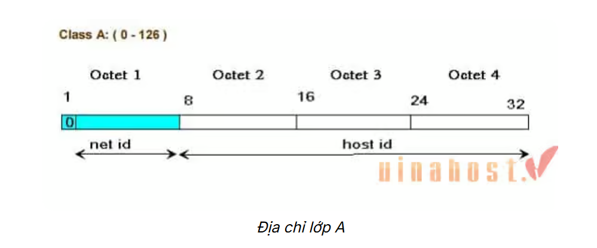
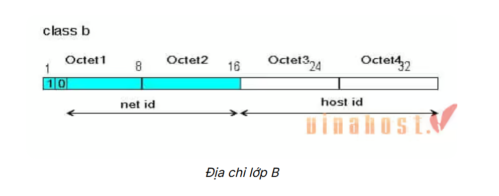
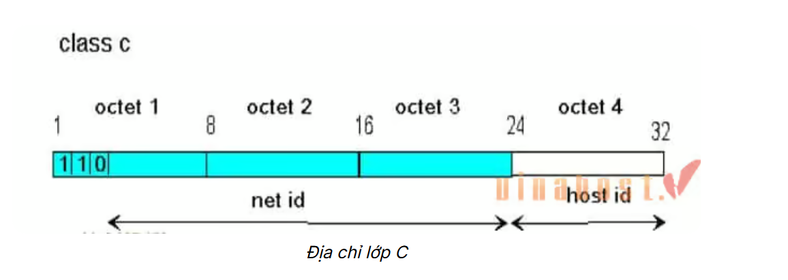
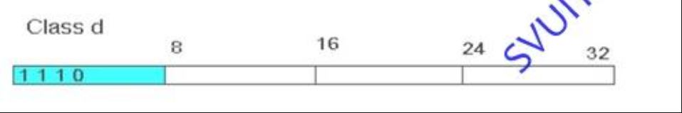

# TÌM HIỂU VỀ IPv4

## I. IPv4 là gì

IPv4 (Internet Protocol version 4) là phiên bản thứ tư của giao thức Internet (IP), một hệ thống địa chỉ số được sử dụng để định danh và liên kết các thiết bị kết nối với internet. Nó chịu trách nhiệm định tuyến lưu lượng truy cập trên mạng. Địa chỉ IPv4 được biểu diễn dưới dạng chuỗi số, chia thành các nhóm được ngăn cách bằng dấu chấm, `ví dụ: 192.168.0.1`

## II. Tại sao lại không có IPv1,2,3,5 ?

### 1. IPv1 đến IPv3 là các phiên bản thử nghiệm nội bộ

- IPv1, IPv2, và IPv3 thực chất đã từng tồn tại, nhưng chỉ trong giai đoạn nghiên cứu và phát triển ban đầu của giao thức IP.

> Chúng không bao giờ được triển khai rộng rãi trên Internet.

- Các phiên bản này được sử dụng trong những bản thảo hoặc các hệ thống thử nghiệm nội bộ tại DARLA hoặc các phòng lab phát triển Internet đầu tiên (như ARPANET).

### 2. IPv4 là phiên bản đầu tiên được triển khai rộng rãi

- IPv4 (Internet Protocol version 4) là phiên bản đầu tiên được chuẩn hóa và sử dụng toàn cầu từ những năm 1980.

- Đây là lý do bạn thấy IPv4 như là "bắt đầu chính thức" của IP.

### 3. IPv5 tồn tại, nhưng không phải là phiên bản kế tiếp của IP

- IPv5 thực ra đã từng được định nghĩa, nhưng nó không phải là một phiên bản IP để thay thế IPv4.

- IPv5 là tên gọi của một giao thức thử nghiệm tên là ST (Stream Protocol), dùng để truyền dữ liệu thời gian thực (audio/video).

> Vì ST đã được gán số phiên bản là 5, nên số này không thể được tái sử dụng cho một giao thức IP kế tiếp.

### 4. IPv6 là phiên bản tiếp theo chính thức

> Khi người ta cần một phiên bản IP mới để giải quyết vấn đề thiếu địa chỉ IP, người ta tạo ra IPv6 và nhảy thẳng từ IPv4 lên IPv6, bỏ qua IPv5 để tránh nhầm lẫn với giao thức ST.

---

## III. Cấu trúc của IPv4


Sơ đồ cấu trúc của IPv4 Diagram

- Địa chỉ IPv4 có cấu trúc 32-bit, được biểu diễn dưới dạng bốn số thập phân. Các số này được phân tách bằng dấu chấm, `ví dụ: 192.168.1.1`. Mỗi số trong dãy này được gọi là một “octet” và có giá trị từ 0 đến 255.

- Mỗi octet tương ứng với 8 bit nhị phân. Khi kết hợp 4 octet lại, chúng ta có tổng cộng 32 bit. Cấu trúc này cho phép tạo ra khoảng 4,3 tỷ địa chỉ duy nhất. Ví dụ, địa chỉ 192.168.1.1 trong hệ nhị phân sẽ là

> 11000000.10101000.00000001.00000001

**-Một số quy tắc đặt địa chỉ IP phải tuân theo:**

- Các bit phần mạng không được phép đồng thời bằng 0.

>VD: địa chỉ 0.0.0.1 với phần mạng là 0.0.0 và phần host là 1 là không hợp lệ.

- Nếu các bit phần host đồng thời bằng 0, ta có một địa chỉ mạng.

>VD: địa chỉ 192.168.1.1 là một địa chỉ có thể gán cho host nhưng địa chỉ 192.168.1.0 là một địa chỉ mạng, không thể gán cho host được.

- Nếu các bit phần host đồng thời bằng 1, ta có một địa chỉ quảng bá (broadcast).

-VD: địa chỉ 192.168.1.255 là một địa chỉ broadcast cho mạng 192.168.1.0


## IV. Các thành phần IPv4

Ban đầu, một địa chỉ IP được chia thành hai phần:

- Network ID: -ID mạng còn được gọi là NetID là một bit cố định trong địa chỉ IP đại diện cho toàn bộ mạng của bất kỳ máy chủ nào được kết nối với mạng đó. Tức là, nó cho biết mạng của máy chủ mà máy chủ đó được kết nối.

  -NET ID sử dụng tiền tố dựa trên lớp của nó. Các lớp A, B, C, D và E lần lượt sử dụng các tiền tố '0', '10', '110', '1110' và '1111 0'. Ngoài ra, như được thấy trong hình bên dưới, mỗi lớp có số lượng octet khác nhau được dành riêng cho Host ID. Lớp A dành 3 octet, lớp B dành 2 octet, lớp C dành 1 octet, và lớp D/E không có octet nào được dành riêng cho ID máy chủ.

  -Kết hợp hai sự kiện này, chúng ta thấy rằng Lớp A, B, C, D và E sử dụng lần lượt 7, 14, 21, 28 và 27 bit cho ID mạng thực tế.


- Host ID: -Là địa chỉ IP định danh từng thiết bị trong hệ thống mạng.


## V. Các lớp của IPv4


Không gian IP address sẽ được chia thành nhiều lớp, bao gồm:

- Lớp A
- Lớp B
- Lớp C
- Lớp D
- Lớp E

Lưu ý:

Các lớp IP address có thể dùng đặt cho các host là các lớp A, B, C. Bạn có thể quan sát octet đầu của địa chỉ để xác định địa chỉ IP thuộc lớp nào. Phân loại như sau:

- 1 -> 126 Địa chỉ IP lớp A
- 128 -> 191 Địa chỉ IP lớp B
- 192 -> 223 Địa chỉ IP lớp C
- 224 -> 239 Địa chỉ IP lớp D
- 240 -> 255 Địa chỉ IP lớp E

### 1. Lớp A



- Địa chỉ IP lớp A dùng một octet đầu làm phần network, ba octet sau làm phần host.
- Bit đầu của một IP lớp A luôn là 0.
- Các địa chỉ mạng lớp A sẽ bao gồm: 1.0.0.0 -> 126.0.0.0.
- Mạng 127.0.0.0 được sử dụng như mạng loopback.
- Phần host có 24 bit => mỗi network lớp A có (2^24 – 2) host.
- Có 126 mạng trong lớp A

### 2. Lớp B



- Địa chỉ lớp B sử dụng 2 octet đầu làm phần mạng, 2 octet sau làm phần
- 2 bit đầu của một IP lớp B sẽ luôn là 1 0.
- Các địa chỉ mạng lớp B sẽ bao gồm: 128.0.0.0 -> 191.255.0.0.
- Có tổng cộng 2^14 mạng trong lớp B
- Phần host dài 16 bit, vì vậy một mạng lớp B có (2^16– 2) host.

### 3. Lớp C



- IP lớp C sử dụng ba octet đầu làm phần network, một octet sau làm phần
- Ba bit đầu của một IP lớp C luôn là 1 1 0.
- Các địa chỉ mạng lớp C sẽ bao gồm: 192.0.0.0 -> 223.255.255.0. - - Có tổng cộng 2^21 mạng trong lớp C.
- Phần host dài 8 bit vì vậy nên một mạng lớp C sẽ có (2^8– 2) host.

### 4. Lớp D



- Lớp D được sử dụng làm các địa chỉ multicast và dải địa chỉ lớp D từ 224.0.0.0 -> 239.255.255.255.
- Địa chỉ multicast trong IPv4 được sử dụng để truyền tải dữ liệu đa điểm trên mạng.được dùng để gửi dữ liệu đến một nhóm các thiết bị mạng.
- Địa chỉ multicast được sử dụng trong nhiều ứng dụng mạng, chẳng hạn như truyền tải video trực tiếp, âm thanh, và các dịch vụ như IP TV và VoIP.

### 5. Lớp E


- Từ 240.0.0.0 trở đi.
- Thường sử dụng vào mục đích dự phòng

## VI. Phân biệt IP Public và IP Private

### 1. Địa chỉ IP Public

- IP Public (hay IP công cộng) là địa chỉ IP được nhà cung cấp dịch vụ Internet cấp cho thiết bị modem hoặc router của bạn khi kết nối với Internet. Chúng đóng vai trò như địa chỉ nhà của thiết bị trên mạng Internet, giúp các thiết bị khác trên thế giới có thể xác định và kết nối với chúng.

### 2. Địa chỉ IP Private

- Địa chỉ IP private của hệ thống là địa chỉ IP được sử dụng để giao tiếp trong cùng một mạng. Thông tin hoặc dữ liệu IP private có thể được gửi hoặc nhận trong cùng một mạng.

### 3.Phân biệt giữa IP Private và IP Public

|**Đặc điểm**|**Địa chỉ IP Private**| **Địa chỉ IP Public**   |
| --------------------- | ---------------------------------------------------------------------------------------------------------------- | ----------------------------------------------------------------------------------- |
| **Phạm vi**           | Cục bộ                                                                                                           | Toàn cầu                                                                            |
| **Mục đích sử dụng**  | Giao tiếp trong mạng                                                                                             | Giao tiếp bên ngoài mạng                                                            |
| **Đặc điểm địa chỉ**  | Địa chỉ IP private của các hệ thống được kết nối trong mạng sẽ khác nhau, nhưng vẫn theo một quy luật thống nhất | Địa chỉ IP public có thể khác nhau theo một quy luật đồng nhất hoặc không đồng nhất |
| **Phạm vi hoạt động** | Chỉ hoạt động trong mạng LAN                                                                                     | Dùng để truy cập dịch vụ Internet                                                   |
| **Quản lý**           | Được sử dụng để load hệ điều hành mạng                                                                           | Được kiểm soát bởi ISP (nhà cung cấp dịch vụ Internet)                              |
| **Chi phí**           | Miễn phí                                                                                                         | Không miễn phí                                                                      |
| **Cách kiểm tra**     | Nhập `ipconfig` vào Command Prompt                                                                               | Gõ "what is my ip" vào Google                                                       |
| **Phạm vi địa chỉ/Dải Host**   | - 10.0.0.0 – 10.255.255.255 <br> - 172.16.0.0 – 172.31.255.255 <br> - 192.168.0.0 – 192.168.255.255              | Ngoại trừ các địa chỉ IP private, toàn bộ phần còn lại đều là IP public             |

## VII. Cách chia địa chỉ IPv4

- Việc chia địa chỉ IPv4, còn gọi là subnetting, là quá trình chia một mạng IPv4 lớn thành nhiều mạng con nhỏ hơn, giúp quản lý hiệu quả hơn và tiết kiệm địa chỉ IP. Để chia IPv4, bạn cần xác định số lượng mạng con cần thiết, số lượng địa chỉ IP cần cho mỗi mạng, sau đó tính toán subnet mask và các địa chỉ mạng con tương ứng.

- Các bước chia địa chỉ IPv4:

### Bước 1. Xác định số lượng mạng con và số lượng thiết bị trên mỗi mạng

Bạn cần biết cần bao nhiêu mạng con và mỗi mạng cần bao nhiêu địa chỉ IP để phục vụ cho các thiết bị.

### Bước 2. Chọn subnet mask

Subnet mask xác định phần mạng và phần host của địa chỉ IP. Bạn có thể chọn subnet mask dựa trên số lượng mạng con và thiết bị cần thiết.

### Bước 3. Tính toán subnet mask

Subnet mask được biểu diễn dưới dạng một dãy số nhị phân 32 bit, trong đó các bit 1 biểu thị phần mạng và các bit 0 biểu thị phần host. Ví dụ, subnet mask 255.255.255.0 (hay /24) có 24 bit 1 và 8 bit 0.

### Bước 4. Xác định địa chỉ mạng con

Sau khi có subnet mask, bạn có thể xác định địa chỉ mạng con bằng cách sử dụng toán tử AND giữa địa chỉ IP gốc và subnet mask.

### Bước 5. Xác định địa chỉ broadcast

Địa chỉ broadcast của mỗi mạng con là địa chỉ cuối cùng trong dải địa chỉ của mạng đó.

### Bước 6. Xác định dải địa chỉ khả dụng

Dải địa chỉ khả dụng là các địa chỉ IP có thể gán cho các thiết bị trong mạng con.

- **Ví dụ minh họa:** Giả sử bạn có địa chỉ IP 192.168.1.0/24 và muốn chia thành 4 mạng con, mỗi mạng có 62 máy tính.

1. Số lượng mạng con và thiết bị: 4 mạng con, mỗi mạng cần 62 máy tính (cộng thêm địa chỉ mạng và địa chỉ broadcast).

2. Chọn subnet mask: Để có 4 mạng con, bạn cần mượn 2 bit từ phần host. Subnet mask tương ứng là /26 (32 - 2 = 30 bit cho mạng, 2 bit cho host). Subnet mask này là 255.255.255.192.

3. Địa chỉ mạng con:

```markdown
Mạng 1: 192.168.1.0/26 (địa chỉ mạng)
Mạng 2: 192.168.1.64/26
Mạng 3: 192.168.1.128/26
Mạng 4: 192.168.1.192/26
```

4. Địa chỉ broadcast:

```markdown
Mạng 1: 192.168.1.63
Mạng 2: 192.168.1.127
Mạng 3: 192.168.1.191
Mạng 4: 192.168.1.255
```

5. Dải địa chỉ khả dụng:

```markdown
Mạng 1: 192.168.1.1 đến 192.168.1.62
Mạng 2: 192.168.1.65 đến 192.168.1.126
Mạng 3: 192.168.1.129 đến 192.168.1.190
Mạng 4: 192.168.1.193 đến 192.168.1.254
```

> Lưu ý:
> Việc chia subletting có thể phức tạp, bạn nên sử dụng các công cụ hỗ trợ như Subnet Calculator để tính toán chính xác.
> Khi chia subnet, hãy đảm bảo rằng không có địa chỉ IP nào bị trùng lặp.
> Trong một số trường hợp, bạn có thể sử dụng kỹ thuật VSSM (Variable Length Subnet Masking) để chia subnet hiệu quả hơn.

## VIII. Phân biệt MultiCast và BoardCast

### Broadcast

Broadcast được sử dụng trong mạng máy tính để mô tả cách thức truyền tin từ 1 điểm đến tất cả các điểm khác trong cùng một mạng . Một gói broadcast chuyển đến tất cả các thiết bị tham gia trong mạng cục bộ , mà không phải quy định rõ ràng như một máy nhận .
Một địa chỉ broadcast sẽ đại diện cho tất cả các thiết bị kết nối cùng mạng. Do đó khi một gói tin được gửi đến địa chỉ broadcast , tất cả các thiết bị trong mạng đều nhận được
Có 2 loại broadcast

- Direct broadcast
- Local broadcast
  

### Multicast

Multicast được sử dụng trong mạng máy tính để mô tả cách thức truyền tin từ 1 điểm đến 1 nhóm các điểm khác trong cùng một mạng , đặc điểm khác so với broadcast là có tính chọn lọc cao hơn.  
 

## IX. Subnet, Subnet Mask, Prefix

### Subnet

Subnet, hay mạng con, là một phần của mạng lớn hơn được chia nhỏ để quản lý và tối ưu hóa hiệu quả hoạt động mạng. Nó giúp phân chia địa chỉ IP thành các nhóm nhỏ hơn, giúp việc quản lý, bảo mật và định tuyến dữ liệu trở nên dễ dàng hơn.

### Subnet Mask

Subnet mask là một dạng số nhị phân 32bit, cho phép người sử dụng phân tách địa chỉ IP thành địa chỉ mạng và địa chỉ host. Các địa chỉ theo dạng số học sẽ không được sử dụng cho máy chủ.

### Prefix

- Subnet mask được sử dụng kèm với địa chỉ IP để một host
  có thể căn cứ vào đó xác định được địa chỉ mạng tương ứng của địa chỉ này. Vì vậy, khi khai báo một địa chỉ IP ta luôn phải khai báo kèm theo một subnet mask. Tuy nhiên, subnet mask dù đã được viết dưới dạng số thập phân vẫn khá dài dòng nên để mô tả một địa chỉ IP một cách ngắn gọn hơn, người ta dùng một đại lượng được gọi là số prefix. Số prefix đơn giản chỉ là số bit NET trong một địa chỉ IP, được viết ngay sau địa chỉ IP, và được ngăn cách với địa chỉ này bằng một dấu “/”.

- Nguyên lý cơ bản của kỹ thuật chia subnet: Để có thể chia nhỏ một mạng lớn thành nhiều mạng con bằng nhau, người ta thực hiện mượn thêm một số bit bên phần host để làm phần mạng, các bit mượn này được gọi là các bit subnet. Tùy thuộc vào số bit subnet mà ta có được các số lượng các mạng con khác nhau với các kích cỡ khác nhau.
