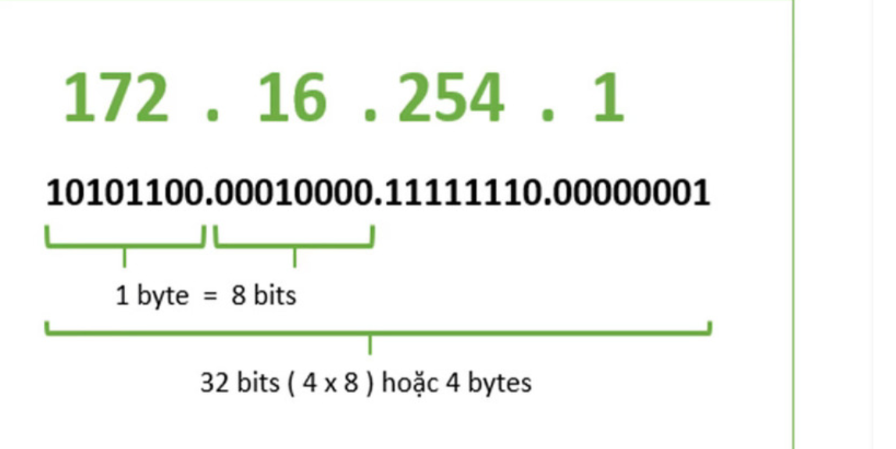
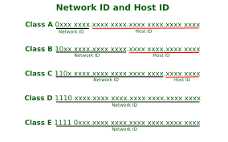

# TÌM HIỂU VỀ IPv4

## I. IPv4 là gì

> IPv4 (Internet Protocol version 4) là phiên bản thứ tư của giao thức Internet (IP), một hệ thống địa chỉ số được sử dụng để định danh và truyền thông tin giữa các thiết bị kết nối với internet hoặc mạng nội bộ.

> Địa chỉ IPv4 được biểu diễn dưới dạng chuỗi số, chia thành các nhóm được ngăn cách bằng dấu chấm, `ví dụ: 192.168.0.1`.

> Mỗi thiết bị kết nối vào mạng sẽ được gán cho 1 địa chỉ IPv4 duy nhất.

## II. Tại sao lại không có IPv1,2,3,5 ?

### 1. IPv1 đến IPv3 là các phiên bản thử nghiệm nội bộ

> Chúng không bao giờ được triển khai rộng rãi trên Internet vì chỉ là phiên bản thử nghiệm của tổ chức ARPANET

### 2. IPv4 là phiên bản đầu tiên được triển khai rộng rãi

- IPv4 (Internet Protocol version 4) là phiên bản đầu tiên được chuẩn hóa và sử dụng toàn cầu từ những năm 1980.

- Đây là lý do bạn thấy IPv4 như là "bắt đầu chính thức" của IP.

### 3. IPv5 tồn tại, nhưng không phải là phiên bản kế tiếp của IP

- IPv5 là tên gọi của một giao thức thử nghiệm tên là ST (Stream Protocol), dùng để truyền dữ liệu thời gian thực (audio/video).

> Vì ST đã được gán số phiên bản là 5, nên số này không thể được tái sử dụng cho một giao thức IP kế tiếp.

### 4. IPv6 là phiên bản tiếp theo chính thức

- Khi người ta cần một phiên bản IP mới để giải quyết vấn đề thiếu địa chỉ IP, người ta tạo ra IPv6 và nhảy thẳng từ IPv4 lên IPv6, bỏ qua IPv5 để tránh nhầm lẫn với giao thức ST.

## III. Đặc điểm, Cấu trúc của IPv4


**-Đặc điểm của IPv4:**

- **Độ dài :** Địa chỉ IPv4 có độ dài 32-bit, chia thành 4 cụm 8 bit (gọi là các octet)

- **Biểu diễn :** Được biểu diễn dưới dạng bốn số thập phân. Các số tách bằng dấu chấm. Mỗi số được gọi là một “octet” và có giá trị từ 0 đến 255.

`ví dụ: 192.168.1.1`

- **Số địa chỉ :** Cấu trúc này cho phép tạo ra khoảng 4,3 tỷ địa chỉ duy nhất. Ví dụ, địa chỉ 192.168.1.1 trong hệ nhị phân sẽ là :

`11000000.10101000.00000001.00000001`

**-Một số quy tắc đặt địa chỉ IP phải tuân theo:**

- Các bit phần mạng không được phép đồng thời bằng 0.

`VD: địa chỉ 0.0.0.1 với phần mạng là 0.0.0 và phần host là 1 là không hợp lệ.`

- Nếu các bit phần host đồng thời bằng 0, ta có một địa chỉ mạng.

`VD: địa chỉ 192.168.1.1 là một địa chỉ có thể gán cho host nhưng địa chỉ 192.168.1.0 là một địa chỉ mạng, không thể gán cho host được`

- Nếu các **bit** phần host đồng thời bằng 1, ta có một địa chỉ quảng bá (broadcast).

`VD: địa chỉ 192.168.1.255 là một địa chỉ broadcast cho mạng 192.168.1.0`



## IV. Các thành phần IPv4

Ban đầu, một địa chỉ IP được chia thành hai phần:

>- **Network ID:** -ID mạng còn được gọi là NetID xác định mạng cụ thể nơi mà một hoặc nhiều hosts có thể được kết nối.


>- **Host ID**: -Là địa chỉ IP định danh từng thiết bị trong hệ thống mạng.


- **Lý do chia Network và Host**

-Quản lý hiệu quả hơn: Trong một mạng lớn, việc chia địa chỉ thành phần network giúp định tuyến dễ dàng hơn. Router chỉ cần quan tâm đến phần network để định tuyến gói tin, thay vì phải xử lý từng thiết bị cụ thể.

-Tiết kiệm tài nguyên: Nếu không chia network và host, toàn bộ 32 bit sẽ phải dùng để quản lý từng thiết bị duy nhất, làm lãng phí tài nguyên. Với cách chia này, nhiều thiết bị có thể chia sẻ cùng một phần network, tiết kiệm địa chỉ.

-Hỗ trợ định tuyến: Phần network giúp các thiết bị (router) trên mạng biết cách gửi dữ liệu qua các mạng khác nhau mà không cần biết chi tiết từng thiết bị.

-Phân chia trách nhiệm quản trị: Mỗi mạng con (subnet) có thể được giao cho một quản trị viên khác nhau. Điều này giúp phân tách quản trị mạng theo quy mô hoặc khu vực.

## V. Các lớp của IPv4



### 1. Phân biệt theo giá trị và cấu trúc

| Lớp | Phạm vi giá trị (thập phân) | Octet đầu (nhị phân) | Số bit cho mạng/host     |
| --- | --------------------------- | -------------------- | ------------------------ |
| A   | 0.0.0.0 - 126.255.255.255   | 0xxxxxxx             | 8 bit mạng, 24 bit host  |
| B   | 128.0.0.0 - 191.255.255.255 | 10xxxxxx             | 16 bit mạng, 16 bit host |
| C   | 192.0.0.0 - 223.255.255.255 | 110xxxxx             | 24 bit mạng, 8 bit host  |
| D   | 224.0.0.0 - 239.255.255.255 | 1110xxxx             | Không chia mạng/host     |
| E   | 240.0.0.0 - 255.255.255.255 | 1111xxxx             | Không chia mạng/host     |

- Cá biệt ta có địa chỉ 127.x.x.x là địa chỉ loopback dùng để kiểm tra kết nối mạng nội bộ trên cùng 1 máy tính.

### 2. Phân biệt theo chức năng và sử dụng

### Phân biệt theo chức năng và sử dụng

| Lớp | Mục đích sử dụng                                                                           |
| --- | ------------------------------------------------------------------------------------------ |
| A   | Được thiết kế cho các tổ chức lớn với số lượng host nhiều (ISP, doanh nghiệp toàn cầu).    |
| B   | Dành cho các tổ chức vừa và lớn như trường đại học, doanh nghiệp vừa.                      |
| C   | Phục vụ các mạng nhỏ như văn phòng, tổ chức nhỏ, mạng gia đình.                            |
| D   | Dùng cho truyền thông multicast, tức là gửi dữ liệu đến một nhóm máy tính cụ thể.          |
| E   | Được dành riêng cho nghiên cứu hoặc sử dụng trong tương lai, không được sử dụng công khai. |

## VI. Phân biệt IP Public và IP Private

### 1. Địa chỉ IP Public

>-**IP Public (hay IP công cộng):** là địa chỉ IP được nhà cung cấp dịch vụ Internet cấp cho thiết bị modem hoặc router của bạn khi kết nối với Internet. Chúng đóng vai trò như địa chỉ nhà của thiết bị trên mạng Internet, giúp các thiết bị khác trên thế giới có thể xác định và kết nối với chúng.Và địa chỉ IP Public chia ra làm 2 loại:

- **Địa chỉ IP động:** Địa chỉ IP động là một địa chỉ IP được cấp phát tự động cho một thiết bị bởi máy chủ DHCP (Dynamic Host Configuration Protocol) mỗi khi thiết bị kết nối vào mạng. Địa chỉ này có thể thay đổi sau mỗi lần kết nối hoặc sau một khoảng thời gian nhất định.

- **Địa chỉ IP tĩnh:** Là một địa chỉ IP được gán cố định cho một thiết bị và không thay đổi theo thời gian. Địa chỉ này thường được gán thủ công bởi quản trị viên mạng hoặc được cấu hình trên thiết bị.

-**So sánh địa chỉ IP động và IP tĩnh:**

| Đặc điểm         | IP tĩnh                              | IP động                                          |
| ---------------- | ------------------------------------ | ------------------------------------------------ |
| Gán địa chỉ      | Thủ công hoặc cấu hình trên thiết bị | Tự động bởi máy chủ DHCP                         |
| Thay đổi         | Không thay đổi                       | Thay đổi sau mỗi lần kết nối hoặc theo thời gian |
| Ổn định truy cập | Rất ổn định                          | Khó khăn hơn, cần Dynamic DNS                    |
| Quản lý          | Khó hơn, cần theo dõi cẩn thận       | Dễ dàng hơn, tự động bởi DHCP                    |

### 2. Địa chỉ IP Private

>**-Địa chỉ IP private** của hệ thống là địa chỉ IP được sử dụng để giao tiếp trong cùng một mạng. Thông tin hoặc dữ liệu IP private có thể được gửi hoặc nhận trong cùng một mạng.

### 3. Phân biệt giữa IP Private và IP Public

| **Đặc điểm**                 | **Địa chỉ IP Private**                                                                                           | **Địa chỉ IP Public**                                                                                                |
| ---------------------------- | ---------------------------------------------------------------------------------------------------------------- | -------------------------------------------------------------------------------------------------------------------- |
| **Phạm vi**                  | Cục bộ                                                                                                           | Toàn cầu                                                                                                             |
| **Mục đích sử dụng**         | Giao tiếp trong mạng                                                                                             | Giao tiếp bên ngoài mạng                                                                                             |
| **Phạm vi hoạt động**        | Chỉ hoạt động trong mạng LAN                                                                                     | Dùng để truy cập dịch vụ Internet                                                                                    |
| **Quản lý**                  | Được sử dụng để load hệ điều hành mạng                                                                           | Được kiểm soát bởi ISP (nhà cung cấp dịch vụ Internet)                                                               |
| **Chi phí**                  | Miễn phí                                                                                                         | Không miễn phí                                                                                                       |
| **Cách kiểm tra**            | Nhập `ipconfig` vào Command Prompt                                                                               | Gõ "what is my ip" vào Google                                                                                        |
| **Phạm vi địa chỉ/Dải Host** | - 10.0.0.0 – 10.255.255.255 <br>- 172.16.0.0– 172.31.255.255<br>- 192.168.0.0 – 192.168.255.255| Ngoại trừ các địa chỉ IP private, toàn bộ phần còn lại đều là IP public, trừ địa chỉ 127.x.x.x là địa chỉ Local Host |

### 4. Kỹ thuật NAT (Network Address Translation) được sử dụng để chuyển đổi giữa IP private và IP public

VD: Khi một thiết bị trong mạng nội bộ (điện thoại, máy tính) muốn truy cập internet, nó sẽ gửi một gói tin đến router (thiết bị thực hiện chức năng NAT). Router sẽ thay thế địa chỉ IP private của thiết bị đó bằng địa chỉ IP public của chính nó (hoặc một địa chỉ IP public được cấu hình sẵn). Gói tin với địa chỉ IP public mới sẽ được gửi đi qua Internet. Khi có phản hồi từ Internet, router sẽ nhận được gói tin và dựa vào thông tin lưu trữ (bảng NAT) để xác định thiết bị nào trong mạng nội bộ là đích đến cuối cùng của gói tin. Router sẽ thay thế địa chỉ IP public trong gói tin trở lại thành địa chỉ IP private ban đầu và chuyển tiếp gói tin đến thiết bị đích.

- **Địa chỉ IP private được sử dụng để bảo tồn địa chỉ IP public đang dần cạn kiệt:** IPv4 có chiều dài 32 bit để đánh địa chỉ, theo đó, số địa chỉ tối đa có thể sử dụng là 4.294.967.296 (2^32). Một số địa chỉ IP được sử dụng cho các mục đích khác như cấp cho mạng cá nhân (xấp xỉ 18 triệu địa chỉ), hoặc sử dụng làm địa chỉ quảng bá (xấp xỉ 16 triệu), nên số lượng địa chỉ thực tế có thể sử dụng cho mạng Internet công cộng bị giảm xuống. Thay vì mỗi thiết bị cần một địa chỉ Public, các thiết bị trong mạng nội bộ sử dụng địa chỉ Private. Router hoặc thiết bị NAT (Network Address Translation) dịch địa chỉ Private thành một địa chỉ Public duy nhất để giao tiếp với Internet, điều này cho phép hàng triệu thiết bị nội bộ sử dụng chung một địa chỉ Public. Địa chỉ Private không cần duy nhất trên toàn cầu, chúng có thể được sử dụng lại ở nhiều mạng khác nhau mà không gây xung đột (vì không được định tuyến trên Internet).

## VII. Cách chia địa chỉ IPv4

- Việc chia địa chỉ IPv4, còn gọi là subnetting, là quá trình chia một mạng IPv4 lớn thành nhiều mạng con nhỏ hơn, giúp quản lý hiệu quả hơn và tiết kiệm địa chỉ IP. Để chia IPv4, bạn cần xác định số lượng mạng con cần thiết, số lượng địa chỉ IP cần cho mỗi mạng, sau đó tính toán subnet mask và các địa chỉ mạng con tương ứng.

- Các bước chia địa chỉ IPv4:

### Bước 1. Xác định số lượng mạng con và số lượng thiết bị trên mỗi mạng

Bạn cần biết cần bao nhiêu mạng con và mỗi mạng cần bao nhiêu địa chỉ IP để phục vụ cho các thiết bị.

### Bước 2. Chọn subnet mask

Subnet mask xác định phần mạng và phần host của địa chỉ IP. Bạn có thể chọn subnet mask dựa trên số lượng mạng con và thiết bị cần thiết.

### Bước 3. Tính toán subnet mask

Subnet mask được biểu diễn dưới dạng một dãy số nhị phân 32 bit, trong đó các bit 1 biểu thị phần mạng và các bit 0 biểu thị phần host. Ví dụ, subnet mask 255.255.255.0 (hay /24) có 24 bit 1 và 8 bit 0.

### Bước 4. Xác định địa chỉ mạng con

Sau khi có subnet mask, bạn có thể xác định địa chỉ mạng con bằng cách sử dụng toán tử AND giữa địa chỉ IP gốc và subnet mask.

### Bước 5. Xác định địa chỉ broadcast

Địa chỉ broadcast của mỗi mạng con là địa chỉ cuối cùng trong dải địa chỉ của mạng đó.

### Bước 6. Xác định dải địa chỉ khả dụng

Dải địa chỉ khả dụng là các địa chỉ IP có thể gán cho các thiết bị trong mạng con.

- **Ví dụ minh họa:** Giả sử bạn có địa chỉ IP 192.168.1.0/24 và muốn chia thành 4 mạng con, mỗi mạng có 62 máy tính.

1. Số lượng mạng con và thiết bị: 4 mạng con, mỗi mạng cần 62 máy tính (cộng thêm địa chỉ mạng và địa chỉ broadcast).

2. Chọn subnet mask: Để có 4 mạng con, bạn cần mượn 2 bit từ phần host. Subnet mask tương ứng là /26 (32 - 2 = 30 bit cho mạng, 2 bit cho host). Subnet mask này là 255.255.255.192.

3. Địa chỉ mạng con:

```markdown
Mạng 1: 192.168.1.0/26 (địa chỉ mạng)
Mạng 2: 192.168.1.64/26
Mạng 3: 192.168.1.128/26
Mạng 4: 192.168.1.192/26
```

4. Địa chỉ broadcast:

```markdown
Mạng 1: 192.168.1.63
Mạng 2: 192.168.1.127
Mạng 3: 192.168.1.191
Mạng 4: 192.168.1.255
```

5. Dải địa chỉ khả dụng:

```markdown
Mạng 1: 192.168.1.1 đến 192.168.1.62
Mạng 2: 192.168.1.65 đến 192.168.1.126
Mạng 3: 192.168.1.129 đến 192.168.1.190
Mạng 4: 192.168.1.193 đến 192.168.1.254
```

> Lưu ý:
> Việc chia subletting có thể phức tạp, bạn nên sử dụng các công cụ hỗ trợ như Subnet Calculator để tính toán chính xác.
> Khi chia subnet, hãy đảm bảo rằng không có địa chỉ IP nào bị trùng lặp.
> Trong một số trường hợp, bạn có thể sử dụng kỹ thuật VSSM (Variable Length Subnet Masking) để chia subnet hiệu quả hơn.

## VIII. Phân biệt MultiCast và BoardCast

### Broadcast

Broadcast được sử dụng trong mạng máy tính để mô tả cách thức truyền tin từ 1 điểm đến tất cả các điểm khác trong cùng một mạng . Một gói broadcast chuyển đến tất cả các thiết bị tham gia trong mạng cục bộ , mà không phải quy định rõ ràng như một máy nhận .
Một địa chỉ broadcast sẽ đại diện cho tất cả các thiết bị kết nối cùng mạng. Do đó khi một gói tin được gửi đến địa chỉ broadcast , tất cả các thiết bị trong mạng đều nhận được
Có 2 loại broadcast

- Direct broadcast
- Local broadcast
  

### Multicast

Multicast được sử dụng trong mạng máy tính để mô tả cách thức truyền tin từ 1 điểm đến 1 nhóm các điểm khác trong cùng một mạng , đặc điểm khác so với broadcast là có tính chọn lọc cao hơn.  
 

## IX. Subnet, Subnet Mask, Prefix

### Subnet

Subnet, hay mạng con, là một phần của mạng lớn hơn được chia nhỏ để quản lý và tối ưu hóa hiệu quả hoạt động mạng. Nó giúp phân chia địa chỉ IP thành các nhóm nhỏ hơn, giúp việc quản lý, bảo mật và định tuyến dữ liệu trở nên dễ dàng hơn.

### Subnet Mask

Subnet mask là một dạng số nhị phân 32bit, cho phép người sử dụng phân tách địa chỉ IP thành địa chỉ mạng và địa chỉ host. Các địa chỉ theo dạng số học sẽ không được sử dụng cho máy chủ.

### Prefix

- Subnet mask được sử dụng kèm với địa chỉ IP để một host
  có thể căn cứ vào đó xác định được địa chỉ mạng tương ứng của địa chỉ này. Vì vậy, khi khai báo một địa chỉ IP ta luôn phải khai báo kèm theo một subnet mask. Tuy nhiên, subnet mask dù đã được viết dưới dạng số thập phân vẫn khá dài dòng nên để mô tả một địa chỉ IP một cách ngắn gọn hơn, người ta dùng một đại lượng được gọi là số prefix. Số prefix đơn giản chỉ là số bit NET trong một địa chỉ IP, được viết ngay sau địa chỉ IP, và được ngăn cách với địa chỉ này bằng một dấu “/”.

- Nguyên lý cơ bản của kỹ thuật chia subnet: Để có thể chia nhỏ một mạng lớn thành nhiều mạng con bằng nhau, người ta thực hiện mượn thêm một số bit bên phần host để làm phần mạng, các bit mượn này được gọi là các bit subnet. Tùy thuộc vào số bit subnet mà ta có được các số lượng các mạng con khác nhau với các kích cỡ khác nhau.
