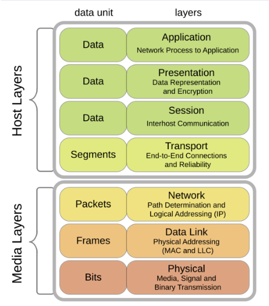

# TÌM HIỂU VỀ MÔ HÌNH OSI

## I. MÔ HÌNH OSI LÀ GÌ ?

### 1. Khái niệm

> Mô hình OSI, còn được gọi là OSI Model hoặc OSI Reference Model là một khung công nghệ hay mô hình tham chiếu quy ước do Tổ chức Tiêu chuẩn hóa Quốc tế phát triển, nhằm mục đích tạo điều kiện cho sự giao tiếp giữa các host hay thiết bị khác nhau thông qua việc áp dụng các giao thức tiêu chuẩn.

-Mô hình OSI có 7 tầng, phân chia quá trình truyền dữ liệu thành các bước riêng biệt, với mỗi lớp đảm nhận một khía cạnh cụ thể. Điều này cho phép sự đa dạng trong các giao thức ứng với từng nhu cầu truyền thông khác nhau.

### 2. MỤC ĐÍCH CỦA MÔ HÌNH OSI

-Mục đích chính của mô hình OSI đó là:

- **Giảm tải được độ phức tạp** : giúp các kĩ sư mạng có thể hiểu rõ kiến trúc kết nối giữa các thiết bị mạng.

- **Nghiên cứu và phát triển nhanh hơn**: các kỹ sư có thể hiểu rõ hơn về công việc của mình.

- **Đảm bảo tính tương thích giữa các thiết bị**: Giúp các nhà sản xuất thiết kế thiết bị tương thích được với chuẩn từng lớp

- **Chuẩn hoá linh hoạt**: Thay vì chỉ định các giao thức để sử dụng giữa các cấp, mô hình OSI chỉ định các tác vụ mà các giao thức thực hiện.

- =>Từ các mục đích trên ta có mục đích cuối đó là mô hình OSI giúp **thúc đẩy, phát triền mạng**

### 3. Ưu/Nhược điểm của mô hình OSI

-Ưu điểm:

- **Chuẩn hóa:**- Được Tổ chức Tiêu chuẩn Hóa Quốc tế (ISO) xác nhận, mô hình OSI là chuẩn mực toàn cầu được chấp nhận rộng rãi, giúp đảm bảo khả năng tương tác và giao tiếp giữa các hệ thống mạng đa dạng.

- **Cấu trúc phân lớp:** Với việc phân chia quy trình giao tiếp thành nhiều lớp độc lập, mỗi lớp đảm nhiệm một nhiệm vụ cụ thể, mô hình OSI làm cho việc quản lý và phân biệt các phần khác nhau của hệ thống mạng từ cơ bản đến nâng cao trở nên thuận tiện hơn.

- **Tính mở:** Mô hình OSI không chỉ xác định các giao thức cụ thể, mà còn cung cấp các khái niệm và nguyên tắc cơ bản. Điều này khuyến khích việc phát triển và mở rộng của các giao thức và ứng dụng mới.

-Nhược điểm:

- **Phức tạp và lãng phí:** Mô hình OSI bao gồm 7 tầng, và việc triển khai đầy đủ các tầng này có thể phức tạp và tốn kém. Đối với các hệ thống mạng nhỏ và đơn giản, việc sử dụng toàn bộ mô hình OSI có thể gây lãng phí tài nguyên.

- **Không phù hợp với thực tế:** Mô hình OSI được xây dựng trên cơ sở lý thuyết nên không thể hoàn toàn đáp ứng các yêu cầu và tình huống thực tế của các mạng thực tế.

- **Thiếu sự tương thích:** Mặc dù mô hình OSI định nghĩa các giao thức tiêu chuẩn, việc triển khai thực tế có thể dẫn đến sự không tương thích giữa các hệ thống và thiết bị từ các nhà sản xuất khác nhau.

## II. CÁC LỚP TRONG MÔ HÌNH OSI

-Trước tiên, để hiểu mô hình OSI này được xây dựng như thế nào thì

> **Mô hình OSI này được xây dựng theo phương pháp đó là phương pháp phân lớp layer appoarch**

### 1. Phương pháp phân lớp là gì ?

> Phương pháp phân lớp đó là phương pháp thiết kế hoặc tổ chức, cấu trúc một hệ thống thành các lớp riêng biệt được kết nối với nhau và mỗi lớp lại có chức năng riêng biệt. Và mô hình OSI là một trong những ví dụ thực tế của phương pháp phân lớp.

### 2. Lớp 7 – Application Layer (Lớp Ứng Dụng) – Giao diện cho người dùng và ứng dụng (HTTP, FTP, SMTP)

> **-Khái niệm:** Được đặt ở vị trí cao nhất (lớp 7), phần lớn các ứng dụng chạy trên tầng này. Tầng này cung cấp những giao thức cần thiết để ứng dụng có thể trao đổi thông tin và hiển thị dữ liệu một cách có ý nghĩa đến người dùng.

**Đặc điểm:**

- Gần gũi với người dùng: Đây là lớp mà người dùng trực tiếp tương tác thông qua các ứng dụng như trình duyệt web, email, hay phần mềm chia sẻ tệp.

- Phụ thuộc vào giao thức: Các ứng dụng hoạt động dựa trên các giao thức mạng được triển khai tại lớp này (ví dụ: HTTP, FTP, SMTP).

- Chỉ xử lý giao diện ứng dụng: Lớp Application không chịu trách nhiệm vận chuyển dữ liệu qua mạng; các nhiệm vụ như đóng gói, truyền tải và định tuyến dữ liệu được thực hiện ở các lớp thấp hơn.

- Độc lập với phần cứng và hệ điều hành: Các giao thức lớp Application có thể hoạt động trên mọi thiết bị và hệ điều hành nếu được hỗ trợ đúng cách.

**Chức năng:**

- Cung cấp giao diện người dùng: Kết nối ứng dụng và mạng, cho phép người dùng sử dụng các dịch vụ mạng như gửi email, truy cập web, hoặc truyền tệp.

`VD: Trình duyệt web cung cấp giao diện để tải trang web thông qua giao thức HTTP.`

- Xác thực và kiểm tra thông tin: Đảm bảo rằng người dùng hoặc ứng dụng được phép truy cập tài nguyên hoặc dịch vụ mạng.

`VD: Xác thực qua username và password khi đăng nhập vào một hệ thống email.`

- Quản lý giao tiếp giữa các ứng dụng: Xử lý các yêu cầu và phản hồi giữa ứng dụng cục bộ và các dịch vụ mạng từ xa.

`VD: Khi người dùng tải tệp qua FTP, lớp Application sẽ quản lý quá trình yêu cầu và nhận dữ liệu.`

**Hỗ trợ các dịch vụ mạng khác:**

- Dịch vụ dịch tên miền (DNS): Chuyển đổi tên miền (domain name) thành địa chỉ IP.

- Email (SMTP, POP3, IMAP): Quản lý việc gửi, nhận và lưu trữ email.

- Truyền tệp (FTP, SFTP): Cung cấp dịch vụ truyền và nhận tệp qua mạng.

### 3. Lớp 6 – Presentation Layer (Lớp Trình Bày): Định dạng, mã hóa/giải mã, nén dữ liệu (JPEG, MPEG)

> **-Khái niệm:** Là lớp thứ 6 trong mô hình OSI, đảm nhận nhiệm vụ chuyển đổi dữ liệu giữa định dạng mà ứng dụng sử dụng và định dạng phù hợp để truyền tải trên mạng. Đây là lớp chịu trách nhiệm chuẩn hóa dữ liệu để các hệ thống khác nhau có thể hiểu được, bất kể nền tảng hoặc ngôn ngữ lập trình. Lớp thứ 6 trong mô hình OSI, đảm bảo dữ liệu được định dạng đúng cách để các hệ thống khác nhau có thể hiểu được khi truyền qua mạng.

-Đặc điểm:

- **Định dạng dữ liệu:** Lớp này đảm bảo dữ liệu từ bên gửi được chuyển đổi sang định dạng mà bên nhận có thể hiểu.

- **Nén dữ liệu:** Giảm kích thước dữ liệu để tối ưu hóa băng thông mạng mà không làm mất dữ liệu.

- **Mã hóa và giải mã:** Đảm bảo dữ liệu được bảo mật khi truyền tải bằng cách mã hóa trước khi gửi và giải mã khi nhận.

- **Độc lập với nền tảng:** Lớp này cung cấp một chuẩn chung cho việc truyền dữ liệu, bất kể các hệ thống gửi và nhận có sử dụng hệ điều hành hoặc kiến trúc phần cứng khác nhau.

-Chức năng của lớp này:

- **Mã hóa/Giải mã (Encryption/Decryption):** Tầng Trình bày có khả năng mã hóa dữ liệu trước khi truyền và giải mã dữ liệu khi nhận, đảm bảo tính bảo mật trong quá trình truyền dữ liệu trên mạng.

- **Nén/Giải nén (Compression/Decompression)**: Nén dữ liệu để giảm dung lượng truyền và giải nén dữ liệu khi nhận, giúp tăng tốc độ truyền dữ liệu và giảm sử dụng băng thông mạng.

- **Định dạng dữ liệu (Data Formatting)**: Tầng Trình bày thực hiện việc chuyển đổi dữ liệu từ định dạng của ứng dụng thành định dạng chuẩn để truyền qua mạng và ngược lại, đảm bảo tính tương thích giữa các ứng dụng và hệ thống khác nhau.

### 4. Lớp 5 – Session Layer (Lớp Phiên): Thiết lập, quản lý và kết thúc phiên giao tiếp

> -Khái niệm: Là lớp thứ 5 trong mô hình OSI, đảm nhận nhiệm vụ quản lý và kiểm soát các phiên giao tiếp giữa các hệ thống. Nó tạo lập, duy trì, đồng bộ hóa và kết thúc các phiên giao tiếp, đảm bảo dữ liệu được truyền tải một cách chính xác và liên tục giữa các thiết bị.

-Đặc điểm:

- **Quản lý phiên:** Tạo ra và duy trì các phiên giao tiếp giữa các thiết bị.

- **Đồng bộ hóa:** Đồng bộ dữ liệu trong quá trình truyền, đảm bảo rằng dữ liệu bị mất có thể được phát hiện và xử lý.

- **Tách biệt các giao tiếp:** Hỗ trợ nhiều phiên giao tiếp đồng thời mà không bị lẫn lộn.

- **Kiểm soát lỗi ở mức phiên:** Đảm bảo phục hồi các phiên giao tiếp bị lỗi hoặc bị gián đoạn.

- **Phụ thuộc vào ứng dụng:** Hoạt động ở mức ứng dụng, giúp các ứng dụng giao tiếp hiệu quả thông qua mạng.

-Các chức năng quan trọng của tầng Phiên bao gồm:

- **Thiết lập phiên (Session establishment)**: Tầng Phiên giúp khởi tạo một phiên làm việc trước khi thực hiện việc truyền tải dữ liệu. Điều này đề cập đến việc nhận diện và thiết lập các tham số liên quan đến phiên, bao gồm thông tin xác thực, cấu hình và các yếu tố điều khiển khác.

- **Duy trì phiên (Session maintenance)**: Đảm bảo việc duy trì và quản lý phiên giao tiếp giữa các ứng dụng. Nó kiểm soát việc truyền dữ liệu trong suốt thời gian phiên diễn ra, thực hiện đồng bộ hóa dữ liệu, xử lý các yêu cầu và phản hồi.

- **Đồng bộ phiên (Session synchronization)**: Xác định các điểm đồng bộ trong quá trình truyền dữ liệu giữa các ứng dụng. Nhờ có chức năng này mà dữ liệu được truyền một cách nhất quán và đúng thứ tự giữa nguồn và đích.

- **Chấm dứt phiên (Session termination)**: Tầng Phiên cho phép các ứng dụng kết thúc phiên giao tiếp một cách an toàn và theo đúng quy trình, cụ thể là thông báo, truyền tải thông tin và giải phóng tài nguyên sau khi hoàn thành.

-**Quản lí đồng thời**: Cho phép nhiều kết nối phiên hoạt động đồng thời không gây ra xung đột

-Các thiết bị và thành phần có trong lớp phiên :

- **Tường lửa:** Quản lý kiểm soát phiên bằng cách giám sát và lọc các kết nối mạng.

- **Máy chủ Proxy:** Thiết lập và quản lý các phiên giữa máy khách và máy chủ.

- **Bộ điều khiển biên giới phiên (SBC):** Được sử dụng trong VoIP để quản lý và bảo mật các phiên giao tiếp.

- **Máy chủ ứng dụng:** Xử lý việc tạo và quản lý phiên cho các ứng dụng.

### 5. Lớp 4 – Transport Layer (Lớp Vận Chuyển): Đảm bảo truyền dữ liệu tin cậy (TCP) hoặc nhanh (UDP); kiểm soát luồng, lỗi

> -Khái niệm: Là lớp thứ 4 trong mô hình OSI, chịu trách nhiệm cung cấp dịch vụ truyền dữ liệu đáng tin cậy giữa các hệ thống đầu cuối (end-to-end). Nó phân phối dữ liệu từ lớp trên (Application) xuống lớp dưới (Network), đồng thời đảm bảo dữ liệu được gửi đúng thứ tự, không bị mất mát hoặc trùng lặp.

-Đặc điểm:

- **Kết nối đầu cuối:** Quản lý giao tiếp trực tiếp giữa các ứng dụng trên các thiết bị khác nhau.

- **Độ tin cậy:** Đảm bảo dữ liệu được truyền tải chính xác, không bị lỗi hoặc mất gói.

- **Kiểm soát luồng dữ liệu:** Điều chỉnh tốc độ truyền dữ liệu giữa các thiết bị để tránh quá tải.

- **Phân đoạn và tái lắp ghép:** Chia dữ liệu thành các đoạn nhỏ (segments) trước khi truyền và ghép chúng lại ở đầu nhận.

- **Khả năng chọn giao thức:** Có thể hoạt động với giao thức kết nối đáng tin cậy (TCP) hoặc không kết nối (UDP), tùy vào yêu cầu của ứng dụng.

-Chức năng:

- **Phân đoạn dữ liệu:** Chia dữ liệu lớn từ lớp Application thành các đoạn nhỏ (segments) để truyền qua mạng.

- **Gắn số thứ tự:** vào từng đoạn để đảm bảo tái lắp ghép chính xác.

- **Kiểm soát lỗi:** Sử dụng cơ chế phát hiện và sửa lỗi để đảm bảo dữ liệu không bị sai lệch.

- **Kiểm soát luồng:** Đảm bảo tốc độ truyền dữ liệu phù hợp với khả năng xử lý của thiết bị nhận.

- **Định danh địa chỉ cổng (Port Addressing):** Sử dụng số cổng (Port Number) để định danh ứng dụng cụ thể trên máy tính.

- **Quản lý kết nối:** Thiết lập, duy trì và kết thúc kết nối truyền tải dữ liệu (đặc biệt với TCP).

-Hỗ trợ cả hai loại giao tiếp:

- **Kết nối đáng tin cậy (TCP):** Đảm bảo dữ liệu được truyền chính xác và đúng thứ tự.

- **Không kết nối (UDP):** Cung cấp truyền dữ liệu nhanh hơn, không kiểm tra lỗi hoặc thứ tự.

### 6. Lớp 3 – Network Layer (Lớp Mạng): Định địa chỉ logic (IP) và định tuyến gói tin qua các mạng

> -Khái niệm: Là lớp thứ 3 trong mô hình OSI, chịu trách nhiệm định tuyến và truyền dữ liệu từ thiết bị nguồn đến thiết bị đích qua nhiều mạng khác nhau. Nó quản lý địa chỉ logic (IP Address) và xác định đường đi tốt nhất cho dữ liệu.

-Đặc điểm:

- **Định tuyến dữ liệu:** Lớp này xác định con đường tối ưu để truyền dữ liệu từ nguồn đến đích thông qua các bộ định tuyến (router).

- **Địa chỉ hóa logic:** Sử dụng địa chỉ IP để xác định nguồn và đích của dữ liệu.

- **Tính độc lập với lớp dưới:** Không quan tâm đến phương thức truyền vật lý (physical transmission).

- **Mở rộng phạm vi kết nối:** Hỗ trợ giao tiếp qua nhiều mạng khác nhau, đảm bảo dữ liệu truyền tải đúng nơi cần đến.

-Các chức năng của lớp mạng:

- **Định tuyến (Routing):** Lớp Mạng xác định đường đi tối ưu cho việc truyền gói tin từ nguồn đến đích qua các mạng khác nhau, thường sử dụng các giao thức như RIP (Routing Information Protocol) và OSPF (Open Shortest Path First) để quyết định đường đi tối ưu.

- **Chuyển tiếp (Forwarding):** Lớp Mạng chịu trách nhiệm chuyển tiếp gói tin từ đầu vào đến đầu ra qua các thiết bị định tuyến (router). Các thiết bị định tuyến sử dụng bảng định tuyến để quyết định cách chuyển tiếp gói tin đến đích.

- **Địa chỉ IP (IP Addressing):** Lớp Mạng sử dụng địa chỉ IP để xác định và định danh các thiết bị trong mạng. Địa chỉ IP đóng vai trò là một địa chỉ duy nhất cho mỗi thiết bị mạng và được sử dụng để xác định nguồn và đích của gói tin.

- **Fragmentation và Reassembly:** Lớp Mạng có khả năng phân mảnh gói tin thành các phần nhỏ hơn để truyền qua các mạng. Ngược lại, nó cũng có khả năng ghép các phần nhỏ lại thành gói tin ban đầu khi gói tin đến đích.

- **Kiểm tra các kết nối:** Hỗ trợ phát hiện và xử lý lỗi liên quan đến định tuyến hoặc giao tiếp giữa các mạng.

### 7. Lớp 2 – Data Link Layer (Lớp Liên Kết Dữ Liệu): Truyền dữ liệu tin cậy giữa hai thiết bị trực tiếp; định địa chỉ vật lý (MAC); đóng khung (frame)

-Lớp này chia thành hai phân lớp con:

- **Lớp LLC (Logical Link Control):** Quản lý các quy tắc truyền thông đồng bộ và không đồng bộ, kiểm tra tính toàn vẹn của dữ liệu và kiểm soát lỗi. Nhiệm vụ của nó là đảm bảo việc truyền thông tin một cách tin cậy giữa các điểm cuối trên cùng một mạng liên kết.

- **Lớp MAC (Media Access Control):** Xác định cách truy cập vào phương tiện truyền thông chia sẻ, ví dụ như mạng LAN Ethernet. Nó phụ trách việc gán địa chỉ vật lý (MAC address) cho các thiết bị mạng và xử lý việc truyền dữ liệu giữa các thiết bị đầu cuối trên cùng một mạng.

-Các chức năng chính tầng này:

- **Đóng gói dữ liệu:** Tách dữ liệu từ tầng mạng thành các Frame nhỏ để chuyển qua đường truyền vật lý.

- **Định địa chỉ vật lý:** Sử dụng địa chỉ MAC để xác định nguồn và đích của Frame dữ liệu.

- **Kiểm tra lỗi:** Phát hiện và xử lý các vấn đề liên quan đến mất mát hoặc hỏng hóc dữ liệu ở tầng Vật lý như kiểm tra lỗi chắn lẻ(parity check).

- **Quản lý truy cập vào phương tiện truyền thông:** Đảm bảo các quy tắc truy cập vào môi trường chia sẻ được quản lý một cách hiệu quả, tránh xung đột và đảm bảo hiệu suất truyền dữ liệu.(VD: Mạng Ethernet sử dụng CSMA/CD).

- **Điều khiển luồng dữ liệu:** Điều chỉnh tốc độ truyền dữ liệu giữa các thiết bị để tránh mất mát dữ liệu.

### 8. Lớp 1 – Physical Layer (Lớp Vật Lý) : Truyền dòng bit qua môi trường vật lý (cáp, sóng vô tuyến)

> **-Khái niệm:** Lớp Physical là lớp thấp nhất trong mô hình OSI, chịu trách nhiệm về việc truyền tải các tín hiệu vật lý qua các phương tiện truyền dẫn (cáp đồng, cáp quang, sóng vô tuyến, v.v.). Lớp này định nghĩa các đặc điểm kỹ thuật của phần cứng cần thiết để truyền dữ liệu giữa các thiết bị mạng.

-Đặc điểm:

- **Hoạt động ở mức tín hiệu:** Thay vì xử lý dữ liệu logic, lớp Physical chuyển đổi dữ liệu thành các tín hiệu vật lý (điện, ánh sáng, sóng radio) để truyền qua mạng.

- **Phụ thuộc vào loại phương tiện truyền dẫn:** Các phương tiện truyền dẫn như cáp xoắn đôi, cáp quang, hoặc mạng không dây quyết định cách thức dữ liệu được truyền.

- **Không quan tâm đến nội dung dữ liệu:** Lớp này không hiểu hay kiểm soát nội dung của dữ liệu mà chỉ đảm bảo tín hiệu được truyền đi một cách chính xác.

- **Tốc độ truyền tải:** Xác định tốc độ dữ liệu (bit per second - bps) mà hệ thống có thể truyền tải.

- **Đồng bộ hóa tín hiệu:** Đảm bảo rằng cả thiết bị gửi và nhận hiểu được cách tín hiệu được gửi đi, chẳng hạn như định thời tín hiệu.

-Chức năng cụ thể của tầng Vật lý bao gồm:

- **Truyền dữ liệu:** Chuyển đổi các bit thành tín hiệu vật lý để truyền qua các phương tiện truyền thông như cáp đồng trục, cáp xoắn đôi, cáp quang hoặc sóng vô tuyến. Tầng này xác định các quy tắc về tốc độ truyền, đồng bộ hóa, kích thước Frame dữ liệu, phạm vi tín hiệu và các thông số vật lý khác.

- **Điều khiển tín hiệu:** Quản lý các tín hiệu điều khiển như tín hiệu báo động, tín hiệu đồng bộ, tín hiệu kiểm tra lỗi và tín hiệu điều chỉnh tốc độ truyền dữ liệu.

- **Định dạng dữ liệu:** Tầng Vật lý quyết định cấu trúc và định dạng của dữ liệu trong từng bit, bao gồm các định dạng như NRZ (Non-Return-to-Zero), Manchester, AMI (Alternate Mark Inversion) và các phương pháp khác.

- Mã hóa và giải mã: Thực hiện quá trình mã hóa và giải mã các tín hiệu để đảm bảo việc truyền dữ liệu được thực hiện một cách chính xác.

## III. QUY TRÌNH HOẠT ĐỘNG CỦA MÔ HÌNH OSI TRÊN HOST/CLIENT

> ALL PROGRESS

Bước 1: Khi Thiết bị A gửi dữ liệu đến Thiết bị B qua mạng thông qua giao thức HTTP, trước tiên nó sẽ được thêm tiêu đề HTTP ở lớp ứng dụng.

Bước 2: Sau đó, một tiêu đề TCP hoặc UDP được thêm vào dữ liệu. Nó được đóng gói thành các phân đoạn TCP ở tầng vận chuyển. Tiêu đề này chứa cổng nguồn, cổng đích và số thứ tự.

Bước 3: Các phân đoạn sau đó được đóng gói với tiêu đề IP ở lớp mạng. Tiêu đề IP chứa địa chỉ IP nguồn/đích.

Bước 4: Gói dữ liệu IP được thêm tiêu đề MAC ở lớp liên kết dữ liệu, với địa chỉ MAC nguồn/đích.

Bước 5: Các khung được đóng gói được gửi đến lớp vật lý và được gửi qua mạng dưới dạng bit nhị phân.

> => Tất cả chu trình đóng gói dữ liệu đẻ gửi data đến máy chủ đích thì ta gọi quá trình đó là **Điều chế(Encapsulation)**

Bước 6-10: Khi Thiết bị B nhận được các bit từ mạng, nó sẽ thực hiện quá trình giải đóng gói, đây là quá trình xử lý ngược lại của quá trình đóng gói. Các tiêu đề được loại bỏ theo từng lớp, và cuối cùng, Thiết bị B có thể đọc dữ liệu.

> => Tất cả quy trình xử lý tệp tin từ phía máy gửi lên các lớp từ lớp vật lý cho đến lớp trình bay ta gọi đó là quá trình **Giải điều chế (de-encapslucation)**

