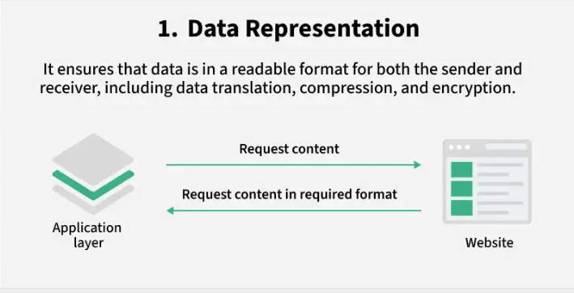

# TÌM HIỂU VỀ MÔ HÌNH OSI

## I. MÔ HÌNH OSI LÀ GÌ ?

### 1. Khái niệm

>Mô hình OSI (Open Systems Interconnection) là một khung mạng được thiết kế để hỗ trợ việc giao tiếp giữa các ứng dụng và thiết bị qua nhiều lớp. OSI nhằm mục đích cung cấp các giải pháp công nghệ và tiêu chuẩn kỹ thuật giúp phần mềm tương tác mượt mà thông qua mạng hoặc hệ thống viễn thông hiện có.

-Mô hình OSI, còn được gọi là OSI Model hoặc OSI Reference Model là một khung công nghệ quy ước do Tổ chức Tiêu chuẩn hóa Quốc tế phát triển, nhằm mục đích tạo điều kiện cho sự giao tiếp giữa các hệ thống truyền thông khác nhau thông qua việc áp dụng các giao thức tiêu chuẩn.

-Mô hình OSI được xem là một tiêu chuẩn chung trong lĩnh vực mạng máy tính, với cơ sở là hệ thống phân tầng. Mô hình này được xây dựng dựa trên ý tưởng chia toàn bộ quy trình liên lạc mạng thành 7 lớp độc lập nhưng có liên kết, mỗi lớp được xây dựng trên nền của lớp trước, nhằm mục đích trừu tượng hóa và chuẩn hóa quy trình thiết kế, triển khai giao thức liên lạc giữa các thiết bị điện tử.

-Mô hình OSI có 7 tầng, phân chia quá trình truyền dữ liệu thành các bước riêng biệt, với mỗi lớp đảm nhận một khía cạnh cụ thể. Điều này cho phép sự đa dạng trong các giao thức ứng với từng nhu cầu truyền thông khác nhau.

### 2. MỤC ĐÍCH CỦA MÔ HÌNH OSI

-Mục đích chính của mô hình OSI là cung cấp một khung công nghệ tiêu chuẩn, đồng nhất để hiểu và triển khai các hệ thống truyền thông mạng. Mô hình OSI nhằm mục đích cải thiện và tối ưu hóa việc giao tiếp và chia sẻ dữ liệu giữa các hệ thống đa dạng mà không cần phải chỉnh sửa hoặc thay thế phần mềm hoặc phần cứng của hệ thống đang được sử dụng.

-Mô hình OSI giúp các kỹ sư phân loại và thiết kế cấu trúc cho các hệ thống mạng phức tạp bằng cách chia hoạt động thành các lớp, dựa vào các chức năng cốt lõi. Từ đó làm cho việc quản lý và nắm bắt bản chất của hệ thống trở nên minh bạch và dễ dàng hơn.

-Mô hình OSI giúp các kỹ sư nghiên cứu và phát triển hệ thống thông qua việc áp dụng các quy trình và giao thức đã được chuẩn hóa.

### 3. Những giao thức trong mô hình OSI

Trong mô hình OSI, giao thức đóng vai trò cực kỳ quan trọng, bao gồm hai loại giao thức chính được áp dụng: giao thức hướng liên kết và giao thức không liên kết.

#### Giao thức hướng liên kết (Connection Oriented)

-Giao thức hướng liên kết (Connection-oriented protocol) là một loại giao thức mạng trong đó một kết nối logic được thiết lập giữa hai thực thể trước khi bắt đầu truyền dữ liệu. Quá trình này đảm bảo rằng dữ liệu được truyền đi một cách có trật tự và đáng tin cậy.

-Trước khi tiến hành truyền dữ liệu, cần thiết lập **một kết nối logic** giữa các thực thể tương ứng trên cùng một tầng của hai hệ thống khác biệt. Quá trình này bao gồm việc thực thể này trao đổi và thỏa thuận với thực thể kia về những tham số sẽ được áp dụng trong quá trình truyền thông, bao gồm việc điều chỉnh kích thước dữ liệu hoặc hợp nhất thông tin. Sau khi quá trình truyền dữ liệu kết thúc, liên kết này sẽ được phá vỡ.

-Đặc điểm chính của giao thức hướng liên kết:

- Thiết lập liên kết:
  Trước khi truyền dữ liệu, các thực thể tham gia cần phải thiết lập một kết nối logic với nhau, thường thông qua quá trình "bắt tay" (handshake).

- Bảo đảm độ tin cậy:
  Giao thức hướng liên kết thường có các cơ chế để đảm bảo dữ liệu được truyền đi một cách đáng tin cậy, bao gồm kiểm tra lỗi, đánh số thứ tự gói tin, và xác nhận đã nhận.

- Quản lý luồng:
  Các giao thức này cũng có thể quản lý luồng dữ liệu để tránh quá tải mạng.

- Hủy liên kết:
  Sau khi truyền xong, kết nối logic này sẽ được hủy bỏ.

**-Thiết lập kết nối logic như vậy giúp tăng cường độ an toàn và tin cậy trong quá trình truyền dữ liệu.**

#### Giao thức không liên kết (Connectionless)

-Là một loại giao thức mạng mà tại đó, mỗi gói tin được truyền đi độc lập với các gói tin khác, không cần thiết lập kết nối trước và không có cơ chế đảm bảo việc gửi và nhận thành công

-Đặc điểm của giao thức không liên kết:

- Không cần thiết lập kết nối:

Trước khi truyền dữ liệu, không có giai đoạn thiết lập kết nối như trong giao thức có liên kết (connection-oriented protocol).

- Gói tin được truyền độc lập:

Mỗi gói tin được xử lý và truyền đi một cách riêng biệt, không phụ thuộc vào các gói tin khác.

- Không có cơ chế đảm bảo độ tin cậy:

Giao thức không liên kết thường không có cơ chế kiểm tra lỗi, sắp xếp lại gói tin hay đảm bảo thứ tự đến của các gói tin.

+Tốc độ truyền nhanh hơn:

Do không có các bước thiết lập kết nối và kiểm tra độ tin cậy, giao thức không liên kết thường có tốc độ truyền dữ liệu nhanh hơn so với giao thức có liên kết.

## II. CÁC LỚP TRONG MÔ HÌNH OSI

### 1. Lớp 7 – Application Layer (Lớp Ứng Dụng) – Giao diện cho người dùng và ứng dụng (HTTP, FTP, SMTP)

-Theo [Wiki](https://en.wikipedia.org/wiki/Application_layer), **Lớp ứng dụng** là lớp trừu tượng chỉ định các giao thức truyền thông được chia sẻ và các phương thức giao diện được các máy chủ sử dụng trong mạng truyền thông. Lớp này hoạt động như giao diện giữa các ứng dụng mạng và chính mạng.

-Chức năng trong lớp:

-Các giao thức và dịch vụ nổi bật trong tầng này bao gồm:

- **HTTP (Giao thức Truyền tải Siêu văn bản)**:Đây là nền tảng của World Wide Web (WWW). HTTP hoạt động theo mô hình máy khách/máy chủ. Giao thức này được sử dụng để truyền các tài liệu siêu phương tiện như HTML. Giao thức này được thiết kế đặc biệt cho việc giao tiếp giữa trình duyệt web và máy chủ web.

- **FTP (Giao thức Truyền tải Tệp)**:Giao thức này giúp truyền các tệp khác nhau từ thiết bị này sang thiết bị khác

- **SMTP (Giao thức Truyền tải Thư Đơn giản).**

- **DNS (Hệ thống Tên Miền).**

- **SNMP (Giao thức Quản lý Mạng Đơn giản).**

### 2. Lớp 6 – Presentation Layer (Lớp Trình Bày): Định dạng, mã hóa/giải mã, nén dữ liệu (JPEG, MPEG)

-Lớp này chịu trách nhiệm mã hóa dữ liệu để đảm bảo an toàn và ví dụ thực tế rõ ràng nhất chính là lớp bảo mật SSL/TLS được sử dụng trong giao thức HTTPS. Tầng Trình bày xác định cách mà hai thiết bị sẽ mã hóa và nén dữ liệu để đảm bảo dữ liệu được truyền một cách chính xác đến đích. Tầng Trình bày lấy dữ liệu từ Tầng Ứng dụng và chuẩn bị cho việc truyền qua Tầng Phiên.

> Tóm lại, Lớp Trình bày biến dữ liệu thành dạng hiển thị cho các ứng dụng sử dụng. Tầng này thực hiện nhiệm vụ dịch, mã hóa và nén dữ liệu.

-Chức năng của lớp này:

- **Mã hóa/Giải mã (Encryption/Decryption):** Tầng Trình bày có khả năng mã hóa dữ liệu trước khi truyền và giải mã dữ liệu khi nhận, đảm bảo tính bảo mật trong quá trình truyền dữ liệu trên mạng.
- **Nén/Giải nén (Compression/Decompression)**: Nén dữ liệu để giảm dung lượng truyền và giải nén dữ liệu khi nhận, giúp tăng tốc độ truyền dữ liệu và giảm sử dụng băng thông mạng.
- **Định dạng dữ liệu (Data Formatting)**: Tầng Trình bày thực hiện việc chuyển đổi dữ liệu từ định dạng của ứng dụng thành định dạng chuẩn để truyền qua mạng và ngược lại, đảm bảo tính tương thích giữa các ứng dụng và hệ thống khác nhau.
- **Quản lý phiên (Session Management)**: Quản lý thông tin phiên giao tiếp giữa các ứng dụng, hỗ trợ việc khởi tạo, duy trì và kết thúc phiên giao tiếp, đồng bộ hóa các hoạt động truyền dữ liệu và xử lý lỗi.

-Giao thức có trong lớp trình bày:

- **Giao thức Lưu trữ Apple (AFP)**: Giao thức Lưu trữ Apple là giao thức mạng độc quyền (giao thức truyền thông) cung cấp dịch vụ cho macOS hoặc macOS cổ điển. Về cơ bản, đây là giao thức điều khiển tệp mạng được thiết kế riêng cho các nền tảng dựa trên Mac.

- **Giao thức trình bày nhẹ (LPP)**: Giao thức trình bày nhẹ là giao thức được sử dụng để cung cấp các dịch vụ trình bày ISO trên đầu các ngăn xếp giao thức dựa trên TCP/IP.

- **Giao thức NetWare Core (NCP)**: Giao thức NetWare Core là giao thức mạng được sử dụng để truy cập tệp, in, thư mục, đồng bộ hóa đồng hồ, nhắn tin, thực thi lệnh từ xa và các chức năng dịch vụ mạng khác.

- **Biểu diễn dữ liệu mạng (NDR)**: Biểu diễn dữ liệu mạng về cơ bản là việc triển khai lớp trình bày trong mô hình OSI, cung cấp hoặc định nghĩa nhiều kiểu dữ liệu nguyên thủy, kiểu dữ liệu được xây dựng cũng như một số kiểu biểu diễn dữ liệu.

- **Biểu diễn Dữ liệu Ngoài (XDR)**: Biểu diễn Dữ liệu Ngoài (XDR) là tiêu chuẩn cho việc mô tả và mã hóa dữ liệu. Nó hữu ích cho việc truyền dữ liệu giữa các kiến trúc máy tính và đã được sử dụng để truyền dữ liệu giữa các máy rất đa dạng. Việc chuyển đổi từ biểu diễn cục bộ sang XDR được gọi là mã hóa, trong khi việc chuyển đổi XDR sang biểu diễn cục bộ được gọi là giải mã.

- **Lớp cổng bảo mật (SSL)**: Giao thức Lớp cổng bảo mật cung cấp bảo mật cho dữ liệu được truyền giữa trình duyệt web và máy chủ. SSL mã hóa liên kết giữa máy chủ web và trình duyệt, đảm bảo mọi dữ liệu được truyền giữa chúng đều được bảo mật và không bị tấn công.

### 3. Lớp 5 – Session Layer (Lớp Phiên): Thiết lập, quản lý và kết thúc phiên giao tiếp

> Tầng phiên đảm nhận vai trò điều khiển việc mở và đóng kết nối giữa hai thiết bị. Thời gian từ khi kết nối mở đến khi đóng được gọi là một phiên. Tầng này đảm bảo rằng phiên được mở đủ lâu để hoàn thành việc truyền dữ liệu và sau đó nhanh chóng đóng lại để tránh lãng phí tài nguyên.

-Nhiệm vụ của tầng này là thiết lập, duy trì và chấm dứt các phiên giao tiếp giữa các ứng dụng trên mạng. Tầng này tạo ra một môi trường ổn định để thiết lập và duy trì các phiên giao tiếp, đồng bộ hóa dữ liệu và kết thúc phiên.

-Các chức năng quan trọng của tầng Phiên bao gồm:

- **Thiết lập phiên (Session establishment)**: Tầng Phiên giúp khởi tạo một phiên làm việc trước khi thực hiện việc truyền tải dữ liệu. Điều này đề cập đến việc nhận diện và thiết lập các tham số liên quan đến phiên, bao gồm thông tin xác thực, cấu hình và các yếu tố điều khiển khác.
- **Duy trì phiên (Session maintenance)**: Đảm bảo việc duy trì và quản lý phiên giao tiếp giữa các ứng dụng. Nó kiểm soát việc truyền dữ liệu trong suốt thời gian phiên diễn ra, thực hiện đồng bộ hóa dữ liệu, xử lý các yêu cầu và phản hồi.
- **Đồng bộ phiên (Session synchronization)**: Xác định các điểm đồng bộ trong quá trình truyền dữ liệu giữa các ứng dụng. Nhờ có chức năng này mà dữ liệu được truyền một cách nhất quán và đúng thứ tự giữa nguồn và đích.
- **Chấm dứt phiên (Session termination)**: Tầng Phiên cho phép các ứng dụng kết thúc phiên giao tiếp một cách an toàn và theo đúng quy trình, cụ thể là thông báo, truyền tải thông tin và giải phóng tài nguyên sau khi hoàn thành.

Ngoài ra, lớp phiên còn đồng bộ hóa quá trình truyền dữ liệu với các điểm kiểm tra.

Ví dụ, nếu đang truyền một tệp có dung lượng 100 megabyte, tầng phiên có thể đặt một điểm kiểm tra sau mỗi 5 megabyte. Điều này có nghĩa là trong trường hợp xảy ra ngắt kết nối hoặc sự cố sau khi đã truyền 52 megabyte, phiên có thể tiếp tục từ điểm kiểm tra gần nhất, chỉ cần truyền thêm 50 megabyte dữ liệu. Nếu thiếu các điểm kiểm tra, việc truyền dữ liệu sẽ phải được thực hiện lại từ đầu.

-Các giao thức sử dụng ở lớp này:

- Giao thức Dòng Dữ liệu AppleTalk ( ADSP ): ADSP là loại giao thức được phát triển bởi Apple Inc. và bao gồm một số tính năng cho phép kết nối mạng cục bộ mà không cần thiết lập trước. Giao thức này được phát hành vào năm 1985. Giao thức này tuân thủ nghiêm ngặt mô hình phân lớp giao thức OSI. Bản thân ADSP có hai giao thức: Giao thức Phân giải Địa chỉ AppleTalk (AARP) và Giao thức Liên kết Tên ( NBP ), cả hai đều nhằm mục đích giúp hệ thống tự cấu hình.
- Giao thức Điều khiển Truyền tải Thời gian Thực ( RTCP ): RTCP là giao thức cung cấp số liệu thống kê ngoài băng tần và thông tin điều khiển cho một phiên RTP (Giao thức Truyền tải Thời gian Thực). Chức năng chính của RTCP là cung cấp phản hồi về chất lượng dịch vụ (QoS) trong phân phối phương tiện bằng cách định kỳ gửi thông tin thống kê như số lượng octet và gói tin đã truyền hoặc tình trạng mất gói tin đến những người tham gia phiên truyền phát đa phương tiện.
- Giao thức Đường hầm Điểm-Điểm ( PPTP ): PPTP là giao thức cung cấp phương pháp triển khai mạng riêng ảo. PPTP sử dụng kênh điều khiển TCP và đường hầm Đóng gói Định tuyến Chung để đóng gói các gói tin PPP (Giao thức Điểm-Điểm). Giao thức này cung cấp mức độ bảo mật và mức độ truy cập từ xa tương đương với các sản phẩm VPN ( Mạng Riêng Ảo ) thông thường.
- Giao thức Xác thực Mật khẩu ( PAP ): Đây là giao thức xác thực dựa trên mật khẩu được Giao thức Điểm-Điểm (PPP) sử dụng để xác thực người dùng. Hầu hết các hệ điều hành mạng và máy chủ từ xa đều hỗ trợ PAP. Xác thực PAP được thực hiện tại thời điểm thiết lập liên kết ban đầu và xác minh danh tính của máy khách bằng cách sử dụng bắt tay hai chiều (Máy khách gửi dữ liệu và máy chủ gửi lại Xác thực-ACK (Acknowledgement) sau khi dữ liệu do máy khách gửi được xác minh hoàn toàn).
- Giao thức Gọi Thủ tục Từ xa ( RPCP ): Đây là giao thức được sử dụng khi một chương trình máy tính khiến một thủ tục (hoặc một chương trình con) thực thi trong một không gian địa chỉ khác mà không cần lập trình viên mã hóa rõ ràng các chi tiết cho tương tác từ xa. Về cơ bản, đây là hình thức tương tác máy khách-máy chủ, thường được triển khai thông qua hệ thống truyền thông điệp yêu cầu-phản hồi.
- Giao thức Sockets Direct (SDP): Đây là giao thức hỗ trợ các luồng socket trên nền tảng mạng Truy cập Bộ nhớ Trực tiếp Từ xa ( RDMA ). Mục đích của SDP là cung cấp một giải pháp thay thế được tăng tốc RDMA cho giao thức TCP. Mục tiêu chính là thực hiện một tác vụ cụ thể theo cách trong suốt đối với ứng dụng.

-Các thiết bị và thành phần có trong lớp phiên :

- Tường lửa : Quản lý kiểm soát phiên bằng cách giám sát và lọc các kết nối mạng.
- Máy chủ Proxy : Thiết lập và quản lý các phiên giữa máy khách và máy chủ.
- Bộ điều khiển biên giới phiên (SBC) : Được sử dụng trong VoIP để quản lý và bảo mật các phiên giao tiếp.
- Máy chủ ứng dụng : Xử lý việc tạo và quản lý phiên cho các ứng dụng.

### 4. Lớp 4 – Transport Layer (Lớp Vận Chuyển): Đảm bảo truyền dữ liệu tin cậy (TCP) hoặc nhanh (UDP); kiểm soát luồng, lỗi

> Lớp vận chuyển, hay lớp 4 của mô hình OSI, kiểm soát lưu lượng mạng giữa máy chủ và hệ thống cuối để đảm bảo luồng dữ liệu đầy đủ.

-Nó nằm giữa lớp mạng và lớp phiên trong mô hình OSI. Các gói dữ liệu phải được lớp mạng tiếp nhận và gửi đến máy tính thích hợp. Sau đó, lớp vận chuyển tiếp nhận các gói, sắp xếp chúng và tìm lỗi. Tiếp theo, lớp này chuyển chúng đến lớp phiên của chương trình máy tính tương ứng. Giờ đây, các gói được cấu trúc đúng sẽ được lớp phiên sử dụng để lưu trữ dữ liệu cho ứng dụng.

-Chức năng của lớp này: Lớp Vận chuyển chịu trách nhiệm truyền tải các gói dữ liệu từ đầu đến cuối. Nó cung cấp một số chức năng quan trọng, đảm bảo việc truyền dữ liệu đáng tin cậy, hiệu quả và có tổ chức giữa các hệ thống máy chủ trong môi trường mạng. Sau đây là 1 số chức năng chính khác nữa

### 3. Lớp 3 – Network Layer (Lớp Mạng): Định địa chỉ logic (IP) và định tuyến gói tin qua các mạng

>Lớp Mạng (Network Layer) là Lớp thứ ba trong mô hình OSI, có nhiệm vụ quản lý định tuyến và chuyển tiếp dữ liệu giữa các mạng khác nhau trong hệ thống mạng. Nó cung cấp các dịch vụ cho tầng Giao vận ở phía trên và Lớp Liên kết dữ liệu ở phía dưới.

-Lớp mạng có trách nhiệm tạo điều kiện thuận lợi cho việc truyền dữ liệu giữa các mạng khác nhau. Trong trường hợp hai thiết bị giao tiếp trên cùng một mạng, Lớp mạng trở nên không cần thiết.

-Lớp mạng phân chia các phân đoạn từ Lớp truyền tải thành các đơn vị nhỏ hơn, được gọi là gói, trên thiết bị của người gửi và tái hợp các gói này trên thiết bị nhận. Ngoài ra, Lớp mạng cũng xác định con đường tối ưu để dữ liệu đến đích của nó; điều này được gọi là định tuyến.

- Lớp mạng đóng vai trò quan trọng trong mô hình OSI, giúp đảm bảo việc định tuyến và chuyển tiếp dữ liệu giữa các mạng khác nhau. Các chức năng chính bao gồm:

- Định tuyến (Routing): Lớp Mạng xác định đường đi tối ưu cho việc truyền gói tin từ nguồn đến đích qua các mạng khác nhau, thường sử dụng các giao thức như RIP (Routing Information Protocol) và OSPF (Open Shortest Path First) để quyết định đường đi tối ưu.

- Chuyển tiếp (Forwarding): Lớp Mạng chịu trách nhiệm chuyển tiếp gói tin từ đầu vào đến đầu ra qua các thiết bị định tuyến (router). Các thiết bị định tuyến sử dụng bảng định tuyến để quyết định cách chuyển tiếp gói tin đến đích.

- Địa chỉ IP (IP Addressing): Lớp Mạng sử dụng địa chỉ IP để xác định và định danh các thiết bị trong mạng. Địa chỉ IP đóng vai trò là một địa chỉ duy nhất cho mỗi thiết bị mạng và được sử dụng để xác định nguồn và đích của gói tin.

- Fragmentation và Reassembly: Lớp Mạng có khả năng phân mảnh gói tin thành các phần nhỏ hơn để truyền qua các mạng. Ngược lại, nó cũng có khả năng ghép các phần nhỏ lại thành gói tin ban đầu khi gói tin đến đích.

### 4. Lớp 2 – Data Link Layer (Lớp Liên Kết Dữ Liệu): Truyền dữ liệu tin cậy giữa hai thiết bị trực tiếp; định địa chỉ vật lý (MAC); đóng khung (frame)

>Lớp Liên kết dữ liệu, được đặt ở vị trí thứ hai trong mô hình OSI, có trách nhiệm xác định địa chỉ vật lý (MAC address) và đảm bảo việc truyền dữ liệu an toàn qua các đường truyền vật lý

-Lớp này chia thành hai phân lớp con:

- Lớp LLC (Logical Link Control): Quản lý các quy tắc truyền thông đồng bộ và không đồng bộ, kiểm tra tính toàn vẹn của dữ liệu và kiểm soát lỗi. Nhiệm vụ của nó là đảm bảo việc truyền thông tin một cách tin cậy giữa các điểm cuối trên cùng một mạng liên kết.

- Lớp MAC (Media Access Control): Xác định cách truy cập vào phương tiện truyền thông chia sẻ, ví dụ như mạng LAN Ethernet. Nó phụ trách việc gán địa chỉ vật lý (MAC address) cho các thiết bị mạng và xử lý việc truyền dữ liệu giữa các thiết bị đầu cuối trên cùng một mạng.

-Các chức năng chính tầng này:

- Đóng gói dữ liệu: Tách dữ liệu từ tầng mạng thành các Frame nhỏ để chuyển qua đường truyền vật lý.

- Định địa chỉ vật lý: Sử dụng địa chỉ MAC để xác định nguồn và đích của Frame dữ liệu.

- Kiểm tra lỗi: Phát hiện và xử lý các vấn đề liên quan đến mất mát hoặc hỏng hóc dữ liệu ở tầng Vật lý.

- Quản lý truy cập vào phương tiện truyền thông: Đảm bảo các quy tắc truy cập vào môi trường chia sẻ được quản lý một cách hiệu quả, tránh xung đột và đảm bảo hiệu suất truyền dữ liệu.

### 5. Lớp 1 – Physical Layer (Lớp Vật Lý) : Truyền dòng bit qua môi trường vật lý (cáp, sóng vô tuyến)

>Tầng Vật lý (Physical Layer) đặt ở tầng thấp nhất trong mô hình OSI, có trách nhiệm đảm bảo việc truyền dữ liệu qua môi trường vật lý mà không quan tâm đến nội dung hay ý nghĩa của dữ liệu. Chức năng chính của nó là tạo ra một đường truyền vật lý ổn định và đáng tin cậy để các tầng cao hơn có thể gửi và nhận các gói tin dữ liệu.

-Tầng này bao gồm các thiết bị vật lý liên quan đến việc truyền dữ liệu, như cáp và thiết bị chuyển mạch. Đây cũng là tầng mà trong đó dữ liệu được chuyển đổi thành một dãy bit, là một chuỗi gồm các số 1 và 0. Lớp vật lý của cả hai thiết bị cũng cần thống nhất về một quy ước tín hiệu để phân biệt giữa số 1 và số 0 trên cả hai thiết bị.

-Chức năng của tầng Vật lý bao gồm:

- Truyền dữ liệu: Chuyển đổi các bit thành tín hiệu vật lý để truyền qua các phương tiện truyền thông như cáp đồng trục, cáp xoắn đôi, cáp quang hoặc sóng vô tuyến. Tầng này xác định các quy tắc về tốc độ truyền, đồng bộ hóa, kích thước Frame dữ liệu, phạm vi tín hiệu và các thông số vật lý khác.

- Điều khiển tín hiệu: Quản lý các tín hiệu điều khiển như tín hiệu báo động, tín hiệu đồng bộ, tín hiệu kiểm tra lỗi và tín hiệu điều chỉnh tốc độ truyền dữ liệu.

- Định dạng dữ liệu: Tầng Vật lý quyết định cấu trúc và định dạng của dữ liệu trong từng bit, bao gồm các định dạng như NRZ (Non-Return-to-Zero), Manchester, AMI (Alternate Mark Inversion) và các phương pháp khác.

- Mã hóa và giải mã: Thực hiện quá trình mã hóa và giải mã các tín hiệu để đảm bảo việc truyền dữ liệu được thực hiện một cách chính xác.

## III. QUY TRÌNH HOẠT ĐỘNG CỦA MÔ HÌNH OSI TRÊN HOST/CLIENT

### 1.Phía máy gửi

- Tầng 7 (application): Người dùng đưa thông tin vào máy tính ( hình ảnh , văn bản).

- Tầng 6 (presentation): Chuyển dữ liệu thành một dạng chung để mã hóa dữ liệu.

- Tầng 5 (session): Xác nhận, bổ sung thông tin cần thiết cho phiên giao dịch.

- Tầng 4 (transport): Dữ liệu được cắt ra thành nhiều Segment và cũng bổ sung thông tin về phương thức vận chuyển dữ liệu để đảm bảo tính bảo mật.

- Tầng 3 (network): Segment tiếp tục được cắt ra thành nhiều Package và bổ sung thông tin định tuyến , xác định đường đi cho gói dữ liệu.

- Tầng 2 (datalink): Package được cắt nhỏ ra thành các Frame và bổ sung thông tin kiểm tra gói tin.

- Tầng 1 (physical): Frame được chuyển thành chuỗi nhị phân để truyền thông tin đến máy nhận.

>=> Tất cả chu trình đóng gói dữ liệu đẻ gửi data đến máy chủ đích thì ta gọi quá trình đó là **Điều chế(Encapsulation)**

### 2. Phía máy nhận

- Tầng 1 (Physical): Máy nhận kiểm tra quá trình đồng bộ và đưa các chuỗi bit nhị phân vào vùng đệm rồi gửi thông báo cho tầng Datalink là đã nhận dữ liệu

- Tầng 2 (Datalink): Kiểm tra các lỗi trong Frame máy gửi tạo ra bằng cách kiểm tra FCS có trong gói tin được gắn phía máy nhận , nếu có lỗi thì frame đó bị hủy. Sau đó kiểm tra địa chỉ Mac Address xem có trùng địa chỉ máy nhận không, nếu đúng thì gỡ bỏ Header của tầng Datalink để chuyển lên network

- Tầng 3 (Network): Kiểm tra xem địa chỉ trong gói tin này có phải là địa chỉ của máy nhận hay không.Nếu đúng địa chỉ máy nhận, tầng Network sẽ gỡ bỏ Header của nó và tiếp tục chuyển đến tầng Transport để tiếp tục qui trình.

- Tầng 4 (Transport): Hỗ trợ phục hồi lỗi và xử lý lỗi bằng cách gửi các gói tin ACK, NAK. Tầng này tiếp tục sắp xếp các thứ tự phân đoạn và đưa dữ liệu đến tầng Session

- Tầng 5 (Session): Đảm bảo các dữ liệu trong gói tin nhận được toàn vẹn. Tiến hành gỡ bỏ Header của tầng Session và tiếp tục gửi lên ầng Presentation.

- Tầng 6 (Presentation): Xử lý gói tin bằng cách chuyển đối các định dạng dữ liệu cho phù hợp. Sau khi hoàn thành sẽ tiến hành gửi lên tầng Application.

- Tầng 7 (Application): Tiến hành xử lý và gỡ bỏ Header cuối cùng. Khi đó ở máy nhận sẽ nhận được dữ liệu của gói tin được truyền đi.

>=> Tất cả quy trình xử lý tệp tin từ phía máy gửi lên các lớp từ lớp vật lý cho đến lớp trình bay ta gọi đó là quá trình **Giải điều chế (de-encapslucation)**

