# TÌM HIỂU VỀ MÔ HÌNH OSI

## I. MÔ HÌNH OSI LÀ GÌ ?

### 1. Khái niệm

> Mô hình OSI (Open Systems Interconnection) là một khung được thiết kế để hỗ trợ việc giao tiếp giữa các thiết bị,host hay thực thể mạng(là các thiết bị truyền được các ứng dụng VD:word, exel, web như http,...). OSI nhằm mục đích cung cấp các giải pháp công nghệ mở và tiêu chuẩn kỹ thuật giúp tương tác phần mềm thông qua mạng hoặc hệ thống viễn thông 

> Mô hình OSI, còn được gọi là OSI Model hoặc OSI Reference Model là một khung công nghệ quy ước do Tổ chức Tiêu chuẩn hóa Quốc tế phát triển, nhằm mục đích tạo điều kiện cho sự giao tiếp giữa các host hay thiết bị khác nhau thông qua việc áp dụng các giao thức tiêu chuẩn.

-Mô hình OSI có 7 tầng, phân chia quá trình truyền dữ liệu thành các bước riêng biệt, với mỗi lớp đảm nhận một khía cạnh cụ thể. Điều này cho phép sự đa dạng trong các giao thức ứng với từng nhu cầu truyền thông khác nhau.

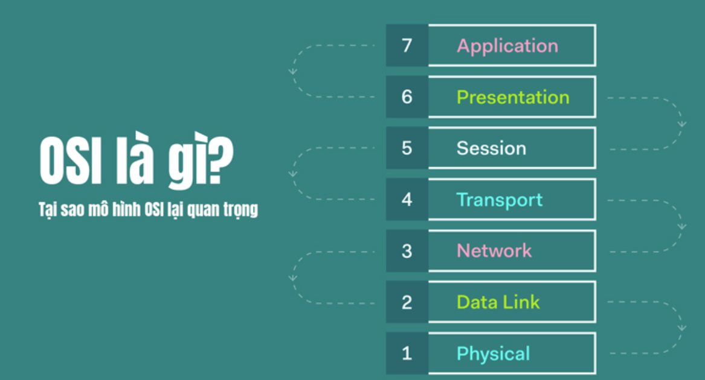

### 2. MỤC ĐÍCH CỦA MÔ HÌNH OSI

-Mục đích chính của mô hình OSI đó là:

- **Giảm tải được độ phức tạp** : giúp các kĩ sư mạng có thể hiểu rõ kiến trúc kết nối giữa các thiết bị mạng.

- **Nghiên cứu và phát triển nhanh hơn**: các kỹ sư có thể hiểu rõ hơn về công việc của mình.

- **Đảm bảo tính tương thích giữa các thiết bị**: Giúp các nhà sản xuất thiết kế thiết bị tương thích được với chuẩn từng lớp

- **Chuẩn hoá linh hoạt**: Thay vì chỉ định các giao thức để sử dụng giữa các cấp, mô hình OSI chỉ định các tác vụ mà các giao thức thực hiện.

### 3. Những giao thức trong mô hình OSI

Trong mô hình OSI, giao thức đóng vai trò cực kỳ quan trọng, bao gồm hai loại giao thức chính được áp dụng: giao thức hướng liên kết và giao thức không liên kết.

#### Giao thức hướng liên kết (Connection Oriented)

-Giao thức hướng liên kết (Connection-oriented protocol) là một loại giao thức mạng trong đó một kết nối logic được thiết lập giữa hai thực thể trước khi bắt đầu truyền dữ liệu. Quá trình này đảm bảo rằng dữ liệu được truyền đi một cách có trật tự và đáng tin cậy.

-Đặc điểm chính của giao thức hướng liên kết:

- Thiết lập liên kết:
  Trước khi truyền dữ liệu, các thực thể tham gia cần phải thiết lập một kết nối logic với nhau, thường thông qua quá trình "bắt tay" (handshake).

- Bảo đảm độ tin cậy: Kiểm tra lỗi trước khi truyền.

- Quản lý luồng:
  Các giao thức này cũng có thể quản lý luồng dữ liệu để tránh quá tải mạng.

- Hủy liên kết:
  Sau khi truyền xong, kết nối logic này sẽ được hủy bỏ.

**-Thiết lập kết nối logic như vậy giúp tăng cường độ an toàn và tin cậy trong quá trình truyền dữ liệu.**

#### Giao thức không liên kết (Connectionless)

-Là một loại giao thức mạng mà tại đó, mỗi gói tin được truyền đi độc lập với các gói tin khác, không cần thiết lập kết nối trước và không có cơ chế đảm bảo việc gửi và nhận thành công

-Đặc điểm của giao thức không liên kết:

- Không cần thiết lập kết nối

- Gói tin được truyền độc lập: Không phụ thuộc vào các gói tin khác.

- Không có cơ chế đảm bảo độ tin cậy: Không có cơ chế kiểm tra lỗi, sắp xếp hay đảm bảo thứ tự của các gói tin.

- Tốc độ truyền nhanh hơn: Giao thức có liên kết.

## II. CÁC LỚP TRONG MÔ HÌNH OSI

-Trước tiên, để hiểu mô hình OSI này được xây dựng như thế nào thì

> **Mô hình OSI này được xây dựng theo phương pháp đó là phương pháp phân lớp layer appoarch**

### 1. Phương pháp phân lớp là gì ?

> Phương pháp phân lớp đó là phương pháp thiết kế hoặc tổ chức, cấu trúc một hệ thống thành các lớp riêng biệt được kết nối với nhau và mỗi lớp lại có chức năng riêng biệt. Và mô hình OSI là một trong những ví dụ thực tế của phương pháp phân lớp.

### 2. Lớp 7 – Application Layer (Lớp Ứng Dụng) – Giao diện cho người dùng và ứng dụng (HTTP, FTP, SMTP)

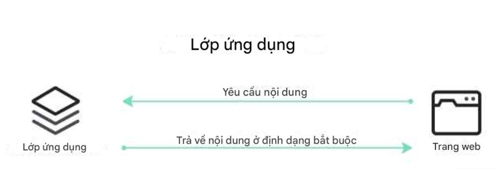

> Các chức năng chính của lớp này đó là chia sẻ tài nguyên, truy cập tệp từ xa và quản lý phiên.

-Chức năng trong lớp:

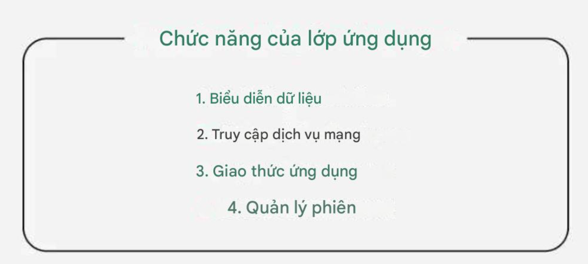

#### 1. Chức năng 1

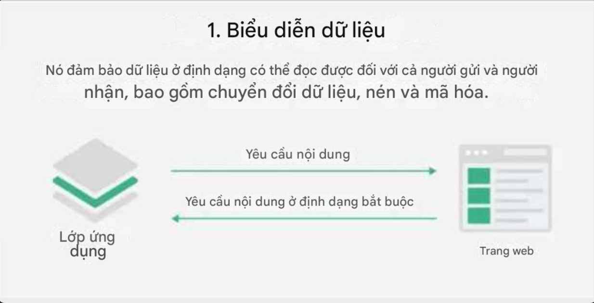

#### 2. Chức năng 2

#### 3. Chức năng 3

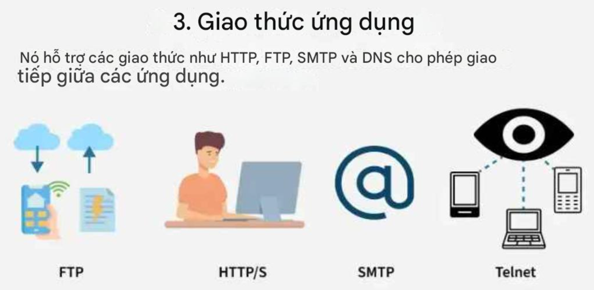

-Các giao thức giao tiếp ứng dụng được quy định là tiêu chuẩn trong lớp này là:

- **HTTP (Giao thức Truyền tải Siêu văn bản)**:Giao thức này được thiết kế đặc biệt cho việc giao tiếp giữa trình duyệt web và máy chủ web.

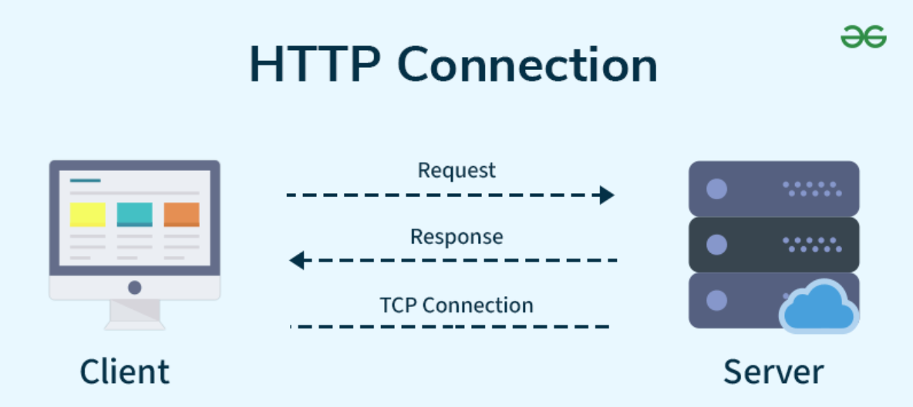

- **FTP (Giao thức Truyền tải Tệp)**: Giao thức này giúp truyền các tệp khác nhau từ thiết bị này sang thiết bị khác

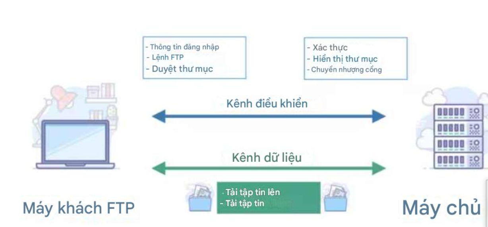

- **SMTP (Giao thức Truyền tải Thư Đơn giản).**

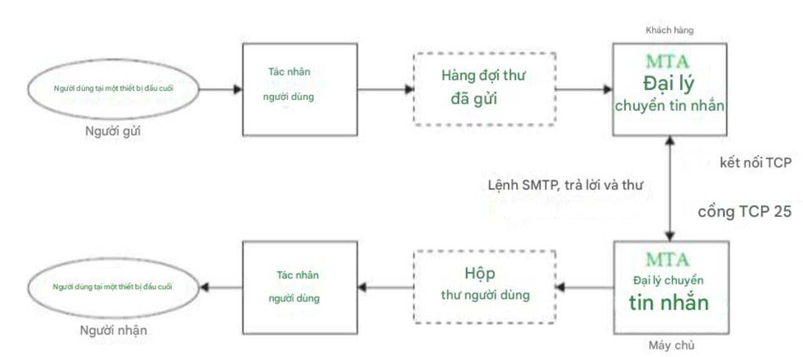

- **DNS (Hệ thống Tên Miền).**

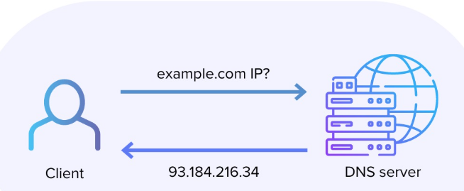

- **SNMP (Giao thức Quản lý Mạng Đơn giản).**

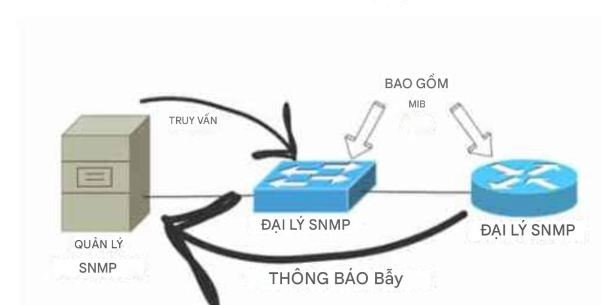

#### 4. Chức năng 4

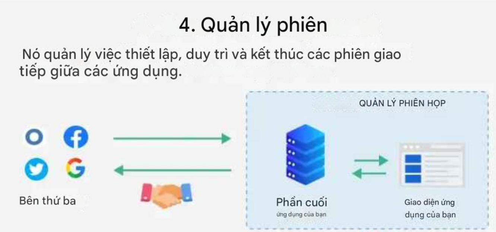

### 3. Lớp 6 – Presentation Layer (Lớp Trình Bày): Định dạng, mã hóa/giải mã, nén dữ liệu (JPEG, MPEG)

> Chức năng chính: Lớp Trình bày biến dữ liệu thành dạng hiển thị cho các ứng dụng sử dụng. Tầng này thực hiện nhiệm vụ dịch, mã hóa và nén dữ liệu.

> -Lớp bảo mật SSL/TLS: Lớp này chịu trách nhiệm mã hóa dữ liệu để đảm bảo an toàn và ví dụ thực tế rõ ràng nhất chính là lớp bảo mật SSL/TLS được sử dụng trong giao thức HTTPS.

- **Lớp cổng bảo mật (SSL)**: Giao thức Lớp cổng bảo mật cung cấp bảo mật cho dữ liệu được truyền giữa trình duyệt web và máy chủ. SSL mã hóa liên kết giữa máy chủ web và trình duyệt, đảm bảo mọi dữ liệu được truyền giữa chúng đều được bảo mật và không bị tấn công.

- **Lớp cổng bảo mật (TLS)**: Là một giao thức bảo mật, được sử dụng để mã hóa dữ liệu truyền tải trên mạng, đảm bảo tính bảo mật và toàn vẹn của thông tin.TLS hoạt động bằng cách thiết lập một kết nối an toàn giữa hai bên (ví dụ, trình duyệt web và máy chủ) thông qua một quá trình gọi là "bắt tay" (handshake)

-Chức năng của lớp này:

- **Mã hóa/Giải mã (Encryption/Decryption):** Tầng Trình bày có khả năng mã hóa dữ liệu trước khi truyền và giải mã dữ liệu khi nhận, đảm bảo tính bảo mật trong quá trình truyền dữ liệu trên mạng.

- **Nén/Giải nén (Compression/Decompression)**: Nén dữ liệu để giảm dung lượng truyền và giải nén dữ liệu khi nhận, giúp tăng tốc độ truyền dữ liệu và giảm sử dụng băng thông mạng.

- **Định dạng dữ liệu (Data Formatting)**: Tầng Trình bày thực hiện việc chuyển đổi dữ liệu từ định dạng của ứng dụng thành định dạng chuẩn để truyền qua mạng và ngược lại, đảm bảo tính tương thích giữa các ứng dụng và hệ thống khác nhau.

- **Quản lý phiên (Session Management)**: Quản lý thông tin phiên giao tiếp giữa các ứng dụng, hỗ trợ việc khởi tạo, duy trì và kết thúc phiên giao tiếp, đồng bộ hóa các hoạt động truyền dữ liệu và xử lý lỗi.

### 4. Lớp 5 – Session Layer (Lớp Phiên): Thiết lập, quản lý và kết thúc phiên giao tiếp

> -Nhiệm vụ/ Chức năng chính của tầng này là **thiết lập**, **duy trì** và **chấm dứt các phiên giao tiếp giữa các ứng dụng trên mạng**, **tạo ra một môi trường ổn định để thiết lập và duy trì các phiên giao tiếp, đồng bộ hóa dữ liệu và kết thúc phiên.**

-Các chức năng quan trọng của tầng Phiên bao gồm:

- **Thiết lập phiên (Session establishment)**: Tầng Phiên giúp khởi tạo một phiên làm việc trước khi thực hiện việc truyền tải dữ liệu. Điều này đề cập đến việc nhận diện và thiết lập các tham số liên quan đến phiên, bao gồm thông tin xác thực, cấu hình và các yếu tố điều khiển khác.

- **Duy trì phiên (Session maintenance)**: Đảm bảo việc duy trì và quản lý phiên giao tiếp giữa các ứng dụng. Nó kiểm soát việc truyền dữ liệu trong suốt thời gian phiên diễn ra, thực hiện đồng bộ hóa dữ liệu, xử lý các yêu cầu và phản hồi.
- **Đồng bộ phiên (Session synchronization)**: Xác định các điểm đồng bộ trong quá trình truyền dữ liệu giữa các ứng dụng. Nhờ có chức năng này mà dữ liệu được truyền một cách nhất quán và đúng thứ tự giữa nguồn và đích.

- **Chấm dứt phiên (Session termination)**: Tầng Phiên cho phép các ứng dụng kết thúc phiên giao tiếp một cách an toàn và theo đúng quy trình, cụ thể là thông báo, truyền tải thông tin và giải phóng tài nguyên sau khi hoàn thành.

-Các thiết bị và thành phần có trong lớp phiên :

- Tường lửa : Quản lý kiểm soát phiên bằng cách giám sát và lọc các kết nối mạng.

- Máy chủ Proxy : Thiết lập và quản lý các phiên giữa máy khách và máy chủ.

- Bộ điều khiển biên giới phiên (SBC) : Được sử dụng trong VoIP để quản lý và bảo mật các phiên giao tiếp.

- Máy chủ ứng dụng : Xử lý việc tạo và quản lý phiên cho các ứng dụng.

### 5. Lớp 4 – Transport Layer (Lớp Vận Chuyển): Đảm bảo truyền dữ liệu tin cậy (TCP) hoặc nhanh (UDP); kiểm soát luồng, lỗi

-Chức năng chính: Lớp Vận chuyển chịu trách nhiệm truyền tải các gói dữ liệu từ đầu đến cuối

-Sau đây là 1 số chức năng :

#### 1.Chức năng 1

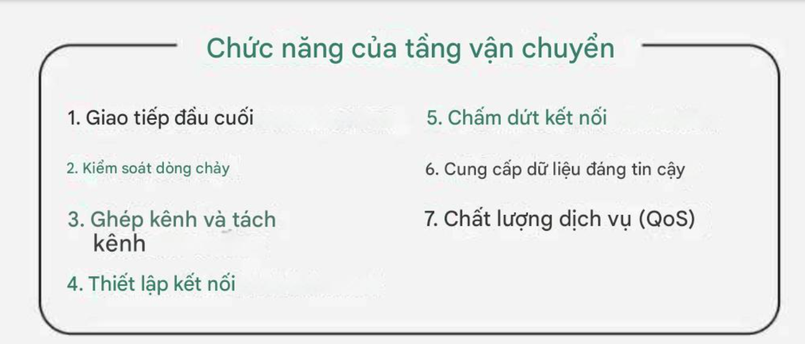

#### 2.Chức năng 2

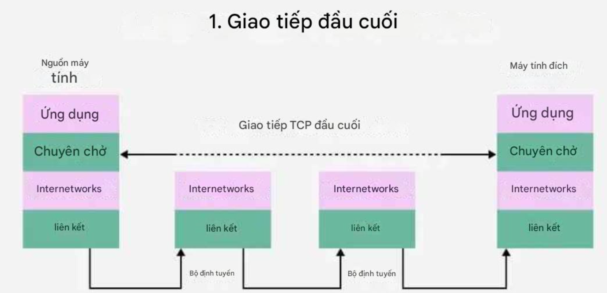

#### 3.Chức năng 3

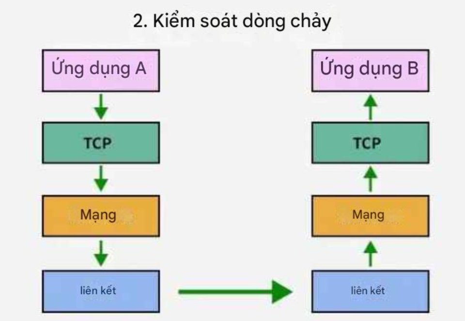

#### 4.Chức năng 4

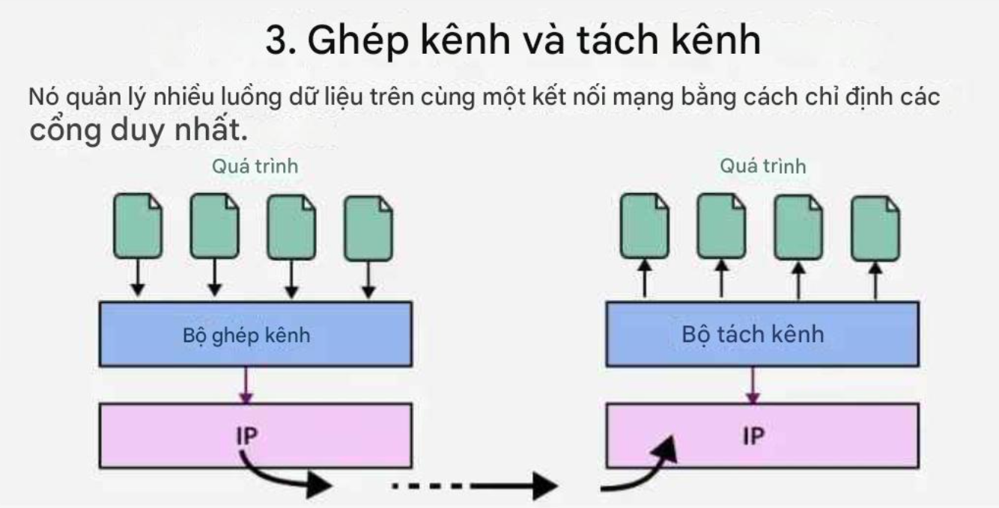

#### 5.Chức năng 5

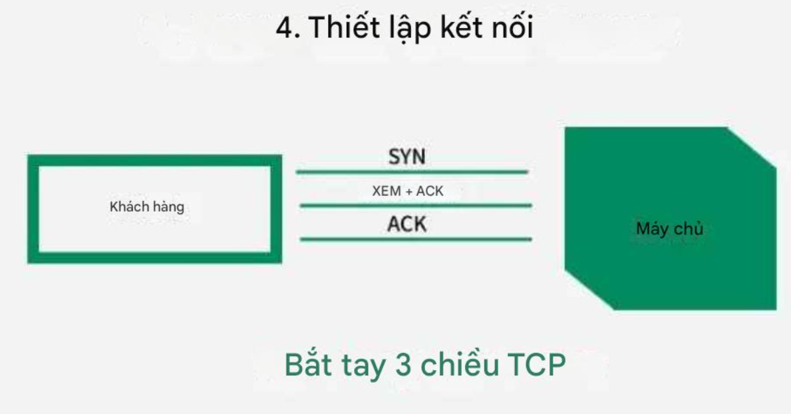

#### 6.Chức năng 6

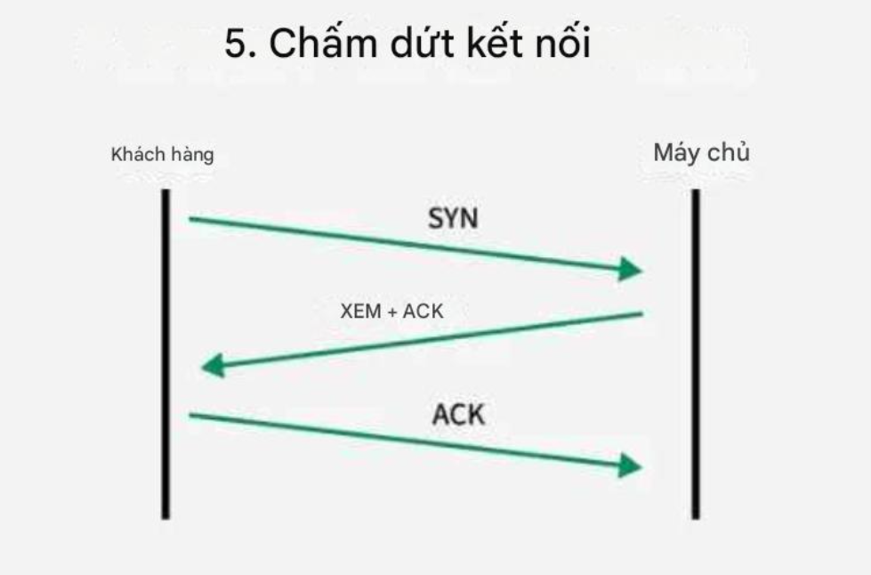

#### 7.Chức năng 7

#### 8.Chức năng 8

### 6. Lớp 3 – Network Layer (Lớp Mạng): Định địa chỉ logic (IP) và định tuyến gói tin qua các mạng

-Lớp mạng phân chia các phân đoạn từ Lớp vận chuyển thành các đơn vị nhỏ hơn, được gọi là gói, trên thiết bị của người gửi và tái hợp các gói này trên thiết bị nhận. Ngoài ra, Lớp mạng cũng xác định con đường tối ưu để dữ liệu đến đích của nó; điều này được gọi là định tuyến.

-Các chức năng của lớp mạng:

- Định tuyến (Routing): Lớp Mạng xác định đường đi tối ưu cho việc truyền gói tin từ nguồn đến đích qua các mạng khác nhau, thường sử dụng các giao thức như RIP (Routing Information Protocol) và OSPF (Open Shortest Path First) để quyết định đường đi tối ưu.

- Chuyển tiếp (Forwarding): Lớp Mạng chịu trách nhiệm chuyển tiếp gói tin từ đầu vào đến đầu ra qua các thiết bị định tuyến (router). Các thiết bị định tuyến sử dụng bảng định tuyến để quyết định cách chuyển tiếp gói tin đến đích.

- Địa chỉ IP (IP Addressing): Lớp Mạng sử dụng địa chỉ IP để xác định và định danh các thiết bị trong mạng. Địa chỉ IP đóng vai trò là một địa chỉ duy nhất cho mỗi thiết bị mạng và được sử dụng để xác định nguồn và đích của gói tin.

- Fragmentation và Reassembly: Lớp Mạng có khả năng phân mảnh gói tin thành các phần nhỏ hơn để truyền qua các mạng. Ngược lại, nó cũng có khả năng ghép các phần nhỏ lại thành gói tin ban đầu khi gói tin đến đích.

### 7. Lớp 2 – Data Link Layer (Lớp Liên Kết Dữ Liệu): Truyền dữ liệu tin cậy giữa hai thiết bị trực tiếp; định địa chỉ vật lý (MAC); đóng khung (frame)

>Chức năng chính: Lớp Liên kết dữ liệu, được đặt ở vị trí thứ hai trong mô hình OSI, có trách nhiệm xác định địa chỉ vật lý (MAC address) và đảm bảo việc truyền dữ liệu an toàn qua các đường truyền vật lý

**-Lớp này chia thành hai phân lớp con:**

- Lớp LLC (Logical Link Control): Quản lý các quy tắc truyền thông đồng bộ và không đồng bộ, kiểm tra tính toàn vẹn của dữ liệu và kiểm soát lỗi. Nhiệm vụ của nó là đảm bảo việc truyền thông tin một cách tin cậy giữa các điểm cuối trên cùng một mạng liên kết.

- Lớp MAC (Media Access Control): Xác định cách truy cập vào phương tiện truyền thông chia sẻ, ví dụ như mạng LAN Ethernet. Nó phụ trách việc gán địa chỉ vật lý (MAC address) cho các thiết bị mạng và xử lý việc truyền dữ liệu giữa các thiết bị đầu cuối trên cùng một mạng.

-Các chức năng chính tầng này:

- Đóng gói dữ liệu: Tách dữ liệu từ tầng mạng thành các Frame nhỏ để chuyển qua đường truyền vật lý.

- Định địa chỉ vật lý: Sử dụng địa chỉ MAC để xác định nguồn và đích của Frame dữ liệu.

- Kiểm tra lỗi: Phát hiện và xử lý các vấn đề liên quan đến mất mát hoặc hỏng hóc dữ liệu ở tầng Vật lý.

- Quản lý truy cập vào phương tiện truyền thông: Đảm bảo các quy tắc truy cập vào môi trường chia sẻ được quản lý một cách hiệu quả, tránh xung đột và đảm bảo hiệu suất truyền dữ liệu.

### 8. Lớp 1 – Physical Layer (Lớp Vật Lý) : Truyền dòng bit qua môi trường vật lý (cáp, sóng vô tuyến)

> -Chức năng chính của nó là truyền 1 dòng bit thô qua 1 đường truyền vật lý cụ thể nào đó và quá trình đó gọi là **Binary Transmission**. Hay xây dựng 1 đường truyền vật lý cho các Host

-Đây cũng là tầng mà trong đó dữ liệu được chuyển đổi thành một dãy bit, là một chuỗi gồm các số 1 và 0. Lớp vật lý của cả hai thiết bị cũng cần thống nhất về một quy ước tín hiệu để phân biệt giữa số 1 và số 0 trên cả hai thiết bị.

-Chức năng cụ thể của tầng Vật lý bao gồm:

- Truyền dữ liệu: Chuyển đổi các bit thành tín hiệu vật lý để truyền qua các phương tiện truyền thông như cáp đồng trục, cáp xoắn đôi, cáp quang hoặc sóng vô tuyến. Tầng này xác định các quy tắc về tốc độ truyền, đồng bộ hóa, kích thước Frame dữ liệu, phạm vi tín hiệu và các thông số vật lý khác.

- Điều khiển tín hiệu: Quản lý các tín hiệu điều khiển như tín hiệu báo động, tín hiệu đồng bộ, tín hiệu kiểm tra lỗi và tín hiệu điều chỉnh tốc độ truyền dữ liệu.

- Định dạng dữ liệu: Tầng Vật lý quyết định cấu trúc và định dạng của dữ liệu trong từng bit, bao gồm các định dạng như NRZ (Non-Return-to-Zero), Manchester, AMI (Alternate Mark Inversion) và các phương pháp khác.

- Mã hóa và giải mã: Thực hiện quá trình mã hóa và giải mã các tín hiệu để đảm bảo việc truyền dữ liệu được thực hiện một cách chính xác.

## III. QUY TRÌNH HOẠT ĐỘNG CỦA MÔ HÌNH OSI TRÊN HOST/CLIENT

>ALL PROGRESS

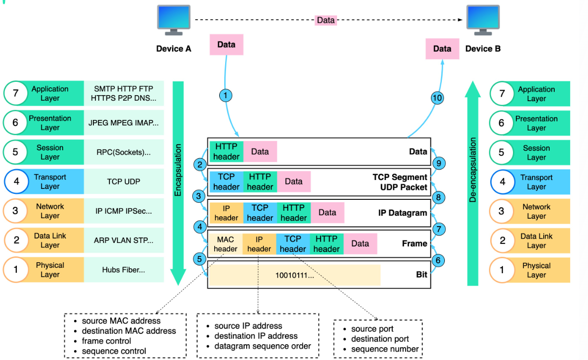

Bước 1: Khi Thiết bị A gửi dữ liệu đến Thiết bị B qua mạng thông qua giao thức HTTP, trước tiên nó sẽ được thêm tiêu đề HTTP ở lớp ứng dụng.

Bước 2: Sau đó, một tiêu đề TCP hoặc UDP được thêm vào dữ liệu. Nó được đóng gói thành các phân đoạn TCP ở tầng vận chuyển. Tiêu đề này chứa cổng nguồn, cổng đích và số thứ tự.

Bước 3: Các phân đoạn sau đó được đóng gói với tiêu đề IP ở lớp mạng. Tiêu đề IP chứa địa chỉ IP nguồn/đích.

Bước 4: Gói dữ liệu IP được thêm tiêu đề MAC ở lớp liên kết dữ liệu, với địa chỉ MAC nguồn/đích.

Bước 5: Các khung được đóng gói được gửi đến lớp vật lý và được gửi qua mạng dưới dạng bit nhị phân.

> => Tất cả chu trình đóng gói dữ liệu đẻ gửi data đến máy chủ đích thì ta gọi quá trình đó là **Điều chế(Encapsulation)**

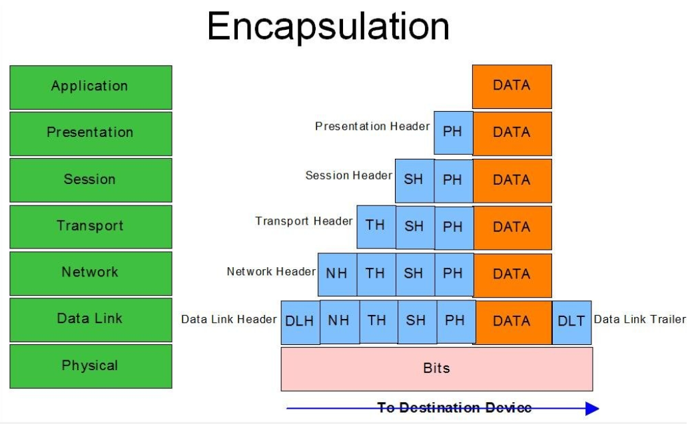

Bước 6-10: Khi Thiết bị B nhận được các bit từ mạng, nó sẽ thực hiện quá trình giải đóng gói, đây là quá trình xử lý ngược lại của quá trình đóng gói. Các tiêu đề được loại bỏ theo từng lớp, và cuối cùng, Thiết bị B có thể đọc dữ liệu.

> => Tất cả quy trình xử lý tệp tin từ phía máy gửi lên các lớp từ lớp vật lý cho đến lớp trình bay ta gọi đó là quá trình **Giải điều chế (de-encapslucation)**

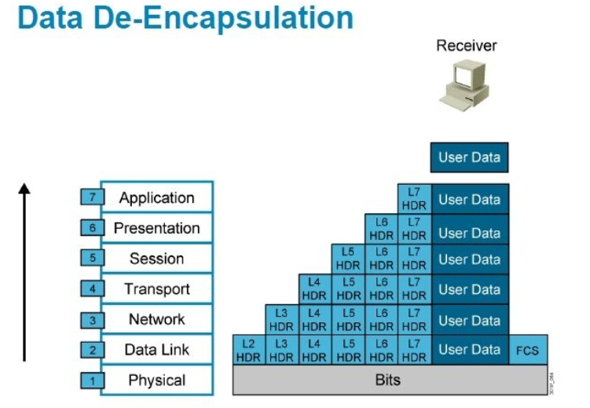
