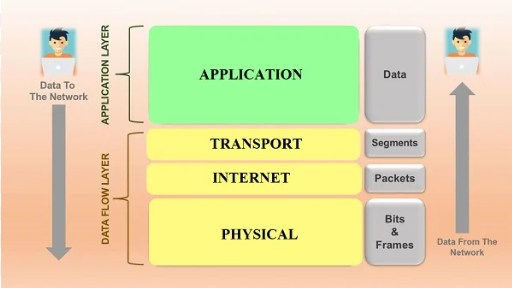
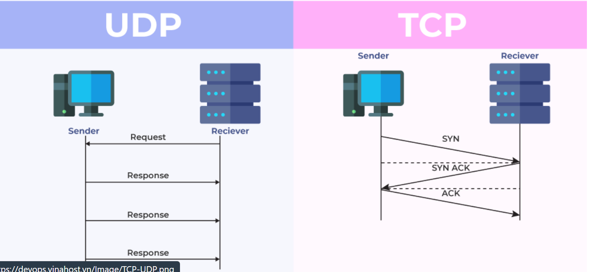
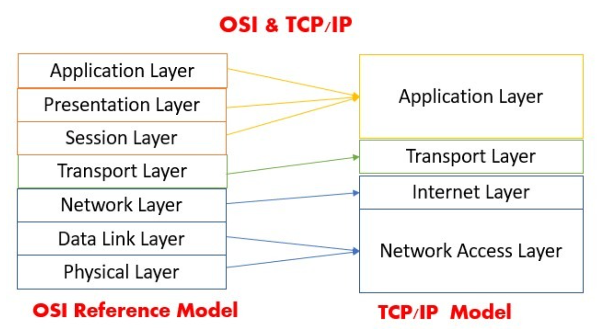
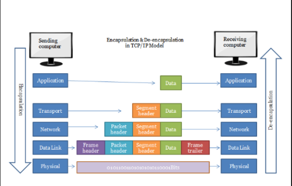
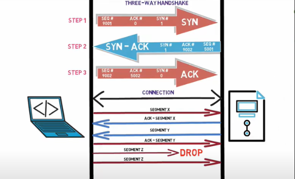

# **TÌM HIỂU MÔ HÌNH TCP/IP**

## I. TCP/IP LÀ GÌ ?

### 1. Định nghĩa TCP/IP ?

> TCP/IP (Transmission Control Protocol/Internet Protocol) là một bộ giao thức mạng được sử dụng rộng rãi trên toàn cầu để kết nối các thiết bị mạng với nhau và truyền dữ liệu qua mạng Internet. Được phát triển từ những năm 1970, TCP/IP đã trở thành tiêu chuẩn quốc tế cho việc truyền thông mạng và là nền tảng cơ bản của Internet ngày nay.

-Bộ giao thức TCP/IP bao gồm hai phần chính:

- TCP: Có chức năng xác định các ứng dụng và tạo ra các kênh giao tiếp .TCP cũng có chức năng quản lý các thông tin khi được chia nhỏ để truyền tải qua internet. Giao thức này sẽ tập hợp các thông tin này theo đúng thứ tự, đảm bảo truyền tải thông tin chính xác tới địa chỉ đến.

- IP: Đảm bảo thông tin được truyền đến đúng địa chỉ. IP sẽ gán các địa chỉ và định tuyến từng gọi thông tin. Mỗi mạng sẽ có 1 địa chỉ IP để xác định được chính xác nơi chuyển/nhận thông tin, dữ liệu.

### 2. Nguyên lí hoạt động

> Nguyên lý hoạt động của TCP/IP là cung cấp một cách thức chuẩn để truyền tải dữ liệu giữa các thiết bị mạng khác nhau. Bộ giao thức này bao gồm hai phần chính là TCP (Transmission Control Protocol) và IP (Internet Protocol), mỗi phần đều có vai trò quan trọng trong quá trình truyền tải dữ liệu trên mạng.

-Trong đó IP (Giao thức liên mạng) cho phép các gói tin được gửi đến đích đã định sẵn, bằng cách thêm các thông tin dẫn đường vào các gói tin để các gói tin được đến đúng đích đã định sẵn ban đầu.

-Và TCP (Giao thức truyền vận) đóng vai trò kiểm tra và đảm bảo sự an toàn cho mỗi gói tin khi đi qua mỗi trạm.

-Trong quá trình này, nếu giao thức TCP nhận thấy gói tin bị lỗi, một tín hiệu sẽ được truyền đi và yêu cầu hệ thống gửi lại một gói tin khác. Quá trình hoạt động này sẽ được làm rõ hơn ở chức năng của mỗi tầng trong mô hình TCP/IP.

### 3. Đặc điểm của mô hình TCP/IP

-Ưu điểm:

- Tiêu chuẩn mở: TCP/IP là một tiêu chuẩn mở, được phát triển bởi nhiều tổ chức khác nhau. Điều này giúp cho việc triển khai và sử dụng TCP/IP trở nên dễ dàng hơn.

- Tương thích cao: TCP/IP có thể tương thích với nhiều loại hệ điều hành và phần cứng khác nhau. Điều này giúp cho việc kết nối các máy tính với nhau trở nên dễ dàng hơn.

- Khả năng mở rộng: TCP/IP có khả năng mở rộng, có thể đáp ứng được nhu cầu phát triển của mạng Internet.

- Đảm bảo tính toàn vẹn của dữ liệu: TCP/IP sử dụng các cơ chế kiểm soát lỗi để đảm bảo tính toàn vẹn của dữ liệu trong quá trình truyền tải.

- Quản lý kết nối: TCP/IP sử dụng các cơ chế quản lý kết nối để đảm bảo rằng các máy tính có thể kết nối với nhau một cách ổn định.

-Nhược điểm:

- Tốc độ truyền dữ liệu: TCP/IP có thể bị ảnh hưởng bởi tốc độ truyền dữ liệu của mạng vật lý.

- Tính phức tạp: TCP/IP là một mô hình giao thức phức tạp, đòi hỏi người dùng phải có kiến thức chuyên môn để triển khai và sử dụng.

- Dễ bị tấn công: TCP/IP có thể bị tấn công bởi các loại tấn công mạng khác nhau.

## II. Các lớp mô hình TCP/IP

-Một mô hình TCP/IP tiêu chuẩn bao gồm 4 lớp được chồng lên nhau, bắt đầu từ tầng thấp nhất là Tầng vật lý (Physical) → Tầng mạng (Network) → Tầng giao vận (Transport) và cuối cùng là Tầng ứng dụng (Application).

### 1. Tầng 4 – Application Layer (Lớp ứng dụng)

> Tầng Ứng dụng được đặt ở trên cùng của mô hình TCP/IP, là nơi mà thế giới ảo của giao tiếp trực tuyến bắt đầu. Tầng này chịu trách nhiệm cho việc giao tiếp dữ liệu giữa các thiết bị khác nhau.

-Ở tầng này, các ứng dụng như duyệt web, trò chuyện, gửi email, cũng như các giao thức truyền tải dữ liệu quan trọng như SMTP, SSH, FTP được triển khai. Mỗi dịch vụ này đóng vai trò quan trọng trong việc đáp ứng nhu cầu đa dạng của người sử dụng Internet.

-Khi dữ liệu đến tầng Ứng dụng, nó đã được định dạng theo kiểu Byte nối Byte, một cách tổ chức có thứ tự giúp các ứng dụng hiểu và xử lý dữ liệu một cách hiệu quả. Đồng thời, tầng này cũng chứa các thông tin định tuyến quan trọng, xác định đường đi đúng của một gói tin qua các địa chỉ và cổng kết nối.

-Tầng ứng dụng không chỉ là nơi giao tiếp thông tin, mà còn là nơi tạo ra trải nghiệm người dùng đa dạng trên Internet. Sự đa dạng này thể hiện qua các ứng dụng và dịch vụ mà chúng ta sử dụng hàng ngày, tạo nên một lớp giao tiếp độc lập và sáng tạo, giúp kết nối thế giới số một cách mạnh mẽ và linh hoạt.

### 2. Tầng 3 – Transport Layer ( Lớp giao vận)

> Tầng Giao vận là tầng thứ ba của mô hình TCP/IP, nơi mà nền tảng giao tiếp giữa các máy chủ trong cùng một mạng hoặc giữa các mạng kết nối với nhau qua bộ định tuyến. Chức năng cơ bản của tầng này là xử lý vấn đề truyền tải dữ liệu một cách hiệu quả và đáng tin cậy.

-Ở tầng Giao vận, dữ liệu sẽ được chia nhỏ thành các đoạn với kích thước không đều, nhưng mỗi đoạn phải nhỏ hơn 64KB. Mỗi đoạn này có cấu trúc đầy đủ với một Header chứa thông tin điều khiển, theo sau là dữ liệu cần truyền.

-Đặc biệt, tầng Giao vận bao gồm hai giao thức chủ chốt là TCP (Transmission Control Protocol) và UDP (User Datagram Protocol). TCP được biết đến với khả năng đảm bảo chất lượng gói tin, đồng thời kiểm soát thời gian để kiểm tra thông tin từ thứ tự dữ liệu đến vấn đề tắc nghẽn lưu lượng dữ liệu.

-Mặt khác, UDP giúp tốc độ truyền tải nhanh hơn, nhưng không đảm bảo chất lượng dữ liệu được gửi đi. Sự lựa chọn giữa TCP và UDP thường phụ thuộc vào yêu cầu cụ thể của ứng dụng hay dịch vụ đang sử dụng.

-Tầng Giao vận ảnh hưởng đến khả năng hiệu quả và độ tin cậy của giao tiếp mạng, đồng thời tạo điều kiện cho sự linh hoạt và đa dạng của Internet ngày nay.

### 3. Tầng 2 – Internet Layer (Lớp mạng)

> Tầng mạng là tầng thứ hai của mô hình TCP/IP, có nhiệm vụ quan trọng trong quá trình truyền tải dữ liệu trong mạng. Giống như tầng mạng của mô hình OSI, tầng này được định nghĩa như một giao thức đảm nhận trách nhiệm truyền tải dữ liệu một cách logic trong mạng.

-Tại tầng mạng, dữ liệu được chia thành các đoạn nhỏ, hay còn gọi là gói tin (Packets), với kích thước mỗi gói phù hợp với loại mạng chuyển mạch mà nó sử dụng để truyền dữ liệu. Các gói tin được đóng gói với một phần Header chứa thông tin liên quan đến tầng mạng, như địa chỉ IP và các thông tin định tuyến.

-Tầng mạng chủ yếu sử dụng các giao thức như IP (Internet Protocol), ICMP (Internet Control Message Protocol), và ARP (Address Resolution Protocol). IP là trụ cột của tầng này, định rõ cách dữ liệu được chuyển từ một điểm đến một điểm khác trên Internet. ICMP giúp quản lý thông báo lỗi và trạng thái mạng, trong khi ARP được sử dụng để ánh xạ địa chỉ IP thành địa chỉ MAC trên mạng.

-Tầng mạng chính là nơi quyết định đường đi của dữ liệu trong mạng, từ điểm xuất phát đến điểm đích. Khả năng hoạt động chính xác và hiệu quả tại tầng này đóng vai trò quan trọng trong việc đảm bảo dữ liệu được truyền tải một cách đáng tin cậy trên Internet rộng lớn ngày nay.

### 4. Tầng 1 – Physical (Tầng vật lý)

> Tầng vật lý là tầng thứ nhất của mô hình TCP/IP, đóng vai trò quan trọng trong quá trình truyền dữ liệu giữa các thiết bị trong cùng một mạng. Nó là sự kết hợp khéo léo giữa tầng Vật lý và tầng Liên kết dữ liệu của mô hình OSI, tạo nên cơ sở hạ tầng vật lý cho hệ thống mạng hiện đại.

-Tại tầng vật lý, dữ liệu được truyền dưới dạng khung, hay Frame, từ một thiết bị tới thiết bị khác trong mạng. Quá trình này bắt đầu khi gói dữ liệu được đóng gói vào trong khung, chứa các thông tin quan trọng như địa chỉ và kiểm tra lỗi. Khung được truyền qua các thiết bị và đường truyền vật lý đến điểm đích, được định tuyến đến đúng đích đã được chỉ định ban đầu.

-Tầng vật lý chịu trách nhiệm về việc định nghĩa các đặc tính vật lý của kết nối, bao gồm loại cáp, cách truyền dẫn, và các thông số kỹ thuật khác. Nó đảm bảo rằng dữ liệu được chuyển đúng cách và ổn định qua môi trường truyền.

-Tầng này thường xuyên được nhấn mạnh trong việc xây dựng và duy trì mạng vì ảnh hưởng lớn đến hiệu suất và độ tin cậy của hệ thống.

## III. So sánh mô hình TCP/IP với OSI

`Điểm giống`

- Cùng sử dụng kỹ thuật chuyển Packet

- Đều có lớp Network và lớp Transport

- Đều có kiến trúc phân lớp, vì chúng đều được xây dựng dựa trên các lớp, nói cách khác là đều phân tầng như nhau.

- Đều đơn giản hóa quá trình khắc phục sự cố bằng cách chia nhỏ chức năng phức tạp thành các phần giản đơn.

- Bên cạnh những điểm giống nhau, Mô hình TCP IP và OSI còn có rất nhiều điểm riêng. Bảng so sánh dưới đây sẽ giúp bạn hiểu rõ.

`Điểm khác`

| Nội dung              | Mô hình OSI                                             | Mô hình TCP/IP                                                              |
| --------------------- | ------------------------------------------------------- | --------------------------------------------------------------------------- |
| Đơn vị phát triển     | ISO (Tổ chức tiêu chuẩn quốc tế)                        | Bộ quốc phòng(DoD)                                                          |
| Số tầng               | 7 tầng                                                  | 4 tầng                                                                      |
| Ý nghĩa               | Là mô hình lý thuyết,được sử dụng cho hệ thống máy tính | Là mô hình Server/client(máy chủ-khách) dùng để truyền dữ liệu qua internet |
| Mức độ sử dụng        | Ít người dùng                                           | Phổ biến toàn cầu                                                           |
| Phương pháp tiếp cận  | Theo chiều dọc                                          | Theo chiều ngang                                                            |
| Thiết kế              | Phát triển mô hình trước rồi mới phát triển giao thức   | Phát triển giao thức trước rồi phát triển mô hình                           |
| Truyền thông          | Hỗ trợ cả không dây và định tuyến                       | Hỗ trợ truyền thông không kết nối từ tầng mạng                              |
| Kết hợp giữa các tầng | Mỗi tầng 1 nhiệm vụ không có kết hợp giữa các tầng      | Trong tầng ứng dụng có tầng trình diễn và tầng phiên được kết hợp với nhau  |
| Tính phụ thuộc        | Giao thức độc lập                                       | Phụ thuộc vào giao thức                                                     |

## IV. Quy trình hoạt động của mô hình TCP/IP

`Bên gửi`

- Tầng 4 (application): Người dùng đưa thông tin vào máy tính ( hình ảnh , văn bản). Data sẽ được gửi xuống tầng vận chuyển

- Tầng 3 (transport): Data ở đây sẽ được chia nhỏ thành các Segment,cấu trúc đầy đủ của segment lúc này là Header chứa thông tin điều khiển và sau đó là dữ liệu . Các Segment tiếp tục được chuyển xuống tầng Internet.

- Tầng 2 (internet): Các Segment ở đây sẽ được đóng gói Packet với phần Header chứa thông tin tầng mạng. Các Packet tiếp tục được đóng vào các Frames được định tuyến đi đến đích chỉ định ban đầu

- Tầng 1 (physical): Ở đây Frame sẽ được mã hóa thành chuỗi nhị phân

`Bên nhận`

- Tầng 1 (physical):Máy nhận kiểm tra quá trình đồng bộ và đưa các chuỗi bit nhị phân vào vùng đệm rồi gửi thông báo đã nhận dữ liệu

- Tầng 2 (internet): Tại đây thông tin sẽ được kiểm tra xem frame có bị lỗi không, nếu lỗi thì hủy và gửi lại. Kiểm tra các định tuyến, thông tin tầng mạng có đúng địa chỉ hay không, nếu đúng sẽ chuyển lên transport

- Tầng 3 (transport):Hỗ trợ phục hồi và xử lý lỗi , ghép các gói tin lại

- Tầng 4 (application): Gỡ bỏ những header còn lại để nhận được dữ liệu bên gửi

  

> Bắt tay ba bước ( Three way handshake)

> Bước 1 (SYN): Bước đầu khi máy khách muốn kết nối với máy chủ , máy khách sẽ gửi một tin nhắn SYN segment(Số thứ tự đồng bộ hóa) để thông báo cho máy chủ rằng máy khách có thể bắt đầu liên lạc với trình tự nào. Tin nhắn SYN bao gồm các thông tin SEQ#(Đánh dấu thứ tự tin gửi tăng dần ),ACK#(chứa số SEQ# kế tiếp cuả thiết bị đích ),SYN#(chỉ 0 hoặc 1 tùy theo dạng tin nhắn ).

> Bước 2(SYN+ACK) : Máy chủ gửi tin nhắn trả lời yêu cầu bằng tin nhắn SYN-ACK biểu thị bằng số thứ tự mà nó có khả năng bắt đầu các phân đoạn đó

> Bước 3(ACK): Sau khi nhận được tin nhắn đồng ý , máy khác sẽ gửi tin nhắn ACK thông báo nhận được đến với máy chủ và tạo kết nối

-Sau khi hoàn thành bắt tay ba bước chúng ta có thể gửi các phân đoạn Segment với nhau . Ví dụ máy cá nhân gửi Segment X tới máy chủ , máy chủ sẽ gửi lại 1 ACK Segment x thôn báo nhận được thành công . Ngược lại máy chủ gửi 1 Segment Y tới máy khách thì máy khách cũng gửi 1 ACK Segment Y ngược lại máy chủ thông báo nhận được thành công . Trong trường hợp 1 thời gian nhất định máy tính gửi không nhận được tin nhắn ACK Segment từ máy nhận thì sẽ tự động gửi lại .

> Ưu điểm của Three way handshake
>
> - Có chơ chế báo nhận
> - Cơ chế đảm bảo tin cậy
> - Phục hồi dữ liệu bị mất trên đường truyền
> - Các segment được đánh số thứ tự nên khi nhận sẽ đảm bảo thứ tự các gói tin
> - Có cơ chế kiểm soát luồng , nhằm đảm bảo không làm quá tải bên nhận
> - Kiểm soát tắc nghẽn giúp việc truyền dữ liệu không làm tắc nghẽn mạng
> - Hỗ trợ truyền và nhận cùng lúc nhiều Segment

Tư liệu tham khảo.

[1] [https://www.totolink.vn/article/149-mo-hinh-tcp-ip-la-gi-chuc-nang-cua-cac-tang-trong-mo-hinh-tcp-ip.html](https://www.totolink.vn/article/149-mo-hinh-tcp-ip-la-gi-chuc-nang-cua-cac-tang-trong-mo-hinh-tcp-ip.html)

[2] [https://tenten.vn/tin-tuc/tcp-ip-la-gi/#1_TCPIP_la_gi](https://tenten.vn/tin-tuc/tcp-ip-la-gi/#1_TCPIP_la_gi)

[3] [https://fpttelecom.com/blog/mo-hinh-osi/](https://fpttelecom.com/blog/mo-hinh-osi/)

[4] [https://fptcloud.com/tcp-ip-la-gi/](https://fptcloud.com/tcp-ip-la-gi/)

[5] [https://thietbimangcisco.vn/tim-hieu-dac-diem-2-mo-hinh-truyen-thong-osi-va-tcp-ip-v-322-330-5216.html](https://thietbimangcisco.vn/tim-hieu-dac-diem-2-mo-hinh-truyen-thong-osi-va-tcp-ip-v-322-330-5216.html)

[6] [https://xaydungso.vn/blog/giai-thich-tcp-va-ip-la-gi-va-cach-chung-hoat-dong-trong-mang-vi-cb.html](https://xaydungso.vn/blog/giai-thich-tcp-va-ip-la-gi-va-cach-chung-hoat-dong-trong-mang-vi-cb.html)

[7] [https://viblo.asia/p/tim-hieu-co-ban-ve-mo-hinh-tcpip-RQqKLkJp57z](https://viblo.asia/p/tim-hieu-co-ban-ve-mo-hinh-tcpip-RQqKLkJp57z)
