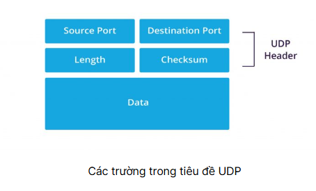
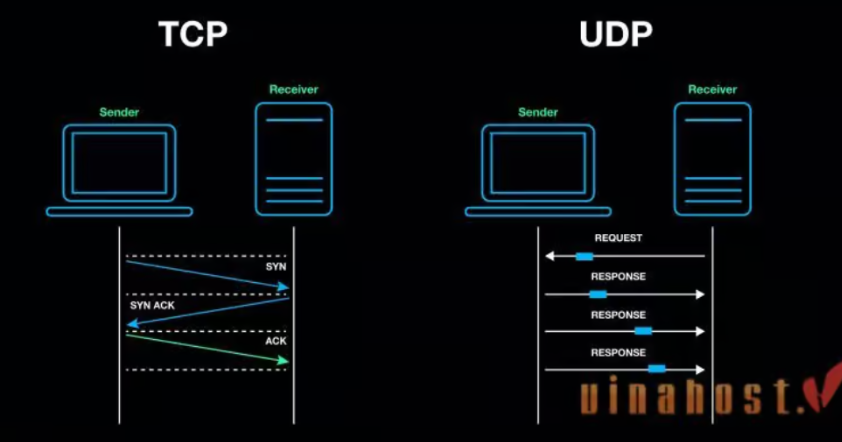

# **TÌM HIỂU MÔ HÌNH TCP/IP**

## I. TCP/IP LÀ GÌ ?

### 1. Định nghĩa TCP/IP ?

> Mô hình TCP/IP (Transmission Control Protocol/Internet Protocol) là một mô hình mạng được thiết kế để mô tả cách các thiết bị giao tiếp trên mạng internet và các máy tính khác. Đây là mô hình chuẩn và phổ biến trong các hệ thống mạng hiện nay.

Mô hình TCP/IP được xây dựng dựa trên thực tế hoạt động của các giao thức, khác với mô hình OSI mang tính lý thuyết hơn.

### 2. Cấu trúc mô hình TCP/IP

| Tầng (TCP/IP)                     | Vai trò                                                                                    | Tương ứng tầng OSI                                              |
| --------------------------------- | ------------------------------------------------------------------------------------------ | --------------------------------------------------------------- |
| 1. Network Access (Liên kết mạng) | Xử lý giao tiếp vật lý và truyền dữ liệu qua phương tiện truyền dẫn.                       | Tầng 1 (Physical) + Tầng 2 (Data Link)                          |
| 2. Internet (Internet)            | Định tuyến và truyền dữ liệu qua các mạng trung gian dựa trên địa chỉ IP.                  | Tầng 3 (Network)                                                |
| 3. Transport (Vận chuyển)         | Đảm bảo truyền dữ liệu đáng tin cậy giữa hai thiết bị đầu cuối, quản lý phân đoạn dữ liệu. | Tầng 4 (Transport)                                              |
| 4. Application (Ứng dụng)         | Cung cấp giao diện cho người dùng và ứng dụng để giao tiếp qua mạng.                       | Tầng 5 (Session) + Tầng 6 (Presentation) + Tầng 7 (Application) |

### 3. Nguyên lí hoạt động

> Nguyên lý hoạt động của TCP/IP là cung cấp một cách thức chuẩn để truyền tải dữ liệu giữa các thiết bị mạng khác nhau. Bộ giao thức này bao gồm hai phần chính là TCP (Transmission Control Protocol) và IP (Internet Protocol), mỗi phần đều có vai trò quan trọng trong quá trình truyền tải dữ liệu trên mạng.

-Trong đó **IP (Giao thức liên mạng)** cho phép các gói tin được gửi đến đích đã định sẵn, bằng cách thêm các thông tin dẫn đường vào các gói tin để các gói tin được đến đúng đích đã định sẵn ban đầu.

-Và **TCP (Giao thức truyền vận)** đóng vai trò kiểm tra và đảm bảo sự an toàn cho mỗi gói tin khi đi qua mỗi trạm.

-Trong quá trình này, nếu giao thức TCP nhận thấy gói tin bị lỗi, một tín hiệu sẽ được truyền đi và yêu cầu hệ thống gửi lại một gói tin khác. Quá trình hoạt động này sẽ được làm rõ hơn ở chức năng của mỗi tầng trong mô hình TCP/IP.

### 4. Đặc điểm của mô hình TCP/IP

-Ưu điểm:

- **Tiêu chuẩn mở:** TCP/IP là một tiêu chuẩn mở, được phát triển bởi nhiều tổ chức khác nhau. Điều này giúp cho việc triển khai và sử dụng TCP/IP trở nên dễ dàng hơn.

- **Tương thích cao:** TCP/IP có thể tương thích với nhiều loại hệ điều hành và phần cứng khác nhau. Điều này giúp cho việc kết nối các máy tính với nhau trở nên dễ dàng hơn.

- **Khả năng mở rộng:** TCP/IP có khả năng mở rộng, có thể đáp ứng được nhu cầu phát triển của mạng Internet.

- **Đảm bảo tính toàn vẹn của dữ liệu:** TCP/IP sử dụng các cơ chế kiểm soát lỗi để đảm bảo tính toàn vẹn của dữ liệu trong quá trình truyền tải.

- **Quản lý kết nối:** TCP/IP sử dụng các cơ chế quản lý kết nối để đảm bảo rằng các máy tính có thể kết nối với nhau một cách ổn định.

-Nhược điểm:

- **Tốc độ truyền dữ liệu:** TCP/IP có thể bị ảnh hưởng bởi tốc độ truyền dữ liệu của mạng vật lý.

- **Tính phức tạp:** TCP/IP là một mô hình giao thức phức tạp, đòi hỏi người dùng phải có kiến thức chuyên môn để triển khai và sử dụng.

- **Dễ bị tấn công:** TCP/IP có thể bị tấn công bởi các loại tấn công mạng khác nhau.

## II. Các lớp mô hình TCP/IP

-Một mô hình TCP/IP tiêu chuẩn bao gồm 4 lớp được chồng lên nhau, bắt đầu từ tầng thấp nhất là Tầng liên kết mạng (Network Access) → Tầng mạng (Network) → Tầng giao vận (Transport) và cuối cùng là Tầng ứng dụng (Application).

### 1. Tầng Application (Ứng dụng)

> **-Khái niệm:** Là nơi các ứng dụng và người dùng tương tác trực tiếp với hệ thống mạng. Tầng này cung cấp các giao thức hỗ trợ việc trao đổi dữ liệu giữa ứng dụng và mạng.

-Đặc điểm:

- Kết hợp chức năng của 3 tầng trong mô hình OSI: Application, Presentation, và Session.

- Không quan tâm đến cách dữ liệu được truyền tải mà chỉ tập trung vào giao tiếp giữa ứng dụng.

Chức năng:

- **Định dạng dữ liệu** từ ứng dụng phù hợp với giao thức sử dụng, Tạo các yêu cầu hoặc phản hồi theo định dạng của giao thức.

- **Chọn giao thức thích hợp** để truyền dữ liệu dựa trên yêu cầu của người dùng hoặc ứng dụng.

- **Cung cấp các dịch vụ** như duyệt web, gửi email, truyền file, phân giải tên miền, kết nối từ xa, v.v.

- **Gửi dữ liệu** đã chuẩn bị xuống tầng Transport để xử lý và truyền đi qua mạng.

Ví dụ giao thức:

- **HTTP/HTTPS:** Truy cập web.

- **SMTP/POP3/IMAP:** Gửi và nhận email.

- **FTP:** Truyền tệp tin.

- **DNS:** Chuyển đổi tên miền thành địa chỉ IP.

### 2. Tầng Transport (Vận chuyển)

> **-Khái niệm:** Tầng Transport chịu trách nhiệm quản lý luồng dữ liệu giữa hai thiết bị đầu cuối, đảm bảo truyền dữ liệu đáng tin cậy.

-Đặc điểm:

- Chia nhỏ dữ liệu thành các phân đoạn (segments) để gửi đi.

- Sử dụng các cơ chế kiểm soát lỗi, kiểm soát lưu lượng, và sắp xếp thứ tự dữ liệu.

- Gồm 2 giao thức cốt lõi là TCP và UDP. Trong đó, TCP đảm bảo chất lượng gói tin nhưng tiêu tốn thời gian khá lâu để kiểm tra đầy đủ thông tin từ thứ tự dữ liệu cho đến việc kiểm soát vấn đề tắc nghẽn lưu lượng dữ liệu. Ngược lại, UDP có tốc độ truyền tải nhanh hơn những lại không đảm bảo được chất lượng dữ liệu được gửi đi.

Chức năng:

- **Phân mảnh dữ liệu:** Chia nhỏ dữ liệu tầng Application thành các phân đoạn (segments) để truyền qua mạng và tái hợp thành dữ liệu gốc khi đến đích.

- **Truyền tải đáng tin cậy:** Sử dụng TCP để đảm bảo dữ liệu đầy đủ, đúng thứ tự.

- **Truyền tải nhanh chóng:** Sử dụng UDP cho các ứng dụng yêu cầu tốc độ cao và độ trễ thấp.

- **Kiểm soát lưu lượng:** Điều chỉnh tốc độ truyền dữ liệu để tránh tắc nghẽn.

Ví dụ giao thức:

- **TCP:** Duyệt web (HTTP/HTTPS), gửi email (SMTP), tải tệp (FTP).

- **UDP:** Streaming video, VoIP, DNS.

### 3. Tầng Internet

> **-Khái niệm:** Tầng Internet chịu trách nhiệm định tuyến dữ liệu qua nhiều mạng để đến đích cuối cùng.

-Đặc điểm:

- Chỉ tập trung vào việc đưa gói tin đến đúng địa chỉ IP.
  Không đảm bảo tính tin cậy của dữ liệu (Không kiểm tra lỗi hoặc thứ tự).

-Chức năng:

- **Định tuyến:** Tìm đường đi tối ưu qua mạng để dữ liệu đến đích.

- **Địa chỉ hóa:** Sử dụng địa chỉ IP để xác định nguồn và đích.

- **Phân mảnh:** Chia gói tin lớn thành các gói nhỏ phù hợp với kích thước mạng trung gian.

-Ví dụ giao thức:

- **IP (Internet Protocol):** Giao thức chính, đảm bảo truyền gói tin đến đúng địa chỉ IP.

- **ICMP:** Phát hiện lỗi và báo cáo sự cố (dụng trong lệnh ping).

- **ARP:** Chuyển đổi địa chỉ IP thành địa chỉ MAC.

- **RARP:** Chuyển đổi địa chỉ MAC thành địa chỉ IP.

### 4. Tầng Network Access (Liên kết mạng)

> **-Khái niệm:** Tầng Network Access là tầng thấp nhất trong mô hình TCP/IP, chịu trách nhiệm truyền dữ liệu qua phương tiện truyền dẫn vật lý.

-Đặc điểm: Kết hợp chức năng của tầng Physical và Data Link trong mô hình OSI.
Phụ thuộc vào loại mạng cụ thể (Ethernet, Wifi, cáp quang, v.v.).

-Chức năng:

- **Truyền dữ liệu:** Chuyển đổi dữ liệu thành tín hiệu vật lý(điện, quang, hoặc vô tuyến) để truyền đi.

- **Địa chỉ hóa vật lý:** Sử dụng địa chỉ MAC để định danh thiết bị trên mạng cục bộ.

- **Phát hiện và sửa lỗi:** Kiểm tra lỗi trong quá trình truyền dữ liệu qua mạng vật lý.

`Ví dụ giao thức và công nghệ: Ethernet, Wifi(802.11), PPP, Token Ring.`

## III. So sánh mô hình TCP/IP với OSI

`Điểm giống`

- Cùng sử dụng kỹ thuật chuyển Packet

- Đều có lớp Network và lớp Transport

- Đều có kiến trúc phân lớp, vì chúng đều được xây dựng dựa trên các lớp, nói cách khác là đều phân tầng như nhau.

- Đều đơn giản hóa quá trình khắc phục sự cố bằng cách chia nhỏ chức năng phức tạp thành các phần giản đơn.

- Bên cạnh những điểm giống nhau, Mô hình TCP IP và OSI còn có rất nhiều điểm riêng. Bảng so sánh dưới đây sẽ giúp bạn hiểu rõ.

`Điểm khác`

| Nội dung              | Mô hình OSI                                             | Mô hình TCP/IP                                                              |
| --------------------- | ------------------------------------------------------- | --------------------------------------------------------------------------- |
| Đơn vị phát triển     | ISO (Tổ chức tiêu chuẩn quốc tế)                        | Bộ quốc phòng(DoD)                                                          |
| Số tầng               | 7 tầng                                                  | 4 tầng                                                                      |
| Ý nghĩa               | Là mô hình lý thuyết,được sử dụng cho hệ thống máy tính | Là mô hình Server/client(máy chủ-khách) dùng để truyền dữ liệu qua internet |
| Mức độ sử dụng        | Ít người dùng                                           | Phổ biến toàn cầu                                                           |
| Phương pháp tiếp cận  | Theo chiều dọc                                          | Theo chiều ngang                                                            |
| Thiết kế              | Phát triển mô hình trước rồi mới phát triển giao thức   | Phát triển giao thức trước rồi phát triển mô hình                           |
| Truyền thông          | Hỗ trợ cả không dây và định tuyến                       | Hỗ trợ truyền thông không kết nối từ tầng mạng                              |
| Kết hợp giữa các tầng | Mỗi tầng 1 nhiệm vụ không có kết hợp giữa các tầng      | Trong tầng ứng dụng có tầng trình diễn và tầng phiên được kết hợp với nhau  |
| Tính phụ thuộc        | Giao thức độc lập                                       | Phụ thuộc vào giao thức                                                     |

## IV. Quy trình hoạt động của mô hình TCP/IP

`Bên gửi`

- Tầng 4 (Application): Người dùng đưa thông tin vào máy tính ( hình ảnh , văn bản). Data sẽ được gửi xuống tầng vận chuyển

- Tầng 3 (Transport): Data ở đây sẽ được chia nhỏ thành các Segment,cấu trúc đầy đủ của segment lúc này là Header chứa thông tin điều khiển và sau đó là dữ liệu . Các Segment tiếp tục được chuyển xuống tầng Internet.

- Tầng 2 (Internet): Các Segment ở đây sẽ được đóng gói Packet với phần Header chứa thông tin tầng mạng. Các Packet tiếp tục được đóng vào các Frames được định tuyến đi đến đích chỉ định ban đầu

- Tầng 1 (Network Access): Ở đây Frame sẽ được mã hóa thành chuỗi nhị phân

`Bên nhận`

- Tầng 1 (Physical):Máy nhận kiểm tra quá trình đồng bộ và đưa các chuỗi bit nhị phân vào vùng đệm rồi gửi thông báo đã nhận dữ liệu

- Tầng 2 (Internet): Tại đây thông tin sẽ được kiểm tra xem frame có bị lỗi không, nếu lỗi thì hủy và gửi lại. Kiểm tra các định tuyến, thông tin tầng mạng có đúng địa chỉ hay không, nếu đúng sẽ chuyển lên transport

- Tầng 3 (Transport):Hỗ trợ phục hồi và xử lý lỗi , ghép các gói tin lại

- Tầng 4 (Application): Gỡ bỏ những header còn lại để nhận được dữ liệu bên gửi

  

## V. Tìm hiểu về giao thức TCP/UDP và so sánh giữa chúng

### 1. TCP (Giao thức điều khiển truyền dẫn)

> **-Khái niệm:** Giao thức điều khiển truyền dẫn (TCP) là tiêu chuẩn internet đảm bảo việc trao đổi các gói dữ liệu thành công giữa các thiết bị qua mạng. TCP là giao thức truyền thông cơ bản cho nhiều ứng dụng khác nhau, VD: FTP, SMTP,HTTP,... Việc thiết lập kết nối TCP yêu cầu cả máy khách và máy chủ đều tham gia vào quá trình gọi là **bắt tay ba chiều**

-Đảm bảo dữ liệu:

- Cơ chế xác thực (ACK): Mỗi gói sẽ được nhận từ thiết bị nhận.

- Tự động phát hiện và gửi lại gói nếu phát hiện mất dữ liệu.

-Ứng dụng:

- Sử dụng trong các vấn đề cần truyền tải dữ liệu chính xác, đưa ra giới hạn: tải tệp, duyệt web, gửi email.

**-Cấu trúc của TCP header:** TCP gói mỗi gói dữ liệu bằng một tiêu đề chứa 10 trường bắt buộc, tổng cộng 20 byte (hoặc octet). Mỗi tiêu đề chứa thông tin về kết nối và dữ liệu hiện tại đang được gửi.

| Tên trường TCP      | Chức năng                                                               |
| ------------------- | ----------------------------------------------------------------------- |
| Source Port         | Cổng của thiết bị gửi dữ liệu.                                          |
| Destination Port    | Cổng của thiết bị nhận dữ liệu.                                         |
| Sequences Number    | Dùng để đánh số thứ tự gói tin trong kết nối TCP để truyền đúng thứ tự. |
| Confirm Number      | Xác nhận đã nhận được dữ liệu từ bên gửi.                               |
| TCP offset Data     | Chỉ định kích thước của tiêu đề TCP.                                    |
| Data reserved       | Trường dành riêng, luôn được đặt thành số không.                        |
| Control Flag        | Điều khiển quản lý luồng dữ liệu (ví dụ: bắt đầu, kết thúc phiên…).     |
| TCP Window Checksum | Dùng để kiểm tra lỗi dữ liệu và quản lý kích thước cửa sổ nhận.         |
| Emergency Pointer   | Dùng khi cờ URG bật, xác định độ lệch đến byte khẩn cấp cuối cùng.      |
| TCP Option Data     | Cho phép mở rộng các tính năng (như kích thước phân đoạn, kiểm soát…).  |

**-Bắt tay ba bước ( Three way handshake):**

- Bước 1 (SYN): Bước đầu khi máy khách muốn kết nối với máy chủ , máy khách sẽ gửi một tin nhắn SYN segment(Số thứ tự đồng bộ hóa) để thông báo cho máy chủ rằng máy khách có thể bắt đầu liên lạc với trình tự nào. Tin nhắn SYN bao gồm các thông tin SEQ#(Đánh dấu thứ tự tin gửi tăng dần ),ACK#(chứa số SEQ# kế tiếp cuả thiết bị đích ),SYN#(chỉ 0 hoặc 1 tùy theo dạng tin nhắn ).

- Bước 2(SYN+ACK) : Máy chủ gửi tin nhắn trả lời yêu cầu bằng tin nhắn SYN-ACK biểu thị bằng số thứ tự mà nó có khả năng bắt đầu các phân đoạn đó

- Bước 3(ACK): Sau khi nhận được tin nhắn đồng ý , máy khác sẽ gửi tin nhắn ACK thông báo nhận được đến với máy chủ và tạo kết nối

- Sau khi hoàn thành bắt tay ba bước chúng ta có thể gửi các phân đoạn Segment với nhau.

- Ví dụ: Máy cá nhân gửi Segment X tới máy chủ, máy chủ sẽ gửi lại 1 ACK Segment x thôn báo nhận được thành công. Ngược lại máy chủ gửi 1 Segment Y tới máy khách thì máy khách cũng gửi 1 ACK Segment Y ngược lại máy chủ thông báo nhận được thành công. Trong trường hợp 1 thời gian nhất định máy tính gửi không nhận được tin nhắn ACK Segment từ máy nhận thì sẽ tự động gửi lại.

> Ưu điểm của Three way handshake
>
> - Có chơ chế báo nhận
> - Cơ chế đảm bảo tin cậy
> - Phục hồi dữ liệu bị mất trên đường truyền
> - Các segment được đánh số thứ tự nên khi nhận sẽ đảm bảo thứ tự các gói tin
> - Có cơ chế kiểm soát luồng , nhằm đảm bảo không làm quá tải bên nhận
> - Kiểm soát tắc nghẽn giúp việc truyền dữ liệu không làm tắc nghẽn mạng
> - Hỗ trợ truyền và nhận cùng lúc nhiều Segment

### 2. UDP (Giao thức dữ liệu người dùng)

> **-Khái niệm:** Giao thức dữ liệu người dùng (UDP) hoạt động trên Giao thức Internet (IP) để truyền dữ liệu qua mạng. UDP không yêu cầu nguồn và đích phải thiết lập bắt tay ba chiều trước khi truyền dữ liệu. Ngoài ra, không cần kết nối đầu cuối.

-Đặc điểm của UDP:

- Nó phù hợp cho các ứng dụng thời gian thực hoặc hiệu suất cao không yêu cầu xác minh hoặc hiệu chỉnh dữ liệu. Nếu cần xác minh, việc này có thể được thực hiện ở lớp ứng dụng.

- UDP thường được sử dụng cho các ứng dụng Gọi Thủ tục Từ xa (RPC)

- Data không được đảm bảo: Không có cơ chế phát hiện dữ liệu bị mất hoặc gửi lại gói tin. Package có thể đến đích sai thứ tự hoặc bị mất mà không có thông báo.

-Ứng dụng: Sử dụng trong các vấn đề ưu tiên tốc độ hơn độ tin cậy, suy luận: truyền video trực tuyến, gọi VoIP, game trực tuyến.

**-Cấu trúc UDP header:** UDP gói các datagram bằng một tiêu đề UDP, chứa bốn trường, tổng cộng là tám byte.

| Trường trong UDP Header      | Chức năng                                                                |
| ---------------------------- | ------------------------------------------------------------------------ |
| Cổng nguồn (Source Port)     | Cổng của thiết bị gửi dữ liệu. Có thể đặt bằng 0 nếu không cần phản hồi. |
| Cổng đích (Destination Port) | Cổng của thiết bị nhận dữ liệu, nằm trong khoảng từ 0 đến 65.535.        |
| Chiều dài (Length)           | Xác định độ dài của tiêu đề và dữ liệu UDP trong gói tin.                |
| Tổng kiểm tra (Checksum)     | Kiểm tra tính toàn vẹn của tiêu đề và dữ liệu. Bắt buộc trong IPv6.      |

### 3. So sánh giữa TCP và UDP

| Tiêu chí                  | Giao thức TCP                                                                                               | UDP                                                                                            |
| ------------------------- | ----------------------------------------------------------------------------------------------------------- | ---------------------------------------------------------------------------------------------- |
| **Kết nối**               | Hướng kết nối (Định hướng kết nối): Cần thiết lập kết nối trước khi truyền dữ liệu (bắt tay 3 chiều)        | Kết nối không định hướng (Không kết nối): Không cần thiết lập kết nối trước khi truyền dữ liệu |
| **Độ tin cậy**            | Đáng tin cậy: Đảm bảo dữ liệu được gửi đầy đủ và đúng thứ tự, có cơ chế phát hiện và gửi lại dữ liệu bị mất | Không đáng tin cậy: Không đảm bảo dữ liệu đến đúng hoặc đầy đủ                                 |
| **Kiểm soát luồng**       | Kiểm tra luồng và tác đề điều chỉnh tốc độ truyền dữ liệu giữa các thiết bị                                 | Không có cơ chế kiểm soát luồng                                                                |
| **Phân đoạn và ghép nối** | Dữ liệu được phân đoạn (phân đoạn) và ghép nối (tập hợp lại) theo thứ tự                                    | Không có kết nối cơ chế, dữ liệu được gửi dưới dạng các gói riêng biệt                         |
| **Hiệu suất**             | Tốc độ chậm hơn do phải thực hiện kiểm tra, xác định và cơ chế chắc chắn                                    | Tốc độ nhanh hơn do không có bước kiểm tra, xác định                                           |
| **Tiêu đề**               | Lớn hơn (20–60 byte)                                                                                        | Nhỏ hơn (~8 byte)                                                                              |

