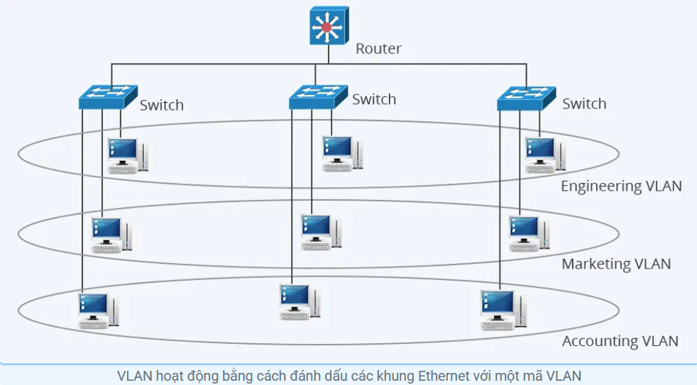
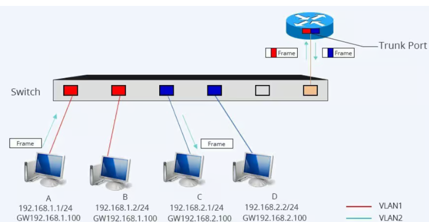
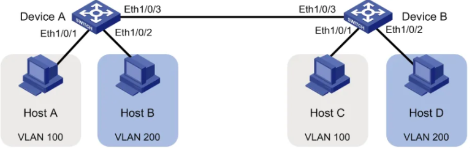
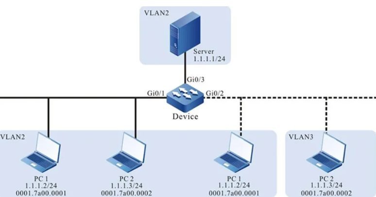

# **TÌM HIỂU VỀ VLAN**

## GIỚI THIỆU TỔNG QUAN VÀ SƠ QUA VỀ MẠNG VLAN

Trong thời đại công nghệ thông tin phát triển mạnh mẽ như hiện nay, việc xây dựng và quản lý mạng nội bộ (Local Area Network - LAN) ngày càng trở nên quan trọng đối với các doanh nghiệp. Một trong những công nghệ mạng được sử dụng rộng rãi để cải thiện hiệu quả và bảo mật của hệ thống mạng chính là VLAN (Virtual Local Area Network).

---

### 1.Mục đích chia VLAN để làm gì ?

**Tăng cường bảo mật**

- Dữ liệu cách ly : Các VLAN phân tách giúp đảm bảo thiết bị trong Vlan này không thể giao tiếp trực tiếp với thiết bị trong Vlan khác nếu không có thiết bị trung gian như bộ định tuyến hoặc tường lửa. Điều này ngăn chặn truy cập trái phép giữa các phòng cấm hoặc thiết bị nhóm.

- Giảm nguy cơ tấn công nội bộ : Nếu có một thiết bị độc hại mã độc, VLAN giúp hạn chế chế độ lan truyền của nó sang các thiết bị khác trong mạng.

**Giảm bớt phát sóng, tăng hiệu suất mạng**

- Storm chế độ phát sóng : Trong mạng LAN thông thường, khi một thiết bị gửi gói tin phát sóng, toàn bộ thiết bị trong cùng mạng đã nhận được gói tin này. Nếu có quá nhiều thiết bị, mạng có thể bị chậm.

- Khi chia Vlan, phát sóng có giới hạn chỉ định trong Vlan đó, giúp giảm tải cho mạng và tối ưu băng thông.

**Quản lý linh hoạt**

- Logic phân nhóm thiết bị : Dễ dàng nhóm các thiết bị có chức năng thay vì vị trí vật lý.

- Quản lý đơn giản hóa : Có thể quản lý các Vlan bằng cách chuyển đổi hoặc bộ định tuyến thông tin qua.

- Tiết kiệm chi phí : VLAN giúp tiết kiệm chi phí đầu tư cho thiết bị mạng. VD: Thầy đặc biệt sử dụng nhiều switch, có thể sử dụng 1 switch duy nhất để tạo ra nhiều VLAN.

**Hỗ trợ QoS (Quality of Service)**

- Ưu tiên lưu lượng mạng : Một số VLAN có thể được ưu tiên hơn. VD: VLAN cho hội nghị truyền hình có thể được ưu tiên băng thông hơn VLAN cho nhân viên văn phòng

- Cải thiện hiệu suất của các ứng dụng quan trọng như VoIP, Video Call

### 2. Ưu, nhược điểm của VLAN

**Ưu điểm**

- **Tăng cường bảo mật:** VLAN giúp cô thiết lập lưu lượng truy cập của các nhóm người dùng khác nhau, giúp bảo vệ dữ liệu nhạy cảm khỏi những quyền truy cập trái phép.

- **Cải thiện hiệu suất:** VLAN giúp giảm tắc nghẽn mạng bằng cách phân chia lượng truy cập vào các nhóm nhỏ hơn. Điều đặc biệt hữu ích này trong các mạng có nhiều người dùng và thiết bị.

- **Dễ dàng quản lý:** VLAN giúp đơn giản hóa công việc quản lý mạng bằng cách cho phép quản trị viên mạng quản lý từng Vlan riêng biệt.

- **Tăng tính linh hoạt:** VLAN giúp dễ dàng chuyển đổi và bổ sung người dùng vào mạng.

- **Giảm chi phí:** VLAN có thể giúp giảm chi phí bằng cách cho phép bạn sử dụng hiệu quả hơn các mạng tài nguyên hiện có.

**Nhược điểm**

- Gói có thể bị rò rỉ giữa các Vlan.

- Gói được tiêm có thể dẫn đến tấn công mạng.

- Mối đe dọa ở một hệ thống đơn lẻ có thể phát hiện virus phân tán cho toàn bộ mạng.

- Cần có một tiện ích bổ sung bộ định tuyến để kiểm soát khối lượng công việc trong các mạng lớn này.

- Khả năng tương tác có thể gặp sự cố.

- Một Vlan không thể chuyển tiếp mạng lưu trữ sang các Vlan khác.

## I. TÌM HIỂU MẠNG VLAN LÀ GÌ ?

Trước khi chúng ta tìm hiểu mạng VLAN là gì thì chúng ta cần hiểu về mạng LAN là gì ?

### 1. Mạng LAN là gì ?

> LAN là một mạng cục bộ (viết tắt của Local Area Network), được định nghĩa là tất cả các máy tính trong cùng một miền quảng bá (broadcast domain).

-Các router (bộ định tuyến) chặn bản tin quảng bá, trong khi switch (bộ chuyển mạch) chỉ chuyển tiếp chúng.

### 2. Mạng VLAN là gì ?

> Là một mạng logic được tạo ra trên mạng LAN vật lý. VLAN chia nhỏ mạng LAN thành các nhóm logic, cho phép quản lý và bảo mật tốt hơn. Các thiết bị trong cùng một VLAN có thể giao tiếp với nhau như thể chúng được kết nối trực tiếp, ngay cả khi chúng được kết nối với các bộ Switch khác nhau trong mạng LAN vật lý.

-Bình thường thì router đóng vai trò tạo ra boardcast domain. Đối với VLAN, switch có thể tạo ra boardcast domain (miền quảng bá).



| **Tiêu chí**               | **Mạng LAN**                                                                                                           | **VLAN (Mạng LAN ảo)**                                                                                                                        |
| -------------------------- | ---------------------------------------------------------------------------------------------------------------------- | --------------------------------------------------------------------------------------------------------------------------------------------- |
| **Phạm vi**                | Là một mạng địa phương, được giới hạn trong một khu vực địa lý nhất định như một văn phòng, nhà ở hoặc một khu dân cư. | Là một mạng ảo được tạo ra để chia sẻ mạng LAN thành các phân đoạn ảo, không phụ thuộc vào vị trí địa lý.                                     |
| **Cách tổ chức**           | Tổ chức theo cấu trúc vật lý, với các máy tính được kết nối với cùng một bộ chuyển mạch hoặc cổng chia mạng.           | Tổ chức logic, trong đó các thiết bị không cần phải kết nối vật lý với nhau nhưng vẫn thuộc cùng một nhóm thông tin cấu hình phần mềm.        |
| **Quản lý và bảo mật**     | Quản lý dựa trên cấu hình vật lý của mạng và bảo mật thường phải dựa vào các giải pháp khác như mật khẩu và cấu hình.  | Quản lý dựa trên cấu hình logic, giúp tăng cường bảo mật bằng cách ngăn chặn truy cập giữa các VLAN khác nhau, tăng tính an toàn của dữ liệu. |
| **Hiệu suất và linh hoạt** | Có thể gặp sự cố khi có nhiều máy tính kết nối với một bộ chuyển mạch hoặc một mạng đoạn.                              | Có thể cải thiện hiệu suất và hoạt động linh hoạt bằng cách chia mạng thành các nhóm, giảm tải lưu lượng và cải thiện khả năng quản lý.       |
| **Chi phí và quản lý**     | Cấu hình yêu cầu và có thể tăng chi phí khi mở rộng mạng hoặc thay đổi cấu trúc.                                       | Có thể giảm chi phí và quản lý thời gian khi cần thay đổi cấu hình mạng, không cần thay đổi cấu trúc vật lý.                                  |

---

## II. CÁCH THỨC HOẠT ĐỘNG VLAN

Mạng VLAN hoạt động bằng cách chia một mạng vật lý thành các mạng ảo độc lập giúp tăng cường quản lý và an ninh, cũng như cải thiện hiệu suất mạng.

- **Phân chia mạng vật lý:** Mạng VLAN bắt đầu bằng cách sử dụng phân chia mạng vật lý thành các phần nhỏ hơn được gọi là VLAN. Mỗi VLAN tương ứng với một đơn vị tổ chức, bộ phận làm việc hoặc yêu cầu nào đó.

- **Gán VLAN IDs:** Mỗi VLAN được gán một VLAN ID, là một số nguyên dương đại diện cho mạng ảo đó. Các mạng thiết bị như switch sẽ sử dụng VLAN ID để xác định các Vlan.

- **Cổng và cổng vật thể:** Các cổng trên switch được chỉ định cho từng cụ thể mạng VLAN. Cổng này có thể là cổng vật lý hoặc cổng vật thể (VLAN dựa trên cổng). Các thiết bị trong cùng một Vlan có thể giao tiếp trực tiếp với nhau và giới hạn chế độ giao tiếp với các thiết bị khác trong Vlan.

- **Access Ports và Trunk Ports:** Trong mạng VLAN, có hai loại cổng quan trọng: cổng truy cập và cổng trung kế. Các cổng Access (truy cập) được chỉ định cho một VLAN cụ thể, trong khi cổng Trunk (trung kế) được sử dụng để chuyển dữ liệu giữa các switch và giữa các VLAN mạng.



- **Gắn thẻ và hủy gắn thẻ:** Khi dữ liệu đi qua cổng trung kế, thông tin về VLAN ID thường được thêm vào gói (gắn thẻ). Ngược lại, khi dữ liệu rời khỏi VLAN mạng, thông tin này có thể bị loại bỏ (gỡ thẻ).

- **Tạo miền phát sóng:** Mỗi Vlan tạo ra một miền phát sóng độc lập, giảm thiểu lưu lượng phát sóng trên mạng và cải thiện hiệu suất.

**Chi tiết về cách VLAN hoạt động**

1. Gửi Ethernet khung: Khi một thiết bị gửi Ethernet khung, nó sẽ thêm Vlan mã hóa vào khung. Mã VLAN này được xác định Vlan mà Ethernet thuộc về khung.

2. Chuyển khung đến bộ chuyển mạch: Khung Ethernet được truyền qua bộ chuyển mạch.

3. Bộ chuyển mạch đọc Vlan mã hóa: Bộ chuyển mạch đọc Vlan mã hóa trong Ethernet khung.

4. Chuyển khung đến cổng tương ứng: Bộ chuyển mạch Ethernet chuyển khung đến cổng tương ứng với Vlan được xác định bởi Vlan mã hóa.

5. Thiết bị được nhận khung: Thiết bị trên cổng Ethernet được nhận khung và xử lý nó.

```
Ví dụ Một mạng LAN với ba VLAN: VLAN 10 cho bộ phận kế toán, VLAN 20 cho bộ phận bán hàng và VLAN 30 cho bộ phận tiếp thị. Khi một máy tính trong bộ phận kế toán gửi email cho một máy tính trong bộ phận bán hàng, khung Ethernet sẽ được đánh dấu với mã Vlan 10. Khi khung Ethernet đến bộ chuyển mạch, bộ chuyển mạch sẽ đọc Vlan mã và chuyển khung đến cổng được phân bổ vào Vlan 20. Máy tính trong bộ phận bán hàng sau đó sẽ nhận được khung Ethernet và email xử lý.
```

## III. PHÂN LOẠI VLAN

- **Sử dụng VLAN dựa trên cổng (Port-based VLAN):** Đây là giải pháp phổ biến và đơn giản nhất, phù hợp với các mạng LAN có cấu trúc cơ bản. Các cổng vật lý trên switch được gán vào các VLAN tương ứng. Bằng cách gán các VLAN tương ứng vào cổng.



- **Sử dụng VLAN dựa trên địa chỉ MAC (MAC-based VLAN):** Giải pháp này phù hợp với các mạng có nhiều thiết bị di động, cho phép các thiết bị di chuyển giữa các cổng mà vẫn giữ nguyên VLAN.



- **Sử dụng VLAN dựa trên địa chỉ IP (Subnet-based VLAN):** Giải pháp này phù hợp với các mạng LAN lớn, giúp quản trị viên dễ dàng quản lý và định tuyến các VLAN dựa trên các subnet IP.

- **Sử dụng VLAN động (Dynamic VLAN):** Giải pháp này giúp tăng tính linh hoạt và giảm chi phí quản lý, phù hợp với các mạng có nhiều thay đổi về cấu trúc và nhu cầu.

- **Sử dụng Router-on-a-Stick:** Đây là giải pháp sử dụng router để định tuyến giữa các VLAN, phù hợp với các mạng LAN nhỏ hoặc trung bình.

- **Sử dụng Trunking:** Giải pháp này sử dụng các đường Trunk để chuyển các khung VLAN qua các liên kết giữa các switch, giúp tăng khả năng mở rộng và linh hoạt của hệ thống.

- **Sử dụng giao thức:** Phương thức này chỉ định thiết bị dựa trên VLAN dựa trên mạng giao thức mà nó không sử dụng
  `ví dụ: IP, IPX).` Ưu điểm của phương pháp này là nó có thể hữu ích cho việc phân chia lưu lượng truy cập mạng theo loại ứng dụng.

- **Sử dụng thẻ(IEEE 802.1Q):** Thêm một thẻ Vlan vào các gói, cho phép chúng đi qua các đường kết nối (dùng để truyền nhiều Vlan qua một đường truyền duy nhất).

## IV. ỨNG DỤNG CỦA VLAN

- **Doanh nghiệp:** Tách biệt mạng của các phòng ban khác nhau (ví dụ: kế toán, kinh doanh, nhân sự) để tăng cường bảo mật và quản lý.

- **Giáo dục:** Tạo VLAN riêng cho từng khoa hoặc nhóm sinh viên để quản lý truy cập và tài nguyên.

- **Dịch vụ đám mây:** Phân chia khách hàng thành các VLAN riêng biệt để đảm bảo tính bảo mật và riêng tư cho dữ liệu của từng khách hàng.

- **IoT:** Cô lập các thiết bị IoT trong một VLAN riêng để tăng cường bảo mật và giảm nguy cơ tấn công mạng.

- **Trường học:** Chia mạng thành các VLAN theo từng lớp học hoặc khu vực để quản lý và bảo mật tốt hơn.

## V. CÁC CÂU HỎI THƯỜNG GẶP VỀ VLAN

### 1. Tại sao nên sử dụng VLAN thay vì bộ định tuyến?

VLAN có lợi thế hơn bộ định tuyến về mặt phân đoạn mạng và tối ưu hóa tài nguyên. Trong khi bộ định tuyến phân chia mạng ở cấp IP, VLAN hoạt động ở lớp liên kết dữ liệu, cho phép kiểm soát lưu lượng và phân tách dữ liệu chi tiết hơn mà không cần thêm thiết bị vật lý.

### 2. Ba lợi ích chính của việc sử dụng VLAN là gì?

Ba lợi ích chính của việc sử dụng VLAN là nâng cao hiệu suất mạng thông qua việc giảm tắc nghẽn và xung đột dữ liệu, cải thiện bảo mật bằng cách cô lập dữ liệu nhạy cảm và kiểm soát quyền truy cập, đồng thời đơn giản hóa việc quản lý mạng, cho phép cập nhật và cấu hình dễ dàng hơn cho các phân đoạn mạng cụ thể.

### 3. VLAN có nằm trên bộ định tuyến hay bộ chuyển mạch không?

VLAN có thể được cấu hình trên cả router và switch. Tuy nhiên, switch thường được kết hợp với VLAN hơn do khả năng phân đoạn lưu lượng mạng dựa trên các cổng switch, khiến chúng trở thành thành phần cơ bản cho việc triển khai VLAN.

### 4. Mục đích của VLAN là gì?

Mục đích của VLAN là phân chia mạng một cách logic thành các nhóm riêng biệt, tăng cường bảo mật dữ liệu, tối ưu hóa hiệu suất mạng và tạo điều kiện phân bổ tài nguyên hiệu quả. VLAN cho phép các thiết bị giao tiếp như thể chúng nằm trên cùng một mạng, ngay cả khi chúng được phân tán vật lý ở nhiều vị trí khác nhau.

### 5. Bạn có thể có bao nhiêu VLAN trên một bộ chuyển mạch?

Số lượng VLAN mà một switch có thể hỗ trợ phụ thuộc vào model và khả năng của nó. Các switch hiện đại có thể hỗ trợ hàng nghìn VLAN, cho phép phân đoạn và quản lý mạng rộng rãi.

### 6. Sự khác biệt giữa VLAN và mạng con là gì?

VLAN hoạt động ở lớp liên kết dữ liệu (Lớp 2), phân đoạn lưu lượng mạng. Ngược lại, mạng con hoạt động ở lớp mạng (Lớp 3) và chia địa chỉ IP thành các nhóm logic cho mục đích định tuyến. VLAN cho phép cô lập thiết bị và kiểm soát lưu lượng, trong khi mạng con hỗ trợ quản lý và định tuyến địa chỉ IP.

### 7. Một cổng có thể có 2 VLAN không?

Có, một cổng trên bộ chuyển mạch có thể được cấu hình để thuộc về nhiều VLAN. Cổng này được gọi là "cổng trunk" hoặc "cổng gắn thẻ". Cổng trunk mang lưu lượng cho nhiều VLAN, cho phép giao tiếp hiệu quả giữa các phân đoạn mạng

## VI. CÁCH CHIA MẠNG VLAN CỤ THỂ TRÊN CẤU HÌNH CISCO HOẶC SecureCRT

Dưới đây là các bước hướng dẫn chi tiết cách cấu hình và thiết lập VLAN:

### 1. Chuẩn bị

- **Xác định mục đích sử dụng VLAN:** Chia sẻ tài nguyên, tăng cường bảo mật, v.v.
- **Lập kế hoạch cho các VLAN:** Số lượng VLAN cần thiết, thiết bị nào thuộc VLAN nào.
- **Chuẩn bị thiết bị mạng:** Switch hỗ trợ VLAN, router (tùy chọn).
  Cáp mạng và các thiết bị đầu cuối khác.

### 2. Cấu hình VLAN trên Switch

- **Đăng nhập vào giao diện quản trị của Switch:** Sử dụng trình duyệt web hoặc giao diện dòng lệnh (CLI) để truy cập vào switch.

- **Tạo VLAN:** Sử dụng lệnh vlan để tạo VLAN mới.

      1 vlan 10
      2 name Marketing

- **Gán cổng vào VLAN:** Sử dụng lệnh interface và switchport access vlan để gán cổng vào VLAN.

      1 interface range fa0/1-fa0/10
      2 switchport access vlan 10

- **Lưu cấu hình:** Sử dụng lệnh `write memory` để lưu cấu hình.

### 3. Cấu hình router (tùy chọn)

- **Cấu hình định tuyến giữa các VLAN:** Nếu cần thiết, bạn cần cấu hình router để định tuyến lưu lượng giữa các VLAN.

- **Cấu hình DHCP:** Nếu bạn muốn sử dụng DHCP để cấp **địa chỉ IP** cho các thiết bị trong VLAN, bạn cần cấu hình server DHCP trên router hoặc switch.

### 4. Kiểm tra

- Sử dụng lệnh `show vlan` để xem danh sách VLAN và các cổng được gán vào từng VLAN.

- Sử dụng lệnh `show ip address` để kiểm tra địa chỉ IP của các thiết bị trong VLAN.

- Ping các thiết bị trong cùng VLAN và giữa các VLAN khác nhau để đảm bảo rằng chúng có thể giao tiếp với nhau.

````
Lưu ý:

- Các bước cụ thể có thể khác nhau tùy thuộc vào loại switch và phiên bản phần mềm bạn đang sử dụng.

- Tham khảo tài liệu hướng dẫn sử dụng của switch để biết thêm thông tin chi tiết.

- Nên sao lưu cấu hình hiện tại trước khi thực hiện bất kỳ thay đổi nào.```
````
