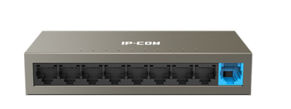

# TÌM HIỂU VỀ THIẾT BỊ MẠNG 

Mạng sẽ không thể hoạt động nếu thiếu các thiết bị vật lý và ảo tạo nên cơ sở hạ tầng mạng. Sử dụng thiết bị mạng và xây dựng kiến trúc mạng thay đổi tùy theo kích thước, mô hình mạng, khối lượng công việc cùng với các yếu tố khác gọp phần tạo lên 1 mạng hoàn chỉnh

Dưới đây là một số các thiết bị mạng cơ bản hay dùng:

## MODEM

>**Khái niệm:** Modem (Modulator - Demodulator) là một mạng thiết bị dùng để kết nối với nhà cung cấp dịch vụ Internet (ISP), giúp chuyển đổi tín hiệu số thành tín hiệu analog (hoặc ngược lại) để truyền dữ liệu qua các phương tiện truyền thông tiện ích như cáp quang, ADSL, cáp đồng trục hoặc 4G/5G.

Chức năng:

- Điều chỉnh & giải quyết điều chỉnh tín hiệu: Chuyển đổi tín hiệu số ↔ analog để truyền trên đường dây điện thoại, cáp quang, sóng vô tuyến.

- Kết nối Internet: Nhận tín hiệu từ ISP và cung cấp kết nối cho các thiết bị trong mạng.

## ROUTER (BỘ ĐỊNH TUYẾN)

>**Khái niệm:** Router là thiết bị hoạt động mạng ở Lớp 3 (Lớp mạng) của mô hình OSI. Nó cam chịu trách nhiệm định tuyến giữa các mạng khác nhau.

Chức năng chính:

- Định tuyến: Xác định mức độ ưu tiên của đường đi cho các gói dựa trên IP địa chỉ. Gói tuyến định hướng từ nguồn đến bằng cách sử dụng định tuyến bảng (Bảng định tuyến).

- Kết nối nhiều mạng khác nhau (LAN → WAN, LAN → Internet).

- Chuyển đổi IP địa chỉ (NAT) để cho phép nhiều thiết bị trong mạng nội bộ truy cập Internet.

- Quản lý lượng: Kiểm soát và quản lý lượng lưu trữ trên mạng.

- Bảo mật: Cung cấp các tính năng bảo mật như tường lửa, VPN.

## SWITCH (L2,L3)

>**Khái niệm:** Switch là một thiết bị mạng hoạt động chủ yếu ở Lớp 2 (Lớp liên kết dữ liệu) nhưng Switch Layer 3 cũng có thể hoạt động ở Lớp 3 (Lớp mạng). Switch có chức năng chính là chuyển mạch (chuyển mạch) các gói trong cùng một mạng LAN.

**Chuyển mạch lớp 2 (Chuyển mạch L2):**

- Kết nối các thiết bị trong cùng một mạng LAN.

- Use MAC địa chỉ để chuyển gói tiếp theo.

- Hỗ trợ VLAN để phân chia mạng thành nhiều logic nhóm.

- Các tính năng cơ bản: STP (Spanning Tree Protocol), VLAN Trunking, MAC address Table.

**Chuyển mạch lớp 3 (Chuyển mạch L3):**

- Kết quả hợp nhất của Switch L2 + Router.

- Có thể định tuyến giữa các Vlan (Định tuyến giữa các Vlan) mà không cần bộ định tuyến.

- Định tuyến giao thức hỗ trợ: OSPF, EIGRP, RIP.

- Bộ định tuyến tốc độ xử lý nhanh hơn ở phần cứng thay vì phần mềm.

-**Switch L2:** Chuyển mạch dựa trên địa chỉ MAC, sử dụng trong mạng LAN. 

-**Switch L3:** Có thể định tuyến giữa các VLAN, thay thế bộ định tuyến trong một số trường hợp.

## FIREWALL (TƯỜNG LỬA)

>**Khái niệm:** Tường lửa là một thiết bị hoặc phần mềm bảo mật mạng hoạt động chủ yếu ở Lớp 3 & 4 (Lớp Mạng & Truyền tải) nhưng cũng có thể kiểm soát Lớp 7 (Lớp Ứng dụng), có chức năng kiểm soát lưu lượng mạng dựa trên các quy tắc được định nghĩa.

Chức năng chính:

- Kiểm soát quyền truy cập: Cho phép hoặc chặn lưu lượng dựa trên IP địa chỉ, cổng, giao thức.

- Ngăn chặn tấn công: Phát hiện và ngăn chặn các cuộc tấn công từ bên ngoài.

- Bảo vệ dữ liệu: Bảo vệ dữ liệu khỏi các quyền truy cập trái phép.

## HUB (BỘ TẬP TRUNG)

>**Khái niệm:** Hub là một thiết bị mạng đơn giản, hoạt động ở Lớp 1 (Lớp vật lý), có chức năng chia sẻ kết nối mạng.

Chức năng:

- Chia sẻ kết nối: Mở rộng mạng bằng cách chia sẻ một cổng thành nhiều cổng.

- Broadcast: Gửi dữ liệu đến tất cả các cổng.

Nhược điểm:

- Khi nhận được dữ liệu, Hub phát (phát) ra tất cả các cổng, gây xung đột dữ liệu và giảm hiệu suất.

- Bảo mật: Dữ liệu có thể được nghe lén.

- Không thể học địa chỉ MAC như Switch.

## GATEWAY

>**Khái niệm:** Gateway cho phép quá trình chia sẻ dữ liệu được diễn ra trên cùng một hệ thống hoặc giữa các hệ thống khác nhau đều được.

Chức năng:

- **Nâng cao khả năng hiển thị:** Gateway cung cấp khả năng hiển thị vô song đối với các lượt truy cập đi qua nút ranh giới.

- **Thực hiện thu thập dữ liệu:** Cổng ghép nối thu thập thông tin từ những vị trí khác của mạng, từ đó khắc phục sự cố nhanh chóng.

- **Chế độ bảo mật được nâng cao:** Vị trí của các Gateway mang đến khả năng bảo mật cần thiết cho mọi dữ liệu khi đi từ hệ thống này sang hệ thống khác.

- **Hỗ trợ đa giao thức:** Các cổng ghép nối được xây dựng để chứa đa dạng các giao thức. Điều đó giúp cho quá trình truyền hoặc sử dụng dữ liệu giữa các mạng được dễ dàng.

## REPEATER (BỘ LẶP TÍN HIỆU)

>**Khái niệm:** Repeater là một thiết bị được dùng tái tạo và khuếch đại tín hiệu, giúp kéo dài khoảng cách truyền tín hiệu trong mạng mà không làm giảm chất lượng tín hiệu.. Vì vậy, Repeater còn được biết đến là bộ tăng cường tín hiệu. Hay nói cách khác.

Chức năng: Đảm bảo chất lượng và độ an toàn của dữ liệu dù cho chúng có được truyền đi xa.

## NETWORK CARD - CARD MẠNG (NIC)

>**Khái niệm:** Network Card là loại bảng mạch, bên trong có bo mạch chính, hỗ trợ các thiết bị giao tiếp với nhau thông qua Internet.

Chức năng:

- Thực hiện quá trình giao tiếp thông tin giữa các thiết bị, đồng thời thống kê và quản lý mọi dữ liệu được truyền tới thiết bị.

- Mỗi card mạng chứa một địa chỉ MAC nhất định và riêng biệt. Chính bởi địa chỉ này mà card mạng có thể phân định dữ liệu và thực hiện truyền đi một cách chuẩn xác.

## BRIDGE (CẦU NỐI)

>**Khái niệm&Chức năng:** là một thiết bị mạng hoạt động ở tầng liên kết dữ liệu, có vai trò kết nối nhiều mạng LAN (mạng cục bộ) với nhau để mở rộng mạng LAN hoặc tạo thành một mạng LAN lớn hơn.

-Phân loại:

-Physical Bridge: Hiện nay ít sử dụng

-Wireless Bridge: Sử dụng cho phạm vi văn phòng gần nhau nhưng không kéo cáp.

## BỘ PHÁT WIFI (ACCESS POINT)

>**Khái niệm:** Wifi là thiết bị cung cấp kết nối mạng không dây cho các thiết bị di động như điện thoại di động, máy tính bảng, laptop. Cho phép các thiết bị này kết nối vào mạng không dây.

Chức năng: Mở rộng vùng phủ sóng wifi, tạo ra các khu vực wifi công cộng hoặc cung cấp kết nối cho các thiết bị di động trong một doanh nghiệp hoặc tổ chức.

| Thiết bị         | Lớp OSI   | Chức năng chính                                                                 | Cách xử lý dữ liệu                                       |
|------------------|-----------|----------------------------------------------------------------------------------|-----------------------------------------------------------|
| Bộ định tuyến    | Lớp 3     | Kết nối mạng LAN/WAN, IP định tuyến                                             | Chuyển tiếp dựa trên IP                                  |
| Switch L2        | Lớp 2     | Kết nối thiết bị trong mạng LAN, chia VLAN                                      | Chuyển tiếp dựa trên MAC                                 |
| Switch L3        | Lớp 3     | Switch + VLAN định tuyến                                                        | Chuyển tiếp dựa trên MAC + IP                            |
| Firewall         | Lớp 3 hoặc 7 | Bảo mật, chặn tấn công mạng, kiểm soát lưu lượng                            | Chặn/cho phép gói tin theo quy tắc                       |
| Hub              | Lớp 1     | Kết nối thiết bị trong mạng LAN                                                 | Phát sóng (phát sóng) tất cả dữ liệu                     |
| Gateway          | 2,7       | Chia sẻ dữ liệu được diễn ra trên cùng một hệ thống hoặc giữa các hệ thống khác nhau đều được | Nhận và Gửi gói dữ liệu đến mạng đích          |
| Netcard          | 1,2       | Hỗ trợ các thiết bị giao tiếp với nhau thông qua Internet                       | Nhận dữ liệu/Đóng gói thành khung                   |
| Wireless Bridge  | 1,2       | Kết nối nhiều mạng LAN (mạng cục bộ) tạo thành một mạng LAN lớn hơn             | Chuyển tiếp data giữa các LAN                            |
