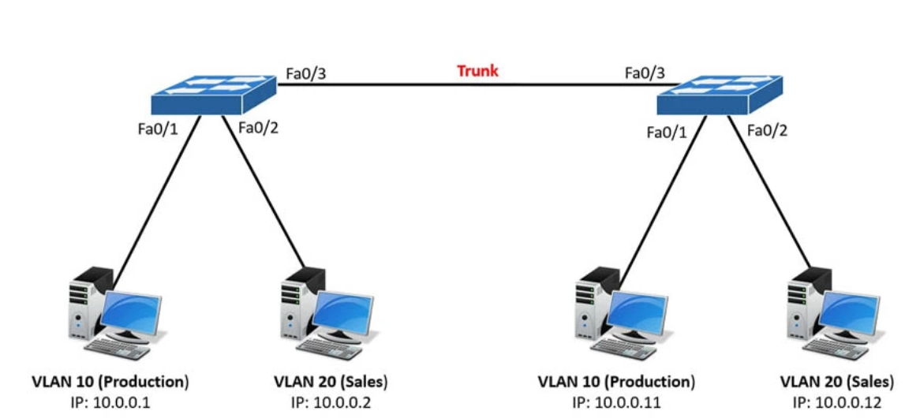
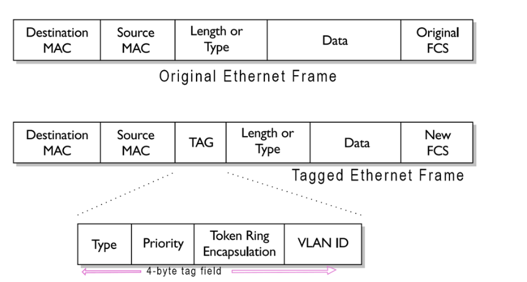
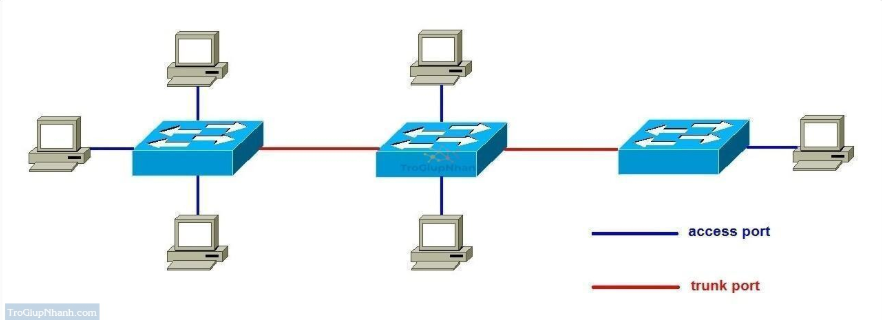
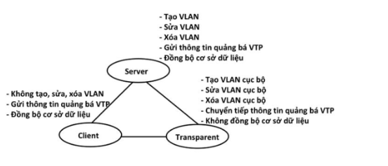

# TÌM HIỂU VỀ TRUNKING

## I. TRUNKING LÀ GÌ ?

**Khái niệm:** Đường Trunk hay Trunking là một kỹ thuật kết nối các mạng thiết bị với nhau để tạo thành một mạng lớn hơn, đặc biệt trong các mạng LAN (Mạng cục bộ) hoặc các mạng VLAN (Mạng cục bộ ảo). Đường trục cho phép chuyển dữ liệu gói từ một Vlan này sang một Vlan khác trên cùng một đường truyền, điều này giúp tối ưu hóa công việc sử dụng băng thông và giảm độ trễ trong mạng.



-Đặc điểm:

- Cho phép truyền dữ liệu của nhiều VLAN qua một cổng duy nhất bằng cách gắn thêm tag VLAN vào gói tin.

- Thường sử dụng giao thức 802.1Q để đánh dấu (thẻ) các gói.
  Được sử dụng khi cần kết nối giữa các Switch với nhau hoặc giữa Switch với Router để truyền tải dữ liệu của nhiều VLAN.

-Khi một cổng được cấu hình, dữ liệu từ nhiều Vlan sẽ được truyền qua cùng một đường truyền. Để phân biệt bất kỳ gói VLAN thuộc tính nào, người ta sử dụng thẻ gắn giao thức (gắn thẻ). Có 2 chuẩn phổ biến là IEEE 802.1Q (DOT1Q) và ISL

## II. CHUẨN IEEE 802.1Q (DOT1Q)

### 1. Khái niệm

**Khái niệm:** IEEE 802.1Q (còn được gọi là DOT1Q) là tiêu chuẩn mở do IEEE phát triển, được sử dụng rộng rãi trên mạng thiết bị của nhiều hãng khác nhau (Cisco, HP, Juniper...).

- Gói tin VLAN khi đi qua cổng trung kế sẽ được gắn thẻ VLAN (Gắn thẻ VLAN) theo tiêu chuẩn 802.1Q.



### 2. Cách hoạt động

-Thêm một thẻ (tag VLAN) vào gói Ethernet để xác định VLAN mà nó thuộc về.

-Thẻ kích thước VLAN: 4 byte (32 bit) được chèn vào giữa phần Header và Payload của Ethernet gói.

-Có khái niệm Native VLAN: Gói tin thuộc Native VLAN sẽ không gắn thẻ khi truyền qua Trunk.

-Khái niệm Native VLAN: Gói tin thuộc Native VLAN sẽ không gắn thẻ khi truyền qua Trunk.

### 3. Cấu trúc thẻ VLAN 802.1Q (4 byte)

| Thành phần                   | Kích thước | Ý nghĩa                                                                    |
| ---------------------------- | ---------- | -------------------------------------------------------------------------- |
| **Kiểu (Type)**              | 2 byte     | Luôn có giá trị `0x8100`, giúp mạng nhận biết đây là gói tin VLAN.         |
| **Ưu tiên (PRI - Priority)** | 3 bit      | Mức độ ưu tiên (0–7), dùng cho QoS (Quality of Service).                   |
| **Token Ring Encapsulation** | 1 bit      | Dùng để xác định MAC địa chỉ định dạng Token Ring. Thường là 0 (Ethernet). |
| **VLAN ID (VID)**            | 12 bit     | Xác định VLAN, giá trị từ 1–4094 (0 và 4095 không dùng).                   |

**Ví dụ Gắn thẻ Vlan với 802.1Q:** Gói tin từ VLAN 10 khi truyền qua Trunk Port sẽ được thêm Tag VLAN 10. Switch đã nhận được gói sẽ đọc thẻ này để biết VLAN nào thuộc về nó.

## III. CHUẨN ISL (Inter Switch Link Cisco)

### 1. Khái niệm

**Khái niệm:** ISL (Inter-Switch Link) là một giao thức trunking độc quyền của Cisco, được sử dụng để truyền tải nhiều VLAN qua một đường trục liên kết giữa các mạng thiết bị của Cisco. ISL chỉ hoạt động trên thiết bị Cisco và không phải tiêu chuẩn IEEE như 802.1Q.

-**Đóng gói ISL:** ISL đóng gói toàn bộ khung Ethernet gốc bằng cách thêm một tiêu đề 26 byte và một đoạn giới thiệu 4 byte.

-Hỗ trợ tối đa 1024 Vlan được hỗ trợ ISL, ít hơn so với 802.1Q (4094 Vlan).

### 2. Cách hoạt động

- Thay vì **chèn tag vào trong Ethernet frame** như 802.1Q, ISL **đóng gói (encapsulate) toàn bộ Ethernet frame** bằng cách:

  1. **Thêm ISL Header** (26 byte) ở đầu frame:

     - Chứa thông tin VLAN ID (10 bit), Type, User bits...

  2. **Thêm ISL Trailer** (4 byte) ở cuối frame:

     - Chứa thông tin kiểm tra lỗi (CRC).

### 3.Cấu trúc ISL Header

**Cấu hình ISL Tiêu đề (30 byte)**

| Thành phần         | Kích thước  | Ý nghĩa                    |
| ------------------ | ----------- | -------------------------- |
| DA (Địa chỉ đích)  | 6 byte      | Địa chỉ MAC đích           |
| Kiểu               | 2 byte      | Xác định gói tin thuộc ISL |
| Trường người dùng  | 1 byte      | Độ ưu tiên                 |
| ID VLAN            | 15 byte     | Chứa VLAN của gói tin      |
| SA (Địa chỉ nguồn) | 6 byte      | Địa chỉ MAC nguồn          |
| **Tổng cộng**      | **30 byte** | Tiêu đề ISL                |

**Ví dụ Gắn thẻ Vlan với ISL:**

- Gói tin từ VLAN 20 khi đi qua Trunk Port sẽ bọc toàn bộ bằng ISL header.

- Switch được nhận sẽ kiểm tra tiêu đề ISL để xác định VLAN.

## IV. CỔNG ACCESS VÀ CỔNG TRUNK



### 1. Cổng Access

- **Định nghĩa**: Cổng switch được cấu hình để truyền dữ liệu của **một VLAN duy nhất**.

- **Chức năng**:

  - Kết nối thiết bị đầu cuối (PC, máy in, camera IP, v.v.) vào mạng.

  - Không gắn thẻ VLAN (untagged frame) khi truyền ra ngoài.

  - Gói tin nhận được từ thiết bị sẽ được switch **gán VLAN ID** tương ứng với cấu hình của cổng.

- **Ứng dụng**:

  - Kết nối máy tính nhân viên vào VLAN phòng ban.

  - Kết nối thiết bị IoT hoặc máy in dùng một VLAN cố định.

- **Cấu hình cổng Access Port:**

      >Switch#config terminal

      >Switch(config)#interface fastetnernet slot/port_number

      >Switch(config)#switchport mode access

### 2. Cổng Trunk

- **Định nghĩa**: Cổng switch được cấu hình để truyền dữ liệu của **nhiều VLAN** qua cùng một liên kết vật lý.

- **Chức năng**:

  - Dùng **VLAN Tagging** (IEEE 802.1Q hoặc ISL) để phân biệt gói tin thuộc VLAN nào.

  - Kết nối giữa các switch, switch với router hoặc switch với server hỗ trợ VLAN.

  - Có **Native VLAN**: gói tin thuộc VLAN này sẽ truyền không có tag.

- **Ứng dụng**:

  - Truyền nhiều VLAN qua liên kết giữa các switch.

  - Kết nối Switch – Router trong mô hình Router-on-a-Stick.

  - Kết nối Switch – Server hỗ trợ VLAN tagging.

- **Cấu hình trunk port:**

      >Switch#config terminal

      >Switch(config)#interface fastetnernet slot/port_number

      >Switch(config-if)#switchport trunk encapsulation [dot1q | isl]

      >Switch(config-if)#switchport mode trunk

### 3. So sánh Cổng Access và Cổng Trunk

| Tiêu chí             | Cổng Access                              | Cổng Trunk                                                  |
| -------------------- | ---------------------------------------- | ----------------------------------------------------------- |
| **Số VLAN hỗ trợ**   | Chỉ 1 VLAN duy nhất                      | Nhiều VLAN cùng lúc                                         |
| **Gắn thẻ VLAN**     | Không gắn thẻ (untagged)                 | Gắn thẻ VLAN (tagged) theo chuẩn 802.1Q hoặc ISL            |
| **Thiết bị kết nối** | PC, máy in, camera IP, thiết bị đầu cuối | Switch, Router, Server hỗ trợ VLAN                          |
| **Ứng dụng chính**   | Kết nối thiết bị đầu cuối vào một VLAN   | Truyền nhiều VLAN giữa các thiết bị mạng                    |
| **Native VLAN**      | Không áp dụng                            | Có thể cấu hình Native VLAN                                 |
| **Ví dụ**            | Cổng vào VLAN 10 để kết nối PC           | Cổng trunk giữa Switch 1 và Switch 2 truyền VLAN 10, 20, 30 |

## V. VTP, STP

### 1. VTP (Giao thức truyền tải VLAN)

**Khái niệm:** VTP (Vlan Trunking Protocol) là giao thức hoạt động ở tầng liên kết dữ liệu trong OSI mô hình. VTP giúp cấu hình Vlan luôn đồng bộ nhất khi thêm, xóa, sửa thông tin về Vlan trong mạng hệ thống.

-Mục đích:

- Tự động đồng bộ Vlan trên toàn hệ thống mà không cần cấu hình thủ công từng Switch.

- Giảm thiểu cấu hình lỗi khi phát triển mạng mở rộng.

- Tiết kiệm thời gian vì chỉ cần tạo VLAN trên một Switch, tất cả các Switch khác trong cùng hệ thống VTP sẽ được nhận.

-Cách hoạt động:

- Trong mạng có nhiều Switch, một Switch được cài đặt làm VTP Server.

- Khi VLAN mới được tạo trên VTP Server, nó sẽ gửi thông báo đến tất cả các Switch khác qua Trunk Link.

- Các Switch khác sẽ cập nhật VLAN mới vào cơ sở dữ liệu của mình.

```
Lưu ý: VTP chỉ đồng bộ VLAN, không đồng bộ Port Transfer (gán port vào VLAN).
```

-**Các chế độ hoạt động của VTP**



`Máy chủ VTP:`

- Switch Cisco mặc định chế độ

- Tạo, sửa, xóa VLAN.

- Các thay đổi sẽ được quảng bá cho các switch khác trong cùng một miền VTP.

- Switch Server lưu trữ thông tin về VLAN trong NVRAM (Non-Volatile RAM).

`Máy khách VTP:`

- Không thể tạo, xóa hoặc sửa đổi VLAN.

- Chỉ nhận VLAN thông tin từ VTP Server.

- Chuyển tiếp các gói VTP mà nó không được nhận từ Máy chủ đến các Máy khách khác.

`VTP trong suốt(Tránparent):`

- Không nhận/sử dụng VLAN từ VTP Server.

- Cho phép tạo VLAN local (local).

- Tiếp tục chuyển tiếp Quảng cáo VTP đến Switch khác.

-**Cấu trúc của VTP Advertisement (Thông điệp VTP)**

`Phiên bản VTP (1 byte):`

- VTP v1: Phiên bản cơ sở, hỗ trợ VLAN từ 1-1005.

- VTP v2: Cải tiến v1, hỗ trợ Token Ring VLAN, hoạt động tốt hơn Transparent Mode.

- VTP v3: Hỗ trợ VLAN 1-4094, bảo mật cao hơn, cho phép cấu hình rollback.

`Loại tin nhắn VTP (1 byte):`

- Quảng cáo tóm tắt : Gửi mỗi 5 phút, chứa số Revision Number và VLAN hiện có.

- Subset Quảng cáo : Gửi khi có thay đổi Vlan (tạo, xóa, sửa Vlan).

- Quảng cáo Yêu cầu : Khi Switch vừa khởi động, nó gửi yêu cầu cập nhật VLAN từ VTP Server.

**VD:** Khi quản trị viên tạo VLAN 20 trên VTP Server, nó sẽ gửi Subset Quảng cáo đến các Switch Client để cập nhật VLAN 20.
Tên miền quản lý (32 byte): Tên miền VTP (VTP Domain).
Số sửa đổi (4 byte): VLAN cập nhật thứ tự (càng lớn, cập nhật càng mới).
Thông tin Vlan (biến đổi): Danh sách Vlan được quản lý.

### 2. STP (Spanning Tree Protocol-Giao thức cây bao trùm)

**Khái niệm:** STP (Spanning Tree Protocol) là một giao thức mạng Lớp 2 (Lớp liên kết dữ liệu) giúp ngăn chặn các vòng lặp (vòng lặp) trong mạng Ethernet bằng cách tạo một cây bao trùm (cây bao trùm) để đảm bảo chỉ có một đường dẫn hoạt động giữa các switch.

-STP tránh các vấn đề quan trọng trong vòng lặp như:

- Cơn bão phát sóng: Các gói phát sóng được sao chép và truyền liên tục trên mạng, gây ra mạng.

- Các khung trùng lặp: Các thiết bị nhận được nhiều bản sao của cùng một gói, gây nhầm lẫn và xử lý sai.

- Bảng địa chỉ MAC không ổn định: Bảng địa chỉ MAC trên switch được cập nhật liên tục, gây khó khăn cho việc chuyển gói tiếp theo.

-Nguyên lý hoạt động:

` STP sử dụng Thuật toán Spanning Tree thuật toán (STA) để xác định đường đi tối ưu, dựa trên: Lựa chọn Cầu gốc (Chọn Cầu gốc), Vai trò cổng (Vai cổng cổng), Chi phí đường dẫn (Chi phí đường truyền) với các bước:`

- Bước 1: Chọn Root Bridge (Cầu Gốc):

  - Tất cả Switch gửi BPDU (Bridge Protocol Data Unit) để bầu chọn Root Bridge.

  - Switch có Bridge ID (Ưu tiên + Địa chỉ MAC) nhỏ nhất sẽ trở thành Root Bridge.

  - Bridge ID = Mức độ ưu tiên của Bridge + Địa chỉ MAC.

- Bước 2: Xác định Root Port (RP) trên mỗi Switch:

  - Root Port là cổng có đường đi ngắn nhất đến Root Bridge. Nếu có 2 đường đến Root Bridge, đường có chi phí nhỏ hơn sẽ được chọn làm Root Port.

  - Chi phí đường dẫn tính toán (Chi phí đường truyền) dựa trên tốc độ cổng: 10 Mbps = 100, 100 Mbps = 19, 1 Gbps = 4, 10 Gbps = 2.

  - Nếu 2 cổng bằng nhau thì cổng nào có BID nhỏ hơn sẽ trở thành cổng gốc.

- Bước 3: Xác định cổng được chỉ định (DP)

  - Cảng được chỉ định là cổng trên mỗi phân đoạn chịu trách nhiệm chuyển tiếp gói tin.

  - Trên mỗi đường truyền, Switch nào có đường đi ngắn hơn Root Bridge sẽ có Cổng được chỉ định.

- Bước 4: Xác định Blocked Port (BP)

  - Những cổng nào không có Root Port hoặc Designated Port sẽ bị chặn (Chặn).

  - Cổng bị chặn vẫn lắng nghe BPDU để có thể kích hoạt lại nếu mạng bị lỗi.
