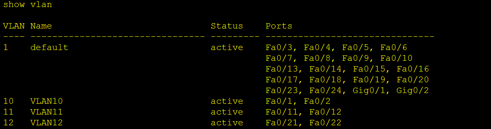

# CHIA VLAN

## Yêu cầu cấu hình VLAN như ảnh

## Các bước thực hiện

### 1. Truy cập vào từng PC cấu hình IP cho từng máy tính

- Có 6 PC ta sẽ nhập địa chỉ IP và nhập miền DOMAIN của từng PC một bằng cách : Nhấp vào PC cần cấu hình => **Config** => Vào phần cấu hình địa chỉ IPv4 => Chọn **Static** => Nhập địa chỉ IPv4/Miền Domain.

- Ở dây ta có PC3 (Có **địa chỉ IP** 10.10.11.11/ **Miền Domain** 255.255.255.0)

### 2. Truy cập vào switch

- Mở Cisco Packet Tracer → Nhấn vào Switch → Chọn CLI.

### 3. Vào config mode trên Switch

      Switch> enable
      Switch# configure terminal

- enable: Truy cập đặc quyền EXEC mode từ người dùng chế độ (Chế độ EXEC người dùng). Ở đặc quyền EXEC mode, bạn có thể kiểm tra cấu hình và thực hiện nâng cấp lệnh.

- configure terminal: Chuyển từ đặc quyền EXEC sang Global Configuration Mode để thay đổi cấu hình thiết bị. Khi ở chế độ này, có thể tạo Vlan, cấu hình cổng, đặt tên, vv

### 4. Tạo các VLAN

    Switch(config)# vlan 10
    Switch(config-vlan)# name VLAN10
    Switch(config-vlan)# exit

    Switch(config)# vlan 11
    Switch(config-vlan)# name VLAN11
    Switch(config-vlan)# exit

    Switch(config)# vlan 12
    Switch(config-vlan)# name VLAN12
    Switch(config-vlan)# exit

- `vlan 10:` Tạo VLAN có ID là 10.

- `name VLAN10:` Đặt tên cho VLAN là VLAN 10.

- `exit:` Thoát VLAN cấu hình chế độ.

- Lặp lại các lệnh này cho từng VLAN muốn tạo.

**KIỂM TRA VLAN VỪA TẠO**

    Switch# show vlan

### 5. Gán cổng vào VLAN
     
**Cổng Fa0/1 và Fa0/2 vào VLAN10 (PC-1, PC-2):**

     Switch(config)# interface fastEthernet 0/1
     Switch(config-if)# switchport mode access
     Switch(config-if)# switchport access vlan 10
     Switch(config-if)# exit

     Switch(config)# interface fastEthernet 0/2
     Switch(config-if)# switchport mode access
     Switch(config-if)# switchport access vlan 10
     Switch(config-if)# exit

- interface fastEthernet 0/1: Select port vật lý FastEthernet 0/1 để cấu hình.

- switchport mode access: Chuyển cổng sang Access mode (cổng này chỉ phụ thuộc một VLAN duy nhất).

- switchport access vlan 10: Gán VLAN 10 cho cổng.
exit: Quit port config mode.

**Cổng Fa0/11 và Fa0/12 vào VLAN11 (PC-3, PC-4):**

     Switch(config)# interface fastEthernet 0/11
     Switch(config-if)# switchport mode access
     Switch(config-if)# switchport access vlan 11
     Switch(config-if)# exit

     Switch(config)# interface fastEthernet 0/12
     Switch(config-if)# switchport mode access
     Switch(config-if)# switchport access vlan 11
     Switch(config-if)# exit

**Cổng Fa0/21 và Fa0/22 vào VLAN12 (PC-5, PC-6):**

     Switch(config)# interface fastEthernet 0/21
     Switch(config-if)# switchport mode access
     Switch(config-if)# switchport access vlan 12
     Switch(config-if)# exit

     Switch(config)# interface fastEthernet 0/22
     Switch(config-if)# switchport mode access
     Switch(config-if)# switchport access vlan 12
     Switch(config-if)# exit

**Kiểm tra VLAN đúng cổng chưa**

     Switch#show vlan

- Như trong hình là các cổng VLAN đã được ghép đúng cổng

**Ping PC để kiểm tra kết nối được thông chưa**

1. Choose PC muốn kiểm tra kết nối: Nhấn vào PC-1 hoặc PC khác trong sơ đồ.

2. Mở công cụ "Dấu nhắc lệnh": Vào tab Màn hình nền → Chọn Dấu nhắc lệnh.

3. Thực hiện lệnh ping:

       ping [địa_chỉ_IP]

Từ PC-1 ping đến PC khác. Nếu cùng vlan sẽ phản hồi `reply`, khác vlan phản hồi `Request time out`.

