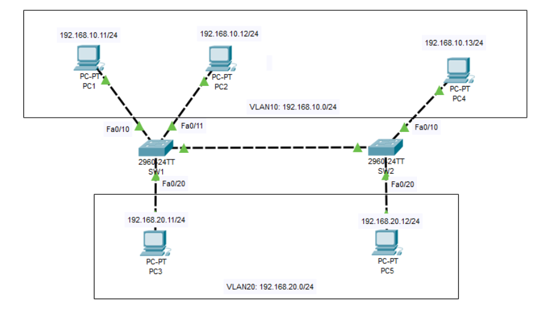
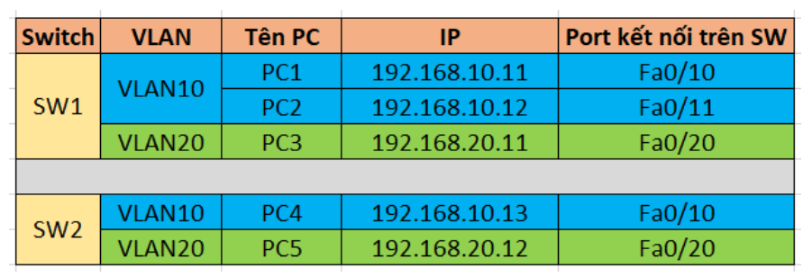
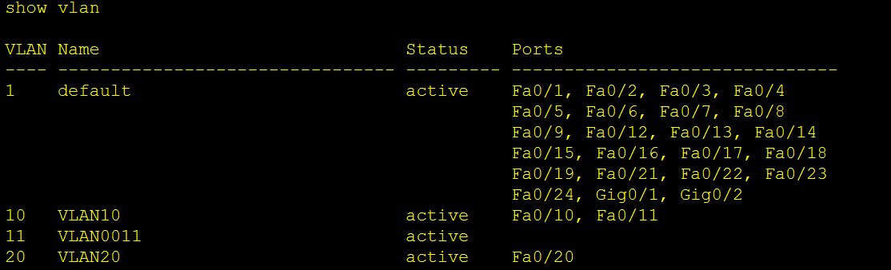
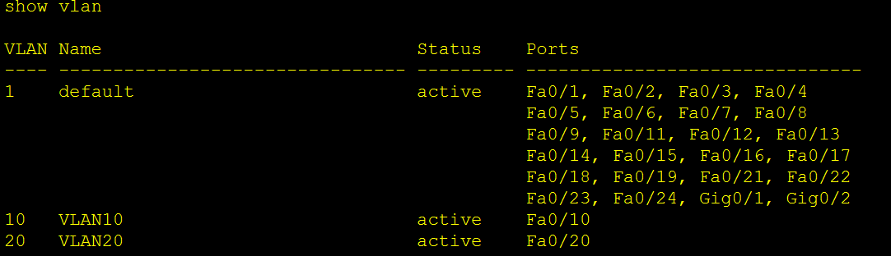
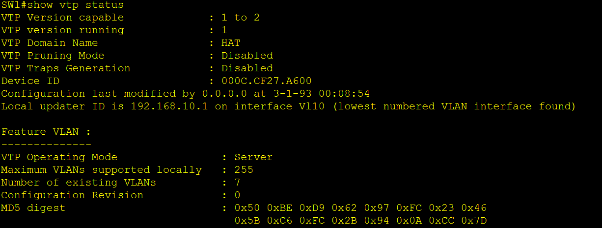
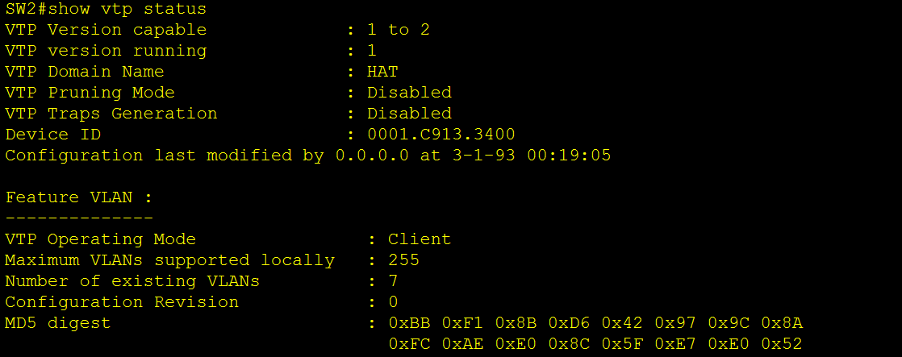
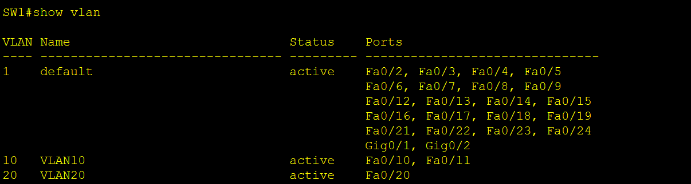
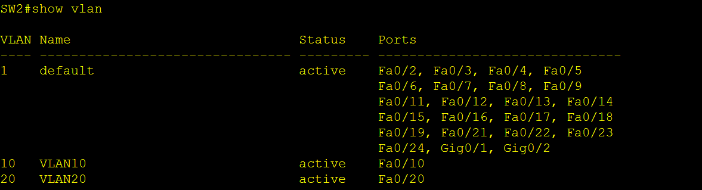
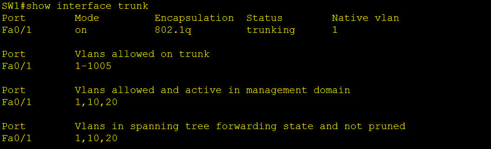
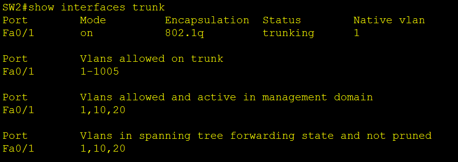

# CẤU HÌNH VTP DOMAIN

## Sơ đồ lab:

**Quy hoạch VLAN :**

- VLAN10: 192.168.10.0/24
- VLAN20: 192.168.20.0/24

**Quy định IP và Kết nối**

## Cấu hình VTP

### 1. Cấu hình chi tiết từng thiết bị

- PC-1:

  - Địa chỉ IP: 192.168.10.11

  - Mặt nạ mạng con: 255.255.255.0

  - Cổng mặc định: (Bỏ trống nếu không có Bộ định tuyến)

- Các PC khác tương tự.

### 2. Cài đặt VLAN trên 2 switch

**Trên Sw1:**

Đặt tên:

    Switch>enable
    Switch#configure terminal
    Switch(config)#hostname SW1
    SW1(config)#

- enable: Chuyển từ chế độ "Chế độ EXEC người dùng" sang "Chế độ EXEC đặc quyền". Cung cấp quyền truy cập vào quản trị lệnh và nâng cao cấu hình.

- configure terminal: Chuyển từ chế độ "Chế độ EXEC đặc quyền" sang "Chế độ cấu hình chung". Cho phép thực thi chung cấu hình lệnh trên switch.

- hostname SW1: Đặt switch tên là "SW1".

Tạo VLAN10 và VLAN20:

    SW1(config)#vlan 10
    SW1(config-vlan)#name VLAN10
    SW1(config-vlan)#exit

    SW1(config)#vlan 20
    SW1(config-vlan)#name VLAN20
    SW1(config-vlan)#exit

    SW1(config)#

Gán các cổng vào VLAN:

    SW1(config)#interface fastEthernet 0/10
    SW1(config-if)#switchport access vlan 10
    SW1(config-if)#exit

    SW1(config)#interface fastEthernet 0/11
    SW1(config-if)#switchport access vlan 10
    SW1(config-if)#exit

    SW1(config)#interface fastEthernet 0/20
    SW1(config-if)#switchport access vlan 20
    SW1(config-if)#exit

    SW1(config)#exit

Kiểm tra xem cổng đã được gán VLAN chưa:

**Trên Sw2:**

Đặt tên:

    Switch>enable
    Switch#configure terminal
    Switch(config)#hostname SW2
    SW2(config)#

Tạo VLAN10 và VLAN20:

    SW2(config)#vlan 10
    SW2(config-vlan)#name VLAN10
    SW2(config-vlan)#exit

    SW2(config)#vlan 20
    SW2(config-vlan)#name VLAN20
    SW2(config-vlan)#exit

    SW2(config)#

Gán các cổng vào VLAN

    SW2(config)#interface fastEthernet 0/10
    SW2(config-if)#switchport access vlan 10
    SW2(config-if)#exit

    SW2(config)#interface fastEthernet 0/20
    SW2(config-if)#switchport access vlan 20
    SW2(config-if)#exit

    SW2(config)#exit

kiểm tra lại:

### 3. Cấu hình VTP

**Trên SW1:**

Đặt IP địa chỉ cho giao diện VLAN10 là `192.168.10.1`và VLAN20 là`192.168.20.1`

    SW1#configure terminal
    SW1(config)#interface vlan 10
    SW1(config-if)#
    SW1(config-if)#ip address 192.168.10.1 255.255.255.0
    SW1(config-if)#no shutdown
    SW1(config-if)#exit
    SW1(config)#

    SW1(config)#interface vlan 20
    SW1(config-if)#ip address 192.168.20.1 255.255.255.0
    SW1(config-if)#no shutdown
    SW1(config-if)#exit

    SW1(config)#exit
    SW1#

**Trên SW2:**

Đặt IP địa chỉ cho giao diện VLAN10 là `192.168.10.2`và VLAN20 là`192.168.20.2`

    SW2#configure terminal
    SW2(config)#interface vlan 10
    SW2(config-if)#
    SW2(config-if)#ip address 192.168.10.2 255.255.255.0
    SW2(config-if)#no shutdown
    SW2(config-if)#exit
    SW2(config)#

    SW2(config)#interface vlan 20
    SW2(config-if)#ip address 192.168.20.2 255.255.255.0
    SW2(config-if)#no shutdown
    SW2(config-if)#exit

    SW2(config)#exit
    SW2#

**Cài đặt VTP Server và VTP Client:**

- Công tắc 1: Máy chủ VTP.

- Công tắc 2: VTP CLIent.

- Tên miền VTP: HAT

- Mật khẩu VTP: hoanganhtien03

**Trên SW1:**

    SW1>enable
    SW1#configure terminal
    SW1(config)#vtp mode server
    SW1(config)#vtp domain HAT
    SW1(config)#vtp password hoanganhtien03
    SW1(config)#exit
    SW1#

- vtp mode server: Đặt switch ở chế độ VTP Server, có thể tạo, chỉnh sửa, xóa VLAN và đồng bộ với các switch client.

- vtp doamin HAT: Đặt tên miền VTP là HAT. Switch này muốn đồng bộ hóa phải cùng tên miền.

- vtp password hoanganhtien03: Thiết lập mật khẩu hoanganhtien03 để bảo vệ và đảm bảo chỉ các switch có cùng bộ dữ liệu mới mật khẩu.

**Trên SW2:**

    SW2>enable
    SW2#configure terminal
    SW2(config)#vtp mode client
    SW2(config)#vtp domain HAT
    SW2(config)#vtp password hoanganhtien03
    SW2(config)#exit
    SW2#

**Tạo đường trục từ SW1 đến SW2:**

Enable trunking trên các cổng kết nối giữa 2 switch là Fa0/1 trên SW1 và Fa0/1 trên SW2.

**SW1:**

    SW1#configure terminal
    SW1(config)#interface fastEthernet 0/1
    SW1(config-if)#switchport mode trunk
    SW1(config-if)#end
    SW1#

**SW2:**

    SW2#configure terminal
    SW2(config)#interface fastEthernet 0/1
    SW2(config-if)#switchport mode trunk
    SW2(config-if)#end
    SW2#

### 4. Các lệnh kiểm tra sau khi cấu hình xong

`SW# show vtp status`

**SW1:**

**SW2:**

`SW# show vtp password`

**SW1:**

**SW2:**

`SW# show vlan`

**SW1:**

**SW2:**

`SW# show interfaces trunk`

**SW1**

**SW2**

