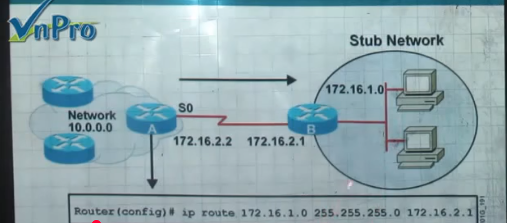

# ROUTING

## I. KHÁI NIỆM ROUTING

### 1. Khái niệm Routing là gì ?

**Khái niệm:** Định tuyến là phương thức mà Router (Bộ định tuyến) hay PC (thiết bị mạng) dùng để chuyển các gói tin đến địa chỉ đích một cách tối ưu nhất, nghĩa là chỉ ra hướng và đường đi tốt nhất cho gói tin

- Router thu thập và duy trì các thông tin định tuyến để cho phép truyền và nhận các dữ liệu.

- Quá trình Routing dựa vào thông tin trên **bảng định tuyến (Routing table)**, là bảng chứa các lộ trình nhanh và tốt nhất đến các mạng khác nhau trên mạng, để hướng các gói dữ liệu đi một cách hiệu quả nhất.

- Routing có vai trò quan trọng trong các hệ thống mạng, đặc biệt là mạng Internet, giúp đảm bảo các thiết bị có thể liên lạc với nhau một cách hiệu quả. Quá trình này được thực hiện bởi các thiết bị mạng như router, switch layer 3 và máy chủ mạng.


- Theo ví dụ trên, Máy tính A muốn nhắn tin cho máy tính B có thể đi theo 2 đường dẫn:

  - Đường 1: đi qua mạng 1, 3 và 5.

  - Đường 2: đi qua mạng 2 và 4.

- Khi dữ liệu từ máy tính A đến Router nó sẽ phân tích và quyết định lựa chọn đường dẫn tốt nhất trong 2 đường dẫn. Trong trường hợp này, Router sẽ chọn đường 1 vì đường truyền từ mạng 2 đến mạng 4 bị chậm.

- Các giao thức routing sử dụng số liệu để xác định đường dẫn tốt nhất cho việc phân phối gói. Số liệu là tiêu chuẩn đo lường như đếm bước nhảy, băng thông, độ trễ, tải hiện tại trên đường dẫn, v.v. được sử dụng bởi thuật toán routing để xác định đường dẫn tối ưu đến đích.

### 2. Chỉ số và các giá trị routing

-Các **chỉ số** và chi phí routing được sử dụng để xác định đường routing tốt nhất đến điểm đến. Các yếu tố được sử dụng bởi các giao thức để xác định đường đi ngắn nhất, những yếu tố này được gọi là một thước đo.

-**Chỉ số** là các **biến mạng** được sử dụng để xác định đường đi tốt nhất đến đích.

-Đối với một số giao thức sử dụng số liệu tĩnh có nghĩa là giá trị của chúng không thể thay đổi được và đối với một số giao thức routing khác, sử dụng số liệu động nghĩa là giá trị của chúng có thể được chỉ định bởi quản trị viên hệ thống.

-**Các giá trị chỉ số phổ biến nhất được đưa ra dưới đây:**

- **Hop count:** là một số liệu chỉ định số lần truyền qua các thiết bị kết nối internet như bộ routing

- **Độ trễ(Delay):** Là khoảng thời gian do bộ routing thực hiện để xử lý, xếp hàng và truyền một gói dữ liệu tới một giao diện.

- **Băng thông:(Bandwidth)** Băng thông được đo bằng bit trên giây.Nó xác định dung lượng data cho tất cả các liên kết dọc theo đường dẫn.

- **Tải:(Load)** Tải cho biết mức độ mà tài nguyên mạng như bộ routing hoặc liên kết mạng đang bận.

- **Độ tin cậy:(Reliability)** là một yếu tố thước đo có thể bao gồm một giá trị cố định. Bất kỳ hệ số độ tin cậy nào cũng có thể được xem xét để chỉ định xếp hạng độ tin cậy, thường là các giá trị số được chỉ định bởi người quản trị hệ thống.

- **Metric / Administrative Distance:** chỉ số ưu tiên, nhỏ hơn thì ưu tiên hơn

### 3. Các thành phần chính của Routing

**Router (Bộ định tuyến):**

- Thiết bị mạng chịu trách nhiệm chuyển tiếp gói dữ liệu giữa các mạng khác nhau.

- Sử dụng bảng định tuyến (routing table) để quyết định đường đi cho các gói dữ liệu.

**Bảng định tuyến (Routing Table):** là tập hợp các tuyến đường mà router sử dụng để quyết định nơi gửi gói tin.

- Chứa thông tin về các đường đi có sẵn trong mạng.

- Bao gồm các thông tin như địa chỉ mạng đích, cổng ra (interface), và metric (độ đo để so sánh các đường đi).

```text
Destination      Gateway        Interface
192.168.1.0      0.0.0.0         Eth0
192.168.2.0      192.168.1.1     Eth1
0.0.0.0          192.168.1.254   Eth0 (default route)
```

**Giao thức định tuyến (Routing Protocol):**

- Các giao thức như RIP, OSPF, BGP được sử dụng để tự động cập nhật bảng định tuyến.

- Giúp router học và chia sẻ thông tin về các đường đi trong mạng.

## II. CHỨC NĂNG ROUTING

-Các bộ định tuyến chủ yếu đảm nhận **ba chức năng chính**:

- **Xác định đường dẫn:** Bộ định tuyến cố gắng tìm đường dẫn tốt nhất bằng cách phân tích các chỉ số mạng như độ trì hoãn, bước nhảy và tốc độ.

- **Chuyển tiếp dữ liệu:** Bộ định tuyến chuyển tiếp dữ liệu đến thiết bị tiếp theo trên đường dẫn đã chọn để cuối cùng là đến điểm đích của nó.

- **Cân bằng tải:** Đôi khi, bộ định tuyến có thể gửi bản sao của cùng một gói dữ liệu bằng cách sử dụng nhiều đường dẫn khác nhau. Bộ định tuyến làm thế này để giảm lỗi do tổn thất dữ liệu, tạo khả năng dự phòng và quản lý lưu lượng truy cập.

## III. PHÂN LOẠI ROUTING

Định tuyến (routing) có thể chia thành 3 loại: Static Routing, Deafault Routing, Dynamic Routing.


### 1. Định tuyến tĩnh (Static routing)

-Là kiểu định tuyến mà quản trị viên mạng phải thiết lập thủ công đường đi của các gói tin.

-Phù hợp với các mạng nhỏ, có cấu trúc đơn giản và ít thay đổi.
Không tiêu tốn tài nguyên hệ thống nhưng khó mở rộng và thiếu tính linh hoạt.

Cấu hình trên router cisco

```ruby
    Router(config)# ip route (network-address) (subnet-mask) (next-hop ip address/ exit interface) [distance] [permanent]
```


-Nhược điểm của routing tĩnh:

- Không có khả năng tự động cập nhật đường đi.

- Phải cấu hình thủ công khi mạng có sự thay đổi.

- Khả năng mở rộng kém, phù hợp với mô hình mạng nhỏ.

**VD:**



### 2. Định tuyến mặc định (Default Routing)

-Routing mặc định là một kỹ thuật trong đó một bộ routing được cấu hình để gửi tất cả các gói đến cùng một thiết bị hop và không quan trọng nó có thuộc một mạng cụ thể hay không. Gói được truyền tới thiết bị mà nó được cấu hình trong

-Routing mặc định. Routing mặc định được sử dụng khi mạng xử lý một điểm thoát duy nhất.

-Nó cũng hữu ích khi phần lớn các mạng truyền tải phải truyền dữ liệu đến cùng một thiết bị hp.

-Khi một tuyến đường cụ thể được đề cập trong bảng routing, bộ routing sẽ chọn tuyến đường cụ thể hơn là tuyến đường mặc định. Tuyến đường mặc định chỉ được chọn khi một tuyến đường cụ thể không được đề cập trong bảng routing.

**VD:**


### 3.Định tuyến động (Dynamic routing)

-Các router sẽ tự động trao đổi thông tin để tính toán đường đi tốt nhất cho gói tin.

-Sử dụng các giao thức định tuyến động như RIP, OSPF, EIGRP, BGP.
  Phù hợp với các mạng lớn, có sự thay đổi thường xuyên.

| Giao thức                                          | Loại            | Tốc độ hội tụ | Sử dụng                  |
| -------------------------------------------------- | --------------- | ------------- | ------------------------ |
| RIP (Routing Information Protocol)                 | Distance Vector | Chậm          | Mạng nhỏ                 |
| OSPF (Open Shortest Path First)                    | Link-State      | Nhanh         | Mạng lớn, doanh nghiệp   |
| EIGRP (Enhanced Interior Gateway Routing Protocol) | Hybrid          | Nhanh         | Cisco, doanh nghiệp      |
| BGP (Border Gateway Protocol)                      | Path-Vector     | Chậm          | Định tuyến trên internet |


## IV. Các thuật toán routing

-Các giao thức định tuyến sử dụng các thuật toán khác nhau để tìm ra đường đi tối ưu.

- Distance Vector (Khoảng cách – hướng đi)

  - Dựa vào số lượng bước nhảy (hop count).

  - Mỗi router chỉ biết thông tin từ router lân cận.

  - Ví dụ: RIP (giới hạn 15 bước nhảy).

- Link-State (Trạng thái liên kết)

  - Mỗi router có thông tin đầy đủ về toàn bộ mạng.

  - Sử dụng thuật toán Dijkstra để tìm đường đi ngắn nhất.

  - Ví dụ: OSPF.

- Path-Vector (Định tuyến theo đường dẫn)

  - Dùng trong định tuyến giữa các hệ thống mạng lớn.

  - Ví dụ: BGP (dùng trên Internet).
