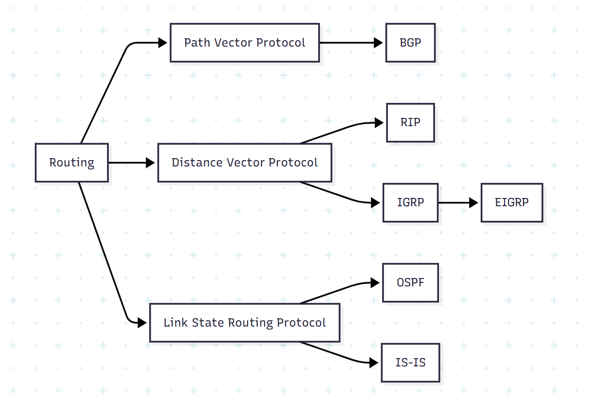
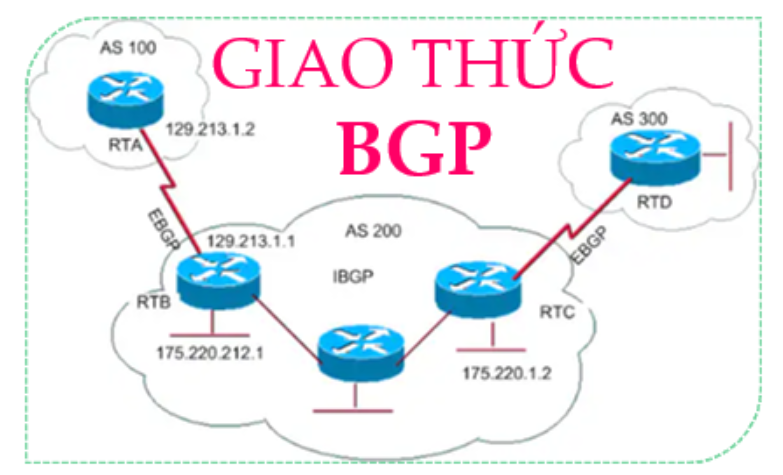
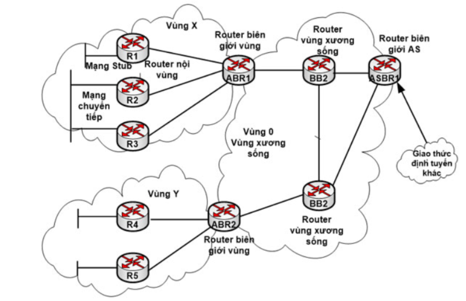
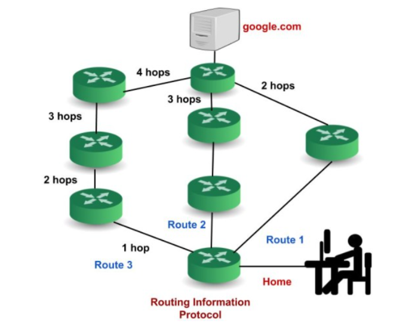

# ROUTING PROTOCOL

0
## BGP (Border Gateway Protocol)

### **Khái niệm BGP**

**BGP (Border Gateway Protocol)** một giao thức định hình hệ thống định tuyến của Internet. Nó là một trong những giao thức quan trọng nhất được sử dụng để trao đổi thông tin định tuyến giữa các hệ thống định tuyến (router) trên Internet.

Giao thức này chủ yếu được sử dụng giữa các nhà cung cấp dịch vụ Internet (ISP) và các tổ chức lớn có nhu cầu duy trì sự kết nối Internet độc lập. Nó cho phép các hệ thống định tuyến trao đổi thông tin về các mạng IP mà chúng có thể định tuyến, giúp xác định đường dẫn tối ưu để chuyển tiếp gói tin giữa các mạng này.

### **Cách thức hoạt động BGP**

Border Gateway Protocol hoạt động dựa trên nguyên tắc đồng thuận giữa các router để xác định đường dẫn tốt nhất cho việc chuyển tiếp dữ liệu giữa các mạng.

**Kết nối giữa BGP peers (đồng thuận):**

- Hai router chạy BGP được gọi là BGP peers.

- BGP peers kết nối với nhau thông qua các kết nối TCP (Transmission Control Protocol).

- Khi kết nối được thiết lập, BGP peers trao đổi thông điệp cấu hình và các bản tin định tuyến.

**Exchange BGP routes:**

- BGP peers trao đổi thông tin về các mạng IP mà chúng có thể định tuyến.

- Mỗi peer thông báo về các mạng mà nó biết đến và đường dẫn để đến các mạng đó.

- Thông điệp này chứa các thuộc tính của đường dẫn như AS_PATH (đường dẫn qua các Autonomous System), NEXT_HOP (địa chỉ IP của next-hop router), và các thuộc tính khác.

**Decision process:**

- Giao thức này sử dụng thuật toán quyết định để lựa chọn đường dẫn tốt nhất.

- Các yếu tố quyết định bao gồm độ dài của AS_PATH, các thuộc tính được ưu tiên, độ ưu tiên của địa chỉ next-hop, và các tiêu chí khác.

- Đường dẫn được chọn sẽ được lưu vào bảng định tuyến BGP.

**Cập nhật bảng routing:**

- Sau khi đường dẫn tốt nhất được xác định, nó sẽ được đưa vào bảng định tuyến của router.
- Router sử dụng thông tin trong bảng định tuyến để xác định cách chuyển tiếp gói tin giữa các mạng.

**Periodic updates và keepalive:**

- BGP peers thường xuyên trao đổi các thông điệp keepalive để duy trì kết nối.

- Thông điệp update được sử dụng để thông báo về sự thay đổi trong mạng, ví dụ như khi có một đường dẫn mới hoặc một đường dẫn cũ không còn khả dụng.

### **Đặc điểm của giao thức BGP (Border Gateway Protocol)**

- **Thiết lập liên kết (Peering):** Giao thức này sử dụng quá trình thiết lập liên kết (peering) giữa các router. Các router BGP thiết lập phiên làm việc với nhau để chia sẻ thông tin định tuyến.

- **Định tuyến giữa các Autonomous System (AS):** Giao thức này chủ yếu được sử dụng để định tuyến giữa các AS khác nhau trên Internet. Nó quảng bá thông tin định tuyến giữa các hệ thống tự lập.

- **Phương thức TCP kết nối:** Giao thức này sử dụng giao thức TCP (Transmission Control Protocol) để duy trì liên kết giữa các router. Giao thức này đảm bảo tin cậy và độ tin cậy trong truyền thông giữa các router.

- **Path Vector Protocol:** BGP là một giao thức đường đi vector (Path Vector Protocol), có nghĩa là nó truyền thông tin định tuyến cùng với thông tin về đường đi. Điều này giúp quyết định đường đi tốt nhất dựa trên các thuộc tính khác nhau.

- **Loop Prevention:** Giao thức này sử dụng cơ chế chống lặp (loop prevention) để tránh việc xuất hiện vòng lặp trong quá trình định tuyến. Điều này đảm bảo tính ổn định của hệ thống định tuyến.

- **Phương thức quảng bá độc lập:** Giao thức này có khả năng quảng bá độc lập, nghĩa là nó có thể chọn lọc và quảng bá chỉ một số lượng nhỏ các mạng thay vì quảng bá toàn bộ bảng định tuyến.

- **Tính linh hoạt và mở rộng:** BGP là một giao thức linh hoạt và mở rộng, có khả năng thích ứng với môi trường mạng lớn và phức tạp trên Internet.

- **Chú trọng vào chính sách định tuyến:** Giao thức này cho phép người quản trị mạng thiết lập chính sách định tuyến dựa trên các thuộc tính và tiêu chí khác nhau, giúp kiểm soát và tối ưu hóa đường đi mạng.

## OSPF (Open Shortest Path First)

### **Khái niệm OSPF**

OSPF (Open Shortest Path First) là một giao thức định tuyến nội bộ (Interior Gateway Protocol – IGP) thường được sử dụng trong mạng nội bộ của một tổ chức. OSPF tập trung vào việc định tuyến trong một Autonomous System và tích hợp các nguyên tắc của thuật toán Dijkstra để tìm đường đi ngắn nhất.

### **Cách thức hoạt động của OSPF**

- Bước 1: Chọn Router – ID

  - Router tự tạo: Router sẽ xem xét interface nào có địa chỉ IP cao nhất và lấy địa chỉ IP đó làm Router-ID.

  - Người dùng tự cấu hình: Quá trình tự động chọn Router-ID có thể không phù hợp với một số trường hợp, vì vậy người quản trị có thể tự cấu hình Router-ID.

- Bước 2: Thiết lập quan hệ láng giềng (neighbor): Giao thức OSPF sử dụng gói tin HELLO để tìm kiếm các router và thiết lập mối quan hệ láng giềng với chúng. Gói tin HELLO được gửi theo định kỳ, với tần suất mặc định là 10 giây một lần.

  - Gói tin HELLO chứa thông tin của router gửi gói tin, bao gồm: Router ID, Area ID, Priority, Link State Advertisement (LSA).

  - Khi một router nhận được gói tin HELLO từ một router khác, nó sẽ kiểm tra các thông tin trong gói tin. Nếu các thông tin này khớp với thông tin của router nhận, thì hai router sẽ thiết lập mối quan hệ láng giềng.

- Bước 3: Trao đổi LSDB

  - LSDB (Link State Database) là cơ sở dữ liệu trạng thái liên kết, chứa thông tin về tất cả các liên kết trong mạng OSPF. LSDB đóng vai trò như bản đồ mạng, giúp các router OSPF xác định đường đi ngắn nhất giữa các mạng.

  - LSDB của các router OSPF cùng vùng sẽ giống nhau. Các router OSPF cùng vùng sẽ trao đổi thông tin liên kết với nhau thông qua các gói tin Link State Advertisement (LSA).

  - Các LSA chứa thông tin sau: Router ID của router gửi LSA, Area ID của router gửi LSA, Link ID của liên kết, Metric của liên kết, Type của liên kết, TOS của liên kết

  - Khi một router OSPF nhận được gói tin LSA từ một router khác, nó sẽ cập nhật thông tin trong LSDB của mình.

- Bước 4: Giao thức OSPF sử dụng cost (Cost trên interface) thay cho Metric để đánh giá độ ưu tiên của một liên kết. Cost chỉ được tính khi một gói tin đi vào một cổng, và không được tính khi đi ra.

  - Cost của một liên kết được tính theo công thức sau: Cost = 108 / Bandwidth (đơn vị bps).

### **Các gói tin của OSPF**

- Hello: Gói tin Hello được sử dụng để thiết lập và duy trì mối quan hệ láng giềng giữa các bộ định tuyến OSPF.

- Database Description: Sau khi thiết lập mối quan hệ láng giềng, bộ định tuyến láng giềng sẽ gửi thông tin cơ sở dữ liệu về cấu trúc liên kết mạng đến hệ thống. Hệ thống sẽ sử dụng thông tin này để cập nhật hoặc sửa đổi cơ sở dữ liệu của mình.

- Link state request: Gói tin Link state request được sử dụng bởi bộ định tuyến để yêu cầu thông tin về một hoặc nhiều liên kết mạng. Ví dụ, bộ định tuyến 1 muốn biết thông tin về bộ định tuyến 2, vì vậy bộ định tuyến 1 gửi gói tin Link state request đến bộ định tuyến 2. Sau khi nhận được gói tin Link state request, bộ định tuyến 2 sẽ gửi gói tin Link state update chứa thông tin về các liên kết mạng của nó đến bộ định tuyến 1.

- Link-state update: Gói tin Link state update được sử dụng bởi bộ định tuyến để truyền phát thông tin về các liên kết mạng của nó. Bất kỳ bộ định tuyến nào muốn thông báo cho các bộ định tuyến khác về các liên kết của mình đều có thể sử dụng gói tin Link state update.

- Link state Acknowledgment: Xác nhận trạng thái liên kết là một cơ chế để đảm bảo rằng tất cả các bộ định tuyến trong mạng đều có cùng thông tin về trạng thái liên kết của nhau. Cơ chế này hoạt động bằng cách yêu cầu mỗi bộ định tuyến gửi xác nhận cho mỗi bản cập nhật trạng thái liên kết mà nó nhận được.

## RIP (Routing Information Protocol)

**RIP:** sử dụng “hop count” để tìm đường đi ngắn nhất từ một mạng đến mạng khác, trong đó “hop count” đếm số lượng thiết bị định tuyến mà một gói tin cần đi qua trên đường đi. Khi một gói tin chuyển từ một mạng sang mạng khác, điều này được gọi là “hop.”

### **Cách thức hoạt động của RIP**

- Router chạy RIP quảng bá toàn bộ bảng định tuyến của nó đến các router láng giềng mỗi 30 giây. Bản cập nhật định kỳ này giúp giữ cho các bảng định tuyến được đồng bộ hóa, tạo điều kiện chia sẻ thông tin định tuyến trên toàn mạng.

- RIP sử dụng hop count làm metric duy nhất để lựa chọn đường dẫn. Số lượng hop tối đa được phép cho một đường dẫn là 15, giúp ngăn ngừa vòng lặp định tuyến và giới hạn kích thước mạng.

- Split Horizon và Poison Reverse : Các cơ chế này ngăn chặn vòng lặp định tuyến bằng cách đảm bảo rằng bộ định tuyến không quảng bá tuyến đường trở lại bộ định tuyến mà nó đã học được.

- Triggered Updates: RIP có thể gửi các cập nhật kích hoạt khi có thay đổi tuyến đường, đảm bảo thông tin định tuyến hội tụ nhanh hơn.

- RIP v1: Chỉ hỗ trợ classful (không có subnet mask), không hỗ trợ VLSM. RIP v2: Hỗ trợ classless, VLSM, có tính năng xác thực. RIPng: Hỗ trợ IPv6.

### **Các trường trong RIP packet**

- Command (8 bits): Chỉ ra loại tin nhắn. Có hai loại chính: yêu cầu và phản hồi. Yêu cầu có thể yêu cầu thông tin định tuyến cụ thể hoặc đầy đủ. Phản hồi có thể được yêu cầu (để phản hồi yêu cầu) hoặc không được yêu cầu (được gửi định kỳ sau mỗi 30 giây hoặc khi có thay đổi trong bảng định tuyến).

- Version (8 bits): Chỉ định phiên bản RIP đang được sử dụng.

- Unused (16 bits): Dành riêng cho mục đích sử dụng sau này.

- Address Family Identifier (16 bits): Xác định họ địa chỉ (ví dụ: IP).

- Route Tag (16 bits): Cung cấp thông tin bổ sung về tuyến đường, thường được sử dụng trong RIP phiên bản 2.

- IP Address (32 bits): Địa chỉ IP của mạng đích.

- Subnet Mask (32 bits): Chỉ ra Subnet Mask cho địa chỉ IP đích.

- Next Hop (32 bits): Chỉ định địa chỉ IP của bộ định tuyến next hop.

- Metric (32 bits): Đại diện cho số lượng hop vào mạng đích, từ 1 đến
 16, trong đó 16 biểu thị một mạng không thể truy cập được.
