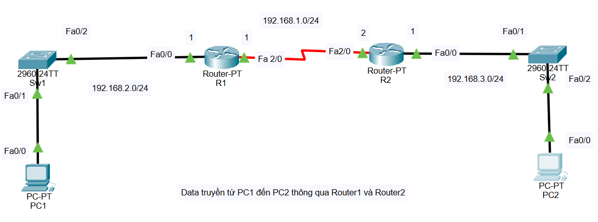
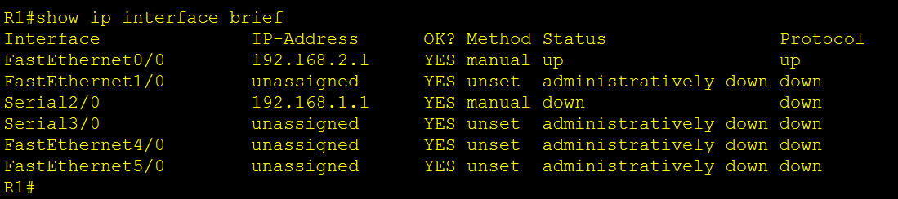
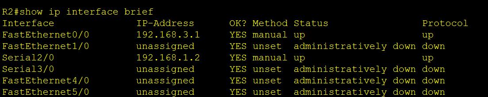
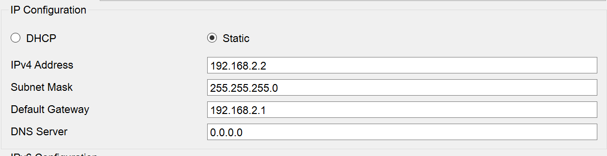
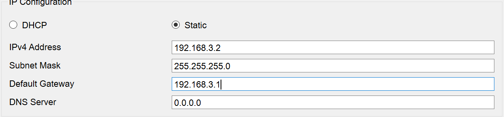
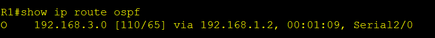
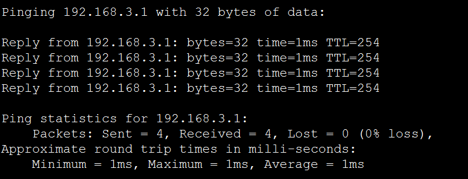

# CẤU HÌNH ROUTING

## Sơ đồ bài Lab



## Yêu cầu bài lab

Cấu hình Routing cho Router 1 và 2 sao cho data truyền từ PC 1 đến PC2 qua 2 con Router.

## Cấu hình bài Lab

### 1. Cấu hình IP trên Router

#### Trên Router 1

Đặt tên

```ruby
Router>enable
Router#configure terminal
Router(config)#hostname R1
R1(config)#
```

Cấu hình ip cho các cổng trên Router1

```ruby
R1(config)#interface serial 2/0
R1(config-if)#ip address 192.168.1.1 255.255.255.0
R1(config-if)#no shutdown
R1(config-if)#exit
R1(config)#interface fastEthernet 0/0
R1(config-if)#ip address 192.168.2.1 255.255.255.0
R1(config-if)#no shutdown
R1(config-if)#exit
```

Kiểm tra các ip đã cấu hình

```ruby
R1#show ip interface brief
```



#### Trên Router 2

Đặt tên

```ruby
Router>enable Router#configure terminal
Router(config)#hostname R2
R2(config)#
```

Cấu hình ip cho các cổng trên Router2

```ruby
R2(config)#interface serial 2/0
R2(config-if)#ip address 192.168.1.2 255.255.255.0
R2(config-if)#no shutdown
R2(config-if)#exit
R2(config)#interface fastEthernet 0/0
R2(config-if)#ip address 192.168.3.1 255.255.255.0
R2(config-if)#no shutdown
R2(config-if)#exit
```

Kiểm tra các ip đã cấu hình

```ruby
R2#show ip interface brief
```



### 2. Cấu hình IP trên PC

#### Trên PC1

IP Address : 192.168.2.2

Subnet Mask : 255.255.255.0

Default Gateway : 192.168.2.1



#### Trên PC2

IP Address : 192.168.3.2

Subnet Mask : 255.255.255.0

Default Gateway : 192.168.3.1



### 3. Cấu hình định tuyến đường đi

#### Định tuyến trên Router 1

```ruby
R1(config)#route ospf 10
R1(config-router)#network 192.168.1.0 0.0.0.255 area 0
R1(config-router)#network 192.168.2.0 0.0.0.255 area 0
R1(config-router)exit
```

Kiểm tra đường mạng

```ruby
R1#show ip route ospf
```



#### Định tuyến trên Router 2

```ruby
R2(config)#route ospf 10
R2(config-router)#network 192.168.3.0 0.0.0.255 area 0
R2(config-router)#network 192.168.1.0 0.0.0.255 area 0
R2(config-router)exit
```

Kiểm tra đường mạng

```ruby
R2#show ip route ospf
```

[R2](./lab_images/R2.png)

### 4. Gửi tập tin từ PC1 đến PC2

```ruby
C:>ping 192.168.3.2
```

=>PC1 đã có thể truyển Data đến PC2


