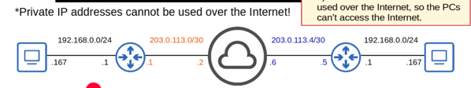
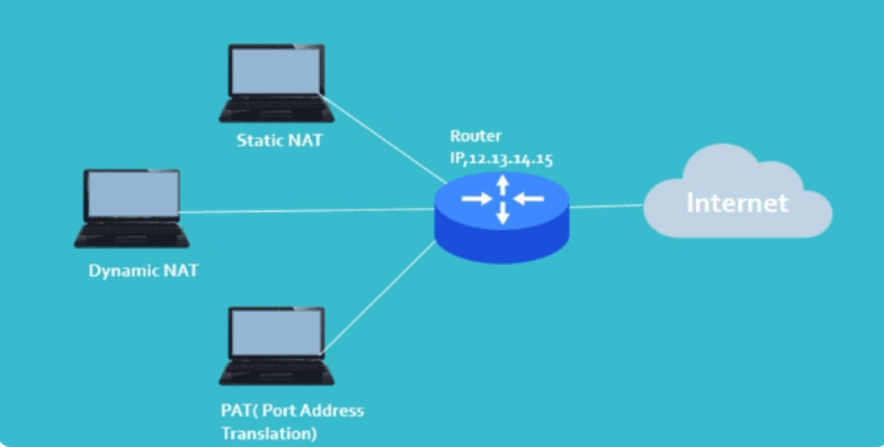

# TÌM HIỂU VỀ NAT

## SƠ QUA VỀ PRIVATE IPv4

Địa chỉ IP Public không cung cấp đủ địa chỉ cho tất cả các thiết bị cần địa chỉ IP trên thế giới hiện nay

Giải pháp lâu dài đó là chuyển địa chỉ từ IPv4 sang IPv6 nhưng đổi tất cả các thiết bị từ IPv4 =>IPv6 là 1 công việc rất phức tạp cho nên ta cần 1 giải pháp tạm thời đó là:

1. CIDR(Classes Inter-Domain Routing): Quên đi các lớp Ip-Domain cứng nhắc mà thay vào đó sử dụng độ dài tiền tố theo bất cứ cách nào mà mình thích mà không cần quan tâm đến lớp
2. Địa chỉ Private IPv4
3. NAT

RFC 1918 quy định các dải địa chỉ IPv4 sau đây là dải địa chỉ riêng tư:

1. 10.x.x.x/8
2. 172.16.x.x => 172.31.x.x/12
3. 192.168.x.x/16

Bởi vì các ISP chặn lưu lượng truy cập hoặc đi từ các địa chỉ IP Private cho nên ta phải dùng 1 cách khác để có thể truy cập Internet từ PC cá nhân của chúng ta trong mạng LAN của nhà tới Internet bằng cách dùng **kĩ thuật NAT**

## I. NAT LÀ GÌ ?



**Khái niệm:** NAT viết tắt của Network Address Translation, là một kỹ thuật chuyển đổi giữa IP Private và IP Public. Quá trình chuyển đổi này hỗ trợ các thiết bị trong mạng cục bộ truy cập dễ dàng vào Internet.

**Một vài chức năng chính:**

- **Hỗ trợ kết nối từ mạng LAN ra ngoài Internet:** Khi một thiết bị trong mạng nội bộ muốn truy cập internet, NAT sẽ ánh xạ địa chỉ IP Private thành địa chỉ IP Public. Điều này cho phép các thiết bị trong mạng nội bộ có thể duy trì kết nối với các dịch vụ và hệ thống trên internet.

- **Hỗ trợ kết nối từ ngoài Internet vào mạng LAN:** Trong quá trình chuyển đổi gói tin từ mạng Internet ngược lại NAT, NAT cần thay đổi dạng IP đích (IP Public) sang dạng IP Private và sau đó chuyển đi.

- **Tăng cường bảo mật:** NAT che giấu địa chỉ IP Private của các thiết bị trong mạng nội bộ khỏi internet, giúp bảo vệ mạng khỏi các cuộc tấn công bên ngoài. Thiết bị từ ngoài internet không thể kết nối trực tiếp với các thiết bị có IP Private mà không qua NAT.

**Một số thuật ngữ dùng trong NAT:**

- **Inside Local:** Địa chỉ IP ứng với mỗi thiết bị nằm trong mạng nội bộ nhưng không cung cấp bởi Network Information Center, thường là IP Private.

- **Inside Global:** Kiểu địa chỉ IP đăng ký tại Network Information Center. Đây là địa chỉ phù hợp để thay thế cho IP Inside local.

- **Outside Global:** Địa chỉ IP ứng với thiết bị hoạt động tại hệ thống mạng bên ngoài, hoàn toàn hợp lệ với mạng internet.

## II. PHÂN LOẠI NAT



### 1. STATIC NAT

Được dùng để chuyển đổi một địa chỉ IP này sang một địa chỉ IP khác. Thông qua cách cố định địa chỉ IP cục bộ sang địa chỉ IP công khai (Public), quá trình này được thiết lập và cài đặt thủ công và tương ững mỗi địa chỉ IPv4 Private ta được 1 địa chỉ IPv4 Public.

**Ưu điểm:** Thích hợp cho các thiết bị trong mạng nội bộ cần truy cập từ bên ngoài với địa chỉ IP công cộng cố định, chẳng hạn như các máy chủ web hoặc máy chủ email.

**Nhược điểm:** Không tiết kiệm địa chỉ IP công cộng vì mỗi thiết bị yêu cầu một địa chỉ IP công cộng riêng biệt.

**Cách cấu hình Stactic NAT như sau:**

-Thiết lập mối quan hệ chuyển đổi giữa địa chỉ IP cục bộ và IP Public ở ngoài:

```ruby
Router (config) # ip nat inside source static [local ip] [global ip]
```

-Xác định các cổng kết nối với mạng cục bộ:

```ruby
Router (config-if) # ip nat inside
```

-Xác định cổng kết nối với mạng bên ngoài với lệnh sau:

```ruby
Router (config-if) # ip nat outside
```

Ví dụ:

```ruby
Router (config) # ip nat inside source static 192.168.1.100 202.1.1.10

Router (config) # interface fa0/0

Router (config-if) # ip nat inside

Router (config) # interface s0/0/0

Router (config-if) # ip nat outside
```

### 2. DYNAMIC NAT

Ánh xạ một địa chỉ IP nội bộ với một địa chỉ IP công cộng từ một nhóm (pool) các địa chỉ có sẵn. Địa chỉ công cộng này không cố định mà được cấp phát động cho thiết bị nào có nhu cầu kết nối ra ngoài trước.

**Ưu điểm:** Tiết kiệm địa chỉ IP công cộng hơn NAT tĩnh vì không cần ánh xạ cố định.

**Nhược điểm:** Địa chỉ IP công cộng thay đổi thường xuyên, gây khó khăn cho việc thiết lập các kết nối từ ngoài vào mạng nội bộ.
Hạn chế bởi số lượng địa chỉ IP công cộng trong pool.

**Cấu hình Dynamic NAT:**

- Xác định địa chỉ IP Public:

```ruby
Router (config) # ip nat pool [name start ip] [name end ip] netmask [netmask]/prefix-lenght [prefix-lenght]
```

- Thiết lập ACL để tạo danh sách các địa chỉ Private được phép chuyển đổi IP:

```ruby
Router (config) # access-list [access-list-number-permit] source [source-wildcard]
```

- Thiết lập mối quan hệ giữa địa chỉ nguồn và đại chỉ IP bên ngoài:

```ruby
Router (config) # ip nat inside source list <acl-number> pool <name>
```

- Xác định cổng kết nối với mạng cục bộ:

```ruby
Router (config-if) # ip nat inside
```

- Xác định cổng kết nối với mạng bên ngoài:

```ruby
Router (config-if) # ip nat outside
```

Ví dụ cho mô hình trên:

```ruby
Router (config) # ip nat pool abc 202.1.1.177 202.1.1.185 netmask 255.255.255.0

Router (config) # access-list 1 permit 192.168.1.0  0.0.0.255

Router (config) # ip nat inside source list 1 pool abc

Router (config) # interface fa0/0

Router (config-if) # ip nat inside

Router (config) # interface s0/0/0

Router (config-if) # ip nat outside
```

### 3. NAT Overload

Hay còn gọi là PAT, cho phép nhiều thiết bị trong mạng nội bộ chia sẻ một địa chỉ IP công cộng duy nhất. Thay vì ánh xạ 1:1, PAT sử dụng các cổng (port) để phân biệt giữa các kết nối từ các thiết bị khác nhau trong mạng nội bộ.

**Ưu điểm:**

- Tiết kiệm tối đa địa chỉ IP công cộng vì nhiều thiết bị có thể sử dụng chung một địa chỉ IP công cộng.

- Là phương pháp phổ biến nhất hiện nay cho các mạng gia đình và văn phòng nhỏ.

**Nhược điểm:** Có thể dẫn đến việc tắc nghẽn hoặc quá tải khi có quá nhiều kết nối từ một địa chỉ IP công cộng.

NAT Overload là một phiên bản mở rộng của NAT động, trong đó ánh xạ không chỉ dựa trên địa chỉ IP mà còn dựa trên các cổng để phân biệt nhiều kết nối.

**Cấu hình NAT Overload:**

- Xác định địa chỉ IP mạng nội bộ cần ánh xạ bên ngoài:

```ruby
Router (config) # access-list <ACL-number> permit <source> <wildcard>
```

- Cấu hình để chuyển IP đến cổng kết nối bên ngoài:

```ruby
Router (config) # ip nat inside source list <ACL-number> interface <interface> overload
```

Xác định nết nối với mạng nội bộ:

```ruby
Router (config-if) # ip nat inside
```

Xác định các cổng kết nối với mạng bên ngoài:

```ruby
Router (config-if) # ip nat outside
```

Ví dụ:

```ruby
Router (config) # access-list <ACL-number> permit <source> <wildcard>

Router (config) # ip nat inside source list <ACL-number> interface <interface> overload

Router (config-if) # ip nat inside

Router (config-if) # ip nat outside
```

## III. CƠ CHẾ HOẠT ĐỘNG CỦA NAT

NAT hoạt động dựa trên việc thay đổi địa chỉ IP và cổng của các gói tin khi chúng đi qua router. Nó giúp che giấu các địa chỉ IP nội bộ với bên ngoài, đồng thời tiết kiệm địa chỉ IP công cộng bằng cách cho phép nhiều thiết bị sử dụng chung một địa chỉ IP công cộng.

Quá trình này thường diễn ra tại router hoặc firewall để quản lý kết nối giữa mạng nội bộ và internet, cụ thể như sau:

**Bước 1 - Gửi gói tin từ mạng nội bộ ra ngoài:**

- Khi một thiết bị trong mạng nội bộ muốn truy cập internet, nó sẽ gửi một gói tin đến router NAT.

- Gói tin này chứa địa chỉ IP nguồn là địa chỉ IP riêng của thiết bị, và địa chỉ IP đích là địa chỉ IP công cộng của máy chủ mà thiết bị muốn kết nối.

**Bước 2 - Thay đổi địa chỉ IP nguồn:**

- Router NAT nhận gói tin và thay đổi địa chỉ IP nguồn từ địa chỉ IP riêng thành địa chỉ IP công cộng của router (hoặc một địa chỉ IP công cộng được ánh xạ).

- Đôi khi, NAT cũng thay đổi cả cổng nguồn của gói tin để đảm bảo sự phân biệt giữa các kết nối khác nhau sử dụng chung một địa chỉ IP public. Đây là quá trình Port Address Translation (PAT).

- Sau đó, router gửi gói tin ra ngoài internet với địa chỉ IP công cộng mới.

**Bước 3 - Lưu bảng NAT:**

- Router NAT sẽ lưu thông tin ánh xạ giữa địa chỉ IP và cổng nguồn ban đầu với địa chỉ IP và cổng nguồn mới trong bảng NAT.

- Bảng này giúp router biết cách chuyển tiếp gói tin phản hồi từ internet về đúng thiết bị trong mạng nội bộ.

**Bước 4 - Nhận gói tin phản hồi:**

- Khi máy chủ bên ngoài phản hồi, gói tin sẽ được gửi về địa chỉ IP công cộng của router NAT.

- Router NAT kiểm tra bảng NAT để tìm ánh xạ phù hợp giữa địa chỉ IP công cộng và địa chỉ IP riêng ban đầu.

**Bước 5 - Chuyển đổi lại địa chỉ IP:**

- Router NAT thay đổi địa chỉ IP đích từ địa chỉ IP công cộng trở lại địa chỉ IP riêng của thiết bị trong mạng nội bộ.

- Gói tin sau đó được gửi đến thiết bị ban đầu trong mạng nội bộ.

**Bước 6 - Kết thúc phiên:**

- Khi phiên kết nối kết thúc, ánh xạ trong bảng NAT sẽ được xóa hoặc thời gian sử dụng

## IV. ĐẶC ĐIỂM KĨ THUẬT NAT

### **Ưu điểm**

- **Tiết kiệm địa chỉ IP công cộng:** Network Address Translation cho phép nhiều thiết bị trong mạng nội bộ sử dụng chung một hoặc một số địa chỉ IP công cộng, giúp giảm nhu cầu tiêu tốn địa chỉ IP công cộng, đặc biệt khi số lượng IPv4 bị giới hạn.

- **Tăng cường bảo mật mạng nội bộ:** Network Address Translation che giấu địa chỉ IP nội bộ khỏi internet, làm cho các thiết bị bên ngoài không thể xác định hoặc truy cập trực tiếp vào các thiết bị bên trong mạng nội bộ. Điều này giúp bảo vệ mạng nội bộ khỏi các cuộc tấn công từ bên ngoài.

- **Linh hoạt trong việc đổi địa chỉ IP:** NAT cho phép thay đổi cấu trúc địa chỉ IP bên trong mạng nội bộ mà không cần thông báo hoặc thay đổi cấu hình của các thiết bị bên ngoài.

- **Hỗ trợ nhiều thiết bị cùng truy cập internet:** Với NAT Overload (PAT), nhiều thiết bị trong mạng nội bộ có thể chia sẻ một địa chỉ IP công cộng duy nhất, tạo điều kiện cho việc truy cập internet mà không cần nhiều địa chỉ IP công cộng.

- **Giảm chi phí ISP:** Việc chỉ cần một vài địa chỉ IP công cộng thay vì phải mua nhiều địa chỉ từ nhà cung cấp dịch vụ (ISP) giúp tiết kiệm chi phí.

### **Nhược điểm**

- **Giảm hiệu suất kết nối:** Quá trình chuyển đổi địa chỉ IP và cổng qua NAT có thể tạo thêm độ trễ (latency) và làm giảm hiệu suất kết nối mạng, đặc biệt là khi có quá nhiều thiết bị chia sẻ một địa chỉ IP công cộng.

- **Khó khăn trong việc thiết lập kết nối từ ngoài vào mạng nội bộ:** Các dịch vụ yêu cầu kết nối từ internet vào thiết bị bên trong mạng nội bộ (ví dụ: máy chủ web hoặc máy chủ trò chơi) có thể gặp khó khăn trong việc cấu hình và hoạt động do NAT không cho phép truy cập trực tiếp.

- **Vấn đề với một số giao thức:** Một số giao thức mạng, như SIP (Session Initiation Protocol) và IPSec, có thể gặp khó khăn trong việc hoạt động qua Network Address Translation vì các vấn đề liên quan đến việc thay đổi địa chỉ và cổng.

- **Tăng độ phức tạp trong cấu hình:** Để các dịch vụ yêu cầu truy cập từ bên ngoài hoạt động chính xác, cần cấu hình cẩn thận NAT tĩnh, NAT động hoặc Port Forwarding, điều này có thể phức tạp đối với người dùng không quen thuộc.

- **Không tương thích với IPv6:** Network Address Translation chủ yếu được sử dụng cho địa chỉ IPv4, trong khi IPv6 có thể không cần đến Network Address Translation do có số lượng địa chỉ IP lớn hơn. Điều này có thể làm cho NAT trở nên kém cần thiết trong các mạng sử dụng IPv6.

## V. SO SÁNH GIỮA SNAT VÀ DNAT

|                         | **SNAT** (Source NAT)                                                                                                                        | **DNAT** (Destination NAT)                                                                                                                                                                                                              |
| ----------------------- | -------------------------------------------------------------------------------------------------------------------------------------------- | --------------------------------------------------------------------------------------------------------------------------------------------------------------------------------------------------------------------------------------- |
| **Thuật ngữ**           | SNAT đổi địa chỉ IP của nguồn kết nối thành công cộng. Ngoài ra có thể đổi cổng nguồn trong TCP/UDP. Thường được dùng bởi người dùng nội bộ. | DNAT đổi địa chỉ đích (destination) thành địa chỉ IP bên trong. Có thể thay đổi cổng đích trong TCP/UDP. Thường sử dụng để ánh xạ dịch vụ cho các gói đến địa chỉ/cổng công cộng (public) thành địa chỉ/cổng IP private bên trong mạng. |
| **Trường hợp sử dụng**  | Khi một client bên trong mạng LAN hay sau firewall muốn sử dụng internet.                                                                    | Khi một website được lưu trữ bên trong trung tâm dữ liệu và firewall cần cho phép người dùng ngoài (public) kết nối đến website đó qua mạng.                                                                                            |
| **Thay đổi về địa chỉ** | SNAT thay đổi địa chỉ nguồn của gói dữ liệu khi bị NAT.                                                                                      | DNAT thay đổi địa chỉ đích của gói dữ liệu qua Router.                                                                                                                                                                                  |
| **Thứ tự hoạt động**    | Sau khi quyết định định tuyến được thực hiện.                                                                                                | Trước khi xác định quyết định định tuyến.                                                                                                                                                                                               |
| **Luồng giao tiếp**     | Xảy ra khi bên trong mạng được bảo mật bắt đầu giao tiếp với bên ngoài.                                                                      | Xảy ra khi mạng không an toàn bên ngoài (public network) muốn giao tiếp với bên trong (private network).                                                                                                                                |
| **Đơn/đa máy chủ**      | SNAT cho phép nhiều máy chủ bên trong mạng truy cập vào bất kỳ máy chủ nào bên ngoài.                                                        | DNAT cho phép một máy chủ bên ngoài truy cập vào một hoặc một nhóm máy chủ bên trong.                                                                                                                                                   |
