# WIRE SHARK

## I. WIRESHARK LÀ GÌ ?

### 1. Khái Niệm

- WireShark là ứng dụng ví như **Packet Analyzer**  
->  Là công cụ **Bắt(Capture)** , giải mã và phân tích gói mạng (không phải tool hack, tool sniff mật khẩu)

### 2. Nó nằm ở vị trí nào trong mạng ?

- **WireShark** không nằm trong luồng giao tiếp.
- Nó chỉ **đứng bên lề và nhìn** card mạng ở **Promiscuous Mode** và nhận mọi frame đi qua **Interface**.

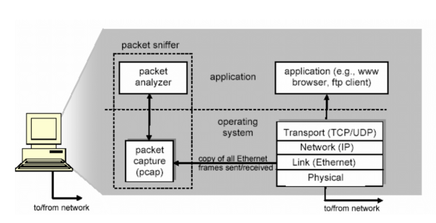

### 3. WhiteShark có công dụng gì ?

- Debug:

  - Web chậm
  - DB time out
  - API fail

- Solve Incident:

  - DDoS
  - Port Scan
  - Strange traffic

- Build Structure:

  - Xem LB có chia traffic không
  - Replica DB có nhận Query

### 4. WhiteShark làm được gì ?

- ***WhiteShark làm được**:

  - Cung cấp giao diện GUI cho OS
  - Bắt Packet layer `2` → `7`
  - **Decode** hàng trăm Protocol
  - Theo dõi flow TCP
  - Phân tích lỗi mạng
  - Debug `DHCP`, `DNS`, `TCP`, `TLS`

- **WhiteShark không làm được**:

  - Không giải mã HTTPS nếu không có key.
  - Không bắt được traffic nơi nó không nghe được
  - Không thay đổi Packet

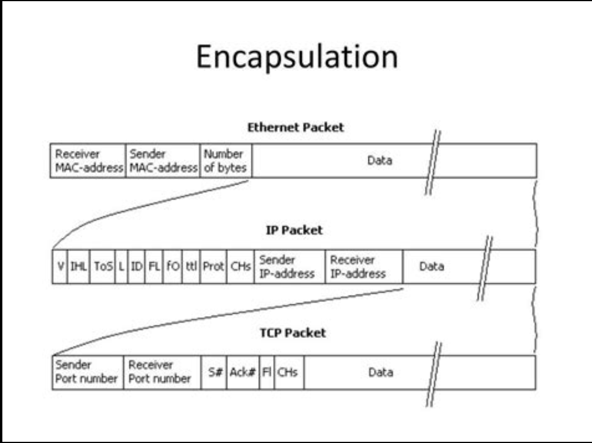

## II. HOW TO USE WIRE SHARK?

### 1. Tải & Cài đặt phần mềm và ứng dụng

`Bước 1`: Truy cập trang web chính thức của WireShark tại địa chỉ [này](https://www.wireshark.org/)

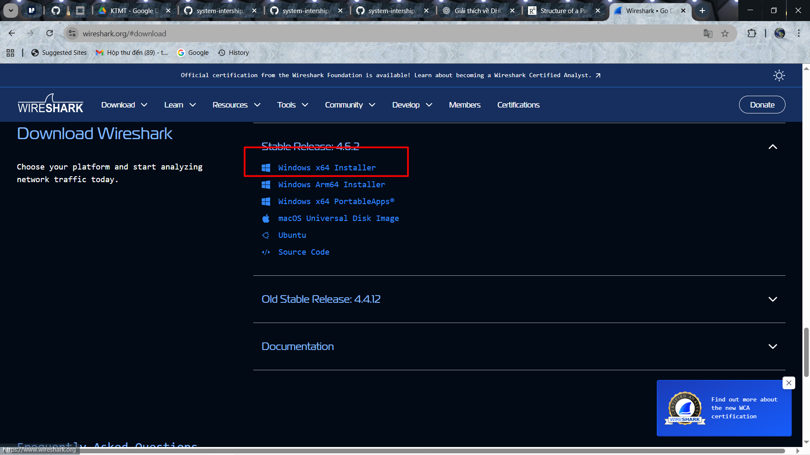

`Bước 2`: Trong mục `Downloads`, chọn phiên bản phù hợp với hệ điều hành máy tính của bạn (32bits or 64 bits). Nhấp vào liên kết để tải về gối cài đặt `.exe` của WireShark.

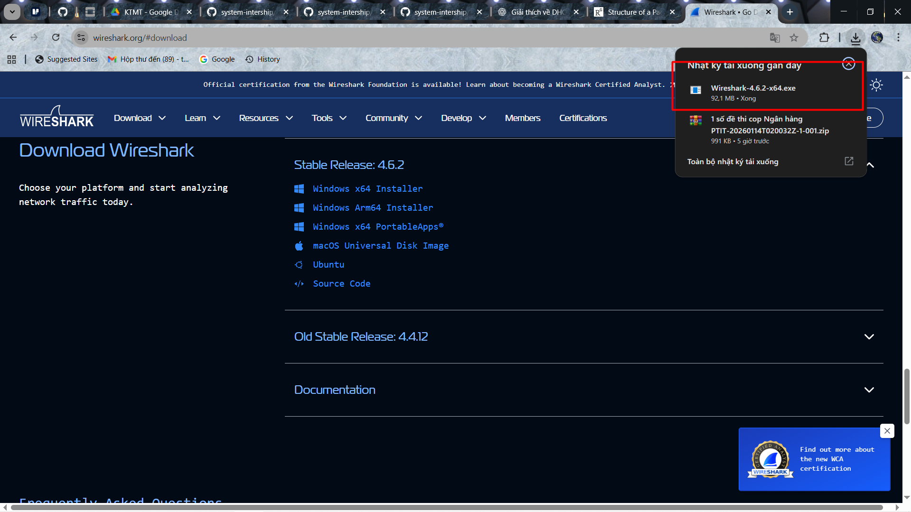

`Bước 3`: Sau khi download hoàn thành, bạn khởi chạy file install và tiếp tục làm theo hướng dẫn trên để hoàn thành cài đặt.

### 2. Cách sử dụng WireShark

Kích đúp vào 1 giao diện nào đó để xem chi tiết lưu lượng các gói tin trên giao diện đó.

- **Ví dụ**: ta xem lưu lượng trên giao diện `Wifi`:

  - Biểu tượng số `2` để ta bắt gói tin trên các giao diện ta đã chọn

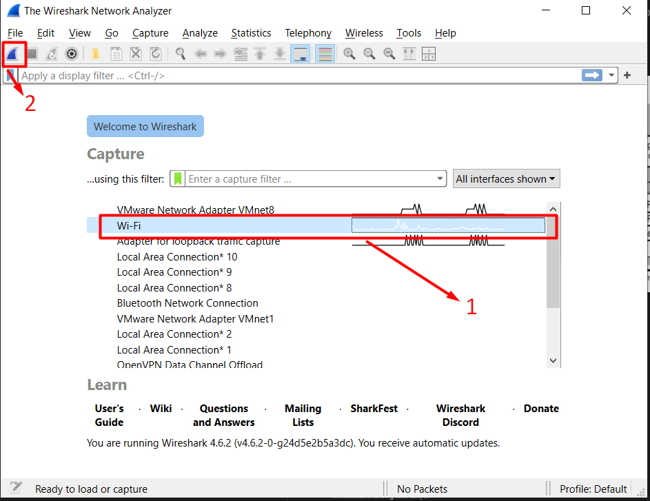

- Sau đó, lưu lượng gói tin qua giao diện `Wifi` sec được hiển thị lên như sau:

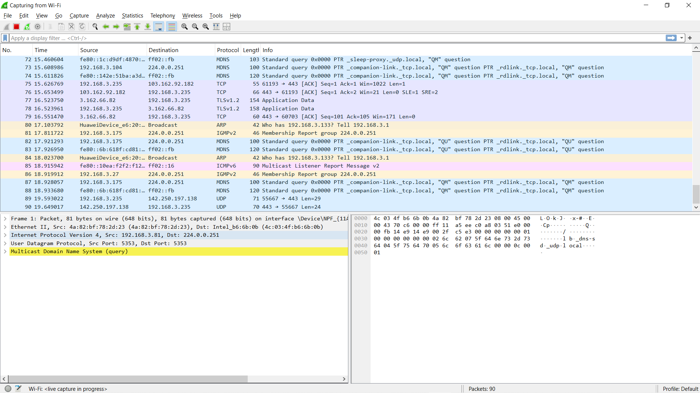

=> Ta thấy giao diện WireShark được chia làm **3 phần chính** :

- **Packet list**: Hiển thị các gói tin bắt được trên 1 card mạng, Ở phần này mỗi gói tin là 1 dòng. Các gói tin được đánh số theo thứ tự

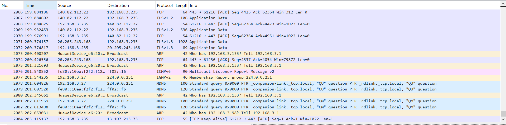

- **Packet details**: Hiển thị thông tin chi tiết của 1 gói tin được chọn:

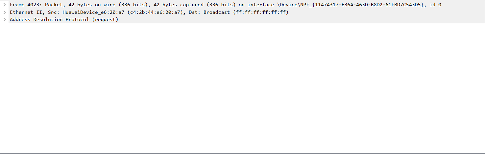

- **Packet bytes**: Hiện thị dữ liệu thô của gói tin dưới dạng hex hoặc ASCII, giúp xem chi tiết nội dung thực tế, tìm kiếm thông tin nhạy cảm như (mật khẩu) trong các giao thức không mã hóa như (HTTP)

  - **Ví dụ** trong 1 gói tin HTTP response:  
  -> Ta có thể thấy thông tin về status trả về: `200`, các header, và dữ liệu trả về `Hello`

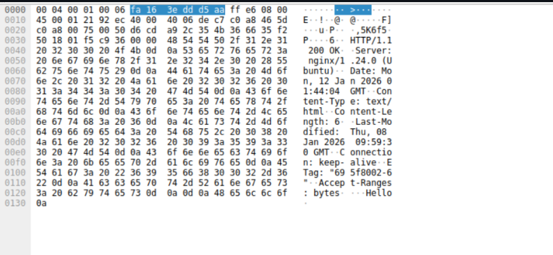

- Ngoài ra, ta còn có thể lưu lại lưu lượng hiện tại bằng cách nhập nút đỏ trên thanh công cụ:

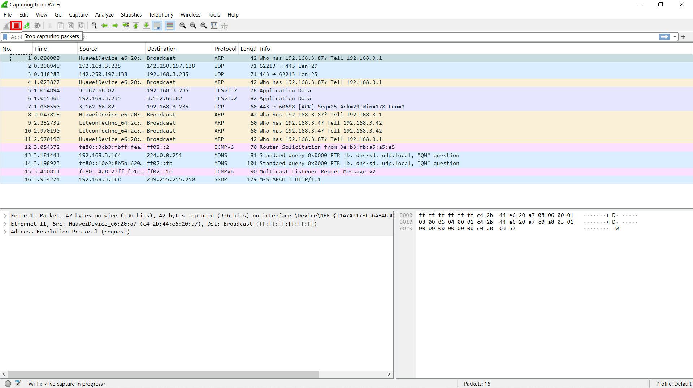

- Sau đó để lưu, Ta chọn vào `file` -> `save`. Lưu lượng những gói tin này sẽ lưu dưới dạng file `.pcap`:

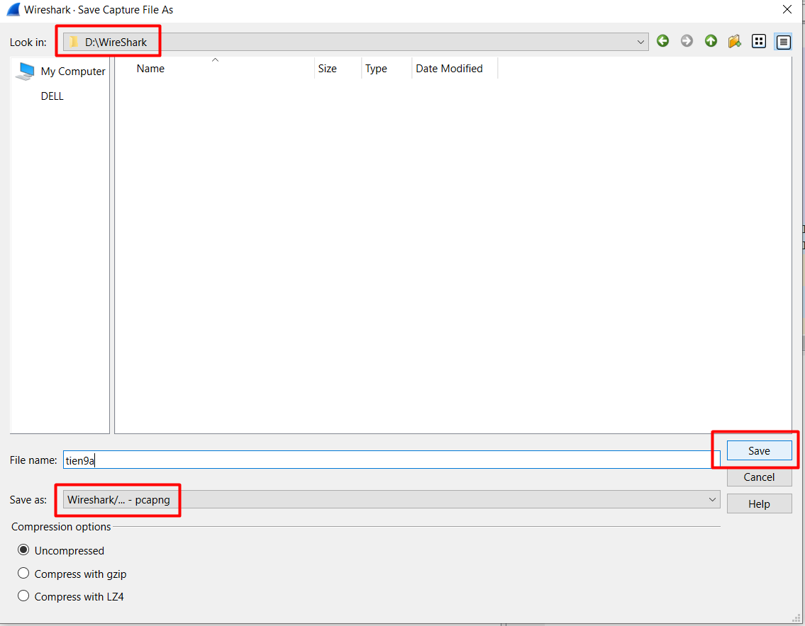

- Thử mở lại file `tien9a.pcap` ta vừa lưu:

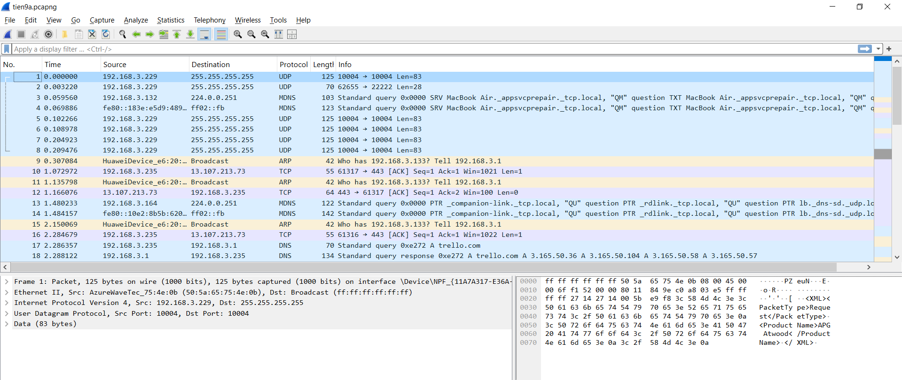

### 3. Ý nghĩa màu sắc các gói tin trong WireShark

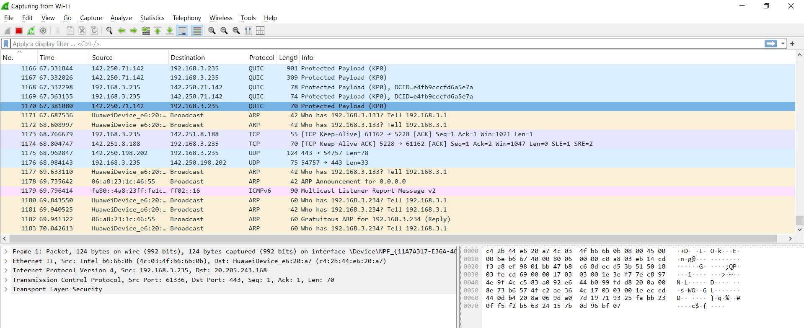

- Để xem ý nghĩa màu sắc các gói tin trong WireShark ta làm như sau: Chọn `View` -> `Colouring Rules`

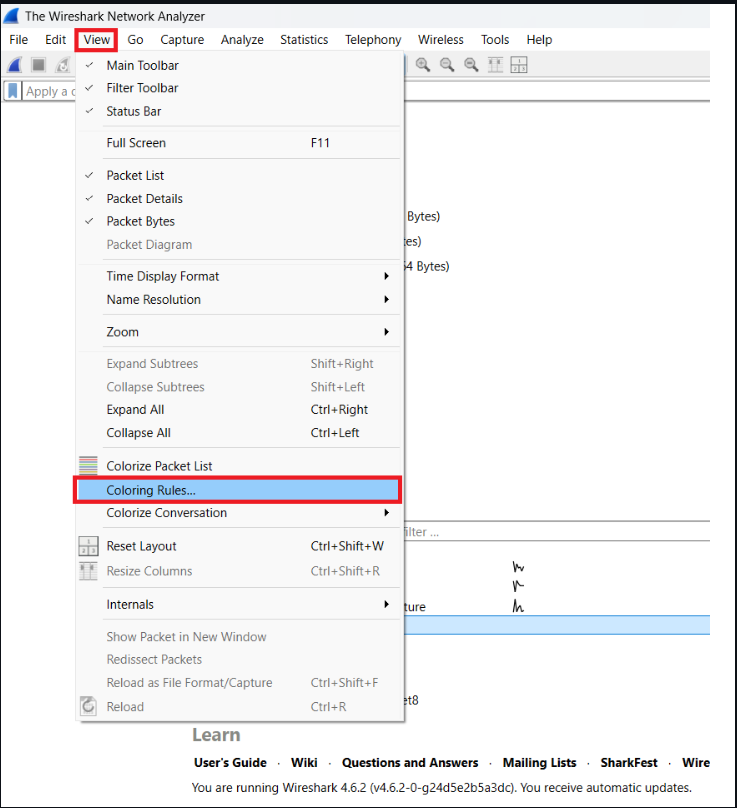

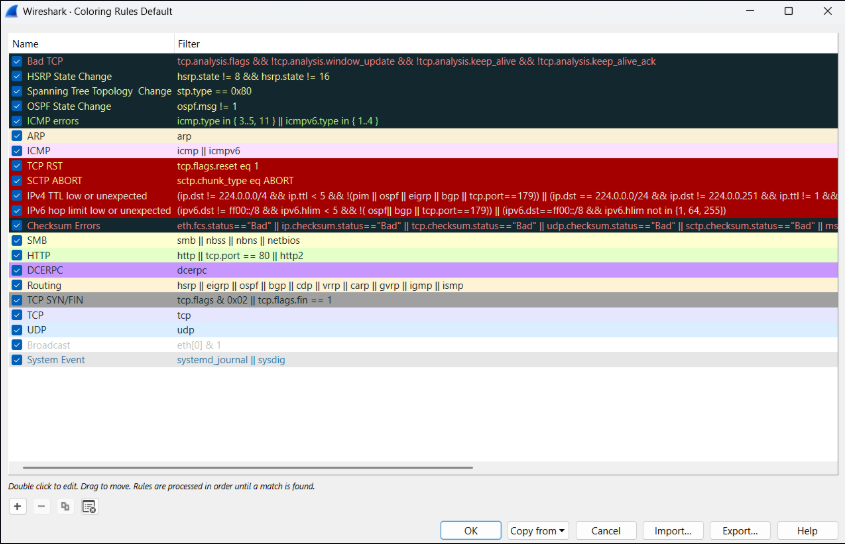

**Trong đó**:

- **`TCP RST` / `SCTP ABORT` - Nền đỏ chữ vàng**

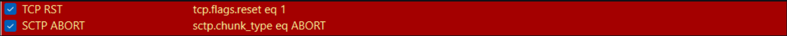

- **`Bad TCP` - Nền đỏ chữ cam**

  - `tcp.analysis.flags`: cờ này được bật khi gói TCP thuộc nhóm bất thường

  - `!tcp.analysis.window_update`: không phải là window update

  - `!tcp.analysis.keep_alive`: Không phải là tcp keep alive

  - `!tcp.analysis.keep_alive_ack`: không phải là các gói trả lời cho tcp keep alive

| Tên nhóm bất thường | Ý nghĩa                                                         |
|---------------------|-----------------------------------------------------------------|
| Retransmission      | Gửi lại một segment TCP do không nhận được ACK hoặc bị timeout  |
| Out of order        | Segment TCP đến không đúng thứ tự so với sequence number        |
| Zero Window         | Server hết buffer nhận, yêu cầu bên gửi tạm dừng truyền dữ liệu |

-> **Tóm lại**: Chỉ tô màu những gói tin TCP mà WireShark đánh giá là có vấn đề nhưng `KHÔNG` tô: `Window update`, `keep-alive`, `ACK` của keep alive

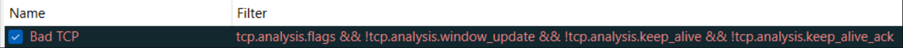

- **`ICMP errors` - Nền đen, chữ xanh**

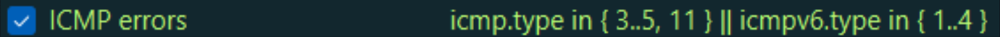

- **`TTL/hop limit thấp` - Nền đỏ, chữ trắng**

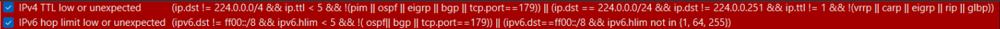

- **`ARP` - Nền màu da nhạt, chữ đen**

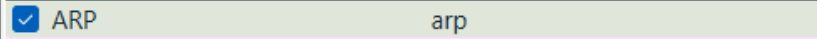

- **`Routing` - Nền màu da đậm, chữ đen**

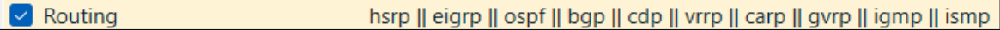

- **`ICMP` - Nền hồng nhạt, chữ đen**

- **`HTTP` - Nền xanh lá nhạt, chữ đen**

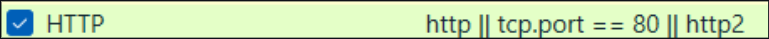

- **`TCP` - Nền tím nhạt, chữ đen**

- **`UDP` - Nền xanh dương nhạt, chữ đen**

- **`Broadcast` - Không màu**

- **`TCP SYN`/`FIN` - Nền xám, chữ đen**

### 4. Mẹo sử dụng Filter (Ctrl+ F) để lọc gói tin

#### Chỉ bắt các gói tin có IP trùng khớp

- Bắt gói tin có Source IP là `192.168.3.86`

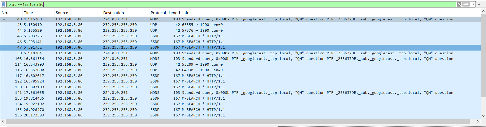

- Bắt gói tin có Dest Ip là `192.168.3.235`

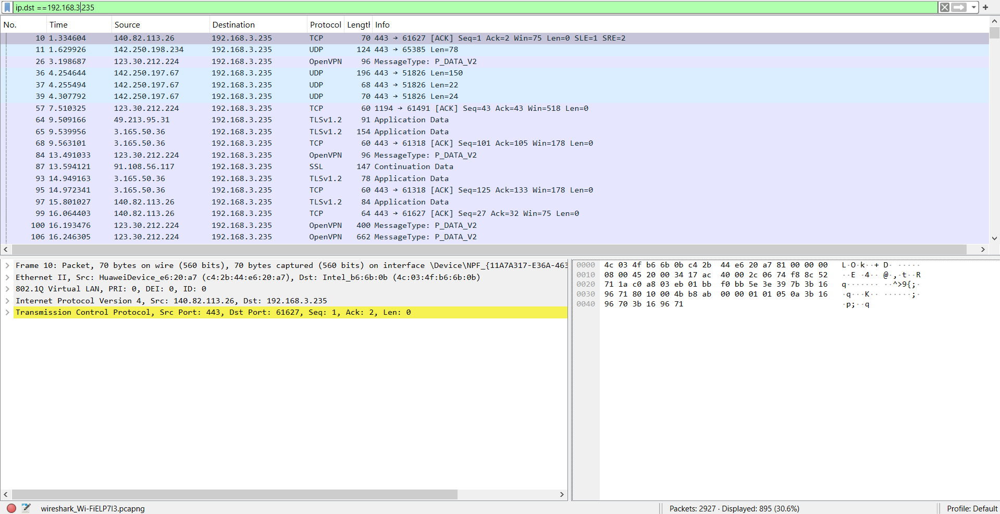

- Bắt các gói tin có cả Source IP là `192.168.3.235` và Dest ip là `123.30.212.224`

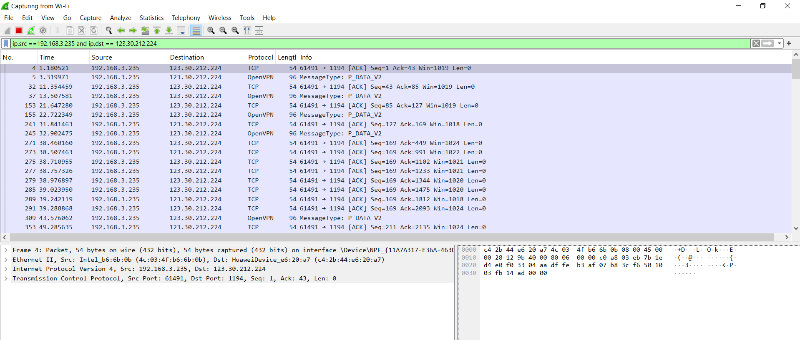

#### Chỉ bắt các gói tin có IP khác với 1 IP nào đó

- Bắt các gói tin có source ip khác ip `192.168.3.235`

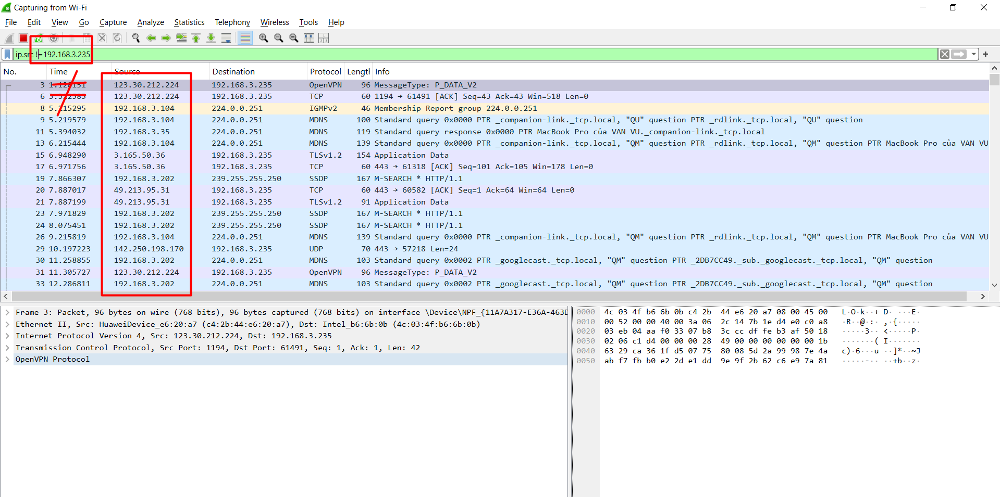

#### Chỉ bắt các gói có port hoặc giao thức trùng khớp

- Bắt các gói tin có TCP Port = `80`

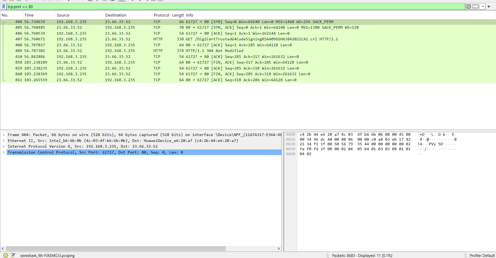

- Bắt các gói tin dùng `SSH`

- Bắt các gói tin có `tcp.srcport == 80`

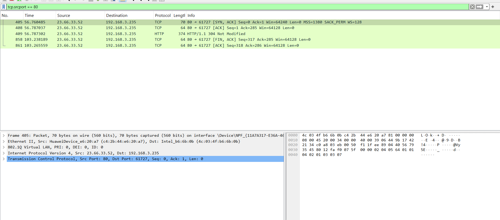

- Bắt các gói tin có `tcp.dstport == 80`

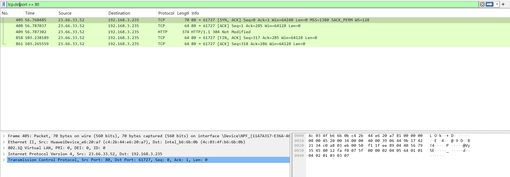
