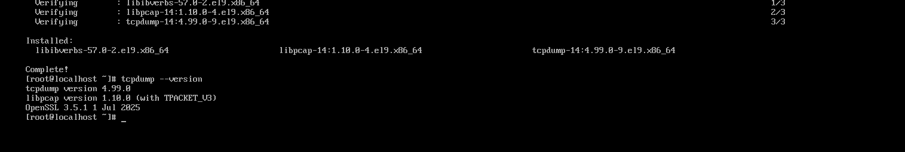
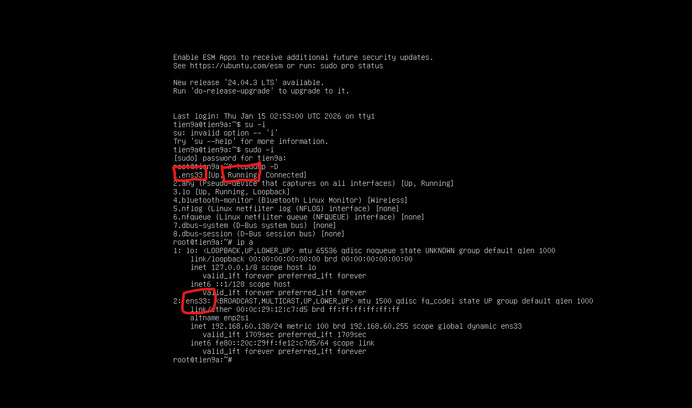
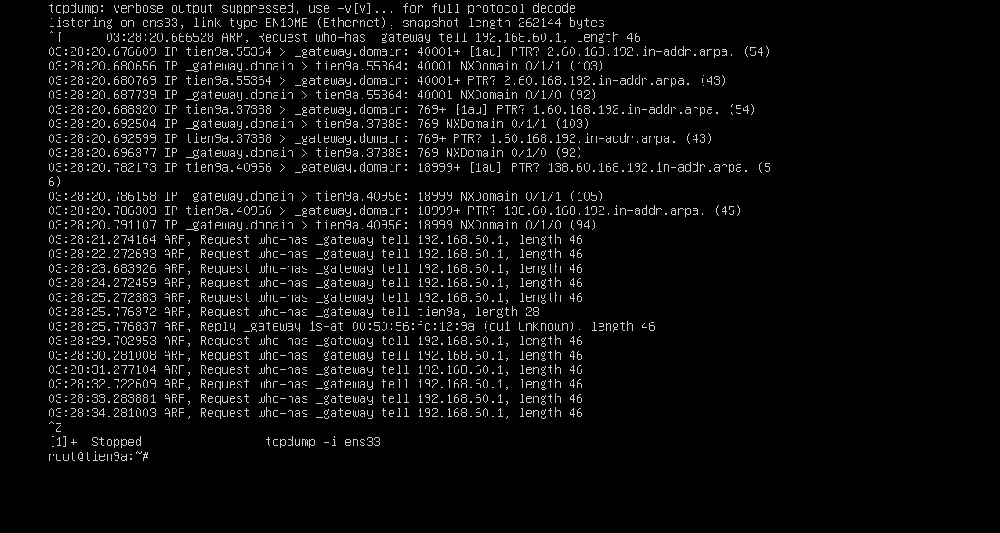
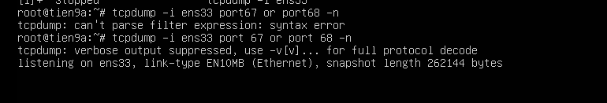
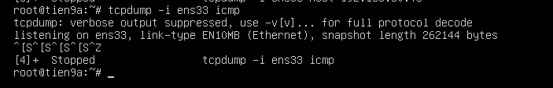

# TCP DUMP

## I. TỔNG QUAN TCP DUMP

### 1. TCPDump là gì?

- **TCPdump** là công cụ **packet analyzer** (phân tích gói tin) trên mạng dựa vào CommandLine (CLI). Nó là 1 trong những công cụ mạnh mẽ và phổ biến nhất và ghi lại lưu lượng mạng trên các hệ thống giống UNIX (Linux,MACOS,...)

- NÓ hoạt động ở tầng Physical trong Mô hình OSI và hoạt động ở ngay trong card mạng (NIC), điều nó giúp nó:

  - Nghe lén gói tin mạng đi qua card mạng
  - Không quan tâm ứng dụng là gì (web,mysql,ssh,...)
  - Nó chỉ thấy **packet thô** (`bit`->`byte`->`header`->`paylooad`)

### 2. Vậy Packet là gì?

- Một Packet ta có thể hiểu như một phong bì thư gói DATA ta cần gửi đi cùng với các giao thức tầng đi kèm

```bash
[Ethernet Header]      # Giao thức tầng DATA LINK
[IP Header]            # Giao thức tầng NET
[TCP Header]           # Giao thức tầng Transport
[DATA]                 # Data cần gửi
```

=> **Tcp dump** không hiểu nội nội dung chi tiết gói tin nó chỉ phân tích rõ từng lớp

### 3. Tcp Dump làm gì bên trong Linux ?

Lệnh `tcpdump` trong linux là một công cụ dòng lệnh dùng để bắt và phân tích lưu lượng mạng đi qua một giao diện mạng trên hệ thống.

**Bên trong Linux**:

```bash
NIC -> KERNEL -> libpcap -> Tcpdump
```

- Trong đó:

  - `libpacp` là thư viện chứa file định dạng `.pcab`
  - `.pcab` là file lưu trữ các gói tin mạng ở dạng **Raw** tại 1 thời điểm -> "đóng băng traffic mạng " tại 1 khảng thời gian
  - Ví dụ `pcab`:

    ```bash
    [Global Header]  ← 1 lần duy nhất
    [Packet Record 1]
    [Packet Record 2]
    [Packet Record 3]
    ...

### 3. Lệnh cài TCPDump ?

```bash
sudo apt update
sudo apt install tcpdump -y
```

Kiểm tra lại :

```bash
tcpdump --version
```



### 4. Cú pháp lệnh `tcpdump`

Cú phép lệnh `tcpdump` để phân tích gói tin. Cú pháp chung:

```bash
sudo tcpdump [option] [filter]
```

- Trong đó:

  - [filter] là bộ lọc tập tin
  - [option] là các tuỳ chọn của lệnh Tcpdump

- Ta có một số `[Option]` hay dùng trong lệnh `tcpdump`:

| Option              | Describe                                                  |
| ------------------- | --------------------------------------------------------- |
| `-i <giao_dien>`    | Chỉ định giao diện mạng để bắt gói tin(vd: `eth0`, `any`) |
| `-c <số>`           | Dừng sau khi bắt đủ số lượng gói                          |
| `-n`                | Không phân giải tên miền (hiển thị IP thô)                |
| `-nn`               | Không phân giải IP và cổng (hiển thị số cổng thô)         |
| `-v`, `-vv`, `-vvv` | Mức độ chi tiết khi hiển thị gói tin                      |
| `-w <file>`         | Ghi gói tin vào file (dạng nhị phân `.pcap`)              |
| `-r <file>`         | Đọc gói tin từ file `.pcap`                               |
| `-t`                | Ẩn dấu thời gian hiển thị                                 |
| `-tttt`             | Hiển thị thời gian đầy đủ, có ngày giờ                    |

- Và các biển thức bộ lọc `[Filter]` như:

  - Giao thức: `tcp`, `udp`, `ip`, ...
  - Địa chỉ IP: `host 192.168.70.93`, `src 10.0.0.1`, `dst 8.8.8.8`
  - Cổng: `port 80`, `src port 443`, `dst port 53`
  - Tổ hợp: `tcp and port 80 and src 192.168.70.93`

### 5. Định dạng chung của 1 dòng đầu ra TCPDump

Định dạng chung:

```text
time-stamp src > dst:  flags  data-seqno  ack  window urgent options
```

- Trong đó:

  - `Time-stamp`: hiển thị thời gian gói tin được capture.
  - `Src` và `dst`: hiển thị địa IP của người gửi và người nhận.
  - Cờ `Flags` sẽ bao gồm các giá trị cơ bản đó là:

    - `S (SYN)`: Được sử dụng trong quá trình bắt tay của giao thức TCP.
    - `.(ACK)`: Được sử dụng để thông báo cho bên gửi biết là gói tin đã nhận được dữ liệu thành công.
    - `F(FIN)`: Được sử dụng để đóng kết nối TCP.
    - `P(PUSH)`: Thường được đặt ở cuối để đánh dấu việc truyền dữ liệu.
    - `R(RST)`: Được sử dụng khi muốn thiết lập lại đường truyền.
    - `Data-sqeno`: Số sequence number của gói dữ liệu hiện tại.
    - `ACK`: Mô tả số sequence number tiếp theo được truyền đến của gói tin mà bên gửi mong muốn nhận được.
    - `Window`: Đây là vùng nhớ đệm có sẵn trên kết nối theo một hướng khác.
    - `Urgent`: Giá trị này cho người dùng biết được các gói dữ liệu khẩn cấp có trong gói tin.

## II.CÁCH SỬ DỤNG TCP

### 1. Set up cơ bản

- Sử dụng `ip a` hoặc `tcpdump -D` để xem các giao diện mà trên VM đang có hoặc các giao diện mà `tcpdump` có thể dùng được

  -> Cụ thể ở đây có giao diện `ens33` ta có thể sử dụng



- Tiếp theo, là dùng cú phép lệnh `tcpdump` sau để phân tích gói tin trên interface `ens33`:
  
  - Bấm `Ctrl + Z` là dừng

```bash
sudo tcpdump -i ens33
```



#### Bắt gói tin DHCP (Cổng 67 và 68)

- Cú pháp:

```bash
sudo tcpdump -i ens33 port 67 or port 68 -n
```



#### Bắt gói tin đến từ 1 IP cụ thể

- Cú pháp:

```bash
sudo tcpdump -i ens33 host 192.168.60.73
```


#### Bắt gói tin giao thức cụ thể (ICMP protocol)

```bash
sudo tcpdump -i ens33 icmp
```



#### Lưu lại gói tin để xem lại bằng WireShark sau này

```bash
tcpdump -i any -c 10 -n -w tien8a.pcap
```

### 2. Tổng hợp một số lệnh

#### a. Cơ bản

| Lệnh                    | Mô tả                                                     |
|-------------------------|-----------------------------------------------------------|
| `sudo tcpdump -i ens33` | Bắt gói tin trên interface `ens33`                        |
| `sudo tcpdump -i any`   | Bắt trên tất cả interface cùng lúc                        |
| `sudo tcpdump -c 10`    | Bắt đúng 10 gói tin rồi dừng                              |
| `sudo tcpdump -nn`      | Không resolve IP và port (hiển thị số IP và port rõ ràng) |

#### b. Bắt gói giao thức cụ thể

| Lệnh                              | Giao thức              |
|-----------------------------------|------------------------|
| `sudo tcpdump icmp`               | **Ping (ICMP)**        |
| `sudo tcpdump port 80`            | **HTTP (port 80)**     |
| `sudo tcpdump port 53`            | **DNS (port 53)**      |
| `sudo tcpdump port 67 or port 68` | **DHCP (port 67, 68)** |

#### c. Bắt gói theo IP

| Lệnh                                  | Mô tả                  |
|---------------------------------------|------------------------|
| `sudo tcpdump host 192.168.3.100`     | Gói từ / đến IP này    |
| `sudo tcpdump src host 192.168.3.100` | Gói có nguồn là IP này |
| `sudo tcpdump dst host 192.168.3.100` | Gói có đích là IP này  |

#### d. Bắt theo port

| Lệnh                       | Mô tả                  |
|----------------------------|------------------------|
| `sudo tcpdump port 22`     | Gói liên quan SSH      |
| `sudo tcpdump tcp port 80` | Gói TCP cổng 80 (HTTP) |

#### e. Bắt gói theo giao thức TCP/UDP

| Lệnh               | Mô tả       |
|--------------------|-------------|
| `sudo tcpdump tcp` | Chỉ gói TCP |
| `sudo tcpdump udp` | Chỉ gói UDP |

#### f. Ghi vào file để xem sau bằng Wireshark

`sudo tcpdump -i ens33 -w output.pcap`

- Ghi toàn bộ lưu lượng vào file `output.pcap`.
- Mở file bằng **Wireshark** trên máy **Windows**

#### g. Đọc lại file `.pcap`

`tcpdump -r output.pcap`: Đọc file `.pcap` đã lưu (không cần `sudo`)

#### h. Kết hợp bộ lọc nâng cao

```bash
sudo tcpdump -i ens33 'tcp and port 80 and src host 192.168.3.10'
```

- Chỉ bắt các gói **TCP** có `port 80` từ IP `192.168.60.135`.
