# LAB DHCP

## I. Vai trò

Trước tiên, để có thể thực hành lab DHCP trên mô hình Client - Sever thì thay vì phải dùng nhiều máy tính hoặc thiết bị mạng để cấu hình thì ta có thể tạo ra 2 Host ảo trên cùng 1 máy tính xách tay của mình và thức hiện cấu hình DHCP trên chùng.

Và để có thể tạo máy ảo trước hết ta cần phải cài đặt hệ diều hành Linux (đây là hệ điều hành rất hữu ích vì nó tích hợp sẵn các công nghệ nhúng cho pháp can thiệp vào hệ thống sever hay dữ liệu ).

- **Ubuntu:** DHCP server
- **CentOS:** DHCP client

## II. Sơ đồ bài lab

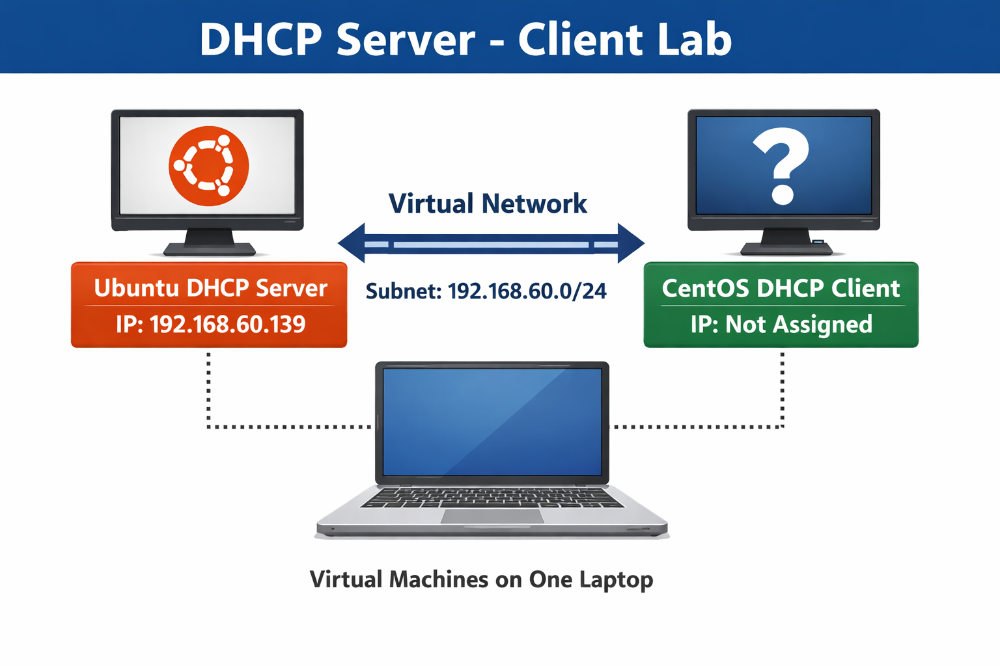

## III. Cấu hình

### 1. `Bước 1` :Cài đặt DHCP Sever trên Ubuntu

- Cập nhật và cài đặt gói DHCP:

  - `isc` là gói phần mềm máy chủ DHCP của ISC

```bash
sudo apt update
sudo apt install isc-dhcp-server -y
```

- Kiểm tra xem cài được chưa :

```bash
dpkg -l | grep isc-dhcp-server
#hoặc
apt list --installed | grep isc-dhcp-server
```

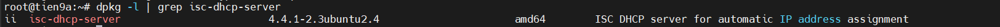

- Kiểm tra interface mạng :

```bash
ip a
```


### `Bước 2`: Đặt IP tĩnh cho Ubuntu

Sửa file Netplan:

```bash
sudo nano /etc/netplan/50-cloud-init.yaml
```

Sửa thành:

```bash
network:                      # Mọi cấu hình mạng đều bắt buộc nằm dưới network
  version: 2                   
  ethernets:                  # Nhóm cấu hình cho card mạng Ethernet vật lý → Nếu là WiFi sẽ là wifis
    ens33:                    # Tên interface mạng
      dhcp4: false            # Tắt DHCP cho IPv4
      addresses:
        - 192.168.60.139/24   # Gán IP tĩnh cho interface 
      routes:                 # Bảng định tuyến cho interface này → Không báo route → không biết gửi packet đi đâu
        - to: 0.0.0.0/0       # Cho mọi mạng (Dùng khi không có route cụ thể)
          via: 192.168.60.2   # Gateway / Nexthop của VM
      nameservers:            # Cấu hình DNS Resolver
        addresses:            # Danh sách DNS Server
          - 8.8.8.8           # Google DNS
          - 8.8.4.4           # Cloudflare DNS

```

Áp dụng cấu hình ngay:

```nano
sudo netplan apply
```

### `Bước 3` : Cấu hình DHCP Sever trên Ubuntu

Sửa file cấu hình `/etc/dhcp/dhcp.conf`:

```bash
sudo nano /etc/dhcp/dhcpd.conf
```

Thêm cấu hình sau:

```bash
default-lease-time 600;
max-lease-time 7200;
authoritative;

subnet 192.168.60.0 netmask 255.255.255.0 {
  range 192.168.60.50 192.168.60.99;
  option routers 192.168.60.2;
  option subnet-mask 255.255.255.0;
  option domain-name-servers 8.8.8.8, 8.8.4.4;
}
```

Trong đó:

- `default-lease-time 600`: Thiết lập thời gian thuê mặc định (default lease time) cho các địa chỉ IP được cấp phát bởi DHCP server là 600 giây (10 phút).
- `max-lease-time 7200`: Thiết lập thời gian thuê tối đa mà DHCP server sẽ cấp phát cho một client là 7200 giây (2 giờ). Khi client yêu cầu thời gian thuê dài hơn, server sẽ không cấp phát quá thời gian này.
- `authoritative`: Khai báo rằng DHCP server này là có thẩm quyền (authoritative) cho các subnet được cấu hình trong file này. Server sẽ phản hồi các yêu cầu DHCP ngay cả khi nó không chắc chắn về cấu hình mạng.
- `subnet 192.168.60.0 netmask 255.255.255.0 { ... }`:
  - `subnet 192.168.60.0`: Xác định địa chỉ mạng của subnet là `192.168.60.0`.
  - `netmask 255.255.255.0`: Xác định subnet mask cho subnet này là `255.255.255.0`.
  - `range 192.168.60.50 192.168.60.99`: Dải địa chỉ DHCP có thể cấp phát.
  - `option routers 192.168.60.2`: `192.168.60.2` là địa chỉ IP của router (cổng mặc định - default gateway) mà các client sẽ sử dụng để truy cập các mạng khác bên ngoài subnet này.
  - `option domain-name-servers 8.8.8.8, 8.8.4.4`: Thiết lập tùy chọn `domain-name-servers` cho các client trong subnet. Các client sẽ sử dụng các địa chỉ IP `8.8.8.8` (máy chủ DNS của Google) và `1.1.1.1` (máy chủ DNS của Cloudflare) này để phân giải tên miền thành địa chỉ IP.

Chỉ định interface để DHCP lắng nghe, sửa file:

```bash
sudo nano /etc/default/isc-dhcp-server
```

Tìm dòng:

```bash
INTERFACESv4=""
```

Thay bằng:

```bash
INTERFACESv4="ens33"  # Hoặc interface kiểm tra được ở bước trên
```

Khởi động DHCP Server:

```bash
sudo systemctl restart isc-dhcp-server
sudo systemctl status isc-dhcp-server
```

Kết quả DHCP đang chạy:

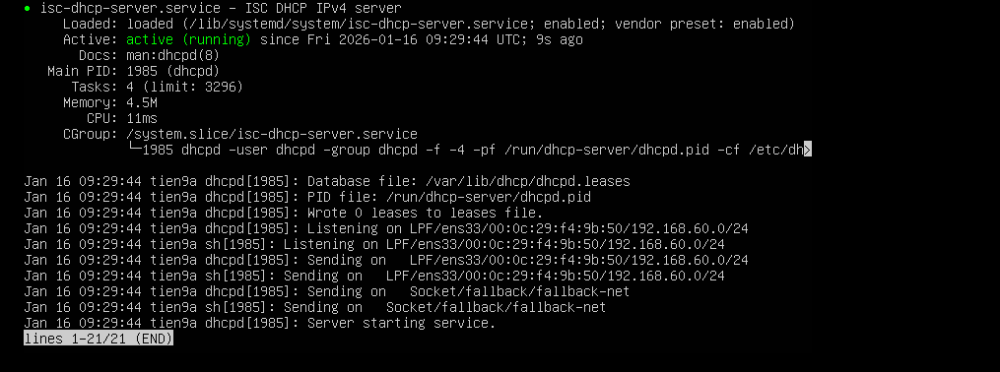

### `Bước 3`: Cấu hình DHCP Client trên CentOS9 để nó dùng được DHCP

- Trước hết tắt dịch vụ DHCP trên máy `local` :

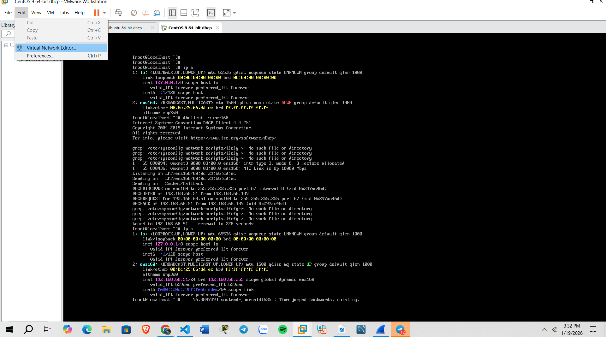

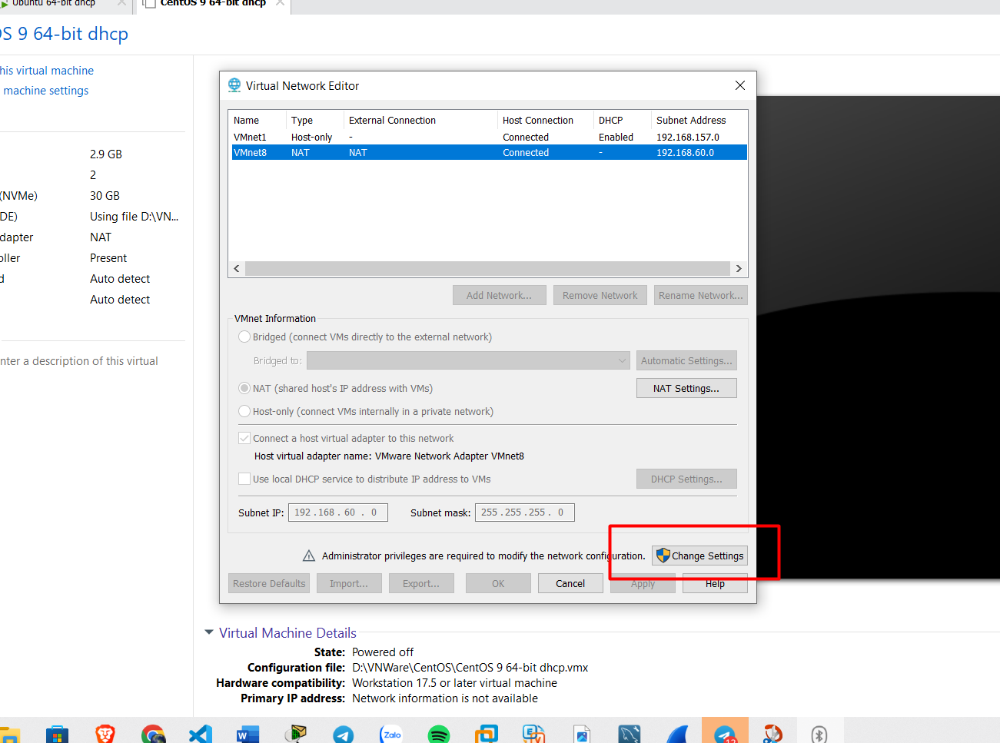

- Không bỏ tích ô trống này :

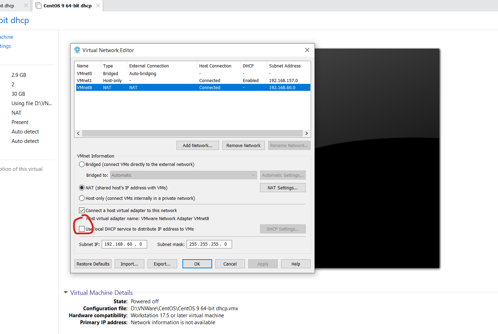

- Kiểm tra Interface của mạng:

-> Ở đây ta dùng giao diện mạng `ens160`

```bash
ip a
```

- Ta tải gói DHclient:

```bash
yum íntall dhclient -y # tải gối dhclient 
```

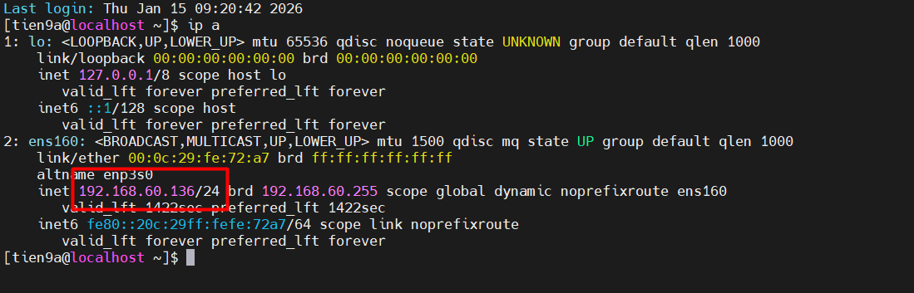

- Nhưng ta thấy IP con DHCP Client đã có IP sẵn trước đó rồi lên lúc này ta cần phải cấu hình để nó không tồn tại IP vì trên thực tế trước khi cấp phát IP cho con DHCP Client thì nó phải không có địa chỉ IP.

- Ta tắt cấu hình IP & DHCP NetworkManager:

```bash
nmcli con modify ens160 ipv4.method disabled
nmcli con modify ens160 ipv6.method disabled
nmcli con up ens160
```

- Sau đó Reboot và check lại Ip:

```bash
reboot
ip a
```

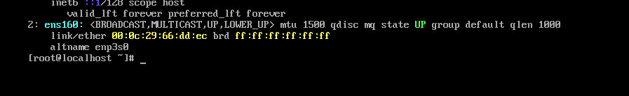

- Vào file cấu hình `/etc/NetworkManager/system-connections/ens160.nmconnection` của giao diện mạng `ens160`

  - Sửa file thành :

  ```bash
  nano /etc/NetworkManager/system-connections/ens160.nmconnection
  ```

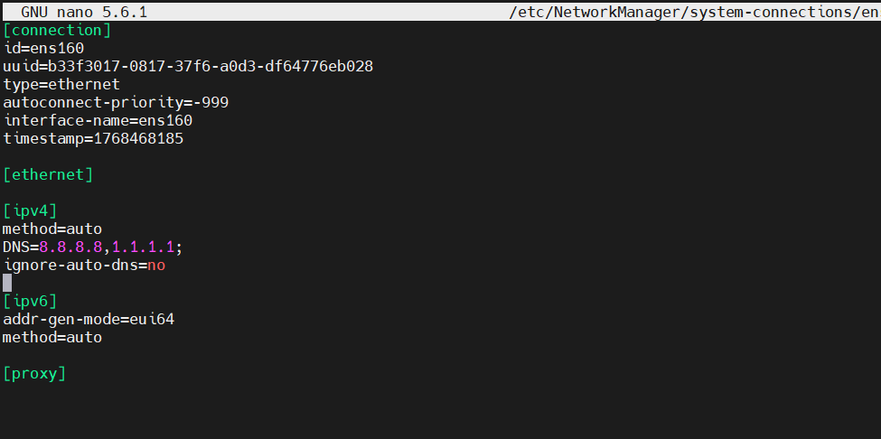

- Khởi động lại NetworkManager để áp dụng:

```bash
sudo systemctl restart NetworkManager
```

- Xin cấp IP bằng cách dùng câu lệnh sau:

```bash
dhclient -v ens160     # xin cấp IP
dhclient - r ens160    # trả lại IP
```

- Kiểm tra IP:

```bash
ip a
```

- Kết quả hiển thị:

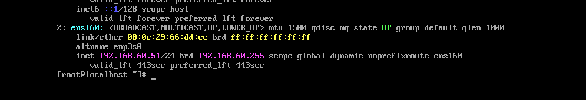

`192.168.60.51` nằm trong dải địa chỉ mạng DHCP server cấp phát.

- Kiểm tra kết nối với DHCP server

```text
ping 192.168.60.139    # IP máy Ubuntu DHCP Server
```

Ping thành công:

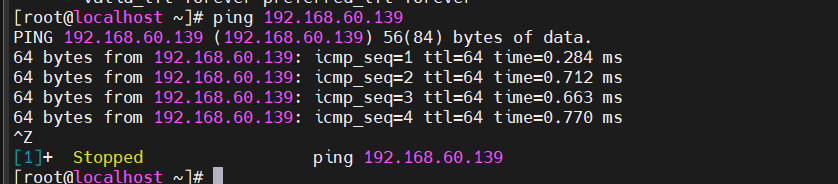

- Kiểm tra cấp phát trên DHCP server (ubuntu). Sử dụng lệnh:

```bash
cat /var/lib/dhcp/dhcpd.leases
```

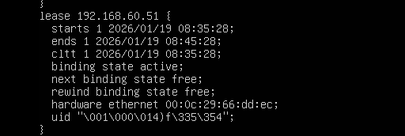

- Trong đó:

  - **IP**: `192.168.60.51` đã được cấp.
  - **starts**: Thời điểm bắt đầu `lease` – nghĩa là thời điểm client nhận được IP.
  - **ends**: Thời điểm kết thúc `lease` – sau đó client cần gia hạn (renew) hoặc lấy IP mới.
  - **cltt** (Client Last Transaction Time): Thời điểm cuối cùng client thực hiện giao dịch với **DHCP server** (giống starts nếu là lần đầu).
  - **binding state active**: Trạng thái binding hiện tại là `active` → IP này đang được sử dụng.
  - **next binding state free**: Khi `lease` hết hạn, trạng thái tiếp theo sẽ là free → IP này sẽ sẵn sàng để cấp phát lại.
  - **rewind binding state free**: Khi thực hiện "rewind" (quay lui cấu hình trước khi server restart), IP này cũng sẽ trở lại trạng thái free.
  - `00:0c:29:66:dd:ec`: Địa chỉ MAC address của client được cấp phát IP.
  - uid "\001\000\014)f\335\354": UID của client (Unique Identifier), thường được DHCP client tạo ra để phân biệt trong các môi trường không có MAC cố định (VD: DHCP relay, VPN...).

- Ta đợi 1 khoảng thời gian sau khi `lease` hết hạn:(Sau 600s)

  - Kiểm tra lại `lease`

  ```bash
  cat /var/lib/dhcp/dhcpd.leases
  ```
  
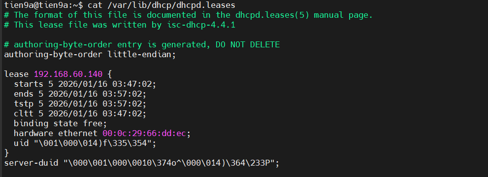

- Trong đó:

  - **tstp**: Time Stop – thời điểm lease bị coi là dừng hẳn
  - **binding state free**: IP đã được thu hồi , DHCP Client không được cấp IP lúc này, và địa chỉ này đã trả về `pool`
  
  -> Thu IP về `pool` nhưng không mất `lease` bởi vì DHCP Server muốn :Tránh cấp IP loạn, Nhận diện client cũ, dùng Debug / audit. `Lease` chỉ mất khi ta xoá file cấu hình DHCP `rm /var/lib/dhcp/dhcpd.leases`.

### `Lưu ý`

- Sau khi cấu hình xong mà ta tắt máy thì nhớ phải bật lại dịch vụ DHCP máy local lên để máy VM có thể nhận IP. Phòng trường hợp gói `dhclient` cần cập nhật lại mà ta không có IP sẵn

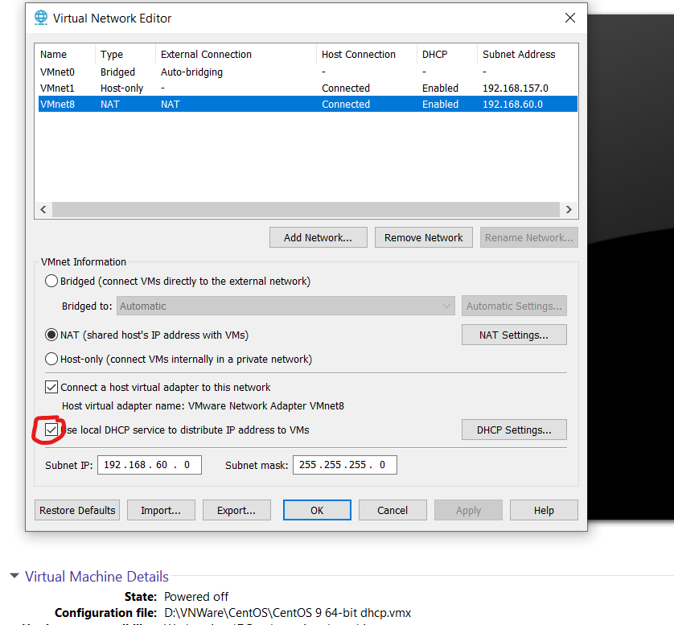

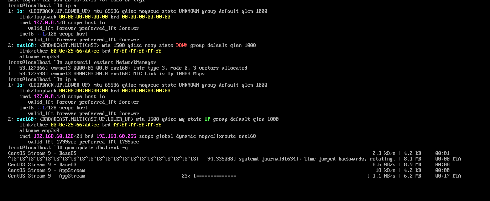

- Và nhớ khi xin cấp lại IP thì phải tắt service DHCP máy local và máy server DHCP phải khởi động `ísc-dhcp-sever`
