# CAPTURE GÓI TIN DHCP BẰNG TCPDUMP VÀ WIRESHARK

## I. CAPTURE BẰNG WIRESHARK

Ta sử dụng DHCP server là ubuntu và DHCP client là CentOS để tạo gói tin về nguyên lý hoạt động của DHCP:

- Trên CentOS ta xin cấp phát IP

```bash
dhclient -v ens 160
```

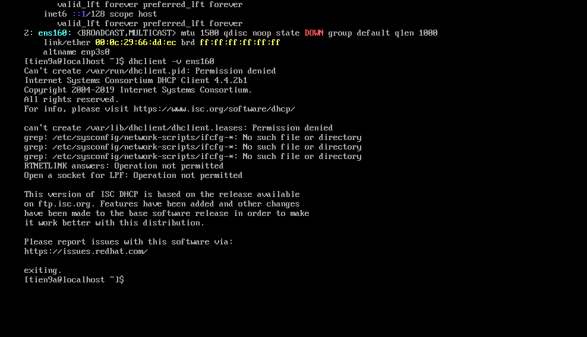

Sử dụng Wireshark để theo dõi các gói tin dhcp đã được trao đổi

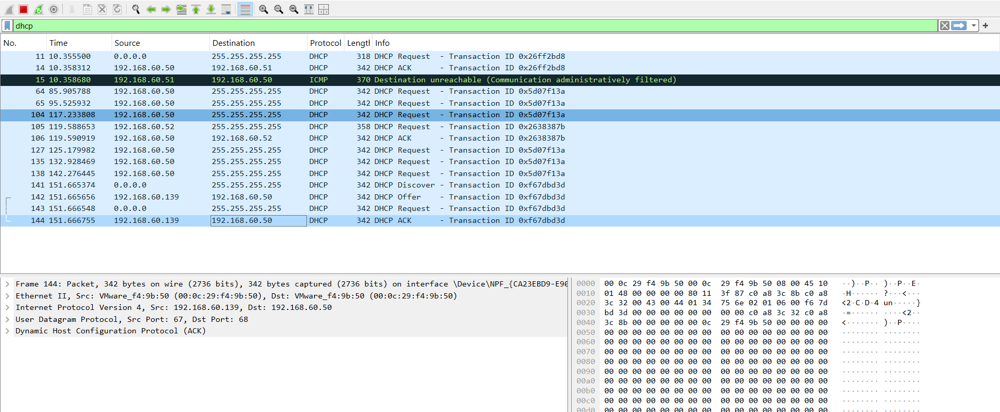

### Kiểm tra gói DHCP discover

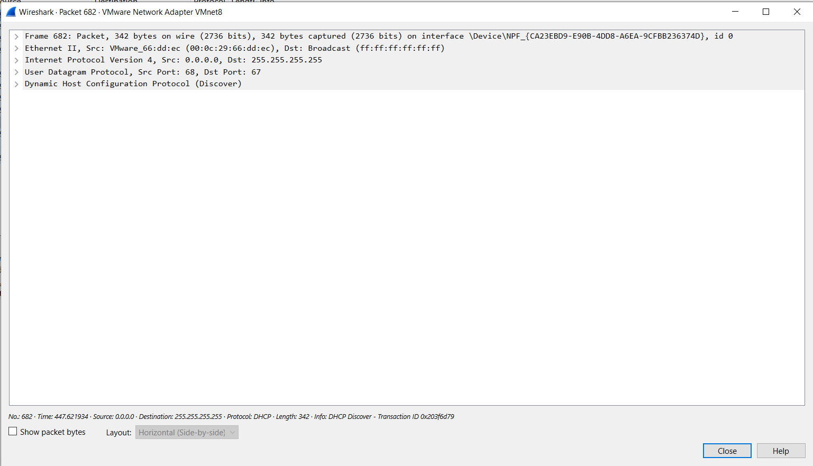

Tầng 2:

- source MAC: `VMware_66:dd:ec` - Địa chỉ MAC cua máy client(máy xin cấp IP)
- dest MAC: `Broadcast`: gửi tất cả thiết bị trong LAN

Tầng 3:

- source IP: `0.0.0.0` (do client chưa có ip nên ip nguồn sẽ là `0.0.0.0`)
- dest IP: `255.255.255.255` (broadcast toàn mạng -> để tìm DHCP server)

Tầng 4: UDP

- source port: `68` (DHCP client)
- dest port: `67` (DHCP server)

Tầng ứng dụng: DHCP(Discover)

- Đây là gói đầu tiên trong quá trình DORA, client đang tìm kiếm DHCP server
- Đây là broadcast không có IP, chỉ có MAC -> DHCP server sẽ phản hồi bằng gói `Offer`

### Kiểm tra gói DHCP offer

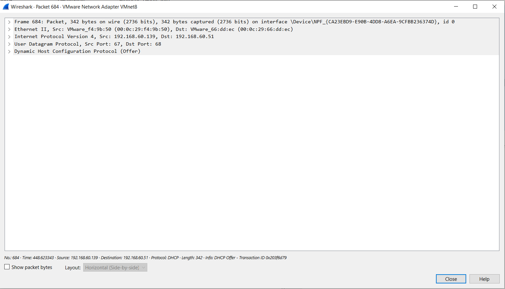

Tầng 2:

- source MAC: `VMware_f4:9b:50` (địa chỉ MAC của DHCP server)
- dest MAC: `VMware_66:dd:ec` (địa chỉ MAC của client)

Tầng 3:

- source IP: `192.168.60.139` (địa chỉ IP của server)
- dest IP: `192.168.174.51` - IP được đề xuất cho client

Tầng 4:

- source port: `67` (DHCP server)
- dest port: `68` (DHCP client)

Tầng ứng dụng: DHCP(Offer)

- Message type: Boot reply(2) -> phản hồi từ server
- Your(client) IP address: `192.168.60.51` -> IP được cấp phát cho client
- IP address lease time: thời gian thuê IP
- subnet mask, router, dns, ...

### Kiểm tra gói tin DHCP request

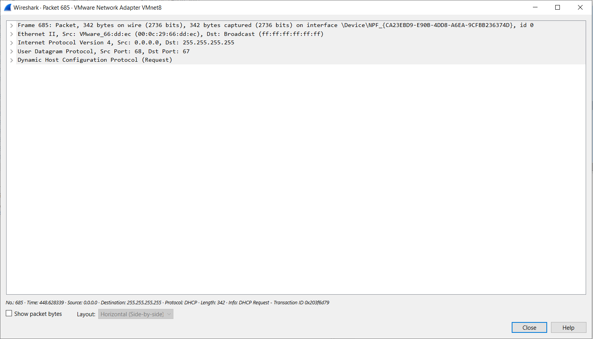

Tầng 2:

- source MAC: `VMware_66:dd:ec` - địa chỉ MAC của DHCP client
- dest MAC: broadcast

Tầng 3:

- source IP: `0.0.0.0` -> vì client chưa có IP
- dest IP: `255.255.255.255` -> gửi broadcast để DHCP server nào gửi offer biết là được chọn

Tầng 4:

- source port: `68` -> DHCP client
- dest port: `67` -> DHCP server

Tầng ứng dụng: DHCP (request)

- Message type: `request` -> DHCP client chọn một offer từ server (gói offer) và gửi lại yêu cầu xác nhận sử dụng IP đó
- Request IP address: IP mà client muốn nhận (do server đề xuất trước đó)
- Parameter Request List: Client yêu cầu các tùy chọn cấu hình từ server (DNS, gateway, lease time, ...)

### Kiểm tra gói tin DHCP ack

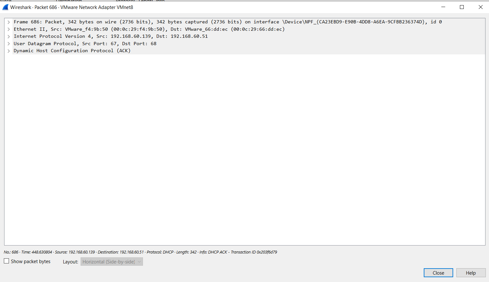

Tầng 2:

- source MAC: `VMware_f4:9b:50` - địa chỉ MAC của server
- dest MAC: `VMware_66:dd:ec` - địa chỉ MAC của client

Tầng 3:

- source IP: `192.168.60.139` - IP của server
- dest IP: `192.168.60.51` - IP được gán cho client

Tầng 4:

- source IP: `67` - DHCP server
- dest IP: `68` - DHCP client

Tầng ứng dụng: DHCP(ack)

- Message type: `ACK` -> DHCP server xác nhận và chính thức cấp phát IP được client chọn trong gói request
- Các DHCP option:
  - IP được cấp
  - IP lease time
  - default gateway
  - DNS server
  - subnet mask

### Bảng các DHCP option quan trọng

#### Option nhận dạng & điều khiển

| Code | Tên Option             | Ý nghĩa                                      |
| ---- | ---------------------- | -------------------------------------------- |
| 53   | DHCP Message Type      | Loại gói DHCP(Discover, Offer, Request, Ack) |
| 61   | Client Identifier      | Định danh client                             |
| 50   | Requested IP Address   | IP client muốn                               |
| 51   | IP Address Lease Time  | Thời gian thuê IP                            |
| 54   | Server Identifier      | IP DHCP Server                               |
| 55   | Parameter Request List | Client yêu cầu option nào                    |

#### Option cấu hình mạng

| Code | Tên Option               | Ví dụ         |
| ---- | ------------------------ | ------------- |
| 1    | Subnet Mask              | 255.255.255.0 |
| 3    | Router (Default Gateway) | 192.168.1.1   |
| 6    | DNS Server               | 8.8.8.8       |
| 15   | Domain Name              | example.com   |
| 28   | Broadcast Address        | 192.168.1.255 |

## II. CAPTURE BẰNG TCP DUMP (CENTOS9)

### Setup cơ bản

- Đâu tiên update và install các gói `yum` và `tcpdump`:

```bash
sudo yum update
sudo yum install tcpdump -y
# Kiểm tra lại
tcp dump --v
```

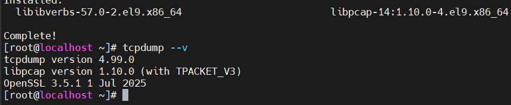

- Dùng `tcpdump` truy cập vào giao diện mạng `ens160` để theo dõi:

```bash
sudo tcpdump -i ens160
```

-> Kết quả thu được:

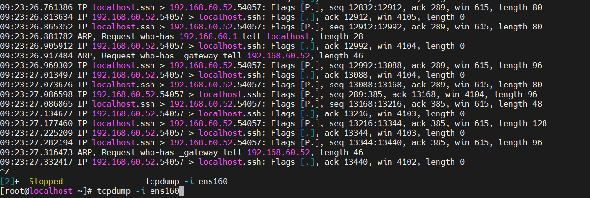

### Dùng Filter bắt gói tin

#### Bắt gói tin DHCP

- Dùng filetr để bắt mỗi gói tin `DHCP`:

```bash
tcpdump -i ens160 -n port 67 or port 68
```

-> Kết quả thu được:

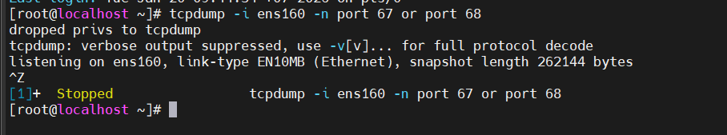

#### Bắt gói tin DHCP Client -> Sever

```bash
tcpdump -i ens160 -n -vv udp dst port 67
```

-> Kết quả thu được:

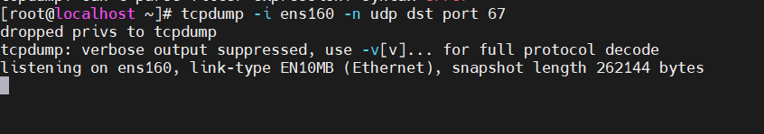

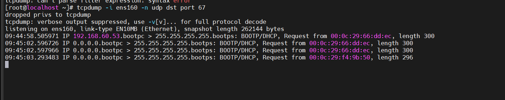

#### Bắt gói tin từ Server -> Client

```bash
tcpdump -i ens160 -n -vv udp src port 67
```

-> Kết quả thu được:

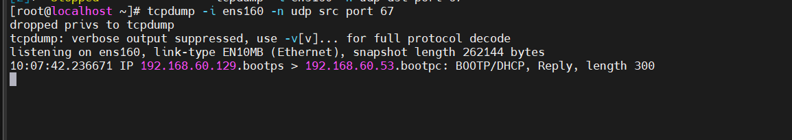

### Bắt gói DHCP kèm MAC

- Dùng Option [-e] dể hiện thị rõ địa chỉ MAC:

```bash
tcpdump -i ens160 -e -n port 67 or port 68
```

-> Kết quả thu được:

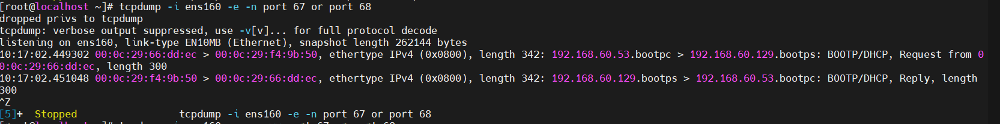
