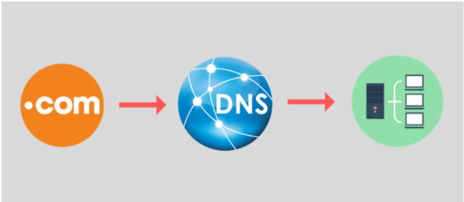
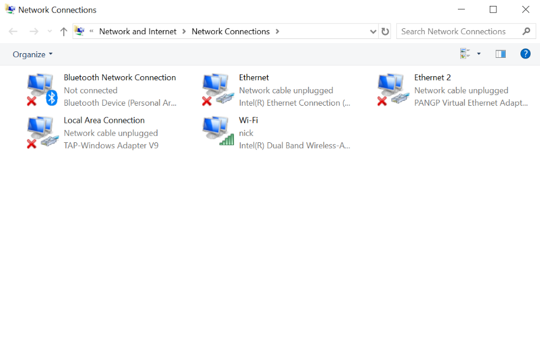
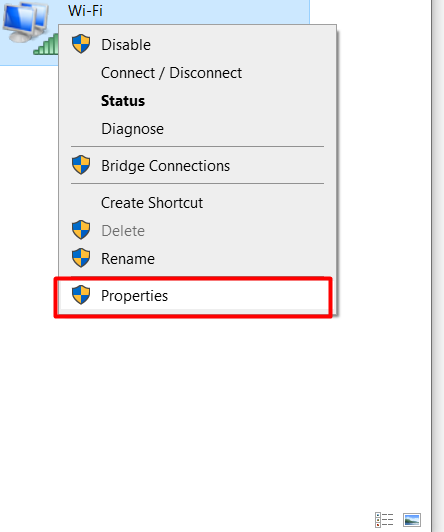
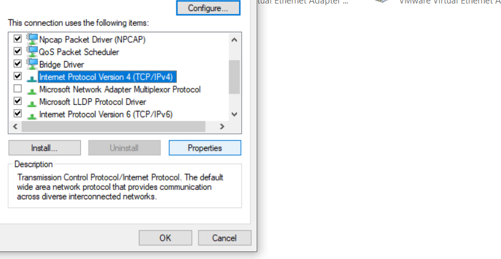
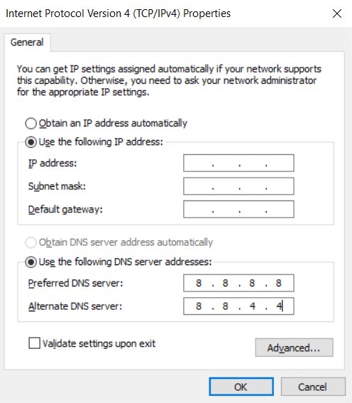
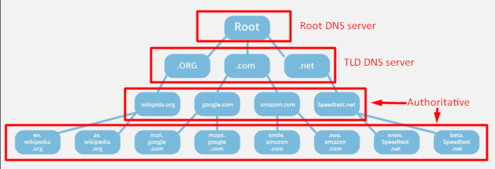
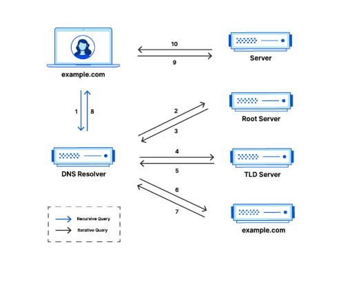

# OVERVIEW DNS


## I. KHÁI NIỆM DNS

- **DNS** là từ viết tắt của **Domain Name System** - là một hệ thống phân giải tên miền, giúp chuyển đổi tên miền sang địa chỉ IP tương ứng, giúp người dùng dễ dàng truy cập website mà mình muốn trên Internet.

- Ví dụ:

```ruby
cloud.test  →  192.168.60.10
google.com  →  142.250.72.14
```

## II. CHỨC NĂNG CỦA DNS

Sau đây là 1 số chức năng quan trọng của DNS:

1. **Phân giải tên miền và IP và quản lí tên miền**: **DNS** cung cấp cơ chế tự động ánh xạ các tên miền thành địa chỉ IP phù hợp để trình duyệt người dùng có thể tải nội dung từ máy chủ trình duyệt. Ngoài ra, cho phép các tổ chức quản lí tên miền bao gồm đăng kí ,hủy bỏ, cập nhật tên miền.

    -> Việc ánh xạ này giúp giảm đáng kể thời gian truy cập của người dùng
    -> Xác định quyền sở hữu và thông tin liên quan đến tên miền

2. **Caching và tối ưu hoá tốc độ truy cập**: **DNS** sử dụng cơ chế lưu trữ tạm thời (DNS Cache) tại nhiều cấp độ, bao gồm trình duyệt,hệ điều hành và máy chủ DNS trung gian. Khi người dùng truy cập 1 trang web thì hệ thống sẽ ưu tiên tìm kiếm thông tin phân giải từ bộ nhớ đệm trước khi gửi truy vấn dên máy chủ DNS khác.

    -> Điều này giúp giảm độ trễ và cải thiện hiệu suất truy cập.

3. **Cân bằng tải và định tuyến thông minh**: Các hệ thống DNS hiện đại hỗ trợ tính năng cân bằng tải (LB), phân phối lưu lượng truy cập dến máy chủ khác nhau dựa trên các bản ghi (DNSRecord):

    -> Địa lí người dùng
    -> Hiệu suất máy chủ

4. **Cung cấp bảo mật**: DNS có thể tích hợp các tính năng cung cấp bảo mật như DNSSEC để chống lại các cuộc tấn công giả mạo như DNS (spoofing) và luôn đảm bảo thông tin trả về từ máy chủ DNS là chính xác.

5. **Cung cấp các thông tin bổ sung**: Ngoài địa chỉ IP thì DNS cung cấp các thông tin bổ sung như:

    -> Thông tin máy chủ thư (MXRecords): Xác định máy chủ gửi và nhận email cho 1 tên miền
    -> Thông tin về dịch vụ (SRVRecords): Cung cấp thông tin về các dịch vụ mạng khác nhau mà tên miền hỗ trợ.
    -> Thông tin về bảo mật (TXTRecords): Sử dụng để xác minh danh tính và cung cấp thông tin bảo mật tên miền.

## III. CÁC LOẠI DNS VÀ VAI TRÒ CỦA NÓ



Có 3 loại DNS chính đó là : ISP DNS, Public DNS, Private DNS

### 1. ISP DNS

- Đây là các máy chủ DNS được tự động gán cho bạn khi bạn kết nối mạng thông qua Nhà cung cấp dịch vụ Internet (ISP) như VNPT, FPT, Viettel… Chúng dễ sử dụng vì bạn không cần cấu hình gì cả. Tuy nhiên, tốc độ và độ ổn định của ISP DNS có thể không phải lúc nào cũng tốt nhất, và đôi khi ISP có thể sử dụng DNS để chặn truy cập một số trang web hoặc ghi lại lịch sử duyệt web của người dùng.

### 2. Public DNS

- Đây là các máy chủ DNS được cung cấp miễn phí cho cộng đồng bởi các tổ chức lớn, với mục tiêu cải thiện tốc độ, độ tin cậy và bảo mật khi duyệt web. Một số Public DNS phổ biến nhất bao gồm:

  - **Google Public DNS**: Địa chỉ `8.8.8.8` và `8.8.4.4` -> Tập trung vào sự ổn định
  - **Cloudflare DNS**: Địa chỉ 1.1.1.1 và 1.0.0.1 -> Tập trung mạnh vào quyền riêng tư và tốc độ, hỗ trợ các chuẩn bảo mật mới như DNS over HTTPS (DoH), DNS over TLS (DoT)
  - **OpenDNS**: Địa chỉ 208.67.222.222 và 208.67.220.220-> Cung cấp các tính năng lọc nội dung (ví dụ: chặn web độc hại, web người lớn) hữu ích cho gia đình và doanh nghiệp.

### 3. Private DNS

- Đây là các máy chủ DNS được thiết lập và quản lý bởi một tổ chức hoặc cá nhân cho mục đích sử dụng nội bộ. Ví dụ, một công ty lớn có thể có Private DNS Server để quản lý tên các máy chủ, máy in trong mạng nội bộ của họ.

### 4. So sánh giữa 3 loại DNS

| **Tiêu chí**              | **Public DNS**                                                   | **ISP DNS**                                                                     | **Private DNS**                                          |
| ------------------------- | ---------------------------------------------------------------- | ------------------------------------------------------------------------------- | -------------------------------------------------------- |
| **Khái niệm**             | DNS công cộng do bên thứ ba cung cấp cho mọi người dùng Internet | DNS do **nhà cung cấp dịch vụ Internet (ISP)** triển khai cho khách hàng của họ | DNS nội bộ dùng riêng cho **doanh nghiệp/mạng LAN**      |
| **Đơn vị vận hành**       | Google, Cloudflare, OpenDNS, Quad9…                              | VNPT, Viettel, FPT, CMC…                                                        | Doanh nghiệp, tổ chức, sysadmin                          |
| **Đối tượng sử dụng**     | Bất kỳ ai trên Internet                                          | Thuê bao của ISP                                                                | Thiết bị trong mạng nội bộ                               |
| **Phạm vi truy cập**      | Toàn cầu                                                         | Trong hạ tầng ISP (có thể ra Internet)                                          | Giới hạn trong mạng private                              |
| **Mục đích sử dụng**      | Phân giải tên miền Internet nhanh, ổn định, trung lập            | Phân giải tên miền cho thuê bao, tối ưu tuyến nội mạng                          | Quản lý tài nguyên nội bộ, bảo mật và kiểm soát truy cập |
| **Tính năng**             | Phân giải toàn cầu, cache lớn, Anycast, tốc độ cao               | Cache gần người dùng, tích hợp hệ thống ISP                                     | Tuỳ chỉnh sâu, split DNS, internal domain                |
| **Kiểm soát truy cập**    | Gần như không                                                    | Có kiểm soát mức ISP                                                            | Kiểm soát chặt chẽ theo policy                           |
| **Bảo mật**               | Cơ bản, có hỗ trợ DNSSEC, DoH/DoT                                | Trung bình, phụ thuộc ISP                                                       | Cao, hạn chế truy cập từ ngoài                           |
| **Quyền riêng tư**        | Có thể log truy vấn (tuỳ nhà cung cấp)                           | ISP **có toàn quyền log**                                                       | Dữ liệu nằm trong tổ chức                                |
| **Quản lý & triển khai**  | Rất đơn giản, chỉ cần cấu hình IP DNS                            | Tự động khi cấp mạng                                                            | Phức tạp, cần kiến thức DNS & hệ thống                   |
| **Truy cập từ bên ngoài** | Được phép                                                        | Được phép                                                                       | Không (trừ khi expose có kiểm soát)                      |
| **Ví dụ**                 | 8.8.8.8, 1.1.1.1                                                 | DNS của VNPT, Viettel                                                           | dns.local, cloud.test                                    |

=> Hiểu về các loại DNS giúp ta có thể đưa ra lựa chọn phù hợp nếu muốn thay đổi DNS mặc định để tối ưu hoá kết nối Internat của mình

## IV. HƯỚNG DẪN CÁCH THAY ĐỔI DNS SERVER

Việc thay đổi **DNS server mặc định** của **ISP** sang một **Public DNS** như **DNS Google** (8.8.8.8) hoặc **DNS Cloudflare** (1.1.1.1) là một thủ thuật đơn giản nhưng có thể **mang lại nhiều lợi ích**: **cải thiện tốc độ truy cập web, tăng cường bảo mật (một số Public DNS chặn các trang lừa đảo, độc hại), và đôi khi giúp truy cập các website bị chặn bằng phương pháp chặn DNS**.

Dưới đây là hướng dẫn cách đổi DNS cơ bản trên các hệ điều hành phổ biến:

### 1.Thay đổi DNS trên máy tính Windows

- **Bước 1**: Bấm Win + R -> ncpaa.cpl (Mở ra giao diện Network Connection)



- **Bước 2**: Chuột phải vào kết nối mạng đang sử dụng (Wi-Fi hoặc Ethernet), chọn “Properties”.



- **Bước 3**: Chọn “Internet Protocol Version 4 (TCP/IPv4)”, nhấn nút “Properties”.



- **Bước 4**: Chọn mục “Use the following DNS server addresses:”.

- **Bước 5**: Nhập địa chỉ DNS bạn muốn dùng. Ví dụ, với Google DNS:

  - `Preferred DNS server`: `8.8.8.8`
  - `Alternate DNS server`: `8.8.4.4`



- **Bước 7**: Nhấn `OK` để lưu lại. Bạn có thể làm tương tự cho “Internet Protocol Version 6 (TCP/IPv6)” nếu mạng của bạn hỗ trợ IPv6 (ví dụ: Google IPv6 DNS là 2001:4860:4860::8888 và 2001:4860:4860::8844).

### 2. Thay đổi DNS trên máy tính macOS

- **Bước 1**: Mở “System Preferences” (hoặc “System Settings” trên phiên bản mới).

- **Bước 2**: Nhấp vào “Network”.

- **Bước3**: Chọn kết nối mạng đang dùng (Wi-Fi hoặc Ethernet) ở danh sách bên trái.

- **Bước4**: Nhấn nút “Advanced…” (hoặc “Details…” trên phiên bản mới).

- **Bước 5**: Chuyển qua tab “DNS”.

- **Bước 6**: Nhấn nút dấu cộng (+) ở dưới mục “DNS Servers”.

- **Bước 7**: Nhập địa chỉ DNS mới (ví dụ: 1.1.1.1 cho Cloudflare). Nhấn (+) lần nữa để thêm địa chỉ phụ (1.0.0.1).

- **Bước 8**: Bạn có thể chọn các địa chỉ DNS cũ và nhấn dấu trừ (-) để xóa nếu muốn.

- **Bước 9**: Nhấn “OK”, sau đó “Apply”.

## V. CÁC HỆ THỐNG PHÂN CẤP CỦA DNS



### 1. Recursive DNS Server (DNS đệ quy)

- Là trung gian giữa người dùng và hệ thống phân giải tên miền toàn cầu.
- Nhận yêu cầu`Request` từ client (máy tính, điện thoại,...) và đi lần lượt đến `Root` -> `TLD` -> `Authoritative DNS` để lấy IP.
- Lưu trữ kết quả tra cứu vào bộ nhớ cache để phục vụ các yêu cầu tiếp theo nhanh hơn.
- ví dụ:

  - `8.8.8.8` (Google)
  - `1.1.1.1` (Cloudflare)
  - DNS của nhà mạng như: `VNPT`, `Viettel`, `FPT`

### 2. Root DNS Server (Máy chủ gốc)

- Đứng đầu chuỗi truy vẫn DNS. Nó chứa thông tin chi tiết về các tên miền cụ thể, nhưng nó không biết địa chỉ cảu các máy chủ **TLD** (Top Level Domain)
- Khi **Recursive Resolver** cần tra cứu một tên miền mà không có trong cache, nó sẽ hỏi Root Server để biết địa chỉ của **TLD Server** tương ứng.
- Được quản lí bởi các tổ chức toàn cầu (Ví dụ: Verisign,ICANN) vận hành. Có 13 hệ thống máy chủ gốc được định danh từ A -> M, phân tán trên toàn cầu.

### 3.TLD DNS Server (Top Level Domain)

- Quản lí các đuôi miền cao cấp như : `.com`,`.vn`,`.edu`,`.org`.
- Chuyển tiếp truy vấn dến Authoritative DNS Server cụ thể của tên miền:
- Ví dụ:

  - `.com`-> được quản lí bởi Verisign.
  - `.vn` -> được quản lí bởi VNNIC.

### 4. Authoritative DNS Server (DNS có thẩm quyền)

Authoritative DNS Server (DNS có thẩm quyền) là máy chủ DNS chính thức chứa bản ghi DNS gốc cho một tên miền (domain).

- Nó được uỷ quyền trực tiếp từ chủ sở hữu tên miền hoặc cơ quan quản lí tên miền (registrar, registry)
- Khi nhận được truy vấn , nó sẽ trả lời bằng thông tin chính xác nhất (IP,mail,..) chứ không phải thông tin "Cache" như các máy chủ DNS khác (ví dụ Recursive DNS).
- Có 2 loại Authoritative:

  - Primary (Master):

    - Lưu trữ bản gốc (zone file) của Domain
    - Quản trị viên chỉnh sửa trực tiếp tại đây

  - Secondary (Slave):

    - Sao chép dữ liệu từ Primary
    - Giúp phân tải và tăng đọ tin cậy

## VI. CƠ CHẾ HOẠT ĐỘNG CỦA DNS



**`Bước 1`: Truy vấn từ Client → Recursive DNS Server**

- Người dùng mở trình duyệt và nhập `www.example.com`.
- Hệ điều hành kiểm tra:
  - File hosts cục bộ (nếu có).
  - Cache DNS cục bộ (nếu có).
  - Nếu không có → gửi truy vấn đến Recursive DNS Server.

**`Bước 2`: Recursive DNS Server xử lý truy vấn**

Recursive DNS sẽ thực hiện các bước sau nếu không có cache:

1. **Hỏi Root DNS Server:**
    - Hỏi: “IP của `www.example.com` là gì?”.
    - Root DNS: “Hãy hỏi `.com` TLD Server”.
2. **Hỏi TLD DNS Server (.com):**
    - Hỏi: “IP của `www.example.com` là gì?”.
    - `.com` server: “domain `example.com` được quản lý bởi DNS server tại `ns1.exampledns.com` (authoritative)”.
3. **Hỏi Authoritative DNS Server:**
    - Truy vấn đến `ns1.exampledns.com`: “IP của `www.example.com` là gì?”.
    - Server này trả lời: “IP là `217.64.213.12`” (A record).

**`Bước 3`: Trả kết quả về Client**

- Recursive DNS server lưu kết quả vào cache (để lần sau trả lời nhanh hơn).
- Trả IP `217.64.213.12` về cho máy người dùng.

**`Bước 4`: Client kết nối đến web server**

- Trình duyệt dùng địa chỉ IP để kết nối đến 217.64.213.12 (qua HTTP/HTTPS).
- Gửi request và tải nội dung web.
