# `DIG` COMMAND

## I. TỔNG QUAN VỀ LỆNH `dig`

### 1. khái niệm `dig`

**DIG (Domain Information Groper)** có nghĩa là **công cụ truy vấn và tìm kiếm thông tin tên miền**. Lệnh `Dig` có tác dụng để **kiểm tra và xử lí** sự cố **DNS Server**, tìm kiếm DNS và hiển thị nội dung được yêu cầu ra màn hình Terminal. Lệnh `Dig` được sử dụng để thay thế cho những công cụ cũ trước đây như `nslookup` và `host`.

  -> Thuộc bộ **dnsutils / bind-utils**
  -> Hoạt động ở tầng **Application**, dùng giao thức TCP (**UDP/TCP** port 53)

### 2. Chức năng & vai trò `dig`

- So với những công cụ tra cứu DNS khác như `nslookup` hay `host`, `dig` có nhiều ưu điểm vượt trội đó là:

  - Kết quả chi tiết
  - Có nhiều tuỳ chọn truy vấn hơn
  - Chọn máy chủ DNS cụ thể và theo dõi chi tiết toàn bộ quá trình phân giải tên miền

- Lệnh `dig` có chức năng tra cứu mọi loại bản ghi DNS: A, AAAA, MX, NS, TXT, SOA
- Kiểm tra phản hồi máy chủ cụ thể
- Debug lỗi:

  - Domain không vào được
  - Mail không gửi/ nhận
  - DNS cache sai
  - DNS propagation
  - Split DNS

### 3. Cấu trúc cơ bản của lệnh `dig`

#### a. Cú pháp câu lệnh

```bash
dig [@DNS_SERVER] [DOMAIN] [RECORD_TYPE] [OPTIONS]
```

- Trong đó:

  - [@DNS_SERVER] : là DNS Server để hỏi (có `@` -> chỉ thẳng DNS Server còn không `@` là chỉ DNS Server mặc định)
  - [DOMAIN]: Tên miền cần truy vấn
  - [RECORD_TYPE: Các loại bản ghi (A,AA,MX,...)

#### b. Kết quả trả về

Output được chia 5 phần lớn:

##### HEADER (đầu gói tin )

- Ví dụ:

```bash
;; ->>HEADER<<- opcode: QUERY, status: NOERROR, id: 12345
;; flags: qr rd ra; QUERY: 1, ANSWER: 1, AUTHORITY: 0, ADDITIONAL: 1
```

- Giải thích:

| Trường   | Ý nghĩa               |
| -------- | --------------------- |
| opcode   | Loại truy vấn (QUERY) |
| status   | Kết quả               |
| NOERROR  | OK                    |
| NXDOMAIN | Domain không tồn tại  |
| SERVFAIL | DNS server lỗi        |
| REFUSED  | Bị chặn               |
| flags    |                       |
| qr       | query response        |
| rd       | recursion desired     |
| ra       | recursion available   |
| ANSWER   | số bản ghi trả lời    |

->**Admin** nhìn **status** là biết domain sống hay chết

##### QUESTION SECTION

- Ví dụ:

```bash
;; QUESTION SECTION:
;google.com.     IN      A
```

- Giải thích:

  - Domain: `google.com`
  - Class: **IN** (Internet)
  - Type: `A`

##### ANSWER SECTION

- Ví dụ:

```bash
;; ANSWER SECTION:
google.com.  300  IN  A  142.250.190.14
```

- Giải thích:

| Thành phần  | Ý nghĩa      |
| ----------- | ------------ |
| google.com. | Domain       |
| 300         | TTL (giây)   |
| IN          | Internet     |
| A           | Loại bản ghi |
| IP          | Kết quả      |

##### AUTHORITY SECTION

```bash
;; AUTHORITY SECTION:
google.com.  172800  IN  NS  ns1.google.com.
```

=> DNS nào có thẩm quyền cho domain

##### ADDITIONAL SECTION

```bash
;; ADDITIONAL SECTION:
ns1.google.com. 172800 IN A 216.239.32.10
```

=> IP của DNS Server thẩm quyền

#### c. Các [OPTIONS] quan trọng lệnh `dig`

##### Options hiển thị kết quả (OUTPUT)

| Option        | Ý nghĩa                     | Ví dụ                               |
| ------------- | --------------------------- | ----------------------------------- |
| `+short`      | Chỉ hiển thị kết quả gọn    | `dig google.com +short`             |
| `+noall`      | Ẩn toàn bộ output           | `dig google.com +noall`             |
| `+answer`     | Chỉ hiện ANSWER SECTION     | `dig google.com +noall +answer`     |
| `+question`   | Chỉ hiện QUESTION           | `dig google.com +noall +question`   |
| `+authority`  | Chỉ hiện AUTHORITY          | `dig google.com +noall +authority`  |
| `+additional` | Chỉ hiện ADDITIONAL         | `dig google.com +noall +additional` |
| `+comments`   | Hiện comment (mặc định bật) | `+nocomments`                       |
| `+stats`      | Hiện thống kê query         | `+nostats`                          |

##### Options điều khiển truy vấn (QUERY BEHAVIOR)

| Option       | Ý nghĩa                           | Khi dùng                   |
| ------------ | --------------------------------- | -------------------------- |
| `+trace`     | Trace DNS từ root → authoritative | Debug DNS propagation      |
| `+recurse`   | Cho phép đệ quy (mặc định)        | DNS client                 |
| `+norecurse` | Không đệ quy                      | Test DNS authoritative     |
| `+tcp`       | Dùng TCP thay UDP                 | Response lớn / DNS bị chặn |
| `+ignore`    | Bỏ qua truncate                   | Khi UDP bị cắt             |
| `+retry=N`   | Số lần retry                      | DNS chậm                   |
| `+time=N`    | Timeout (giây)                    | DNS lag                    |

##### Options liên quan DNSSEC

| Option      | Ý nghĩa            |
| ----------- | ------------------ |
| `+dnssec`   | Yêu cầu DNSSEC     |
| `+cdflag`   | Bỏ kiểm tra DNSSEC |
| `+sigchase` | Theo chữ ký DNSSEC |

##### Options về TTL & định dạng

| Option       | Ý nghĩa                    |
| ------------ | -------------------------- |
| `+ttlunits`  | Hiển thị TTL dạng phút/giờ |
| `+multiline` | Output nhiều dòng dễ đọc   |
| `+split=W`   | Cắt dòng độ rộng W         |

##### Options EDNS & kích thước gói

| Option          | Ý nghĩa        |
| --------------- | -------------- |
| `+edns=0`       | Bật EDNS0      |
| `+noedns`       | Tắt EDNS       |
| `+bufsize=SIZE` | Set buffer UDP |

##### Options chỉ định DNS server

| Cách dùng  | Ý nghĩa               |
| ---------- | --------------------- |
| `@8.8.8.8` | Hỏi DNS server cụ thể |
| `-b IP`    | Bind IP nguồn         |
| `-p PORT`  | Chỉ định port         |

##### Options debug / test nâng cao

| Option        | Ý nghĩa                      |
| ------------- | ---------------------------- |
| `+qr`         | Hiển thị query gửi đi        |
| `+fail`       | Ngừng khi lỗi                |
| `+besteffort` | Nhận câu trả lời chưa đầy đủ |

##### Các combo dùng nhiều trong thực tế

**Lấy IP nhanh**:

```bash
dig domain.com +short -4
```

**Debug DNS gọn**:

```bash
dig domain.com +noall +answer
```

**Trace DNS từ root**:

```bash
dig domain.com +trace
```

**Test DNS authoritative**:

```bash
dig @ns1.domain.com domain.com +norecurse
```

**Debug mail**:

```bash
dig domain.com MX +noall +answer
dig domain.com TXT +noall +answer
```

## II. Cài đặt và sử dụng một số lệnh `dig` thông dụng

### 1. Cài đặt `dig`trên Ubuntu/Các bản phân phối trên Debian

```bash
sudo apt update
sudo apt install dnsutils -y
```

Kiểm tra lại xem đã cài được chưa:

```bash
dnsutils --v
```

### 2. Cài đặt `dig` trên CentOS/ Các bản phân phối trên Red Hat

```bash
sudo yum update
sudo yum install bind-utils
```

Kiểm tra lại xem đã cài được chưa:

```bash
check bind-utils
```

### 3. Sử dụng 1 số lệnh `dig` thông dụng

#### Truy vấn tới DNS Server dùng lệnh `dig`

Truy vấn tới DNS Server `Google`:

```bash
dig google.com
```

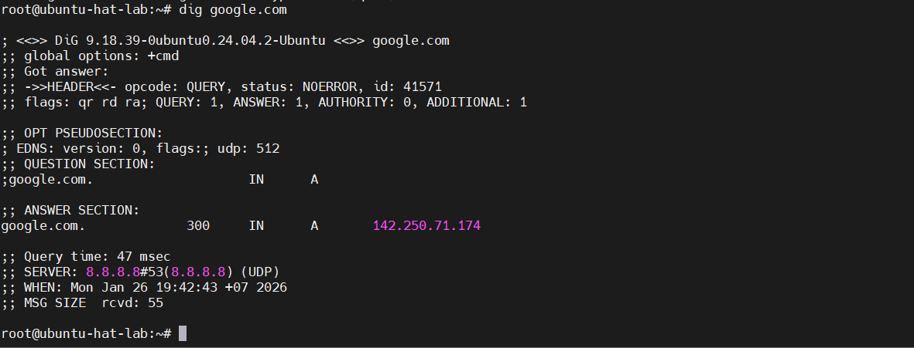

Trong đó:

- Output gồm các phần: **HEADER, ANSWER, QUESTION, NAME SERVER**:

- Phần **Header**: hiển thị một bản tóm tắt ngắn gọn về lệnh mà bạn đã chạy. Giá trị “opcode” hiển thị hành động mà dig đã thực hiện. Trong khi đó, giá trị "status" xuất kết quả tổng thể của truy vấn.

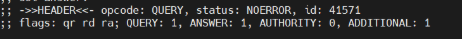

Phần **Question** hiển thị danh sách các truy vấn mà bạn đã thực hiện thông qua dig. Cột đầu tiên in tên miền hoàn chỉnh theo sau là lớp truy vấn và loại bản ghi DNS.


Phần **Answer** hiển thị kết quả truy vấn của bạn. Cột đầu tiên chứa tên miền hoàn chỉnh theo sau là giá trị “Time To Live” của nó. Cột thứ ba và thứ tư hiển thị loại truy vấn và loại bản ghi DNS, trong khi cột thứ năm xuất kết quả.

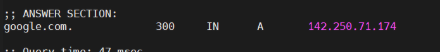

Phần **Nameserver** chứa thông tin chi tiết về DNS server được sử dụng cho lệnh này. `QUERY TIME` là lượng thời gian mà máy chủ cần để xử lý truy vấn. Giá trị `SERVER` là địa chỉ IP của nameserver và `MSG SIZE` hiển thị kích thước của truy vấn tính bằng byte.

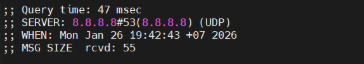

#### Truy vấn DNSServer chỉ cần biết mỗi IP

Check nhanh địa chỉ IP của 1 **DNSServer** ta dùng lệnh sau

```bash
dig +short google.com
```

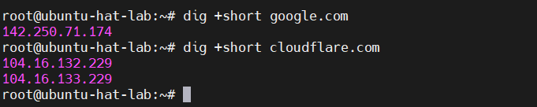

#### Truy vấn DNSServer chỉ cần biết mỗi Answer Section

```bash
dig google.com +noall +answer
```

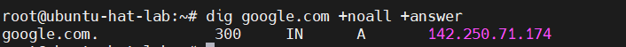

=> Tuỳ chọn này tắt tất cả section chỉ hiển thị mỗi **Answer Section**

#### Truy vấn ngược

Nếu ta chỉ nhớ mỗi địa chỉ IP mà quên tên miền thì ta cũng có thể dùng cú pháp truy vẫn ngược để truy xuất tên miền

```bash
dig -x 72.30.38.140 +short
```

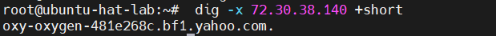

=> Dùng tuỳ chọn `-x` để truy vấn ngược

#### Truy vấn đường dẫn của gói tin tới DNSServer hay theo dõi đường đi truy vấn DNS(Trace)

Đây là một trong những tính năng mạnh mẽ nhất của `dig` để chẩn đoán sự cố. Tùy chọn `+trace` sẽ mô phỏng lại cách một trình phân giải DNS tìm kiếm thông tin, bắt đầu từ các **Máy chủ gốc (root servers)**.

Ví dụ:

```bash
dig google.com +trace -4 (Chỉ trace IPv4)
```

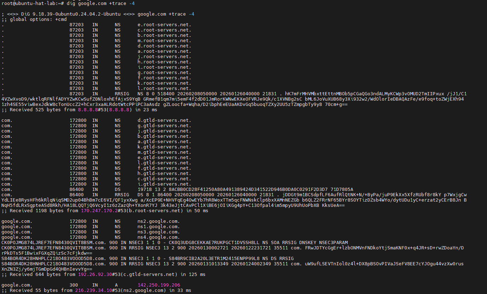

#### Kiểm tra DNSSEC

**DNSSEC** là extension tăng cường bảo mật cho DNS bằng cách xác thực các phản hồi. Cho nên, để xem 1 tên có kích hoạt **DNSSEC** thì ta dùng tuỳ chọn `+dnssec`

```bash
dig google.com +dnssec
```

#### Truy vấn A Record (IPv4)

```bash
dig google.com a
```

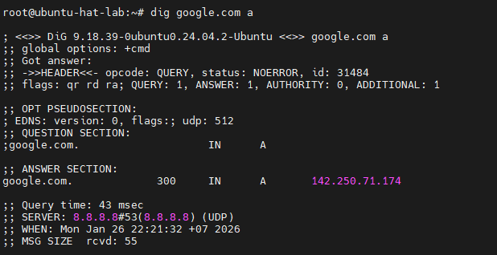

#### Truy vấn AAAA Record (IPv6)

```bash
dig google.com aaaa
```

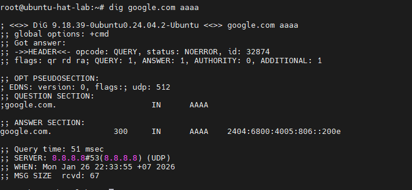

#### Truy vấn CN Record (Canonical Name)

Truy vấn bản ghi các tên miền phụ của **DNSSerrver**:

```bash
dig google.com cn
```

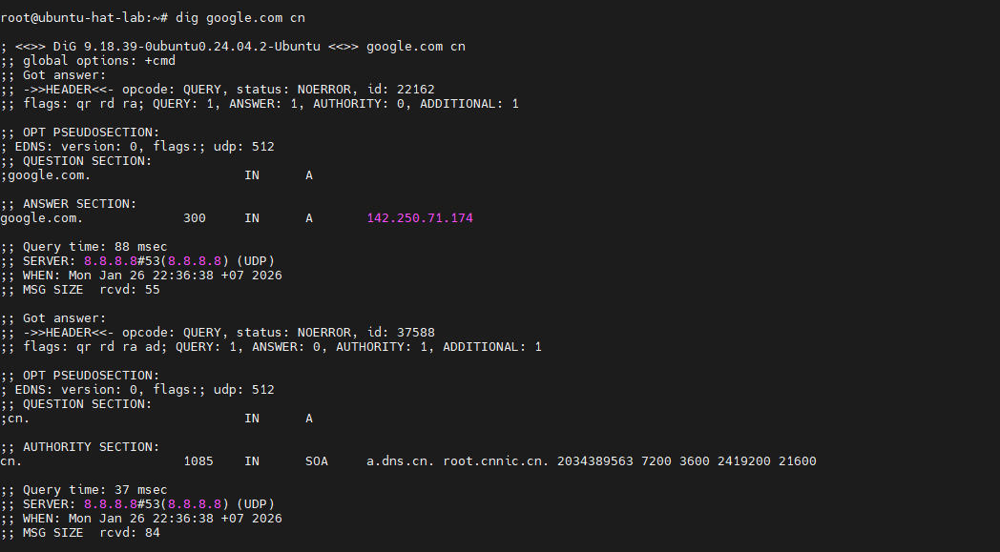

Trong đó:

- Phần **Question Section** ban đầu nó vẫn hỏi tên miên chính `google.com` và được reply bằng phần **Answer Section**
- Nhưng `dig` sẽ hỏi thêm để truy vấn `cn`(tên miền phụ)  
  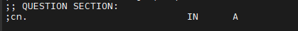
- Nhưng kết quả ra được đó là không có bản ghi (A Record) cho tên miền `cn`  
  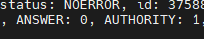
=> Vì `cn` là **TLD(Top-Level Domain)** cho nên nó không có A Record
- Phần **Authority Section** gửi lại bản ghi SOA
=> `google.com` chỉ có tên miền chính duy nhất không có tên miền phụ

#### Truy vấn NS Record

Truy vấn các NameServer mà tên miền `google.com` đang quản lí

```bash
dig google.com ns
```

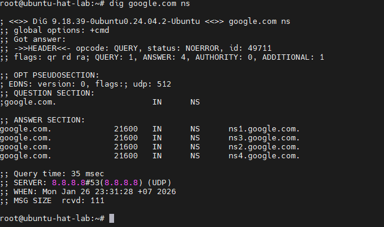

=> Trỏ về 4 hostname chứ không trỏ về IP `ns1.google.com`,..

#### Truy vấn MX Record

Nếu bạn muốn biết email gửi đến tên miền `google.com` sẽ được xử lý bởi máy chủ nào, hãy dùng lệnh sau:

```bash
dig google.com mx +noall +answer
```

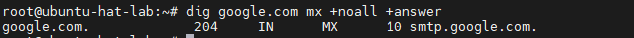

=> Kết quả sẽ hiện ra máy chủ thư và độ ưu tiên

#### Truy vấn TXT Record

Để truy cập dữ liệu văn bản được liên kết với một tên miền cụ thể, hãy truy xuất bản ghi TXT:

```bash
dig google.com txt +noall +answer
```

#### Truy vấn tất cả bản ghi cùng lúc

Để truy cập tất cả các bản ghi DNS cho một tên miền cụ thể cùng với địa chỉ IP, hãy sử dụng tùy chọn `any`:

```bash
dig google.com any +noall +answer
```

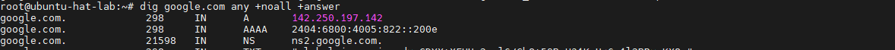

#### Tùy chỉnh đầu ra lệnh `dig`

Khi sử dụng công cụ `dig`, bạn có thể đặt các mục được sử dụng thường xuyên làm mặc định cho lệnh `dig` để tối ưu hóa đầu ra và đạt được kết quả mong muốn trong thời gian ngắn nhất. Cần lưu ý rằng thông tin do `dig` cung cấp được lưu trữ trong tệp `~/.digrc`. Tệp này có thể được chỉnh sửa. Do đó, hãy truy cập nội dung của tệp này bằng cách thực hiện lệnh sau bởi trình soạn thảo yêu thích của bạn:

```bash
sudo nano ~/.digrc
```

Sau đó, bạn có thể thêm các tùy chọn mong muốn vào nội dung của nó, ví dụ:

```text
+noall
+answer
```

Thoát khỏi tệp `(ctrl-x)`. Kết quả là, khi bạn thực thi lệnh `dig example.com`, đầu ra sẽ được hiển thị theo cách các tùy chọn `+noall` và `+answer` được thêm vào lệnh.

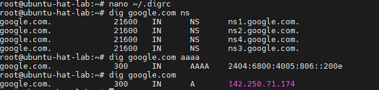

#### Truy vấn một số lượng lớn các tên miền

Một trong những ưu điểm của công cụ dig là nó cho phép bạn liệt kê một số lượng lớn tên miền trong một tệp (một tên miền trên mỗi dòng), và bằng cách sử dụng tệp đó, bạn có thể truy vấn một số lượng lớn tên miền. Với mục đích này, bạn phải sử dụng tùy chọn -f cùng với lệnh dig như sau:

```bash
dig -f test.txt
```

=>`test.txt` là một ví dụ về tệp chứa danh sách tên miền cần truy vấn. Thay thế test.txt bằng tệp mong muốn.
