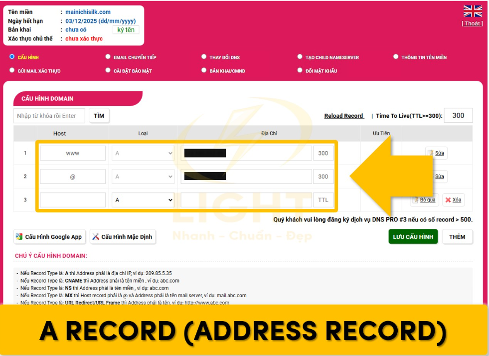
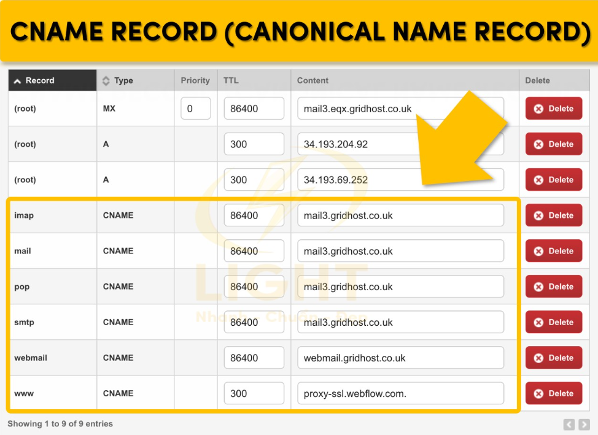
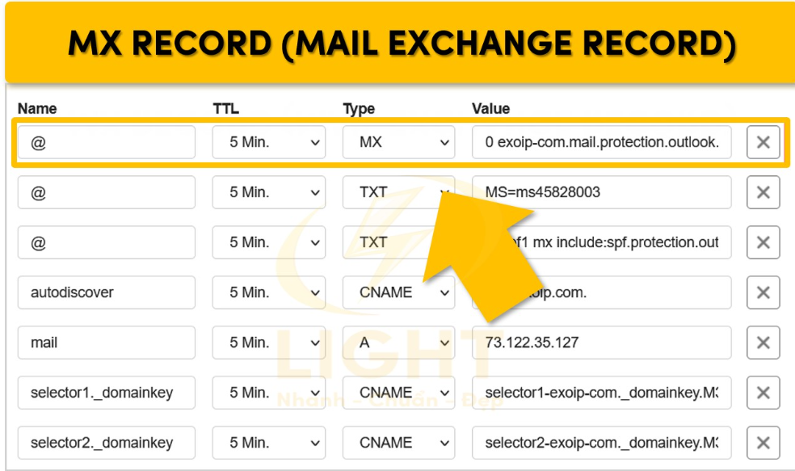
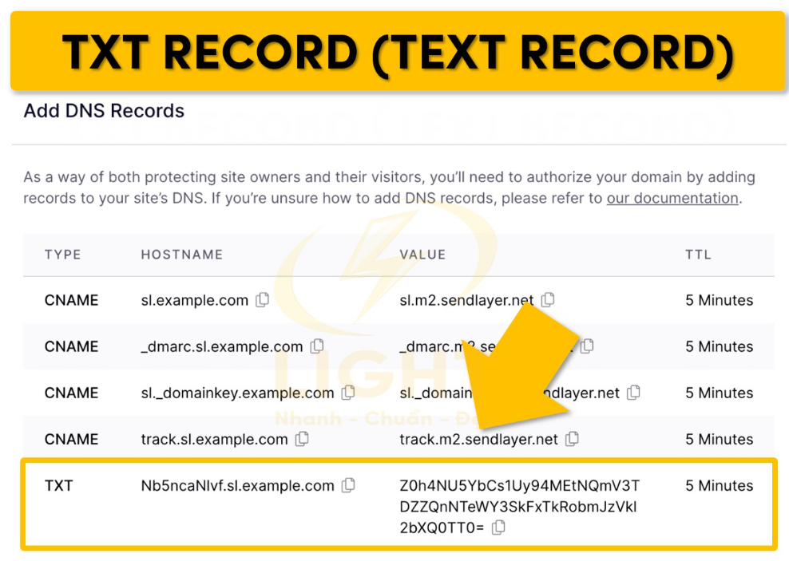
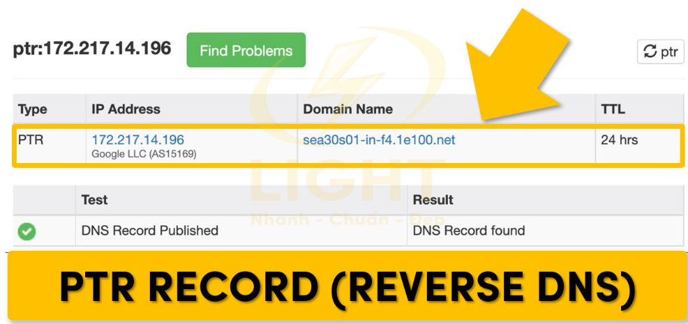

# DNS RECORD

## I. BẢN GHI TÀI NGUYÊN (Resource Record - RR) TRONG DNS

- Máy chủ **DNS(name server)** lưu trữ các bản ghi tài nguyên để ánh xạ giữa tên **miền(host name)** và địa chỉ IP hoặc thông tin khác.
- Mỗi bản ghi tài nguyên có 4 trường chính:

```bash
(Name, Value, Type, TTL).
```

Trong đó:

- **Name**: tên miền (hostname, domain name).
- **Value**: giá trị gắn với tên miền(IP, tên alias, mail server, ...).
- **Type**: loại bản ghi(A, NS, CNAME, MX, ...).
- **TTL(Time To Live)**: thời gian tồn tại cảu bản ghi trong cache, hết hạn thì phải hỏi lại.

## II. Các loại bản ghi (Type) chính

### 1. Bản ghi A (A Record)



**A Record** là bản ghi DNS cơ bản nhất, ánh xạ một tên miền tới một địa chỉ IPv4. Được thiết kế để hỗ trợ định tuyến lưu lượng từ tên miền đến máy chủ tương ứng, A Record là nền tảng cho mọi hoạt động truy cập Internet.

=> Nó là địa chỉ IPv4 của máy chủ

Ví dụ:

```bash
example.com     IN  A    93.184.216.34
```

### 2. Bản ghi CN (Canonical Name Record)



**CNAME Record (Canonical Name Record)** ánh xạ một **tên miền tới một tên miền khác** thay vì địa chỉ IP. Loại bản ghi này mang lại sự linh hoạt trong việc **quản lý các tên miền phụ** và các dịch vụ liên quan.

=> tạo bí danh (alias) cho một tên miền khác.

Ví dụ:

```bash
www.example.com     IN  CNAME   blog.example.com  
```

### 3. Bản ghi AAAA (IPv6 Address Record)

**AAAA Record** là bản ghi DNS cơ bản nhất, ánh xạ một tên miền tới một địa chỉ IPv6.

=> Nó ánh xạ địa chỉ IPv6 của máy chủ

Ví dụ:

```bash
example.com     IN  AAAA    2606:2800:220:1:248:1893:25c8:1946
```

### 4. Bản ghi MX (Mail Exchange Record)



**MX Record**: được thiết kế để định tuyến email đến đúng máy chủ thư của một tên miền. Đây là bản ghi DNS quan trọng cho bất kỳ hệ thống email nào, đảm bảo thư điện tử được xử lý một cách hiệu quả và đáng tin cậy.

=> Chỉ định máy chủ email phụ trách xử lí thư đến cho 1 tên miền cụ thể (có số priority để chỉ định thứ tự ưu tiên máy chủ nào nhận thư trước)

Ví dụ:

```bash
example.com     IN  MX   10 mail1.example.com.
example.com     IN  MX   20 mail2.example.com.
```

### 5. Bản ghi TXT (Text Record)



**TXT Record**: Là loại bản ghi DNS lưu trữ dữ liệu dạng văn bản, thường được sử dụng cho các mục đích xác thực và bảo mật.

=> Chứa dữ liệu dạng văn bản, dùng cho: Xác thực email(SPF,DMARC,DKIM), Chứng minh quyền sở hữu quyền sử dụng tên miền,...

Ví dụ:

```bash
example.com     IN  TXT   "v=spf1 include:_spf.google.com ~all"
```

### 6. CAA Record

**CAA Record**: chỉ định tổ chức cấp chứng chỉ SSL/TLS cho tên miền, giúp bảo vệ chống chứng chỉ SSL giả mạo.

Ví dụ:

```bash
example.com     IN  CAA  0 issue "letsencrypt.org"
```

- `0` = Không bắt buộc: Cho phép **Certification Authority (CA)** giải thích hoặc bỏ qua bản ghi nếu nó không hiểu.
- `1` = Critical (quan trọng): Nếu một CA không hiểu bản ghi CAA có flag = 1, nó phải từ chối cấp chứng chỉ.

### 7. NS Record (NameServer Record)

=> Chỉ định DNS Server nào quản lý bản ghi của tên miền. Dùng để trỏ về nhà cung cấp DNS đang dùng (Cloudflare, GoDaddy, v.v.). Ứng dụng của nó thường dùng để phân tán tải (HA)

Ví dụ:

```bash
example.com     IN  NS   ns1.cloudflare.com.
example.com     IN  NS   ns2.cloudflare.com.
```

### 8.SRV Record(Service Record)

=> Dùng để định tuyến đến dịch vụ cụ thể, ví dụ: VoIP (SIP), IM (XMPP), LDAP, v.v. SRV Record này chứa thông tin về hostname, cổng (port), độ ưu tiên.

Ví dụ:

```bash
_sip._tcp.example.com   IN  SRV  10  60  5060  sipserver.example.com.
```

Trong đó:

- Dùng để trỏ về nhà cung cấp DNS đang dùng (Cloudflare, GoDaddy, v.v.).
- `_sip` → tên dịch vụ (SIP – Session Initiation Protocol, dùng trong VoIP, gọi điện qua internet).
- `_tcp` → giao thức sử dụng (TCP)
- `10` (Priority – mức ưu tiên): càng nhỏ càng ưu tiên.
- `60` (Weight – trọng số): nếu có cùng priority, `weight` quyết định tỉ lệ chia tải. `weight` cao hơn sẽ có xác suất được chọn nhiều hơn, cao hơn.
- `5060` (Port – cổng).

### PTR Record (Reverse DNS)



**PTR Record** (Pointer Record): hay còn gọi là **Reverse DNS (rDNS)**, là bản ghi ánh xạ ngược địa chỉ IP về tên miền. Loại bản ghi này trái ngược với A Record, tập trung vào việc xác thực địa chỉ IP.

=> **PTR Record** xác nhận rằng một địa chỉ IP có liên kết với một tên miền cụ thể, đảm bảo tính minh bạch và độ tin cậy của kết nối mạng

