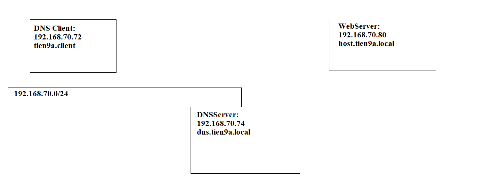
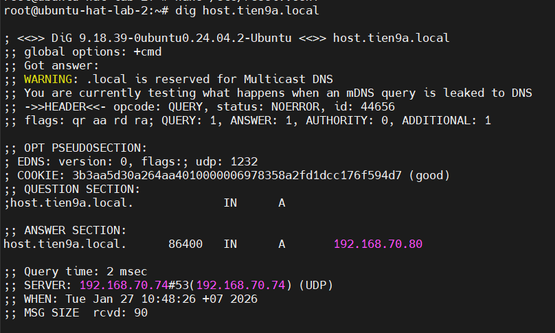
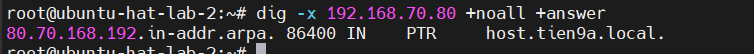

# Triển khai mô hình DNS server trên Ubuntu24.04

## Mục tiêu

- Triển khai một DNS server nội bộ với domain: `tien9a.local`
- Máy chủ DNS: `dns.tien9a.local` – IP: `192.168.70.74`
- Máy khách: `tien9a.client` – IP: `192.168.70.72`
- Phân giải tên miền `host.tien9a.local` thành IP `192.168.70.80`
- Hỗ trợ cả phân giải thuận (A record) và phân giải ngược (PTR record)
  
## Mô hình



## Thành phần chính của hệ thống

| Thành phần   | Vai trò                       |
| ------------ | ----------------------------- |
| BIND(named)  | Phần mềm DNS server           |
| `named.conf` | File cấu hình chính của BIND  |
| Zone file    | chứa bản ghi DNS cho tên miền |
| Reverse Zone | chứa bản ghi phân giải ngược  |

## Triển khai

### Bước 1: Cài đặt BIND9

```bash
sudo apt update
sudo apt install bind9 bind9utils bind9-dnsutils -y
```

Trong đó:

- `bind9 (Berkeley Internet Name Domain)`: Phần mềm DNS server.
- `bind9-utils`: Công cụ hỗ trợ kiểm tra DNS như `dig`, `nslookup`.

### Bước 2: Cấu hình file `named.conf.options`

```bash
sudo nano /etc/bind/named.conf.options
```

Tìm và sửa file cấu hình theo dòng sau:

```bash
options {                                # Đây là cấu hình toàn cục DNSServer,mọi zone sẽ bị ảnh hưởng
directory "/var/cache/bind";             # Chỉ định thư mục làm việc của BIND(lưu cache,filezone)


listen-on { 127.0.0.1; 192.168.70.74; }; # Chỉ định IP mà DNSServer sẽ lắng nghe
allow-query { any; };                    # Cho phép ai được lắng nghe
recursion yes;                           # Cho phép DNSServer hỏi hộ client


forwarders {                             # Chỉ định DNS upstream
8.8.8.8;                                 # Hỏi địa chỉ 8.8.8.8 trước
8.8.4.4;
};


dnssec-validation auto;                  # Bật kiểm tra DNSSEC
};
```

### Bước 3: Khai báo Zone

Mở file:

```bash
sudo nano /etc/bind/named.conf.local
```

Thêm nội dung:

```bash
zone "tien9a.local" IN {               # Khai báo một DNS zone (tien9a.local)
type master;                           # DNSServer này là máy chủ chính (authoritative) của zone
file "/etc/bind/db.tien9a.local";      # Chỉ định filezone chứa SOA, NS, A Record,...
};


zone "70.168.192.in-addr.arpa" IN {    # Khai báo Zone ngược (DNS đảo 3 octet đầu)
type master;                           # DNS server là authoritative cho reverse zone (Tự quản lý các bản ghi PTR)
file "/etc/bind/db.70.168.192";        # File chứa thông tin các PTR Record
};
```

### Bước 4: Tạo Forward Zone file

Mở file:

```bash
sudo nano /etc/bind/db.tien9a.local
```

Thêm nội dung:

```bash
$TTL 86400                                       # Thời gian cache mặc định cho các bản ghi trong zone (giây)
@ IN SOA dns.tien9a.local. root.tien9a.local. (  # Bản ghi SOA - Bản ghi quan trọng nhất của zone 
2026010101                                       # Số Seri phiên bản zonefile (chỉnh file số tăng)
3600                                             # Time Refresh: Thời gian (giây) DNS phụ hỏi DNS master về thay đổi
1800                                             # Time Retry: Nếu Refresh fail thì bao lâu thử lại 
604800                                           # Time Expire: Time zone hết hiệu lực nếu 2 con không liên lạc được
86400 )                                          # Cache cho truy vấn thất bại


@ IN NS dns.tien9a.local.                        # Bản ghi NS - DNSServer nào quản lí zone này
dns IN A 192.168.70.74                           # Bản ghi A Record
host IN A 192.168.70.80                          # Host nội bộ được phân giải
```

### Bước 5: Tạo Reverse Zone file

Mở file:

```bash
sudo nano /etc/bind/db.70.168.192
```

Thêm nội dung:

```bash
$TTL 86400
@ IN SOA dns.tien9a.local. root.tien9a.local. (
2026010101
3600
1800
604800
86400 )


@ IN NS dns.tien9a.local.                     
74 IN PTR dns.tien9a.local.
80 IN PTR host.tien9a.local.
```

### Bước 6: Kiểm tra cấu hình chính

```bash
sudo named-checkconf
sudo named-checkzone tien9a.local /etc/bind/db.tien9a.local
sudo named-checkzone 70.168.192.in-addr.arpa /etc/bind/db.70.168.192
```

### Bước 7: Khởi động DNSServer

```bash
sudo systemctl restart bind9
sudo systemctl enable bind9
sudo systemctl status bind9
```

### Bước 8: Cấu hình DNS cho Client (Ubuntu)

Mở file:

```bash
sudo nano /etc/netplan/01-netcfg.yaml
```

Cấu hình file như sau:

```bash
network:
    version: 2
    ethernets:
        ens33:
          addresses:
             - 192.168.70.72/24
          nameservers:
             addresses:
               - 192.168.70.74
             search:
               - tien9a.local
```

Mở file:

```bash
nano /etc/resolv.conf
```

Cấu hình:

```bash
nameserver 192.168.70.74
```

Áp dụng:

```bash
sudo netplan apply
```

### Bước 9: Kiểm tra hoạt động DNS

1. Phân giải thuận

```bash
dig host.tien9a.local
```

Kết quả nhận được:



2. Phân giải nghịch:

```bash
dig -x 192.168.70.80 +noall + answer
```


