# CONFIG WORDPRESS PAGE WITH DOMAIN NAME `cloud.test`

## I. MỤC TIÊU

- Triển khai DNS Server nội bộ sử dụng BIND9  
- Cấu hình domain name cloud.test cho website WordPress  
- Thực hiện phân giải thuận (A record) cho website  
- Thực hiện phân giải ngược (PTR record) cho máy chủ Web  
- Kiểm tra và xác nhận DNS hoạt động đúng với WordPress

## II. MÔ HÌNH BÀI LAB

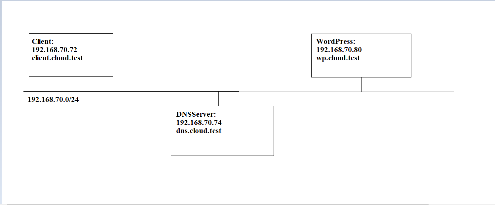

## III. THÔNG TIN MÔ HÌNH

### 1. Domain sử dụng

- Domain website: `cloud.test`
- FQDN website WordPress: `www.cloud.test`

  - `.test` là domain được RFC quy định dành riêng cho testing, an toàn và không gây xung đột mDNS

### 2. IP và vai trò các máy

| Máy        | Hostname            | IP              | Vai trò          |
| ---------- | ------------------- | --------------- | ---------------- |
| DNS Server | `dns.cloud.test`    | `192.168.70.74` | BIND9 DNS Server |
| Web Server | `cloud.test`        | `192.168.70.80` | WordPress        |
| Client     | `client.cloud.test` | `192.168.70.72` | Truy vấn DNS     |

## IV. THÀNH PHẦN CHÍNH CỦA HỆ THỐNG

| Thành phần           | Vai trò               |
| -------------------- | --------------------- |
| BIND9 (`named`)      | Phần mềm DNS server   |
| `named.conf.options` | Cấu hình toàn cục DNS |
| `named.conf.local`   | Khai báo zone         |
| Forward Zone         | Phân giải tên → IP    |
| Reverse Zone         | Phân giải IP → tên    |

## V. TRIỂN KHAI

### Bước 1: Cài đặt trên DNSServer(BIND9)

Thực hiện trên DNS Server – `192.168.70.74`

```bash
sudo apt update
sudo apt install bind9 bind9utils bind9-dnsutils -y
```

Kiểm tra dịch vụ:

```bash
systemctl status bind9
```

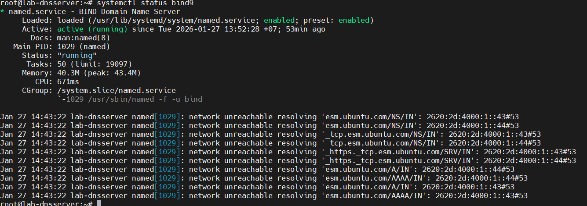

### Bước2: Cấu hình DNS toàn cục

Trên **DNSServer** `192.168.70.74`. Mở file cấu hình:`/etc/bind/named.conf.options`

```bash
nano /etc/bind/named.conf.options
```

Chèn nội dung:

```bash
options {
    directory "/var/cache/bind";

    recursion yes;
    allow-query { any; };
    listen-on { 127.0.0.1; 192.168.70.74; };

    forwarders {
        8.8.8.8;
        8.8.4.4;
    };

    dnssec-validation no;
};
```

### Bước 3: Khai báo Zone DNS

Trên **DNSServer** `192.168.70.74`. Mở file cấu hình :`/etc/bind/named.conf.local`

```bash
nano /etc/bind/named.conf.local
```

Thêm nội dung:

```bash
zone "cloud.test" {
    type master;
    file "/etc/bind/zones/db.cloud.test";
};

zone "70.168.192.in-addr.arpa" {
    type master;
    file "/etc/bind/zones/db.192.168.70";
};
```

### Bước 4: Tạo Forward Zone(A Record)

Trên **DNSServer** `192.168.70.74`. Tạo thư mục Zone:

```bash
sudo mkdir /etc/bind/zones
```

Phân quyền và bảo mật file:

```bash
sudo chown -R root:bind /etc/bind/zones
sudo chmod -R 755 /etc/bind/zones
```

Chỉnh sửa cấu hình file `/etc/bind/zones/db.cloud.test`

```bash
nano /etc/bind/zones/db.cloud.test
```

Chèn nội dung sau:

```bash
$TTL 86400
@ IN SOA dns.cloud.test. admin.cloud.test. (
2026012701
3600
1800
604800
86400
)


@ IN NS dns.cloud.test.                       # Máy chịu trách nghiệm phân giải DNS cho Domain này
@ IN  A   192.168.70.80                       # Bản ghi A Record cho Domain gốc cloud.test
dns IN A 192.168.70.74                        # Máy dns.cloud.test có địa chỉ IP là 192.168.70.74”
www IN A 192.168.70.80                        # Người dùng truy cập www.cloud.test sẽ vào Web Server WordPress
```

### Bước 5: Tạo Reverse Zone (PTR Record)

Trên **DNSServer** `192.168.70.74`. Chỉnh sửa cấu hình file `/etc/bind/zones/db.192.168.70`

```bash
sudo nano /etc/bind/zones/db.192.168.70
```

Chèn nội dung sau:

```bash
$TTL 86400
@   IN  SOA dns.cloud.test. admin.cloud.test. (
        2026012701
        3600
        1800
        604800
        86400
)

@       IN  NS      dns.cloud.test.
74      IN  PTR     dns.cloud.test.
80      IN  PTR     cloud.test.
```

### Bước 6: Kiểm tra cấu hình DNS

Trên **DNSServer** `192.168.70.74`:

```bash
sudo named-checkconf
sudo named-checkzone cloud.test /etc/bind/zones/db.cloud.test
sudo named-checkzone 70.168.192.in-addr.arpa /etc/bind/zones/db.192.168.70
```

Restart DNS:

```bash
sudo systemctl restart bind9
```

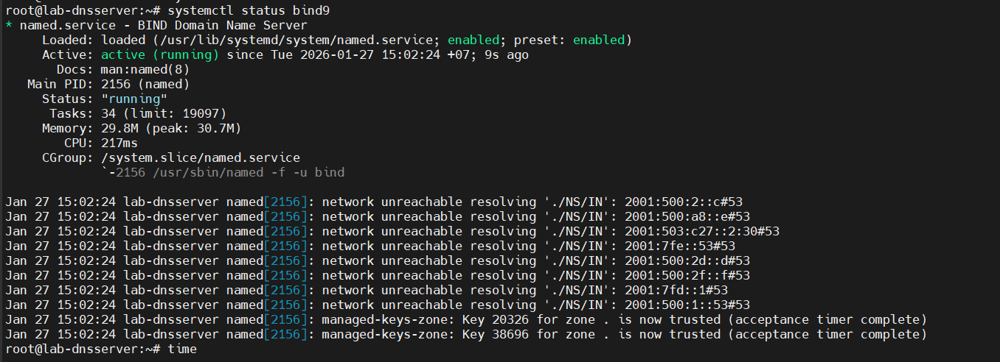

### Bước 7: Kiểm tra phân giải DNS - Cấu hình Client dùng DNS nội bộ

#### Trên máy `192.168.70.72` cấu hình DNS nội bộ 

File `/etc/resolv.conf` trong máy VM <hay bất kỳ máy Linux khác> dùng để cấu hình DNS resolver – tức là khai báo máy chủ DNS mà hệ thống sẽ hỏi khi phân giải tên miền thành IP.

```bash
nano /etc/resolv.conf
```

Thêm:

```bash
nameserver 192.168.70.74
```

#### Forward Lookup

Trên con **DNSClient** `192.168.70.72` ta:

```bash
dig www.cloud.test
nslookup www.cloud.test
```

Kết quả nhận được:

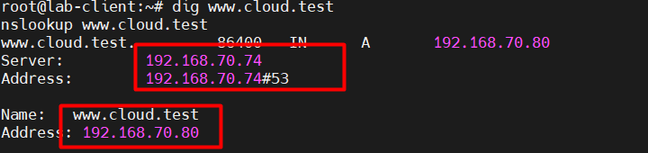

#### Reverse Lookup

Trên con **DNSClient** `192.168.70.72` ta:

```bash
dig -x 192.168.70.80
```

Kết quả nhận được:

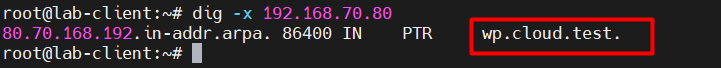

### Bước 8: Cấu hình nhanh WordPress

Trên con **WebServer** `192.168.70.80` thì các bước tạo trang WordPress đã có hướng dẫn chi tiết hãy làm theo các bước sau:

Cài trang WordPress và phân quyền cho **DocumentRoot** :

```bash
cd /var/www/
wget https://wordpress.org/latest.zip
unzip latest.zip
mv wordpress cloud.test
chown -R www-data:www-data cloud.test
chmod -R 755 cloud.test
```

Chỉnh file `wp-config-sample.php` thành `wp-config.php`:

```bash
cd /var/www/cloud.test
cp wp-config-sample.php wp-config.php
```

`Lưu ý`: Khai báo Server Name cho Apache

```bash
sudo nano /etc/apache2/apache2.conf

# Thêm dòng cuối file

ServerName cloud.test
```

Tạo file VirtualHost như sau:

```bash
nano /etc/apache2/sites-available/cloud.test.conf

# Thêm cấu hình
<VirtualHost *:80>
    ServerName cloud.test
    ServerAlias www.cloud.test
    DocumentRoot /var/www/cloud.test

    <Directory /var/www/cloud.test>
        AllowOverride All
        Require all granted
    </Directory>

    ErrorLog ${APACHE_LOG_DIR}/cloud_error.log
    CustomLog ${APACHE_LOG_DIR}/cloud_access.log combined
</VirtualHost>
```

Restart Apache:

```bash
a2dissite 000-default.conf
a2ensite cloud.test.conf
a2enmod rewrite
systemctl reload apache2
```

Tạo user Mysql vá Database `Cloud.test`để import vào file `config.php`

```sql
CREATE DATABASE Cloud_test;
CREATE USER 'tien9a'@'localhost' IDENTIFIED BY 'Tien9a@123';
GRANT ALL PRIVILEGES ON Cloud_test.* TO 'tien9a'@'localhost';
FLUSH PRIVILEGES;
EXIT;
```

Mở port lắng nghe các địa chỉ ngoài của MySQL nếu muốn máy ngoài truy cập vào:

```bash
nano /etc/mysql/mysql.conf.d/mysqld.cnf

# Sửa chỗ bind address
127.0.0.1 -> 0.0.0.0
```

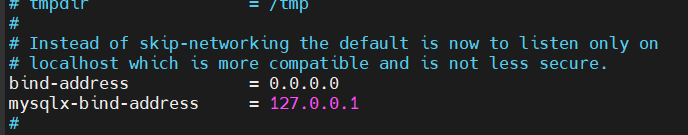

Tiếp theo import DataBases vào file `wp-config.php`

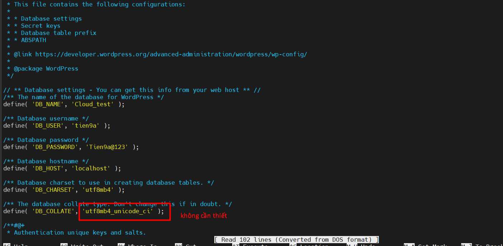

Xong Restart lại Apache & Bật site:

```bash
sudo systemctl restart apache2
```

### Bước 9: Kiểm tra trang WordPress

#### Truy cập trang WordPress bằng IP

Sau đó ta sẽ được trang WordPress truy cập bằng IP như sau đây:(Có thể truy cập bằng máy đang lab vì đã chỉnh port)

```text
http://192.168.70.80
```

Hoàn thành nốt các bước nhập thông tin rồi `Install Wordpress`

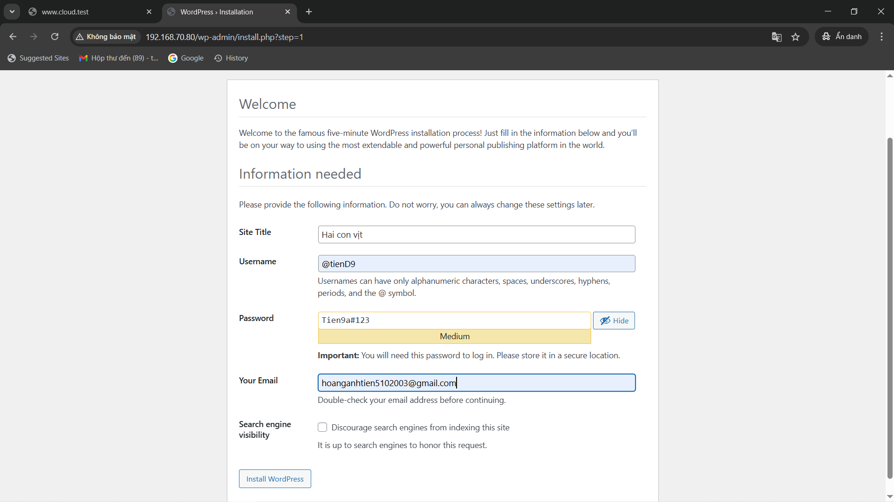

Sau khi truy cập thì trang WordPress yêu cầu cấu hình để tạo DB dự phòng:

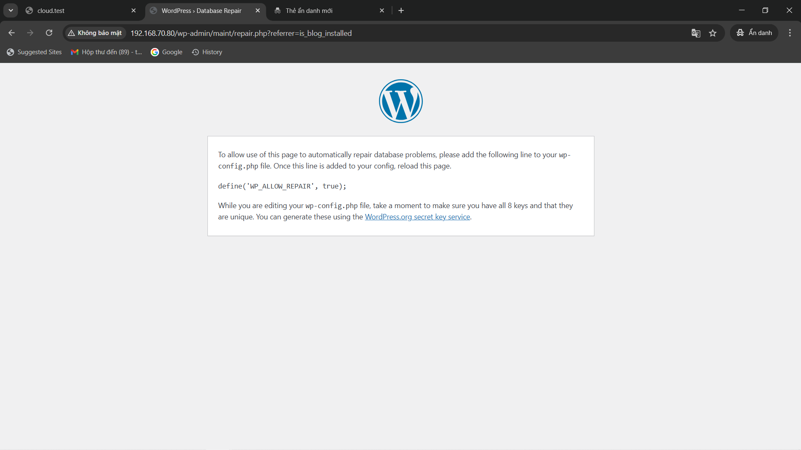

Ta vào lại file config `wp-config.php` thêm dòng `define('WP_ALLOW_REPAIR', true);`

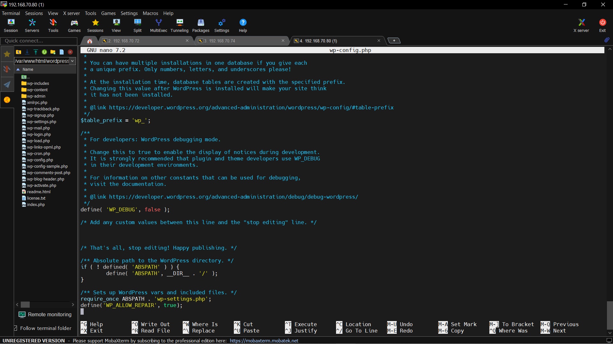

Restart lại Apache và Page. Giao diện trang lúc này sẽ hiện

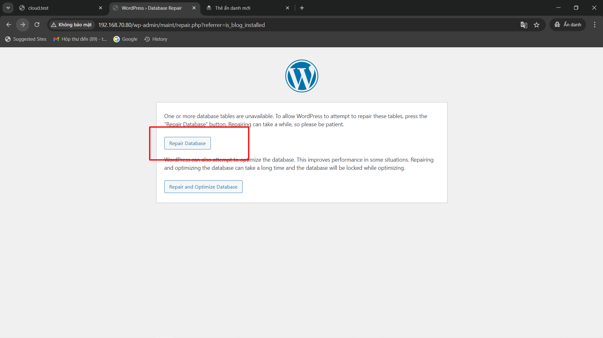

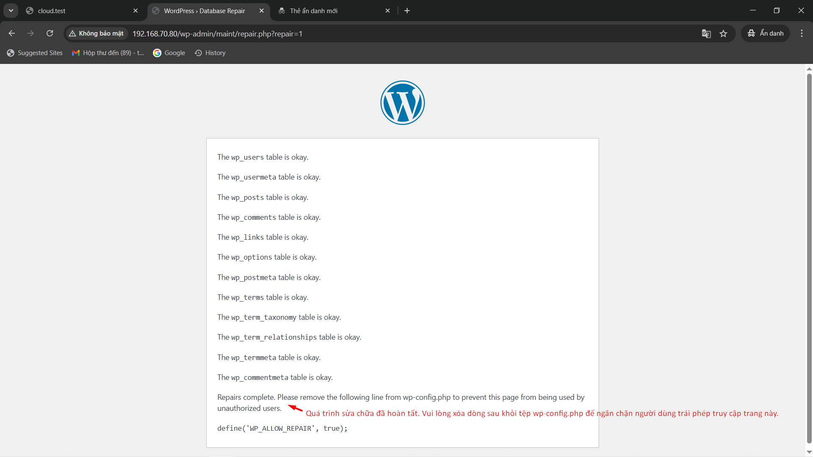

Rồi sau đó xoá dòng ``define('WP_ALLOW_REPAIR', true);`` trong file ``wp-config.php``rồi restart Apache và reload lại trang login:

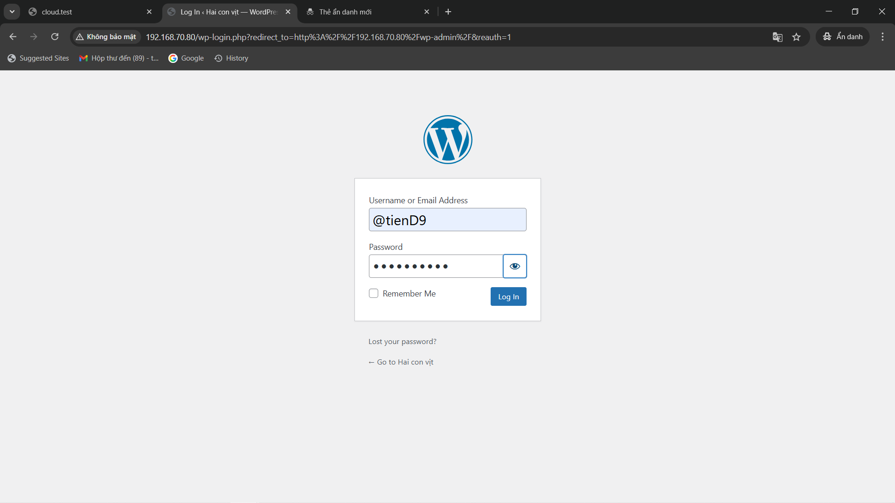

Sau khi vào giao diện WordPRess, ta thử tạo trang blog như sau:

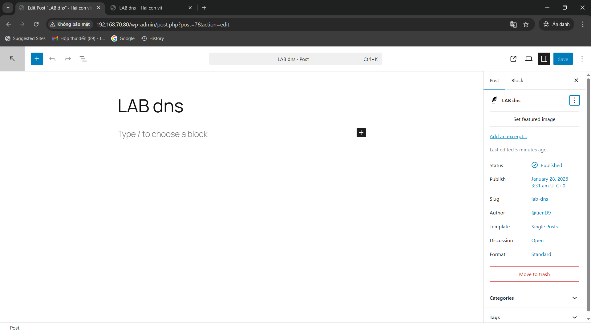

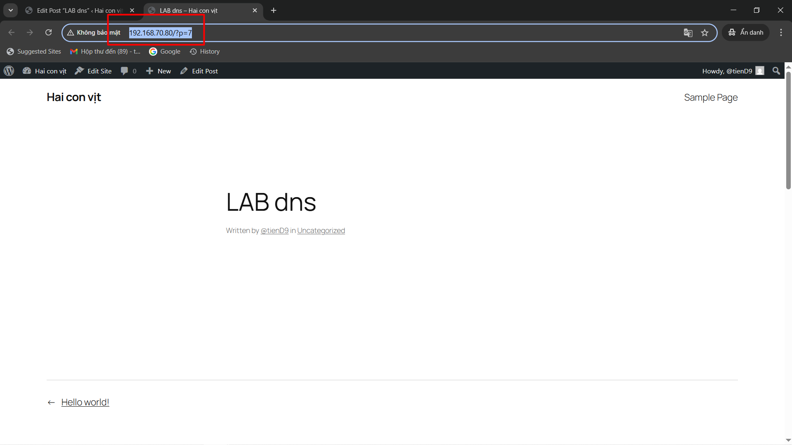

#### Truy cập trang WordPress bằng tên miền `Cloud.test`

Truy cập trình duyệt trang WordPress `Cloud.test` từ máy Client `192.168.70.72`:

```bash
curl http://www.cloud.test
```

hoặc:

```bash
dig www.cloud.test
```

Kết quả hiển thị:

=> Ở đây, ta mắc một lỗi rất cơ bản khi lab DNS đó là `DNS_PROBE_FINISHED_NXDOMAIN` (hay **NXDOMAIN**)

- **NXDOMAIN**(Non-Existent Domain): Domain không tồn tại trong DNS, hay hiểu là khi ta Query DNSServer không tìm thấy bản ghi cho tên miền đó

Ví dụ:

```bash
dig cloud.test
```

Trả về:

```bash
status: NXDOMAIN
```

→ DNS bảo: “tao không biết thằng `cloud.test` là ai cả”.

Nguyên nhân xảy ra lỗi **NXDOMAIN**:

- **DNSServer chưa hoạt động**

- **Chưa khai báo zone**:

  - Chưa có file zone `cloud.test`
  - Chưa có zone `"cloud.test" { ... }` trong `named.conf`

  -> DNS không biết domain này tồn tại

- **Zone có nhưng không có bản ghi**

  - Ví dụ zone có rồi nhưng không có A record:

  ```bash
  cloud.test.   IN   A   192.168.1.10
  ```

  → `dig cloud.test` = `NXDOMAIN`

- **SOA / NS sai**

- **Client hỏi nhầm DNS**

- **Forwarder ăn gian**

### Bước 10: Cách Check Lỗi `NXDOMAIN`

#### 1. Check DNS Server có đang hoạt động không

Trên con này DNSServer `192.168.70.74`. Trước tiên, phải đảm bảo dịch vụ DNS (BIND9) đang chạy.

```bash
systemctl status named
```

- `active (running)` → OK
- `inactive / failed` → DNS Server không hoạt động

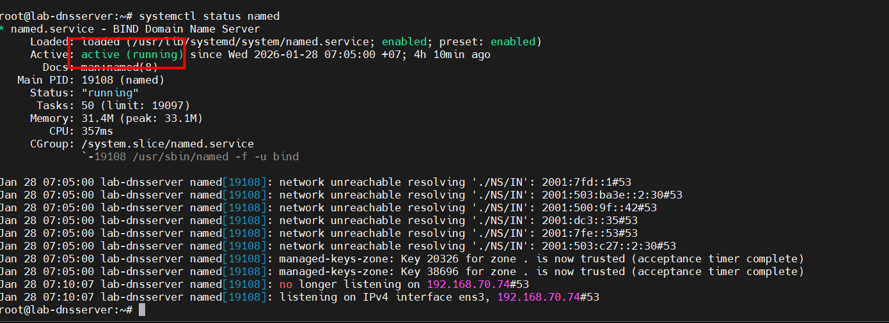

=> Trạng thái `active`-> OK

Nếu DNS chưa chạy:

```bash
systemctl start named
systemctl enable named
```

#### 2. Check cấu hình tổng thể BIND

Trên con **DNSServer**. Kiểm tra lỗi cú pháp trong các file cấu hình DNS.

```bash
named-checkconf
```

- Không có output → cấu hình hợp lệ
- Có lỗi → sửa theo dòng báo lỗi

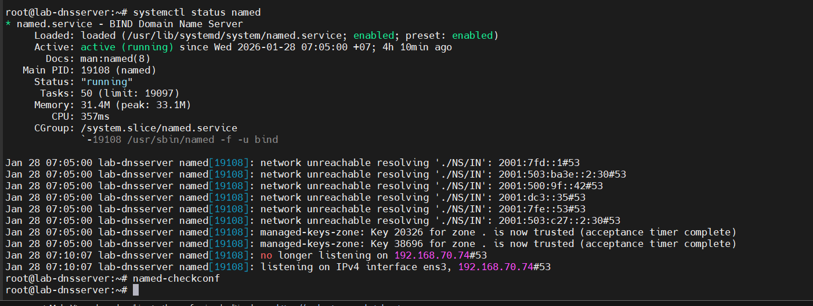

=> Không có Output -> OK

#### 3. Check đã khai báo zone `cloud.test` hay chưa

Trên con **DNSServer**. Mở file cấu hình zone (ví dụ: /etc/named.conf hoặc /etc/bind/named.conf.local):

```bash
cat /etc/named.conf
```

Hoặc:

```bash
cat /etc/bind/named.conf.local
```

Phải có khai báo zone dạng:

```bash
zone "cloud.test" {
    type master;
    file "/var/named/cloud.test.zone";
};
```

- Nếu chưa có → DNS không biết domain tồn tại → `NXDOMAIN`

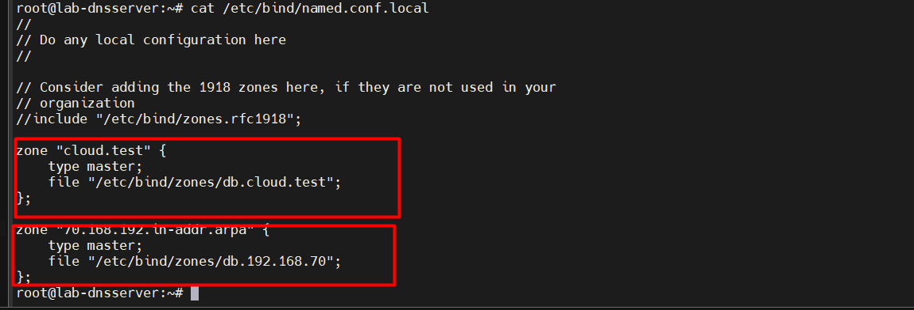

=> Đã khai báo 2 Zone thuận và ngược

#### 4. Check file zone có tồn tại không

Trên con **DNSServer**. Kiểm tra file zone đã khai báo:

```bash
ls -l /var/named/cloud.test.zone
```

hoặc:

```bash
 ls -l /etc/bind/zones
```

- Không tồn tại → tạo file zone
- Có nhưng sai quyền → DNS không đọc được

Fix quyền:

```bash
chown root:named /var/named/cloud.test.zone
chmod 640 /var/named/cloud.test.zone
```

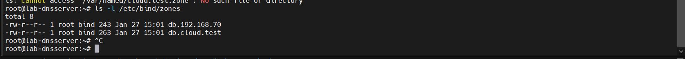

=> Đã tồn tại zone và cũng đã được cấp quyền

#### 5. Check nội dung file zone (SOA / NS / A record)

Trên con **DNSServer**. Kiểm tra cấu trúc zone:

```bash
sudo named-checkconf
sudo named-checkzone cloud.test /etc/bind/zones/db.cloud.test
sudo named-checkzone 70.168.192.in-addr.arpa /etc/bind/zones/db.192.168.70
```

- `OK` → zone hợp lệ
- `FAILED` → lỗi SOA, NS, syntax

Ví dụ zone tối thiểu đúng:

```bash
$TTL 86400
@   IN  SOA ns1.cloud.test. admin.cloud.test. (
        2026012801
        3600
        1800
        604800
        86400
)


@       IN  NS      ns1.cloud.test.
ns1     IN  A       192.168.1.2
@       IN  A       192.168.1.10
www     IN  A       192.168.1.10
```

- Thiếu A `record` cho domain → `NXDOMAIN`

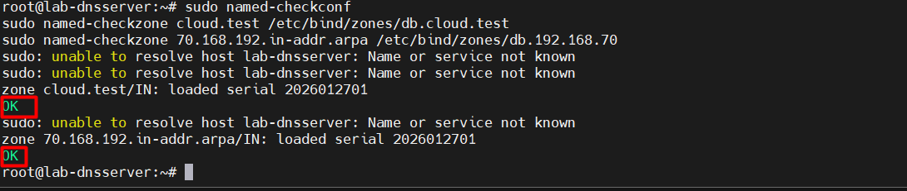

=> Có `OK`-> đúng rồi

#### 6. Check 3 con có hỏi đúng DNS Server không

Tra:

```bash
cat /etc/resolv.conf
```

Hoặc (Ubuntu mới):

```bash
resolvectl status
```

Phải thấy:

```bash
nameserver <IP_DNS_SERVER>
```

- Nếu đang trỏ 8.8.8.8 hoặc DNS khác → DNS nội bộ không được hỏi

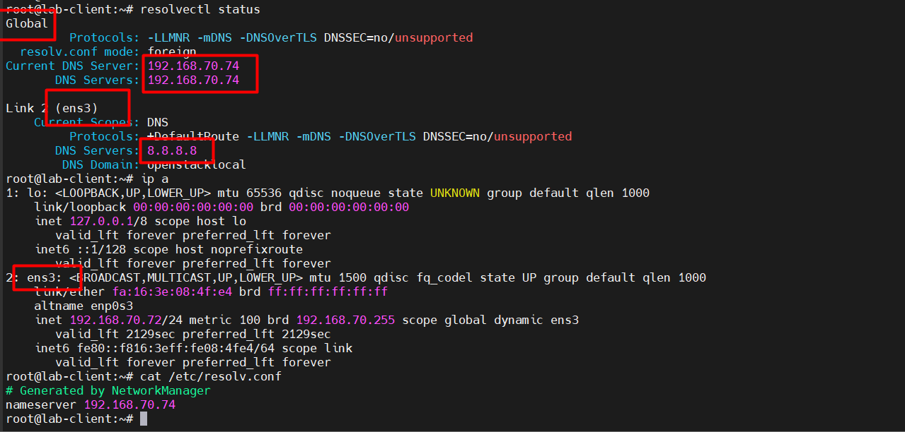
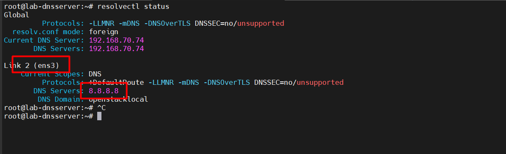
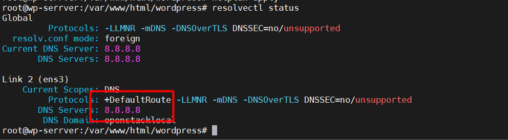

=> Đã bắt được lỗi sai **NXDOMAIN** ở dây đó là: Ở giao diện `Global` thì Client vẫn nhận diện được DNS nhưng ở card mạng `ens3` 3 con đang Query Google DNS thay vì DNS nội bộ.

#### 7. Check bằng dig chỉ định DNS Server

Query trực tiếp vào **DNS Server** để loại trừ lỗi Client:

```bash
dig @192.168.70.74 cloud.test +noall +answer
dig @192.168.70.74 www.cloud.test +noall +answer
```

- Có IP → DNS OK
- `NXDOMAIN` → lỗi nằm ở DNS Server

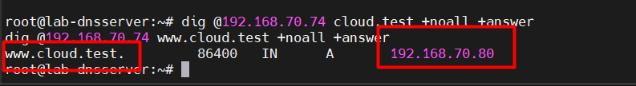

=> Hiện IP -> `OK`

#### 8 Check forwarder (tránh bị “ăn gian”)

Trên con **DNSServer**. Mở file cấu hình DNS:

```bash
cat /etc/bind/named.conf.options
```

Nếu thấy:

```bash
forwarders {
    8.8.8.8;
    1.1.1.1;
};
```

→ Google DNS không biết domain nội bộ
→ trả về NXDOMAIN

Giải pháp:

- Xoá forwarder
- Hoặc cấu hình forward only / forward first phù hợp

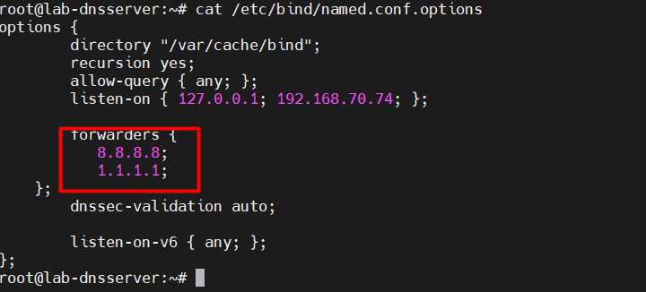

=>`OK` -> Không xảy ra vấn đề gì

### Bước 12: Debug lỗi `NXDOMAIN`

#### Hiểu rõ bản chất

Do **Systemd-resolved** ưu tiên DNS theo interface:

Thứ tự ưu tiên:

- DNS gắn với interface (ens3) ← đang là `8.8.8.8`
- DNS Global

Nên:

- `dig cloud.test` → hỏi `8.8.8.8`
- `cloud.test` là domain nội bộ → NXDOMAIN

### Bước 11: Tìm cách DEBUG tối ưu

#### Cách 1: FIX mỗi con client

Cả 3 con `Client`, `Server` và `Web` khi tra check `resolvectl status` thì giao diện `ens3` đều đang Query Google DNS và mục tiêu của ta là truy cập được `www.cloud.test`.

=> Chỉ cần sửa DNS trên con Client(client.cloud.test)

Bởi vì -> **Web Server** vẫn cần DNS để:

- WordPress update
- Gọi API ngoài
- Resolve callback / cron / plugin

=> Do đó, trong môi trường lab chuẩn, nên trỏ DNS cho toàn bộ VM về DNS nội bộ.

#### Cách 2: Fix trên cả 3 con VM

Để giúp mô hình lab chuẩn Enterprise, không phụ thuộc Internet và Log debut không bị loạn thì ta lên sửa file `nmcli`,`netplan` or `resolved file` tuỳ theo máy đang ưu tiên cái nào hơn

=> **MỌI MÁY TRONG LAB → DNS trỏ về DNS Server nội bộ**

### Bước 12: Tiến hành DEBUG

Ta chọn cách 2 để FIX vì cần hiểu rõ bản chất của mô hình lab DNS + WordPress này

#### 1. Check xem VM đang ưu tiên cấu hình mạng bằng file nào `nmcli`,`netplan` hay `resolved.conf`

Check connection của `nmcli`:

```bash
nmcli con show
```

=> Cả 3 máy không thấy connect nào chứng tỏ không dùng `nmcli`

Chỉnh file `resolved.conf`:

```bash
sudo nano /etc/systemd/resolved.conf
```

Add cấu hình:

```bash
[Resolve]
DNS=192.168.70.74
Domains=cloud.test
```

Kiểm tra:

```bash
resolvectl status
```

=> Cả 3 máy vẫn Query Google DNS -> VM ưu tiên cấu hình ở `netplan` hơn

Chỉnh file `netplan`. Trước hết check :

```bash
ls /etc/netplan
```

-> Trên **Client**:

```bash
# Mở cấu hình Netplan
nano /etc/netplan/00-installer-config.yaml

# Thêm cấu hình
network:
  version: 2
  ethernets:
    ens3:
      dhcp4: true
      dhcp4-overrides:
        use-dns: false
      nameservers:
        addresses:
          - 192.168.70.74
        search:
          - cloud.test

# Áp dụng cấu hình
sudo netplan generate
sudo netplan apply

# Khôi phục systemd-Resolved
rm -f /etc/resolv.conf
ln -s /run/systemd/resolve/stub-resolv.conf /etc/resolv.conf
systemctl restart systemd-resolved
```

-> Trên **DNSServer**: `ens3` đang nhận DNS từ DHCP OpenStack, `Cloud-init` + `netplan` vẫn ép DNS vào card

```bash
# Chặn DNS từ DHCP trên ens3
mkdir -p /etc/systemd/network/ens3.network.d
nano /etc/systemd/network/ens3.network.d/override.conf

# Dán cấu hình
[DHCP]
UseDNS=no
UseDomains=no

# Mở cấu hình Netplan
nano /etc/netplan/01-netcfg.yaml

# Thêm cấu hình
network:
  version: 2
  renderer: networkd
  ethernets:
    ens3:
      dhcp4: no
      addresses:
        - 192.168.70.74/24
      gateway4: 192.168.70.1
      nameservers:
        addresses:
          - 127.0.0.1
        search:
          - cloud.test

# Diệt Cloud-init Network
nano /etc/cloud/cloud.cfg.d/99-disable-network-config.cfg

# Dán
network: {config: disabled}

# Reset resolv.conf về stub
rm -f /etc/resolv.conf
ln -s /run/systemd/resolve/stub-resolv.conf /etc/resolv.conf

# Add cấu hình và Restart systemd-resolved
netplan generate
netplan apply
systemctl restart systemd-networkd
systemctl restart systemd-resolved
reboot
```

-> Trên **WebServer**: Trên WM này đặc biệt hơn vì khi ta dùng `resolvectl status` ta thấy cả giao diện `global` của con này cũng đang Query Google DNS cho nên **khả năng cao** bị metadata OpenStack(`Cloud-init`) ép DNS= `8.8.8.8` vì thế cần thêm bước diệt DNS nhận IP từ DHCP Open Stack:

```bash
#Mở cấu hình Netplan
sudo nano /etc/netplan/01-netcfg.yaml

# Thêm cấu hình
network:
  version: 2
  ethernets:
    ens3:
      dhcp4: true                # Vẫn nhận IP DHCP
      dhcp4-overrides:
        use-dns: false           # Bỏ nhận DNS DHCP 
      nameservers:
        addresses:
          - 192.168.70.74
        search:
          - cloud.test

# Áp dụng cấu hình
sudo netplan generate
sudo netplan apply

## Vô hiệu hóa việc nhận DNS từ DHCP OpenStack nhằm tránh metadata ghi đè cấu hình DNS nội bộ.

# Tạo file cấu hình giao diện ens3
sudo mkdir -p /etc/systemd/network/ens3.network.d
sudo nano /etc/systemd/network/ens3.network.d/override.conf

# Chèn chính xác vào file
[DHCP]
UseDNS=no
UseDomains=no

# Tắt DNS của Cloud-init
nano /etc/cloud/cloud.cfg.d/99-disable-network-config.cfg

# Dán
network: {config: disabled}     # Cloud-init không được phép đụng vào netwwork + DNS nữa

# Khôi phục systemd-resolved
sudo rm -f /etc/resolv.conf
sudo ln -s /run/systemd/resolve/stub-resolv.conf /etc/resolv.conf

# Restart
sudo systemctl restart systemd-networkd
sudo systemctl restart systemd-resolved
```

#### 2. Check lại Systemd-resolved trên 3 con VM

```bash
resolvectl status
```

-> Trên con Client:

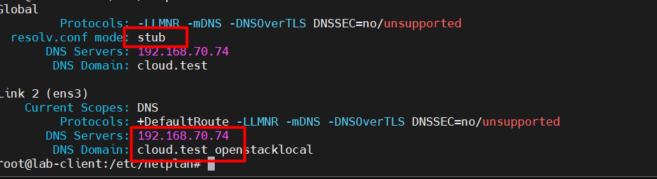

=> `ens3` không còn Query `8.8.8.8` -> `OK`

-> Trên con DNSServer:

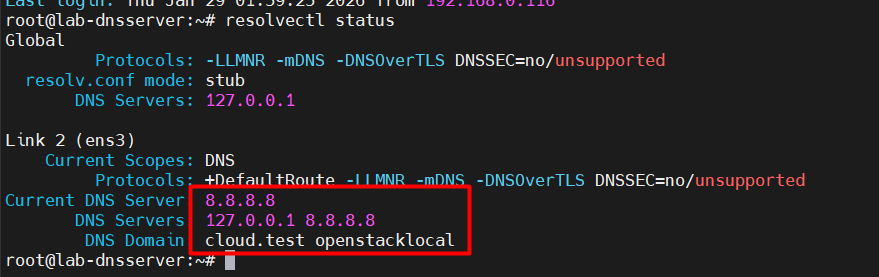

=> **DNS server** nhận DNS ngoài từ OpenStack metadata, tuy nhiên DNS nội bộ vẫn hoạt động độc lập thông qua BIND9.

-> Trên con Client:

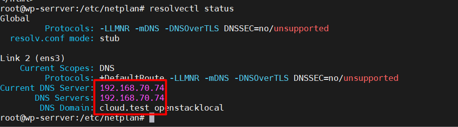

=> `ens3` không còn Query `8.8.8.8` -> `OK`

### Bước 13: Kiêm tra

Trên DNS Client `192.168.70.72` ta dùng `curl` để truy cập website `cloud.test`:

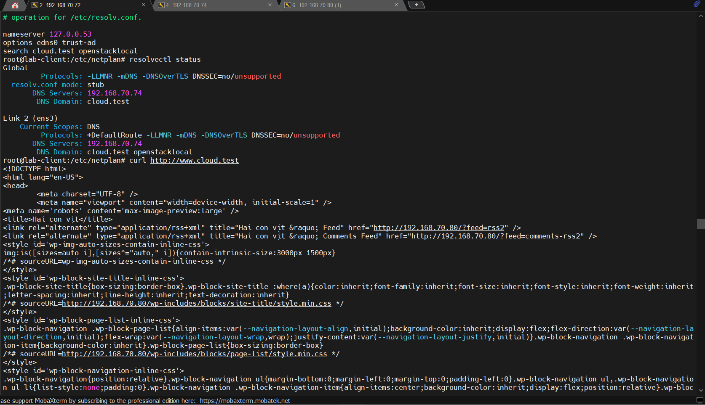

Trên WebServer `192.168.70.80` ta dùng `curl` vào trang website `cloud.test`:

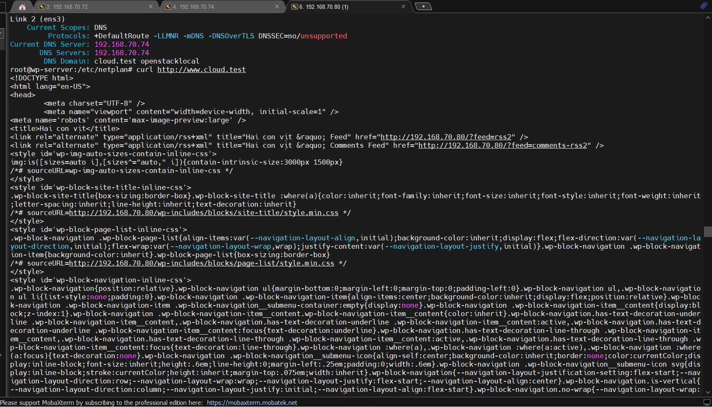

### Bước 14: TRuy cập trnag `cloud.test` ở trình duyệt máy thật

- Vào `Control Panel`

- Vào `Network Adapter` đang dùng

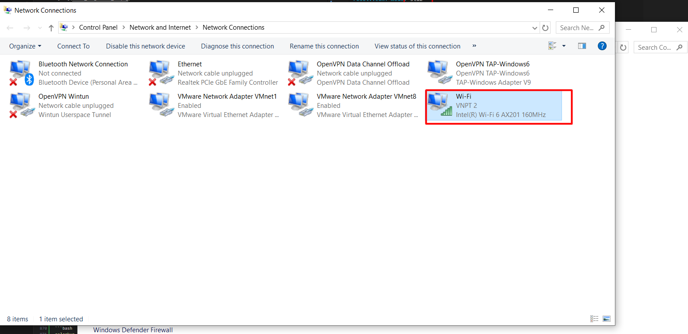

- Vào `IPv4` → `Properties`

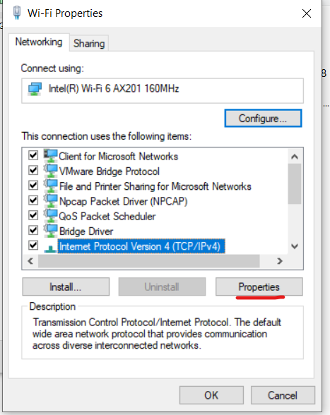

- Chọn `DNS`:

```text
Preferred DNS: 192.168.70.74
```

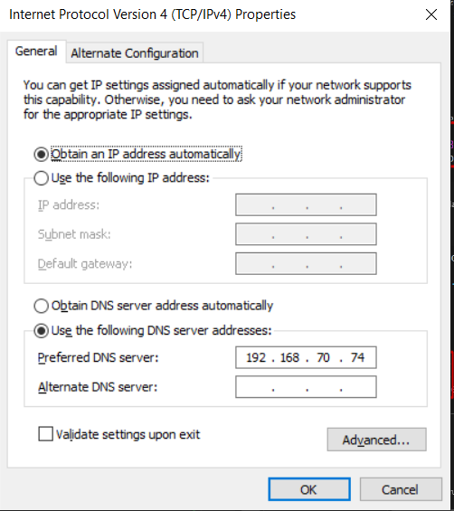

- Mở CMD:

```bash
ipconfig /flushdns
```

Test:

```bash
nslookup cloud.test
```

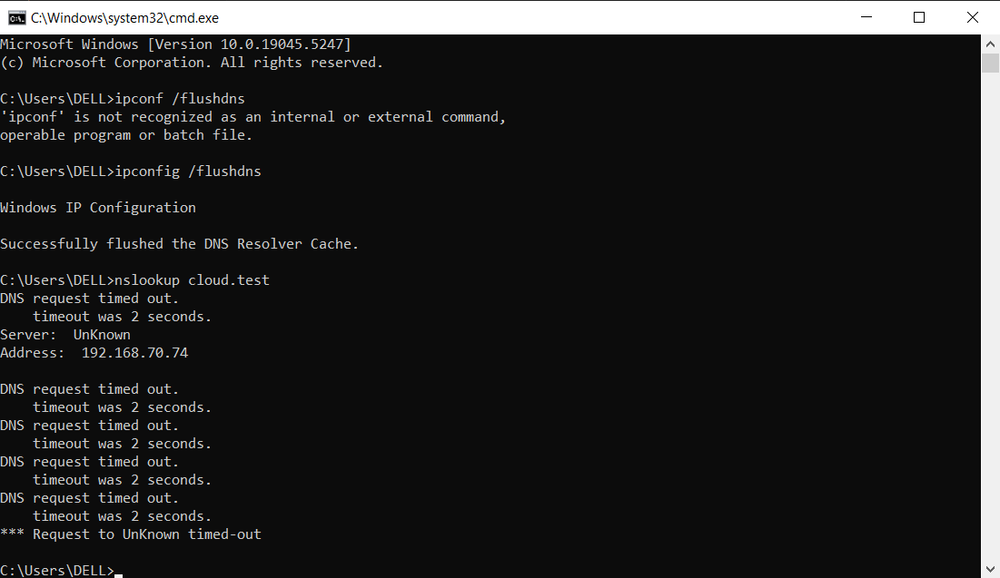

- Mở trình duyệt:

```text
http://www.cloud.test
```

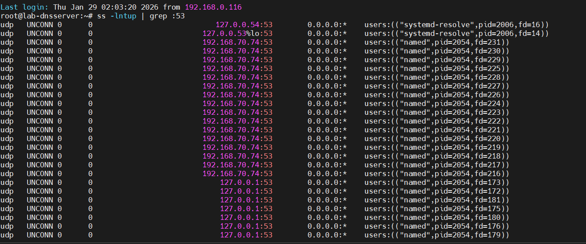

- Sẽ có trường hợp vào lần 1 trên trình duyệt được nhưng lần 2 làm lại thì không được thì ta có thể bị 1 trong các nguyên nhân sau:

  - Trình duyệt máy thật lưu cache thì dùng `Ctrl+F5` để xoá cache
  - DNSServer tự loop chính nó
  - BIND chạy nhưng chỉ listen localhost
  - `resolv.conf` bị đổi qua lại

- Trong lab này đang bị lỗi **DNSServer tự loop chính nó** do check thấy:

```bash
ss -lntup | grep :53 # Kiểm tra tiến trình ordịch vụ nào đang lắng nghe trên công 53
```

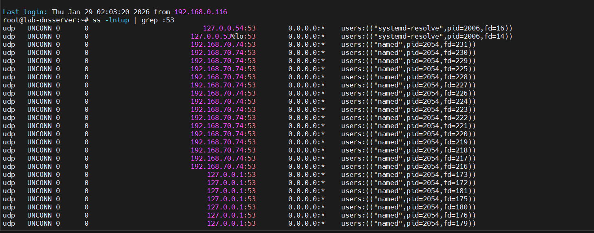

=> Ta có thể thấy có 2 dịch vụ đang chiếm cổng 53 gây xung đột đó là `named(BIND9)` và `systemd-resolved` cho lên ta chỉ có xử lí bằng cách loại bỏ `systemd-resolved`

- Các bước Debug:

  - `Bước 1`: Tắt systemd-resolved trên DNS server

  ```bash
  systemctl stop systemd-resolved
  systemctl disable systemd-resolved
  ```

  - `Bước 2`: Fix `resolv.conf` cho DNS server

  ```bash
  rm -f /etc/resolv.conf
  echo "nameserver 127.0.0.1" > /etc/resolv.conf # DNS Query chính nó, không Query Google DNS 
  ```

  - `Bước 3`: Restart BIND

  ```bash
  systemctl restart bind9
  ```

  - `Bước 4`: Check lại port 53

  ```bash
  ss -lntup | grep :53
  ```

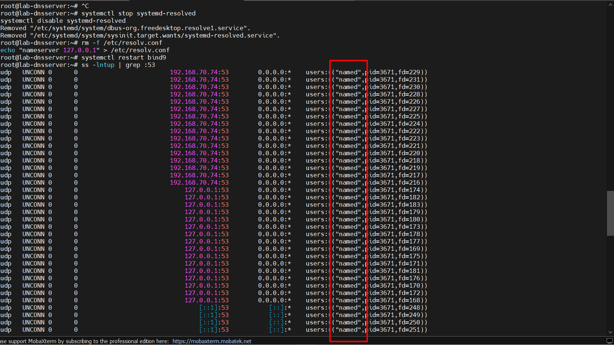

=> Sau đó, ta thử làm cách cũ để tra trang `cloud.test` trên trình duyệt máy thật :

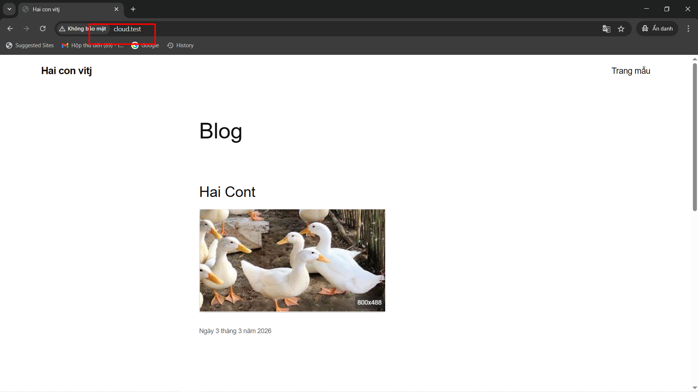

=> Ảnh này từ bài lab đã được làm lại và chỉnh sửa lên không có lỗi NXDomain (Tien5102003@-mkwordpress và @tienD9 là user)