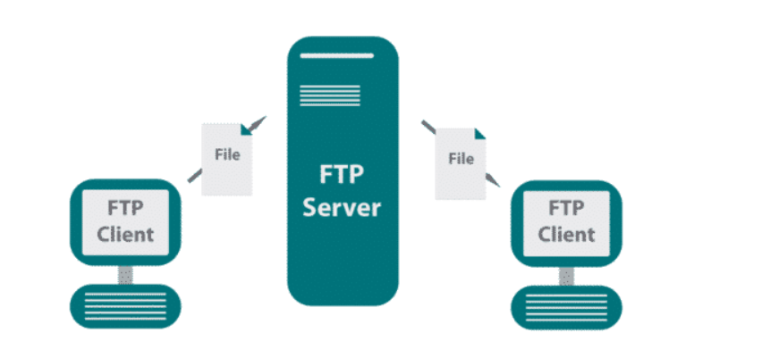
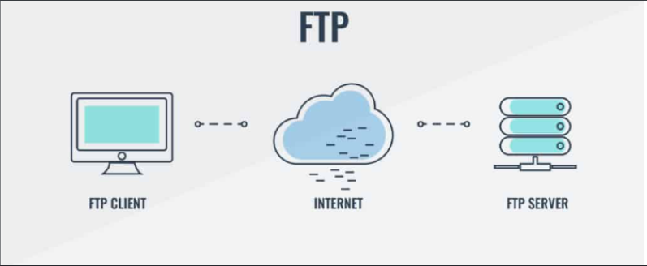
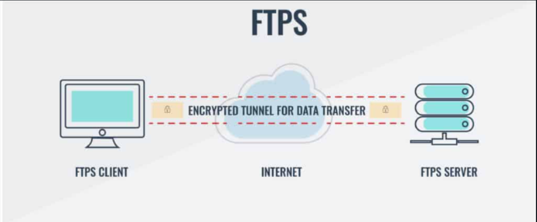
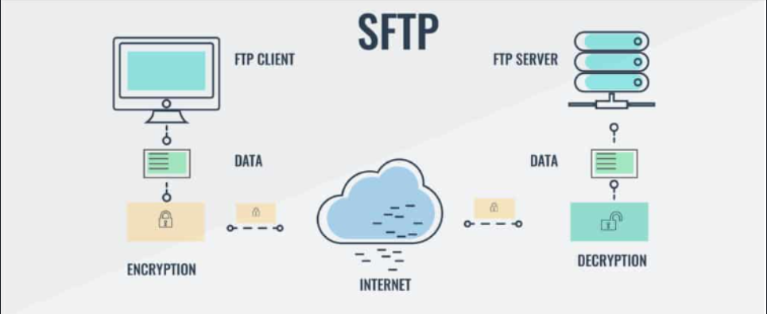
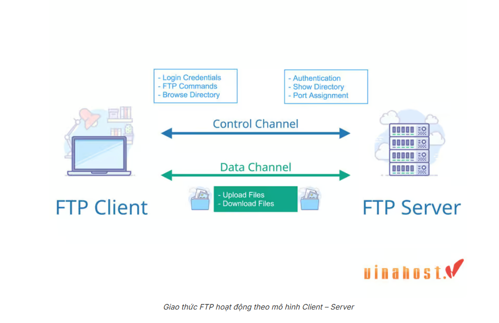

# TÌM HIỂU VỀ FTP

## FTP LÀ GÌ ?



**FTP (File Transfer Protocol)** là một giao thức truyên tải tệp tin sử dụng để chia sẻ và truyền tải dữ liệu giữa các máy tinh trên mạng Internet. Nó cho phép người dùng truy cập và truyền tải các tệp tin từ một máy tính (máy gửi) đến một máy tính khác (máy nhận) thông qua kết nối mạng.

Các tập tin chia sẻ ở dây có thể là:

- Các file hình ảnh, âm thanh, ...
- Các file code như HTML, CSS. PHP, JS, ...  
...

Ngoài ra, **FTP** cho phép người dùng tải lên (upload) hoặc tải xuống (download) các tệp từ một máy chủ (server) FTP.

## VAI TRÒ FTP ?

**Tải tệp lên máy chủ (Upload)**:

- Sử dụng FTP để tải các tệp tạo nên 1 trang web (HTML, CSS, JS, hình ảnh, video,...) từ máy tính cá nhân lên web server.
- Cập nhật nội dung website: Khi cần update website, admin thường sử dụng FTP để tải các tệp đã cập nhật lên máy chủ.

**Tải tệp từ máy chủ (Download)**:

- Lấy về các bản sao lưu (Backup)
- Tải phần mềm từ nhà cung cấp
- Lấy các file cần update (SourceCode,`.htaccess`,`wp-config.php`..) cho WebServer

**Quản lí tệp tin từ xa**:

- Tạo xoá và đổi tên thư mục hoặc tệp tin.
- Thay đổi phân quyền cho các file và thư mục

**Chia sẻ file trong INternet hoặc mạng nội bộ**:

- **Chia sẻ tệp lớn**: FTP hiệu quả hơn so với gửi qua email hoặc các phương tiện khác khi truyền tệp lớn.
- Doanh nghiệp sử dụng FTP server để chia sẻ tài liệu nội bộ.
- Một số hệ thống lưu trữ tài liệu kỹ thuật hoặc tài nguyên số cũng dùng FTP để phân phối.

**Sao lưu dữ liệu máy**:

- Sao lưu dữ liệu máy chủ này sang máy chủ khác

**Truyền tệp tự động**:

- Ứng dụng hoặc hệ thống được cấu hình để tự động truyền tệp qua FTP theo lịch hoặc một số sự kiện cụ thể xảy ra.

**Khôi phục dữ liệu sau thảm hoạ**:

- Sử dụng FTP để chuyển dữ liệu gốc đến trung tâm khôi phục dữ liệu sau sự cố ngoài ý muốn.

## ĐẶC ĐIỂM CỦA FTP

### 1. Ưu điểm

- Upload và Download nhiều file về cùng một lúc
- Khả năng truyền tệp tin khi bị mất kết nối: Trường hợp mất kết nối khi truyền tệp tin, FTP cho phép tiếp tục quá trình truyền từ nơi đã bị gián đoạn mà không cần bắt đầu lại từ đầu

- **Tự động chuyển tập tin bằng các Script:**

  ```bash
  ftp -inv 192.168.3.97 <<EOF
  user ftpuser yourpassword
  lcd /home/ftptan/upload
  cd /upload
  put daily_report.txt
  bye
  EOF
  ```

  - `-i`: Bỏ qua xác nhận thủ công khi dùng `mput`/`mget`
  - `-n`: Không tự đăng nhập (để mình chủ động dùng `user`)
  - `-v`: Hiện chi tiết tiến trình

- **Quản lý khung chờ và lên lịch truyền:**

  ```bash
  lftp -u ftpuser,ftp_password ftp://192.168.3.97 <<EOF
  queue
  cd /upload
  lcd /home/ftptan/files
  put file1.txt
  put file2.txt
  put file3.txt
  wait
  bye
  EOF
  ```

- **Khả năng đồng bộ hóa tệp tin:**
  - Đồng bộ thư mục `/home/ftptan/project/` (local) với thư mục `/backup/project/` trên FTP server.

  ```bash
  lftp -u ftpuser,ftppass ftp://192.168.3.97 <<EOF
  mirror -R /home/ftptan/project /backup/project
  bye
  EOF
  ```

### 2. Nhược điểm

- Khả năng bảo mật kém
- Dễ bị tấm công ButeForce, hacker có nhiều phương thức để dò mật khẩu
- Các máy chủ FTP có thể bị qua mặt và dẫn đến việc gửi thông tin dến cổng ngẫu nhiên, gây ra mất an toàn và ảnh hưởng dến bảo mật

## CÁC LOẠI FTP PHỔ BIẾN ?

### 1. FTP (Plain FTP)



- Không mã hóa bất kỳ thông tin nào, bao gồm cả tên đăng nhập và mật khẩu.
- Sử dụng cổng 21 cho điều khiển, 20 cho dữ liệu (ở chế độ active).
- Không an toàn khi dùng trên mạng công cộng (vì có thể bị nghe lén).
- Dùng trong mạng nội bộ,ít bị hack và cần đơn giản và nhanh.

### 2. FTPS (FTPSecure/FTP SSL)



- Là FTP thông thường nhưng có thêm lớp mã hóa SSL/TLS.
- Có 2 kiểu FTPS:

  - Explicit FTPS: client yêu cầu bắt đầu mã hóa sau khi kết nối.
  - Implicit FTPS: mã hóa bắt buộc ngay từ đầu (dùng cổng 990).

### 3. SFTP (SSH FTP)



- Hoàn toàn khác với FTP/FTPS – không dùng cổng 21.
- Là một phần của SSH, chạy qua port 22.
- Toàn bộ phiên làm việc được mã hóa.
- Ưu điểm:

  - Phổ biến nhất hiện nay.
  - Không cần tải FTP server riêng nếu server đã có OpenSSH.

### 4. TFTP (Trivial FTP)

- Phiên bản rút gọn của FTP – không có xác thực người dùng, không mã hóa.
- Dùng giao thức UDP (port 69).
- Dùng trong các thiết bị mạng như router, switch để cập nhật firmware.
- Dùng khi cần truyền file cực đơn giản, không cần bảo mật. Phổ biến trong môi trường nhúng, mạng nội bộ.

## CẤU TRÚC THÀNH PHẦN TRONG FTP

### 1. Thành phần chính

Giao thức **FTP** hoạt động theo mô hình **Server-Client**

- **Máy chủ FTP (FTP Server)**:

  - Là máy chứa tệp cần chia sẻ
  - Lắng nghe trên cổng 21, xử lí yêu cầu từ phía Client:

    - Xác thức tài khoản
    - Cấp quyền truy cập
    - Gửi và nhận file
    - Trả về danh sách thư mục

- **Máy khách FTP(FTP Client)**:

  - Là máy người dùng kết nối đến Server để upload/download file
  - Có thể là:

    - Giao diện dòng lệnh (ftp,lftp,sftp,...)
    - Phần mềm giao diện đồ hoạ: FileZilla, Win SCP, Cyberduck...
  
  - Gửi lệnh FTP (get,push,ls,cd..)qua kênh điều khiển Server

### 2. Các loại Kết nối trong FTP



**FTP** sử dụng hai kết nối song song

**Kết nối điều khiển (Control Connection)**:

- Sử dụng cổng 21 (TCP)
- Dùng đẻ gửi lệnh và phản hồi (như `USER`, `PASS`, `LIST`, `STOR`,...)
- Luôn giữ mở suốt phiên làm việc

**Kết nối dữ liệu (Data Connection)**:

- Dùng để truyền file hoặc danh sách thư mục.
- Cổng dùng tùy thuộc vào chế độ FTP:
  
  - `Active mode`: Server dùng cổng 20, Client mở cổng ngẫu nhiên.
  - `Passive mode`: Client mở cổng dữ liệu, Server dùng cổng ngẫu nhiên.

## NGUYÊN LÍ HOẠT ĐỘNG

**FTP** sử dụng 2 phương thức kết nối song song là **kết nối dữ liệu** và **kết nối diều khiển**.

