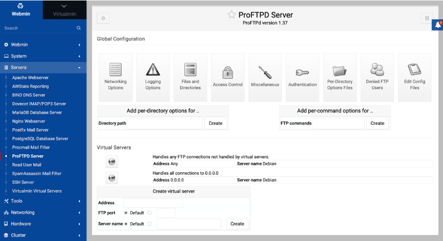

# TÌM HIỂU FTP COMMAND

Dưới đây là các lệnh FTP phổ biến khi dùng chế độ **Command-line** [ftp (server-ip)]:

## 1. Lệnh kết nối & đăng nhập

| Lệnh              | Ý nghĩa                |
| ----------------- | ---------------------- |
| `ftp <ip/domain>` | Kết nối tới FTP server |
| `open <ip>`       | Mở kết nối FTP         |
| `user <username>` | Nhập username          |
| `pass <password>` | Nhập password          |
| `bye` / `quit`    | Thoát FTP              |
| `close`           | Đóng kết nối hiện tại  |

## 2. Lệnh thao tác thư mục

| Lệnh             | Ý nghĩa                          |
| ---------------- | -------------------------------- |
| `ls`             | Liệt kê file trên server         |
| `dir`            | Hiển thị danh sách file chi tiết |
| `pwd`            | Xem thư mục hiện tại trên server |
| `cd <folder>`    | Chuyển thư mục trên server       |
| `lcd <folder>`   | Chuyển thư mục trên máy local    |
| `mkdir <folder>` | Tạo thư mục trên server          |
| `rmdir <folder>` | Xoá thư mục trên server          |

## 3. Upload & Download file

| Lệnh             | Ý nghĩa                     |
| ---------------- | --------------------------- |
| `get <file>`     | Tải file từ server về local |
| `mget *.txt`     | Tải nhiều file              |
| `put <file>`     | Upload file lên server      |
| `mput *.log`     | Upload nhiều file           |
| `delete <file>`  | Xoá file trên server        |
| `rename old new` | Đổi tên file trên server    |

## 4. Chế độ truyền dữ liệu

| Lệnh      | Ý nghĩa                                                |
| --------- | ------------------------------------------------------ |
| `binary`  | Chuyển sang chế độ nhị phân (file .zip, .iso, .jpg...) |
| `ascii`   | Chế độ text (file .txt, .html...)                      |
| `passive` | Bật/tắt passive mode                                   |

## 5. Ví dụ thực tế

```bash
ftp 192.168.1.10
Name: user1
Password: ********

ls
cd uploads
put file.txt
get backup.zip
bye
```

## 6. FTP service phổ biến trên Linux



- vsftpd
- ProFTPD
- Pure-FTPd

## 7. Ứng dụng FTP trong Deploy product

- Upload source code WP
- Upload theme / plugin
- Backup file Web
