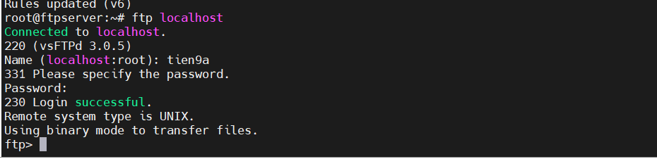

# FTP LAB

## 1. Mô hình Lab

| Máy     | Chức năng  | IP              |
|---------|------------|-----------------|
| Ubuntu  | FTP Server | 192.168.70.87   |
| Rocky   | FTP Client | 192.168.70.83   |

Triển khai một FTP server bằng phần mềm vsftpd (Very Secure FTP Daemon) - một FTP server phổ biến, bảo mật và nhẹ, chạy được trên hầu hết các bản phân phối Linux (Ubuntu, CentOS, Debian, ...).

## 2. Thực Hành

### `Bước 1`: Trên máy Ubuntu `192.168.70.87` cài FTP Server (vsftpd)

Cài đặt FTP server (vsftpd):

```bash
sudo apt install vsftpd -y
```

### `Bước 2`: Bật và khởi động dịch vụ (vsftpd)

Khởi động dịch vụ FTP:

```bash
sudo systemctl start vsftpd
sudo systemctl enable vsftpd
```

Check Service enable chưa:

```bash
systemctl status vsftpd
```


### `Bước 3`: Tạo người dùng và thiết lập thư mục

Tạo người dùng mới:

```bash
sudo adduser tien9a
sudo passwd tien9a
```

Tạo thư mục riêng chứa file FTP (ftp_files)

```bash
# Tạo thư mục riêng để chứa file FTP (ftp_files)
sudo mkdir -p /home/tien9a/ftp_files

# Gán quyền sở hữu thư mục cho user
sudo chown nobody:nogroup /home/tien9a/ftp_files

# Gỡ quyền ghi của user
sudo chmod a-w /home/tien9a/ftp_files
```

Trong đó:

- `nobody`: Để gán file cho user cực hạn chế, nhằm cô lập quyền truy cập của service hoặc client.
- Gỡ quyền ghi để không user nào có thể sửa/ xoá trực tiếp trong thư mục chính.

Tạo thư mục upload bên trong để user có thể ghi vào file. Gán quyền sở hữu cho user `tien9a`:

```bash
sudo mkdir /home/tien9a/ftp_files/upload
sudo chown tien9a /home/tien9a/ftp_files/upload
```

### `Bước 4`: Cấu hình vsftpd

Mở file cấu hình chính của `vsftpd` để chỉnh sửa:

```bash
nano /etc/vsftpd.conf
```

Thêm đoạn sau vào cuối chỉnh sửa ở trên nếu bị trùng

```bash
# Cho phép user hệ thống đăng nhập
local_enable=YES

# Allow anonymous login
anonymous_enable=YES
anon_root=/home/$USER/ftp_files

# Cho phép ghi file (upload, xóa,...)
write_enable=YES

# Giới hạn user trong home
chroot_local_user=YES

# Cho phép ghi trong chroot
allow_writeable_chroot=YES

# Passive mode
pasv_enable=YES
pasv_min_port=10000
pasv_max_port=10100

# Cho phép dùng biến username
user_sub_token=$USER

# Root FTP cho mỗi user
local_root=/home/$USER/ftp_files

# Listen IPv4
listen=YES
listen_ipv6=NO
```

**Lưu ý quan trọng**: Vì đã sử dụng `pasv_enable`, comment lại active FTP `connect_from_port_20=YES`

### `Bước 5`: Khởi động lại dịch vụ `vsftpd`

```bash
systemctl restart vsftpd
```

### `Bước 6`: **Mở tường lửa** & Add **Security Group**

```bash
sudo ufw allow 20/tcp
sudo ufw allow 21/tcp
sudo ufw allow 10000:10100/tcp
```

Trong đó:

- `20`: dữ liệu FTP
- `21`: điều khiển FTP
- `100001:10100`: passive mode

### `Bước 7`: Kiểm tra FTP

Kiểm tra trên con FTP Server:

- Dùng FTP Client dòng lệnh có sẵn
- Đăng nhập với dòng lệnh đã tạo
- Dùng lệnh để kiểm tra kết nối

```bash
ftp localhost
```

Kết quả thành công:



**Lưu ý quan trọng**: Giả sử FTP Client muốn kết nối được được FTP Server `192.168.70.87` thì ít nhất phải cùng dải mạng hoặc cả 2 route được nhau.
