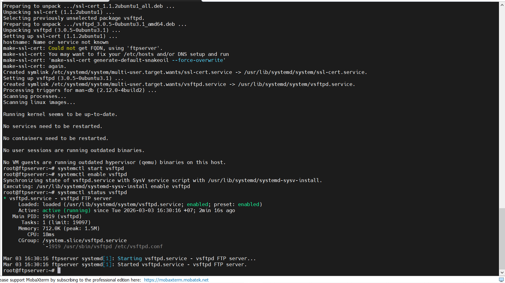

# FTP LAB

## 1. Mô hình Lab

| Máy     | Chức năng  | IP              |
|---------|------------|-----------------|
| Ubuntu  | FTP Server | 192.168.70.87   |
| CentOS  | FTP Client | 192.168.70.89   |
| Windows | FTP Client | 192.168.0.141   |

Triển khai một FTP server bằng phần mềm vsftpd (Very Secure FTP Daemon) - một FTP server phổ biến, bảo mật và nhẹ, chạy được trên hầu hết các bản phân phối Linux (Ubuntu, CentOS, Debian, ...).

## 2. Thực Hành

### `Bước 1`: Trên máy Ubuntu `192.168.70.87` cài FTP Server (vsftpd)

Cài đặt FTP server (vsftpd):

```bash
sudo apt install vsftpd -y
```

### `Bước 2`: Bật và khởi động dịch vụ (vsftpd)

Khởi động dịch vụ FTP:

```bash
sudo systemctl start vsftpd
sudo systemctl enable vsftpd
```

Check Service enable chưa:

```bash
systemctl status vsftpd
```



### `Bước 3`: Tạo người dùng và thiết lập thư mục

Tạo người dùng mới:

```bash
sudo adduser tien9a
sudo passwd Tien9a