# THƯC HÀNH 1 SỐ LỆNH TRÊN FTP

## 1. Phân biệt giữa Anonymous User và Local User

- Local User và Anonymous User có thể trỏ cùng 1 thư mục.
- **Chỉ khác nhau ở User Indentity + Permission LInux**.

-> FTP Server = Process chạy dưới Linux User

Khi Login:

- anonymous -> mapped thành user `ftp` hoặc `nobody`
- local -> mapped thành user thật (`tien9a`)

Mô hình nên ứng dụng:

```bash
/srv/ftp
├── public     (anonymous read)
/srv/ftp
├── upload     (local only)
```

## 2. Thực hành 1 số lệnh FTP

Lấy từ mô hình DNS Server:

| Máy     | Chức năng  | IP              |
|---------|------------|-----------------|
| Ubuntu  | FTP Server | 192.168.70.87   |
| Rocky   | FTP Client | 192.168.70.83   |

### a. Các lệnh về thư mục

Trên máy `192.168.70.87` thực hiện các lệnh sau:

Cài gói `ftp` và đăng nhập vào FTP server:

```bash
dnf install ftp -y    &        ftp 192.168.70.87
```

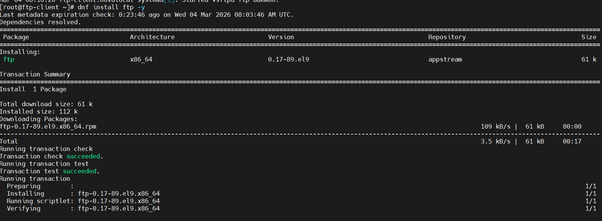

`pwd`: Hiển thị thư mục hiện tại

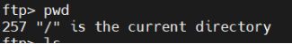

`ls`: Liệt kê file

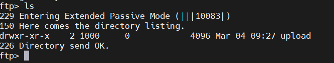

`cd`: di chuyển vào thư mục `/upload`

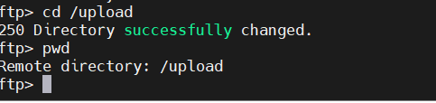

mkdir: tạo thư mục/tệp `file_rocky.txt`

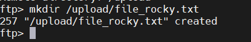

lcd: chuyển thư mục làm việc trên client

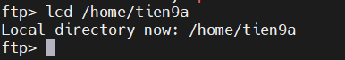

rename: đổi tên `file_ubuntu.txt` thành `file_rename.txt`

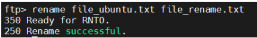

delete: xóa file file_rename.txt. Hoặc có thể dùng lệnh `mdelete *.txt` để xóa tất cả file có đuôi `.txt.`

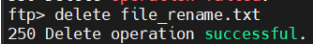

### b. Các lệnh về tệp tin

Trên máy `192.168.70.83` thực hiện các lệnh sau

`binary`: chuyển sang chế độ truyền file nhị phân (truyền dạng nguyên gốc, không bị thay đổi nội dung).

`ascii`: chuyển sang chế độ văn bản (ascii) - ASCII có thể thay đổi dấu xuống dòng (\n vs \r\n) khi truyền file → chỉ nên dùng với file văn bản.

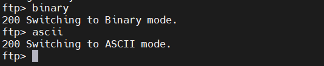

put: upload file lên FTP server

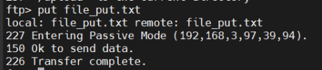

get: download `file_ubuntu.txt` từ FTP server

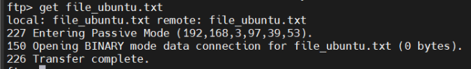

### c. Các lệnh khác

`help`: hiển thị danh sách các lệnh FTP có sẵn hoặc hướng dẫn sử dụng lệnh.

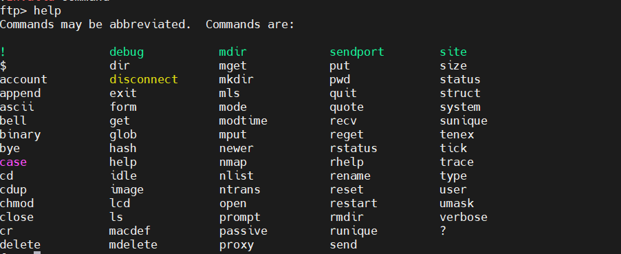

`status`: Xem trạng thái phiên hiện tại

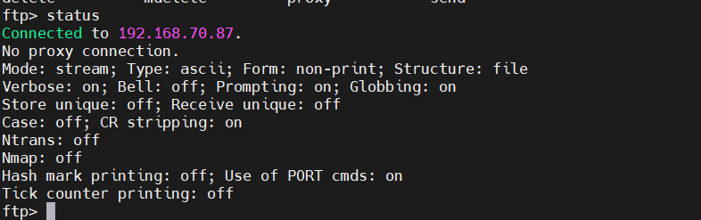

`system`: Xem hệ điều hành của FTP server

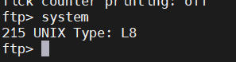

`!`: Thực thi lệnh shell trên máy client (không thoát FTP)

Chạy lệnh Linux như `ls`, `cd`, `pwd` ngay trong phiên FTP mà không cần thoát.

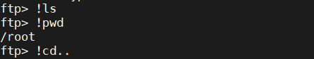

`open`: Kết nối đến FTP server

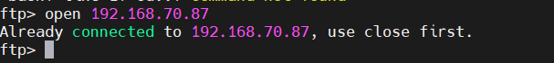

`close`: Ngắt kết nối với FTP server nhưng vẫn ở trong shell FTP

`quit` và `bye`:Thoát hoàn toàn khỏi FTP

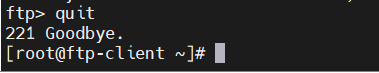

->`quit` và `bye` là giống nhau
