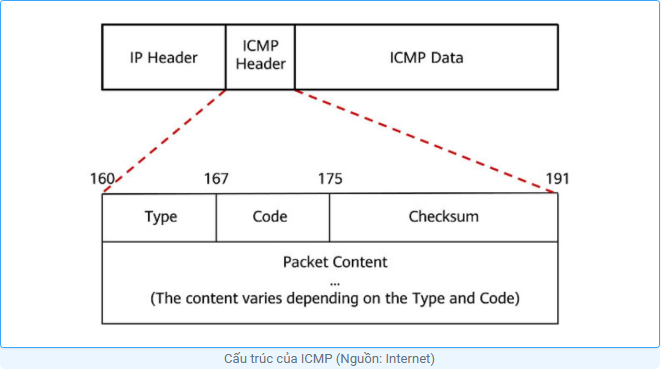
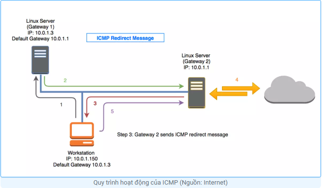
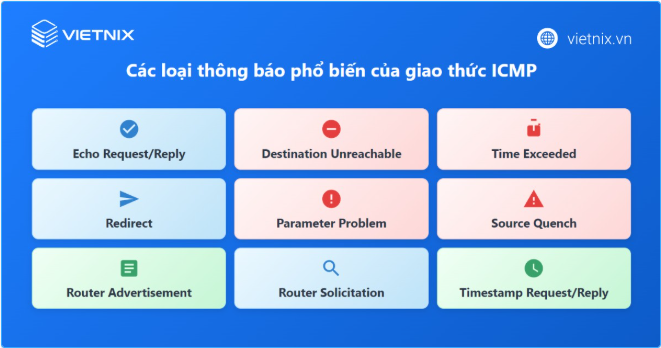

# ICMP

## 1. ICMP là gì?

>ICMP là từ viết tắt của Internet Control Message Protocol (Giao thức Kiểm soát Thông điệp Internet). Đây là một giao thức tầng mạng được các thiết bị mạng sử dụng để chẩn đoán các vấn đề về giao tiếp mạng. Hoạt động ở Layer3 như TCP

ICMP chủ yếu được sử dụng để xác định liệu dữ liệu có đến được đích dự định một cách kịp thời hay không. Thông thường, giao thức này được sử dụng trên các thiết bị mạng, chẳng hạn như bộ định tuyến. Giao thức này rất quan trọng cho việc báo cáo lỗi và thử nghiệm, nhưng nó cũng có thể được sử dụng trong các cuộc tấn công từ chối dịch vụ phân tán (DDoS).

## 2. Những thông số cơ bản trong giao thức ICMP

Các tham số ICMP nằm trong tiêu đề của gói tin và giúp xác định lỗi trong gói IP liên quan. Các tham số này giống như nhãn vận chuyển trên gói hàng, cung cấp thông tin để các công cụ và giao thức mạng biết cách xử lý gói tin. Các tham số chính của giao thức này như sau:

**Loại (Type): 8 bit đầu tiên** chỉ loại thông điệp ICMP

- Loại 0: Echo reply
- Loại 3: Destination unreachable (Đích đến không thể tiếp cận)
- Loại 8: Echo
- Loại 5: Redirect (Chuyển hướng )

Loại giúp thiết bị nhận biết mục đích của thông điệp và cách xử lý. Ví dụ, nếu nhận thông điệp Echo (Loại 8), thiết bị có thể phản hồi bằng thông điệp Echo Reply (Loại 0) nếu nó sẵn sàng.

**Mã (Code)**: 8 bit tiếp theo cho biết thêm thông tin về loại lỗi.

**Checksum**: 16 bit cuối cùng kiểm tra tính toàn vẹn của thông điệp. Nó giúp đảm bảo rằng gói tin đã được truyền đầy đủ và không bị lỗi.

Các phần khác của tiêu đề:

- **Pointer**: 32 bit dữ liệu này chỉ ra vị trí byte trong thông điệp IP gốc gây ra lỗi. Thiết bị nhận sử dụng thông tin này để xác định chính xác vấn đề.
- **Datagram gốc**: Phần cuối cùng chứa bản sao của thông điệp IP gốc có lỗi, với kích thước tối đa là 576 byte trong IPv4 và 1.280 byte trong IPv6.

## 3. 9 loại giao thức ICMP phổ biến

Dưới đây là danh sách 9 loại giao thức ICMP phổ biến mà bạn cần tìm hiểu:

- ICMP echo
- ICMP Destination Unreachable
- ICMP Parameter Problem
- ICMP Redirect/ Change Request
- ICMP Timestamp request
- ICMP Information Request and Reply
- ICMP Address Mask Request
- ICMP Router Discovery
- ICMP Source Quench

## 4. Cách thức hoạt động ICMP

Quy trình hoạt động của ICMP diễn ra như sau:

- Tạo thông điệp ICMP: Khi cần gửi một thông báo kiểm soát hoặc báo lỗi, thiết bị nguồn sẽ tạo ra một gói tin ICMP chứa các trường dữ liệu về loại thông điệp, mã lỗi, checksum và các thông tin liên quan.
- Nhúng vào gói tin IP: Gói tin ICMP sẽ được chèn làm phần dữ liệu của một gói tin IP và truyền đi dựa trên giao thức IP.
- Chuyển địa chỉ đích: Gói tin ICMP được truyền tới địa chỉ IP của thiết bị đích (hoặc chuyển hướng sang đích khác với bản tin Redirect).
- Truyền tải gói ICMP: Gói tin ICMP được gửi qua các thiết bị mạng như router và được xử lý như bất kỳ gói IP nào.
- Xử lý tại thiết bị đích: Khi tới nơi, gói ICMP sẽ được tách ra và xử lý bởi giao thức ICMP trên thiết bị đích, hành động xử lý tiếp theo sẽ phụ thuộc vào loại thông điệp và mã lỗi.
- Xử lý thông điệp ICMP: Thiết bị đích có thể cập nhật bảng định tuyến, gửi phản hồi hoặc thông báo lỗi lên hệ điều hành hoặc ứng dụng tương ứng theo từng loại thông điệp.
- Phản hồi (nếu cần): Với nhiều loại thông điệp như Echo Request, thiết bị đích sẽ gửi ngược lại một thông điệp cùng loại (Echo Reply), cho phép kiểm tra khả năng kết nối và hoạt động của mạng một cách tự động.

## 5. Đặc điểm của giao thức ICMP

### 5.1. ICMP echo

Có hai loại thông điệp là **“echo request”** và **“echo reply”** với các trường như sau:

- Type = 0: là “echo reply”, với code = 0
- Type = 8: là “echo request”, với code = 0

Ngoài ra, còn có hai trường khác (mỗi trường 16 bit) là ID và Sequence Number, được sử dụng để phân biệt các cặp thông điệp reply/request.

### 5.2. ICMP Destination Unreachable

Khi gặp lỗi Destination Unreachable, thiết bị trung gian sẽ gửi một thông điệp Destination Unreachable về phía người gửi. Lỗi Destination Unreachable có nhiều loại, tương ứng với các nguyên nhân khác nhau, và mỗi loại có cặp giá trị code riêng biệt:

Ví dụ:

- Type = 3, code = 0: Mạng không thể tiếp cận (Network Unreachable)
- Type = 3, code = 1: Máy chủ không thể tiếp cận (Host Unreachable)
- Type = 3, code = 2: Giao thức không thể tiếp cận (Protocol Unreachable)
- Type = 3, code = 3: Cổng không thể tiếp cận (Port Unreachable)

### 5.3. ICMP Parameter Problem

Thông điệp này được gửi khi có lỗi xảy ra trong tiêu đề của datagram (ở một số octet), làm cho nó không thể tiếp tục được chuyển đi. Trong trường hợp này, thiết bị trung gian sẽ gửi một thông điệp ICMP Parameter Problem về phía người gửi, với các trường sau:

- Type = 12
- Code = 0 – 2

Thêm vào đó, còn có một trường Pointer (8 bit) để chỉ rõ vị trí của octet gặp lỗi.

### 5.4. ICMP Redirect/ Change Request

Là một loại thông điệp điều khiển được gửi bởi một default gateway để thông báo cho host rằng có một đường dẫn tốt nhất:

- Tại giao diện mà gói tin đã đi vào và sau đó được định tuyến ra ngoài.
- Tại subnet/network của địa chỉ IP nguồn cùng subnet/network với nexthop.

Khi host được cấu hình để gửi thông điệp ICMP Redirect theo mặc định. Có thể tắt cấu hình này bằng lệnh: no ip redirects.

Các loại thông điệp Redirect Require tương ứng với các type và code như sau:

- Type = 5, code = 0: Redirect datagram cho mạng
- Type = 5, code = 1: Redirect datagram cho máy chủ
- Type = 5, code = 2: Redirect datagram cho loại dịch vụ và mạng
- Type = 5, code = 3: Redirect datagram cho loại dịch vụ và máy chủ

### 5.5. ICMP Timestamp request

Được dùng để đồng bộ hóa thời gian cho các ứng dụng giữa nơi gửi và nơi nhận:

- Type = 13, code = 0: ICMP Timestamp Request
- Type = 14, code = 0: ICMP Timestamp Reply

Ngoài ra, còn có hai trường 16 bit là ID và Sequence Number, được sử dụng để phân biệt các cặp thông điệp reply/request.

### 5.6. ICMP Information Request and Reply

Được dùng để xác định số mạng đang được sử dụng:

- Type = 15, code = 0: ICMP Information Request
- Type = 16, code = 0: ICMP Information Reply

Thêm vào đó, có hai trường 16 bit là ID và Sequence Number, được sử dụng để phân biệt các cặp thông điệp reply/request.

### 5.7. ICMP Address Mask Request

Khi host cần xác định subnet mask của mình mà không được cấu hình thủ công:

- Type = 17, code = 0: ICMP Address Mask Request
- Type = 18, code = 0: ICMP Address Mask Reply

Ngoài ra, có hai trường 16 bit là ID và Sequence Number để phân biệt các cặp thông điệp reply/request. Thêm vào đó, còn có một trường 32 bit dành cho Address Mask (trong thông điệp yêu cầu, trường này không được sử dụng, trong thông điệp phản hồi, trường này chứa Address Mask chính xác của host).

### 5.8. ICMP Router Discovery

Giao thức này được sử dụng để xác định bộ định tuyến khi người gửi không còn default gateway. Thông điệp này được thực hiện với Type = 9, Code = 0.

### 5.9. ICMP Source Quench

Giao thức này dùng để thông báo cho người gửi về tình trạng tắc nghẽn và yêu cầu họ quyết định xem có muốn giảm tốc độ gửi gói dữ liệu hay không, với thông số Type = 4, Code = 0.

### 6. Chức năng của giao thức ICMP

Chức năng của giao thức này bao gồm:

#### 6.1. Dùng để Điều khiển dòng dữ liệu

Giao thức này giúp quản lý lưu lượng dữ liệu trên mạng bằng cách thông báo các tình trạng tắc nghẽn hoặc yêu cầu điều chỉnh tốc độ truyền tải. Ví dụ, khi mạng bị tắc nghẽn, giao thức này có thể gửi thông điệp yêu cầu giảm tốc độ gửi gói dữ liệu để giảm áp lực lên mạng.

#### 6.2. Dùng để Thông báo lỗi

Giao thức này cung cấp cơ chế để thông báo các lỗi xảy ra trong quá trình truyền dữ liệu. Các thông điệp lỗi như “Destination Unreachable” (Đích đến không thể tiếp cận) hoặc “Time Exceeded” (Hết thời gian) giúp gửi thông tin về các vấn đề như không tìm thấy đích đến, lỗi giao thức, hoặc gói tin vượt quá thời gian cho phép.

#### 6.3. Dùng để Kiểm tra trạm làm việc

Giao thức này có chức năng kiểm tra và xác minh hoạt động của các thiết bị mạng. Các thông điệp như “Echo Request” và “Echo Reply” (Tiếng vọng yêu cầu và phản hồi) được sử dụng để kiểm tra kết nối giữa hai thiết bị, giúp xác định tình trạng hoạt động của mạng và các thiết bị kết nối.

Các chức năng này giúp duy trì hiệu suất và độ tin cậy của mạng bằng cách cung cấp thông tin quan trọng và quản lý lưu lượng dữ liệu.

### 7. Cách thức hoạt động của giao thức ICMP

Không giống như Giao thức Internet (IP), ICMP không liên quan đến một giao thức tầng vận chuyển như TCP hoặc UDP. Điều này khiến ICMP trở thành một giao thức không kết nối, một thiết bị không cần phải mở kết nối với thiết bị khác trước khi gửi một thông điệp Lưu lượng IP thông thường được gửi bằng TCP, có nghĩa là hai thiết bị trao đổi dữ liệu sẽ thực hiện một cái bắt tay TCP để đảm bảo cả hai thiết bị đều sẵn sàng nhận dữ liệu. ICMP không mở kết nối theo cách này. Giao thức này cũng không cần kết nối đến một cổng cụ thể trên thiết bị.

### 8. Các cuộc tấn công DDoS liên quan đến ICMP

#### 8.1. ICMP flood attack

Ping flood là khi kẻ tấn công gửi rất nhiều gói tin yêu cầu tới một thiết bị mục tiêu. Thiết bị mục tiêu phải xử lý và trả lời từng gói tin, làm tiêu tốn tài nguyên của nó. Kết quả là thiết bị bị quá tải và không thể cung cấp dịch vụ cho người dùng.

#### 8.2. Ping of death attack

Cuộc tấn công ping of death xảy ra khi kẻ tấn công gửi một gói ping có kích thước lớn hơn mức tối đa cho phép đến máy tính mục tiêu. Khi máy tính nhận gói tin này, nó sẽ cố gắng ghép lại các phần của gói tin, và kích thước quá lớn của gói tin có thể làm máy tính bị treo hoặc gặp sự cố do tràn bộ nhớ.

Mặc dù tấn công này chủ yếu là vấn đề trong quá khứ, nhưng các thiết bị mạng cũ vẫn có thể bị ảnh hưởng bởi loại tấn công này.

#### 8.3. Smurf attack

Trong một cuộc tấn công Smurf, kẻ tấn công gửi một gói tin với địa chỉ IP giả mạo. Các thiết bị mạng nhận được gói tin này và gửi phản hồi đến địa chỉ IP giả, khiến nạn nhân bị ngập trong các gói tin ICMP không mong muốn. Giống như cuộc tấn công ping of death, cuộc tấn công Smurf hiện nay chỉ có thể xảy ra với các thiết bị cũ.
