# Tổng quan về Linux

## I. LINUX LÀ GÌ ?

### 1. Khái niệm

Linux là một hệ điều hành mã nguồn mở dựa trên nhân (kernel) Linux. Nó cung cấp môi trường hoạt động cho phần mềm và phần cứng, tương tự như Windows hoặc macOS, nhưng có tính linh hoạt và bảo mật cao hơn.

### 2. Kiến trúc thành phần Linux

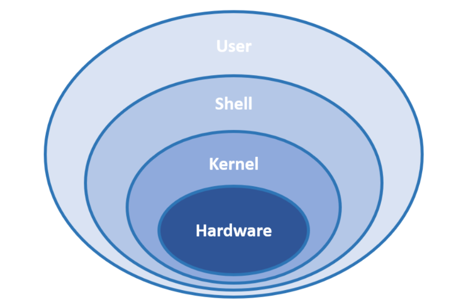

Hệ điều hành Linux được tổ chức theo một kiến trúc phân lớp, trong đó mỗi thành phần có nhiệm vụ và vai trò riêng biệt. Cấu trúc này giúp Linux hoạt động ổn định và hiệu quả trên nhiều loại phần cứng khác nhau.

**Hardware (Phần cứng) – Nền tảng vật lý:**

- **Không phải là một thành phần của hệ điều hành Linux**, nhưng là nền tảng để hệ điều hành hoạt động.
- Gồm CPU, RAM, ổ cứng, card mạng, bo mạch chủ và các thiết bị ngoại vi khác.
- Kernel của Linux sẽ giao tiếp với phần cứng thông qua trình điều khiển thiết bị (drivers).

**Kernel (Nhân hệ điều hành) – Cốt lõi của Linux:**

- Thành phần quan trọng của Linux, chịu trách nhiệm quản lý tài nguyên phần cứng và phân phối chúng cho các tiến trình và ứng dụng.
- Quản lý bộ nhớ, CPU, thiết bị ngoại vi và thực thi các tiến trình.
- Kernel hoạt động như một cầu nối giữa phần cứng và phần mềm.

**Shell:**

- Là thành phần đứng giữa người dùng và Kernel
- Làm nhiệm vụ “phiên dịch” các câu lệnh của người dùng cho Kernel hiểu để thao tác với phần cứng.

**User Space (Không gian người dùng) – Ứng dụng và Chương trình:**

- Là thành phần trên cùng của kiến trúc Linux, đây chính là các chương trình, ứng dụng (Program, Application) hay câu lệnh mà người dùng chạy trong quá trình sử dụng Linux.

**Các thành phần quan trọng khác:**

- **Bootloader (bộ nạp khởi động):** Khi bật máy tính, nó sẽ trải qua quá trình tự khởi động gọi là booting. Bootloader (bộ nạp khởi động) sẽ có chức năng chính là tải kernel vào bộ nhớ và bắt đầu quá trình khởi động này.
- **Daemon:** là các quy trình chạy ngầm (background process) bắt đầu trong quá trình khởi động. Daemon đảm bảo các chương trình chạy trơn tru trên hệ thống:

  - **systemd:** Daemon trung tâm chịu trách nhiệm quản lý các tiến trình daemon khác.
  - **sshd:** Daemon cho phép kết nối an toàn với máy chủ từ xa và cho phép truyền tệp.
  - **Httpd:** Daemon máy chủ web nhận các yêu cầu HTTP và phục vụ các trang web.
  - **cron:** Daemon thực thi các tác vụ hoặc tập lệnh đã lên lịch từ crontab vào những thời điểm được yêu cầu.

- **Init system (Hệ thống khởi tạo):** là một quy trình daemon được bắt đầu bởi kernel. Init system có vai trò khởi tạo không gian người dùng trong khi khởi động và quản lý các quy trình hệ thống trong thời gian chạy.
- **Graphic server (Máy chủ đồ họa):** là một framework cơ bản trên Linux hiển thị đồ họa trên màn hình. Thành phần này triển khai Hệ thống X Window (X11 hoặc X) và cho phép quản lý cửa sổ, nhập liệu bằng bàn phím/chuột và hỗ trợ nhiều màn hình.
- **Môi trường desktop:** là một thành phần không bắt buộc có trên tất cả các hệ thống Linux. Mỗi môi trường desktop cung cấp:
  - Các ứng dụng cài sẵn (ví dụ: trình quản lý tệp và thư mục, công cụ chỉnh sửa văn bản, trình duyệt web, trò chơi, và các tác vụ phổ biến khác).
  - Giao diện người dùng đồ họa (GUI) cho phép người dùng tương tác với hệ điều hành bằng chuột và bàn phím (Ví dụ: cửa sổ, menu thả xuống, cách hiển thị tệp và thư mục…)

## II. CẤU TRÚC FILE, FOLDER TRONG LINUX

Đối với Linux, tất cả đều là file. Từ file thông thường, thư mục, đĩa cho đến thiết bị ngoại vi, mọi thứ đều được hệ điều hành Linux coi là các file trong hệ thống. Tất cả các “file” này được tổ chức theo cấu trúc dạng cây phân cấp (FHS – File Hierarchy Structure) trong đó cao nhất là thư mục gốc “/” (gọi là root)

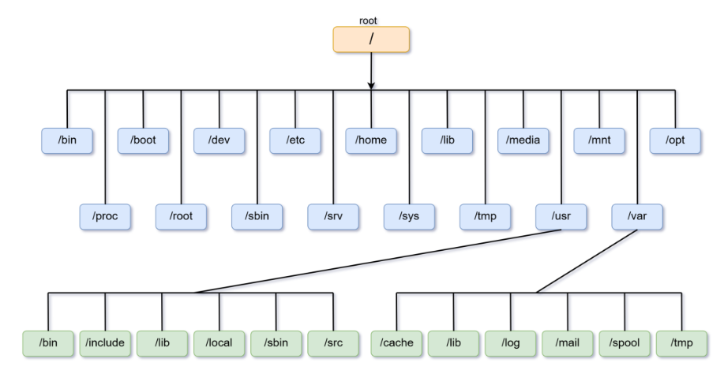

### 1. Root - Thư mục gốc (`/`)

- Thư mục cấp cao nhất của hệ thống Linux.
- Chứa tất cả các thư mục và tệp trong hệ thống.
- Có thể truy cập bởi mọi người dùng nhưng hầu hết các tệp và thư mục nếu muốn sửa đổi thì cần quyền của người dùng root.

### 2. Các thư mục quan trọng trong hệ thống Linux

| thư mục | Mô tả |
|-----------|-------------|
| `/bin` | Chứa các lệnh thiết yếu như `ls`, `cp`, `mv`, `rm`, `cat`… |
| `/sbin` | Chứa các lệnh quản trị hệ thống như `reboot`, `shutdown`, `fdisk`… |
| `/boot` | Chứa các tập tin khởi động hệ thống như `vmlinuz` (kernel Linux), `grub` (bootloader). |
| `/dev` | Chứa các tệp thiết bị (device) như `sda` (ổ cứng), `tty` (terminal), `cdrom`… |
| `/etc` | Chứa các tệp cấu hình hệ thống và ứng dụng, ví dụ: `/etc/passwd`, `/etc/fstab`… |
| `/home` | Thư mục chứa dữ liệu cá nhân của người dùng (Ví dụ: `/home/user1`, `/home/user2`…). |
| `/lib` | Chứa thư viện hệ thống cần thiết cho chương trình trong `/bin` và `/sbin`. |
| `/mnt` | Thư mục tạm để gắn kết (mount) ổ đĩa ngoài, USB, phân vùng khác. |
| `/media` | Thư mục chứa các thiết bị gắn ngoài tự động như USB, CD-ROM. |
| `/opt` | Chứa phần mềm cài đặt thủ công hoặc từ bên thứ ba (ví dụ: Google Chrome, Skype). |
| `/proc` | Chứa thông tin về tiến trình hệ thống (process) và thông tin kernel. |
| `/root` | Thư mục home của tài khoản **root** (quản trị viên). |
| `/run` | Chứa các tập tin tạm thời của tiến trình chạy sau khi hệ thống khởi động. |
| `/srv` | Chứa dữ liệu của các dịch vụ chạy trên máy như web server, FTP. |
| `/sys` | Chứa thông tin về phần cứng hệ thống, tương tự `/proc`. |
| `/tmp` | Chứa các tệp tạm thời, sẽ bị xóa sau khi hệ thống khởi động lại. |
| `/usr` | Chứa các chương trình cài đặt bởi người dùng, gồm `/usr/bin`, `/usr/sbin`, `/usr/lib`… |
| `/var` | Chứa dữ liệu thay đổi liên tục như log hệ thống (`/var/log`), hàng đợi in (`/var/spool`). |

### 3. Các thư mục quan trọng trong `/usr`

- `/usr/bin`: Chứa các lệnh dành cho tất cả người dùng (ví dụ: `nano`, `vim`, `wget`…).
- `/usr/sbin`: Chứa các lệnh dành riêng cho quản trị viên (`apache2`, `nginx`, `iptables`…).
- `/usr/lib`: Chứa các thư viện bổ sung.
- `/usr/local`: Dành cho phần mềm do người dùng cài đặt thủ công.

### 4. Các thư mục quan trọng trong `/var`

- `/var/log`: Chứa file log hệ thống (`syslog`, `auth.log`, `dmesg`…).
- `/var/spool`: Chứa dữ liệu hàng đợi in, email.
- `/var/www`: Chứa dữ liệu website trên máy chủ web.

### 5. Một số thư mục đặc biệt khác

- `.` (dấu chấm): Đại diện cho thư mục hiện tại.
- `..` (hai dấu chấm): Đại diện cho thư mục cha.
- `~` (dấu ngã): Đại diện cho thư mục home của người dùng hiện tại.
- `-`: Thư mục đã làm việc trước đó.
- `/lost+found`: Dành cho file bị lỗi sau khi kiểm tra hệ thống (chỉ có trong phân vùng ext4).

## III. ĐẶC ĐIỂM LINUX

### 1. Ưu điểm

**Mã nguồn mở & miễn phí:**

- Không cần mua bản quyền như Windows.
- Người dùng có thể chỉnh sửa, tùy biến theo nhu cầu.

**Bảo mật cao:**

- Ít bị virus và phần mềm độc hại tấn công do có hệ thống phân quyền chặt chẽ.
- Cộng đồng liên tục cập nhật và vá lỗi nhanh chóng.

**Hiệu suất cao và ổn định:**

- Linux có khả năng hoạt động hiệu quả trên cả phần cứng cũ và mới
- Chạy mượt trên cả máy cấu hình thấp.
- Có thể chỉnh sửa Kernel và các thành phần khác để tối ưu hóa hiệu suất.
- Ít bị lỗi treo máy, ít cần khởi động lại.

**Tùy biến linh hoạt:**

- Có nhiều bản phân phối (Ubuntu, Fedora, Arch Linux...) phù hợp với nhiều nhu cầu khác nhau.
- Hỗ trợ nhiều môi trường desktop (GNOME, KDE, XFCE, LXQt).

**Hỗ trợ tốt cho lập trình & quản trị hệ thống:**

- Tích hợp sẵn nhiều công cụ lập trình, đặc biệt là cho Python, C, C++, Java...
- Hệ thống dòng lệnh (terminal) mạnh mẽ giúp quản lý hệ thống dễ dàng.

**Đa nhiệm:**

- Linux có khả năng đa nhiệm tốt, cho phép chạy nhiều tiến trình và ứng dụng cùng lúc mà không làm giảm hiệu suất hoạt động.

**Hệ thống file linh hoạt:**

- Hỗ trợ nhiều định dạng file hệ thống như Ext4, XFS, Btrfs…
- Ít bị phân mảnh hơn so với Windows.

### 2. Hạn chế

**Khó sử dụng với người dùng mới:**

- Giao diện khác Windows, yêu cầu làm quen với terminal.
- Một số tác vụ yêu cầu dùng dòng lệnh thay vì giao diện đồ họa.

**Phần mềm hạn chế:**

- Một số phần mềm phổ biến như Microsoft Office, Photoshop không có bản chính thức cho Linux.
- Phải sử dụng phần mềm thay thế (LibreOffice, GIMP) hoặc giả lập (Wine, PlayOnLinux).

**Không tương thích với một số phần cứng:**

- Một số driver không được hỗ trợ chính thức (ví dụ: card đồ họa NVIDIA, máy in).
- Phải tìm kiếm và cài đặt driver thủ công trong một số trường hợp.

**Không phù hợp cho game:**

- Hầu hết game trên PC được tối ưu cho Windows.
- Dù có Steam Proton và Lutris giúp chạy game Windows trên Linux, nhưng không phải game nào cũng hoạt động tốt.

**Hỗ trợ kỹ thuật hạn chế:**

- Không có trung tâm hỗ trợ chính thức như Windows hay macOS.
- Phải tự tìm kiếm trên các diễn đàn hoặc nhờ cộng đồng giúp đỡ.

## IV. DISTRO LINUX LÀ GÌ ? PHÂN LOẠI DISTRO LINUX

### 1. Khái niệm Distro Linux

**Distro (Linux Distribution) - bản phân phối của Linux:**

- là một phiên bản của hệ điều hành Linux, được đóng gói kèm theo Kernel (nhân Linux), công cụ hệ thống, phần mềm mặc định, trình quản lý gói (package manager) và giao diện người dùng.
- Mỗi Distro có cách quản lý, tối ưu và mục đích sử dụng khác nhau, phù hợp với nhiều đối tượng từ người mới dùng đến lập trình viên và quản trị hệ thống.

### 2. Thành phần chính của một bản phân phối Linux

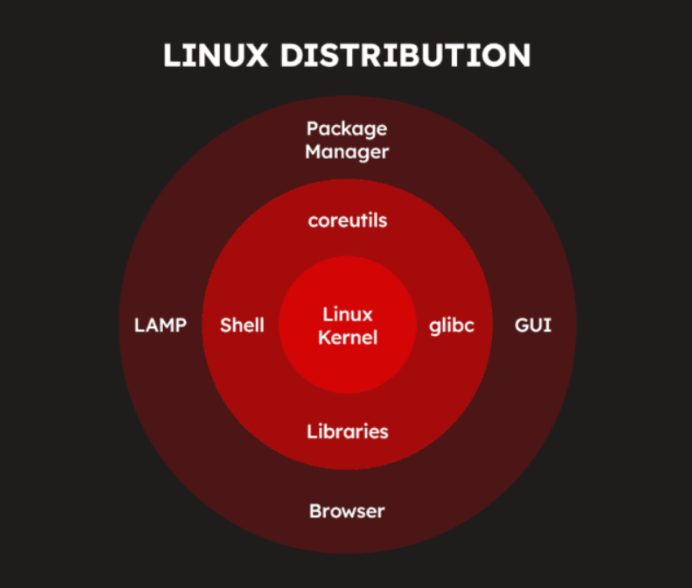

**Lớp lõi (Core) – Trung tâm của hệ thống:**

- **Kernel:** nhân hệ điều hành, quản lý tài nguyên hệ thống và giao tiếp với phần cứng.

**Lớp hệ thống (System Layer) – Cung cấp công cụ cơ bản:**

- **Shell:** Giao diện dòng lệnh (CLI) giúp người dùng giao tiếp với hệ thống.
- **glibc (GNU C Library):** Thư viện C tiêu chuẩn mà hầu hết các chương trình trong Linux sử dụng.
- **Libraries:** Các thư viện phần mềm mà ứng dụng cần để chạy.
- **coreutils:** Bộ công cụ dòng lệnh cơ bản (ls, cat, cp, mv, rm, etc.).

**Lớp ứng dụng và quản lý phần mềm:**

- **Package Manager:** Hệ thống quản lý gói phần mềm, giúp cài đặt và cập nhật ứng dụng (ví dụ: `apt`, `dnf`, `pacman`).
- **LAMP (Linux, Apache, MySQL, PHP/Python/Perl):** Bộ công cụ cho máy chủ web.
- **GUI (Graphical User Interface):** Giao diện đồ họa, giúp người dùng thao tác dễ dàng hơn (Gnome, KDE, XFCE…).
- **Browser:** Trình duyệt web được cài sẵn trong nhiều bản phân phối.

### 3. Phân loại distro linux

**Theo nguồn gốc (Dựa trên Distro gốc):** Hầu hết các bản phân phối Linux đều phát triển từ một số ít các bản gốc, tạo thành các nhánh chính:

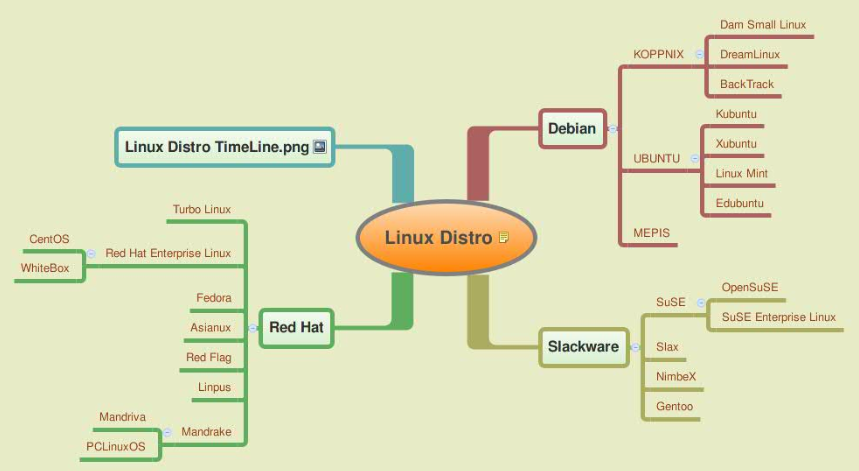

- `Debian-based` (dựa trên Debian)

  - Tiêu biểu: Ubuntu, Linux Mint, Kali Linux, MX Linux.
  - Đặc điểm: Ổn định, dễ dùng, quản lý gói bằng `APT` (`.deb`).
  - Ứng dụng: Máy tính cá nhân, server, bảo mật.

- `Red Hat-based` (dựa trên Red Hat)

  - Tiêu biểu: RHEL (Red Hat Enterprise Linux), CentOS, Fedora, Rocky Linux, AlmaLinux.
  - Đặc điểm: Phù hợp cho doanh nghiệp, quản lý gói bằng `DNF`/`YUM` (`.rpm`).
  - Ứng dụng: Server, doanh nghiệp, phát triển phần mềm.

- `Slackware-based` (dựa trên Slackware)

  - Tiêu biểu: Slackware, Puppy Linux, Zenwalk.
  - Đặc điểm: Cổ điển, ít thay đổi, không có trình quản lý gói tự động.
  - Ứng dụng: Hệ thống ổn định, chuyên biệt.

- `Arch-based` (dựa trên Arch Linux)

  - Tiêu biểu: Arch Linux, Manjaro, EndeavourOS.
  - Đặc điểm: Tối giản, dành cho người dùng nâng cao, quản lý gói bằng `Pacman`.
  - Ứng dụng: Người dùng có kinh nghiệm, hệ thống nhẹ, tùy chỉnh cao.

**Phân loại theo mục đích sử dụng:**

- `Distro dành cho Desktop` (Người dùng cá nhân)

  - Tiêu biểu: Ubuntu, Linux Mint, Fedora, Manjaro.
  - Đặc điểm: Giao diện thân thiện, hỗ trợ phần cứng tốt, dễ dùng.
  - Ứng dụng: Thay thế Windows/macOS, công việc văn phòng, giải trí.

- `Distro dành cho Server`

  - Tiêu biểu: Ubuntu Server, CentOS, RHEL, Debian Server, OpenSUSE Leap
  - Đặc điểm: Ổn định, bảo mật cao, hỗ trợ lâu dài (LTS).
  - Ứng dụng: Lưu trữ web, máy chủ doanh nghiệp, điện toán đám mây.

- `Distro dành cho bảo mật & hacking`

  - Tiêu biểu: Kali Linux, Parrot OS, BackBox.
  - Đặc điểm: Cung cấp sẵn công cụ pentest, forensic, hacking.
  - Ứng dụng: Kiểm thử bảo mật, nghiên cứu an toàn thông tin.

- `Distro dành cho máy tính cũ & nhẹ`

  - Tiêu biểu: Puppy Linux, Lubuntu, Xubuntu, Tiny Core.
  - Đặc điểm: Nhẹ, chạy nhanh trên phần cứng cũ, tối ưu RAM thấp.
  - Ứng dụng: Tái sử dụng máy tính cũ, hệ thống nhúng.

- `Distro dành cho lập trình viên & DevOps`

  - Tiêu biểu: Fedora, Arch Linux, Ubuntu, Debian.
  - Đặc điểm: Cập nhật nhanh, nhiều công cụ lập trình, hỗ trợ container.
  - Ứng dụng: Phát triển phần mềm, DevOps, Docker/Kubernetes.

**Phân loại theo mô hình phát hành (Release Model):**

- `Fixed Release` (Phát hành cố định)

  - Tiêu biểu: Ubuntu, Debian, Fedora, RHEL.
  - Đặc điểm: Cập nhật định kỳ (6 tháng – 2 năm), ổn định hơn.
  - Ứng dụng: Người dùng phổ thông, doanh nghiệp.

- `Rolling Release` (Phát hành liên tục)

  - Tiêu biểu: Arch Linux, Manjaro, OpenSUSE Tumbleweed.
  - Đặc điểm: Luôn cập nhật phiên bản mới nhất, ít cần cài đặt lại.
  - Ứng dụng: Lập trình viên, người thích cập nhật công nghệ mới.

## V. USER AND GROUP

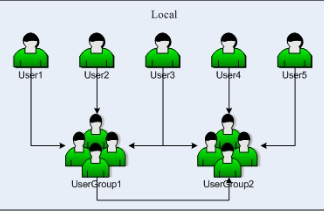

### 1. Thế nào là User trong Linux ?

- **Định nghĩa:** User đại diện cho một thực thể (thường là một người) hoặc một tiến trình có thể tương tác với hệ thống. Mỗi user có một danh tính riêng và được hệ thống xác thực khi đăng nhập hoặc thực hiện các tác vụ.
- **User ID (UID):** Mỗi user được gán một số định danh duy nhất gọi là User ID (UID). UID được sử dụng bởi kernel để xác định user khi thực hiện các hoạt động liên quan đến quyền truy cập.
  - **UID 0:** Thường dành cho root user (superuser).
  - **UID 1-999 (hoặc một khoảng tương tự):** Thường dành cho các system user và service account, được hệ thống hoặc các ứng dụng tạo ra để chạy các dịch vụ.
  - **UID 1000 trở lên (hoặc một khoảng tương tự):** Thường dành cho các regular user (người dùng thông thường).
- **Username:** Đây là tên mà người dùng sử dụng để đăng nhập vào hệ thống. Username thường dễ nhớ và có ý nghĩa hơn so với UID.
- **Home Directory:** Mỗi regular user thường có một thư mục riêng gọi là home directory. Đây là nơi người dùng lưu trữ các tệp và thư mục cá nhân của họ. Đường dẫn thường là `/home/<username>`.
- **Thông tin User** được lưu trữ chủ yếu trong 2 tệp:
  - `/etc/passwd`: Chứa thông tin cơ bản về user như username, UID, GID (Group ID mặc định), home directory, và shell mặc định. Thông tin này có thể đọc được bởi tất cả mọi người.

  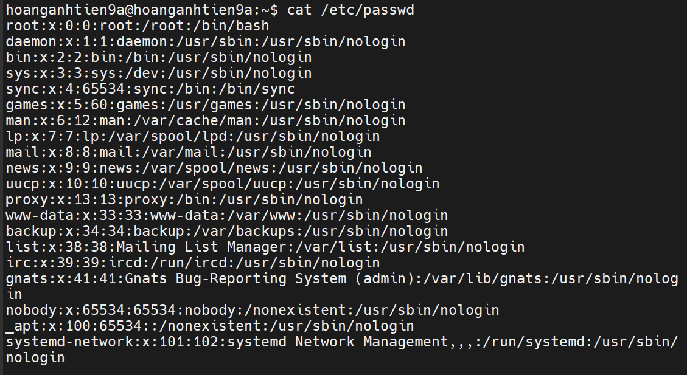

- `/etc/shadow`: Chứa thông tin nhạy cảm về user như mật khẩu đã được mã hóa và các thông tin liên quan đến quản lý mật khẩu. Tệp này thường chỉ có quyền đọc cho root user.

### 2. Các loại user trong Linux

Trong Linux, cách phân loại phổ biến và cơ bản gồm có **Root User** và **Regular User**. Bên cạnh đó, có các loại user khác thường được nhắc đến là "**System User**, **Service Account**, **Guest User**."

- **Root** có quyền cao nhất.
- **Regular User** là tài khoản dùng hằng ngày.
- **System user** và **service account** là các tài khoản **regular user** được tạo ra và quản lý bởi hệ thống hoặc ứng dụng, không dành cho người dùng tương tác trực tiếp.
- **Guest user** cũng là một dạng regular user nhưng mang tính tạm thời và có nhiều hạn chế hơn.

#### a. **Root User (Người dùng quản trị - Siêu người dùng):**

- **Root** là người dùng có quyền cao nhất trong hệ thống.
- Có thể làm mọi thứ: cài đặt/xóa phần mềm, thay đổi file hệ thống, tạo và xóa user, thay đổi quyền hạn file, v.v.
- UID (User ID) = 0.
- Chuyển sang root:

    ```ruby
    sudo -i # hoặc sudo su
    ```

*Lưu ý:* Không nên đăng nhập trực tiếp bằng **root**, thay vào đó hãy dùng `sudo` để chạy lệnh với quyền root.

#### b. **Regular User (Người dùng thông thường):**

- Tạo bởi root hoặc trong quá trình cài đặt hệ thống.
- Có UID từ 1000 trở lên trên hầu hết các hệ thống Linux hiện đại.
- Là các tài khoản người dùng có quyền sử dụng hệ thống, tạo file/thư mục trong thư mục home của mình (/home/username).
- Không thể cài đặt phần mềm hoặc sửa đổi file hệ thống mà không có quyền sudo.
- **Ví dụ lệnh quản lý user:**

  ```ruby
  sudo adduser user1  # Tạo một user mới
  sudo passwd user1   # Đặt mật khẩu cho user
  sudo deluser user1  # Xóa user
  ```

  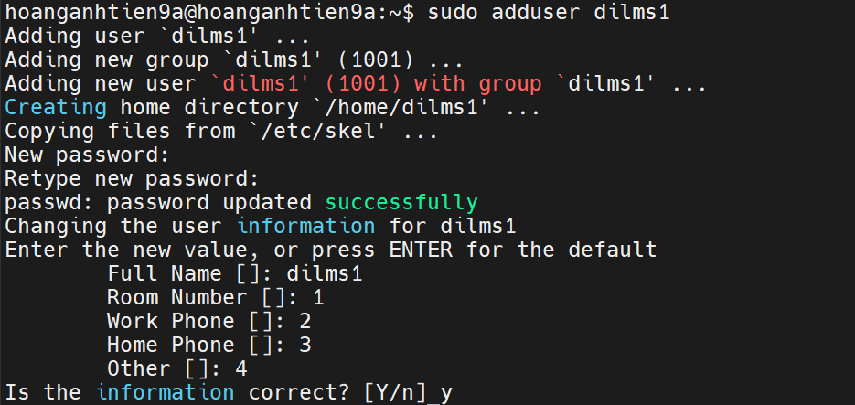

#### c. **System User (Người dùng hệ thống):**

- Là các tài khoản được tạo tự động khi cài đặt hệ điều hành để chạy các dịch vụ hệ thống (daemon).
- Thường có UID từ 1-999.
- Không đăng nhập trực tiếp vào hệ thống.
- **Kiểm tra danh sách System User:**

    ```plaintext
    cat /etc/passwd | grep nologin
    ```

- Kết quả:

  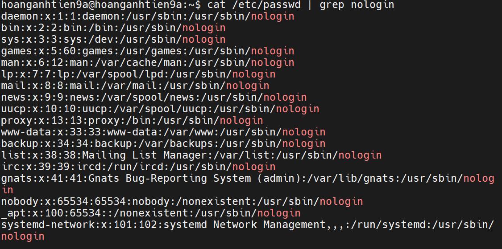

#### d. **Service Account (Tài khoản dịch vụ - chuyên biệt):**

- Là dạng user được sử dụng để chạy các ứng dụng hoặc dịch vụ cụ thể.
- Ví dụ:
  - **www-data** (Nginx/Apache)
  - **mysql** (MySQL, MariaDB)
  - **docker** (Docker daemon)

#### e. **Guest User (Người dùng khách - Tạm thời):**

- Có quyền hạn thấp nhất, thường được dùng trên hệ thống chia sẻ công khai.
- Không thể cài đặt phần mềm hoặc thay đổi cài đặt hệ thống.
- Thư mục /home/guest có thể bị xóa sau khi đăng xuất.
- Tạo một Guest User:

  ```plaintext
  sudo adduser guest --disabled-password
  ```

### 3. Ngữ cảnh phân loại

- Xét về quyền hạn quản trị: **Root User** và **Regular User**.
- Xét theo cách hệ thống quản lý user, cần có thêm **System User**.
- Đi sâu hơn về quản lý tài nguyên, cần thêm **Service Account** và **Guest User**.

## Group trong Linux

### 1. Group là gì?

- **Định nghĩa:** Group là một tập hợp các user. Mục đích chính của việc sử dụng group là để đơn giản hóa việc quản lý quyền truy cập cho nhiều user cùng một lúc. Thay vì phải cấp quyền cho từng user riêng lẻ,chỉ cần cấp quyền cho một group và tất cả các user trong group đó sẽ được hưởng quyền này.
- **Group ID (GID):** Tương tự như user, mỗi group cũng được gán một số định danh duy nhất gọi là Group ID (GID).
- **Group Name:** Đây là tên được sử dụng để tham chiếu đến group.
- **Primary Group:** Khi một user được tạo, họ sẽ được gán một group chính (primary group). Thông thường, primary group có cùng tên với username. Khi user tạo một tệp mới, group sở hữu tệp đó sẽ là primary group của user.
- **Secondary Groups:** Một user có thể thuộc nhiều group khác nhau ngoài primary group. Các group này được gọi là secondary groups.
- **Thông tin Group:** Thông tin về group được lưu trữ trong tệp `/etc/group`. Tệp này chứa thông tin về group name, GID, và danh sách các user là thành viên của group đó.

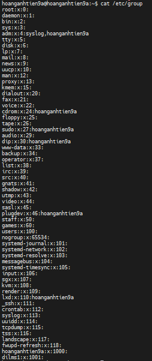

### 2. Mối quan hệ giữa User và Group trong quản lý quyền

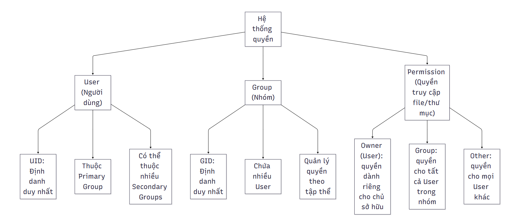

- **Quyền sở hữu tệp và thư mục:** Mỗi tệp và thư mục trong Linux đều có thông tin về **owner (chủ sở hữu)** (là một user) và **group owner (nhóm sở hữu)** (là một group).
- **Quyền truy cập:** Hệ thống Linux sử dụng ba loại quyền truy cập cơ bản cho mỗi tệp và thư mục, áp dụng cho ba đối tượng:
  - **Owner:** User sở hữu tệp/thư mục.
  - **Group:** Group sở hữu tệp/thư mục.
  - **Others:** Tất cả các user khác không phải là owner và không thuộc group sở hữu.
- **Các loại quyền:**
  - **Read (r):** cho phép xem nội dung của tệp hoặc nội dung của thư mục.
  - **Write (w):** Cho phép sửa đổi nội dung của tệp hoặc tạo, xóa, đổi tên tệp trong thư mục.
  - **Execute (x):** Cho phép chạy tệp (nếu là một chương trình) hoặc truy cập vào thư mục (để truy cập các tệp bên trong).

- Lệnh `chmod`: Được sử dụng để thay đổi quyền truy cập của tệp và thư mục.
- Lệnh `chown`: Được sử dụng để thay đổi owner của tệp và thư mục.
- Lệnh `chgrp`: Được sử dụng để thay đổi group owner của tệp và thư mục.

### 3. Quản lý User và Group

**Quản lý User:**

| Chức năng | Câu lệnh |
|-----------|-------------|
| Tạo mới user | `sudo adduser username` |
| Xóa user | `sudo deluser username` |
| Đổi mật khẩu user | `sudo passwd username` |
| Liệt kê User | `cat /etc/passwd` |
| Kiểm tra user hiện tại | `whoami` |

**Quản lý Group:**

| Chức năng | Câu lệnh |
|-----------|-------------|
| Tạo group mới | `sudo groupadd groupname` |
| Xóa group | `sudo groupdel groupname` |
| Thêm user vào group | `sudo usermod -aG groupname username` |
| Liệt kê nhóm của user | `groups username` |
| Xem danh sách group | `cat /etc/group` |

### 4. Xem phân quyền của một file/thư mục

- Xem phân quyền của một file/thư mục:
  - Để xem thông tin phân quyền của một file hay thư mục gõ lệnh **ls** **-l** **/file_name/**. Kết quả thu được sẽ hiện dưới dạng format như sau:
  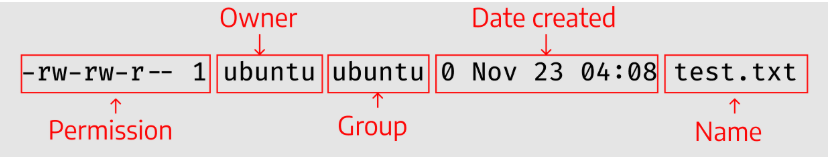
    - **Permission:** các quyền của file.
    - **Owner:** chủ sở hữu của file.
    - **Group:** nhóm mà owner thuộc vào.
    - **Date Created:** ngày tạo file.
  - Trong Permission, có chi tiết các quyền cho các loại user khác nhau:
  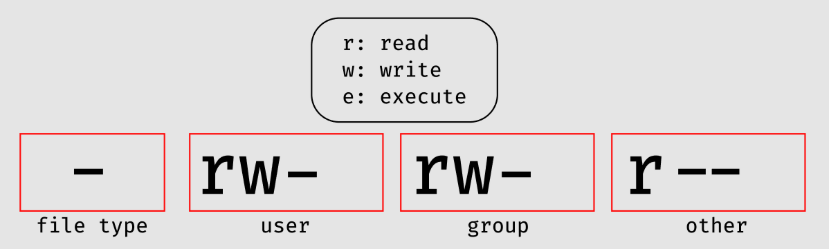
    - **file type:** có ba loại là Tệp thông thường (-)/ Thư mục (d)/ Liên kết (i).
    - **user:** quyền đối với người dùng (chủ sở hữu).
    - **group:** quyền đối với nhóm của chủ sở hữu.
    - **other:** quyền đối với những người dùng khác.
- Các chế độ chỉnh sửa phân quyền:

```ruby
    Syntax: $ chmod [permission] [file_name]
```

  - Symbolic Mode: sử dụng ký tự để phân quyền
    - Quy ước ký tự:
      - User (u)
      - Group (g)
      - Other (o)
      - All (a)
      - Read (r)
      - Write (w)
      - Excute (x)
      - +: thêm quyền lên đầu các quyền hiện có
      - -: xóa quyền khỏi các quyền hiện có
      - =: ghi đè lên các quyền hiện có
    - `Syntax: $ chmod [user_type][signs][permission] [file_name]`
  - Numeric Mode: sử dụng mã nhị phân để phân quyền

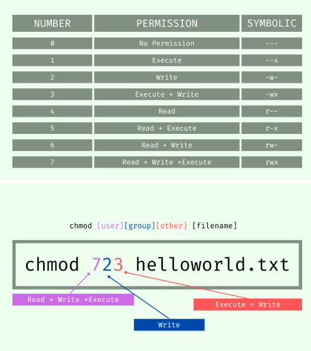

## VI. GIẤY PHÉP NGUỒN MỞ TRONG LINUX

### 1. Khái niệm Giấy phép mã nguồn mở

#### a.Khái niệm

- Giấy phép nguồn mở là một loại giấy phép pháp lý được sử dụng để quản lý việc sử dụng, phân phối, và sửa đổi mã nguồn của phần mềm nguồn mở. Phần mềm nguồn mở( open source software) là phần mềm mà mã nguồn của nó được công khai, cho phép bất kỳ ai xem, sử dụng, sửa đổi, hoặc phân phối mã nguồn theo các điều khoản của giấy phép.

#### b. Xác định rõ giấy phép mã nguồn mở

- Thường là một tệp văn bản thuần túy( text file ) với các đuôi phổ biến như .txt .md hoặc đôi khi không có đuôi, thường được nêu trong tệp `LICENSE`, `COPYING`, `README` trong thư mục dự án.
- Có thể được nhúng trực tiếp vào đầu tệp mã nguồn (thường là dưới dạng comment).

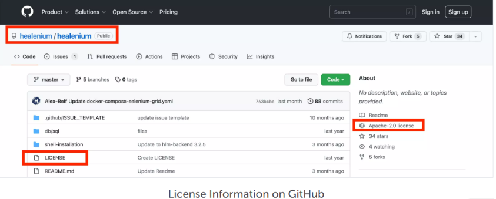

#### c. Đặc điểm chính

- **Tự do truy cập mã nguồn**: Mã nguồn phải được cung cấp công khai.
- **Quyền sửa đổi**: Người dùng có thể chỉnh sửa mã nguồn để đáp ứng nhu cầu của họ.
- **Quyền phân phối**: Cho phép chia sẻ phần mềm hoặc phiên bản sửa đổi của nó.
- **Không phân biệt đối xử**: Giấy phép không được giới hạn quyền sử dụng dựa trên đối tượng hoặc mục đích.
Định nghĩa chính thức: Theo Open Source Initiative (OSI), một giấy phép nguồn mở phải đáp ứng 10 tiêu chí của Định nghĩa Nguồn Mở (Open Source Definition), bao gồm:

- Phân phối tự do.
- Cung cấp mã nguồn.
- Cho phép sửa đổi và tạo ra sản phẩm phái sinh.
- Không hạn chế phân phối mã nguồn sửa đổi.
- Không phân biệt đối xử với cá nhân hoặc nhóm.
- Không phân biệt lĩnh vực sử dụng.
- Quyền được cấp tự động khi phân phối.
- Không giới hạn ở một sản phẩm cụ thể.
- Không hạn chế các phần mềm khác.
- Giấy phép phải trung lập về công nghệ.

#### d. Yêu cầu chung khi sử dụng giấy phép nguồn mở

- **Ghi công tác giả (Attribution)**: Yêu cầu giữ lại thông báo bản quyền (copyright notice), điều khoản từ chối trách nhiệm(disclaimer), và thông tin giấy phép trong mã nguồn hoặc tài liệu đi kèm.
- **Cung cấp mã nguồn (nếu yêu cầu)**: Một số giấy phép, đặc biệt là giấy phép copyleft (như GPL), yêu cầu công khai mãi nguồn của phần mềm hoặc các sản phẩm phái sinh khi phân phối.
- **Tôn trọng điều khoản phân phối**: Với các giấy phép như GPL, AGPL, hoặc MPL, các sản phẩm phái sinh phải được phân phối dưới cùng giấy phép. Với các giấy phép như MIT, Apache, hoặc BSD, bạn có thể phân phối mã nguồn hoặc sản phẩm phái sinh dưới bất kỳ giấy phép nào, miễn là giữ lại thông báo bản quyền.
- **Không sửa đổi giấy phép**: Không được xóa hoặc thay đổi điều khoản giấy phép trong mã nguồn.
- **Tôn trọng quyền sáng chế**: Một số giấy phép (như Apache License 2.0) bao gồm điều khoản cấp quyền sáng chế (patent grant), nghĩa là bạn được cấp quyền sử dụng các sáng chế liên quan đến phần mềm. Bạn cần tuân thủ và không được vi phạm các quyền này.

#### e. Tại sao giấy phép nguồn mở quan trọng

- **Thúc đẩy hợp tác**: Cho phép cộng đồng phát triển phần mềm cùng nhau.
- **Tăng cường bảo mật**: Mã nguồn công khai giúp cộng đồng phát hiện và sửa lỗi nhanh chóng.
- **Tiết kiệm chi phí**: Người dùng có thể sử dụng phần mềm miễn phí hoặc với chi phí thấp.
- **Khuyến khích đổi mới**: Việc chia sẻ mã nguồn thúc đẩy sự đổi mới và phát triển nhanh chóng của phần mềm.
- **Tính minh bạch**: Mã nguồn mở giúp người dùng kiểm tra được cách phần mềm hoạt động, tránh các rủi ro như mã độc.

### 2. Các loại giấy phép mã nguồn mở

Giấy phép nguồn mở có thể chia thành hai loại chính: **Bản quyền cho dùng (Copyleft)** và **Cấp phép (Permissive)**. Sự phân chia này dựa trên các yêu cầu và hạn chế của giấy phép đối với người dùng.

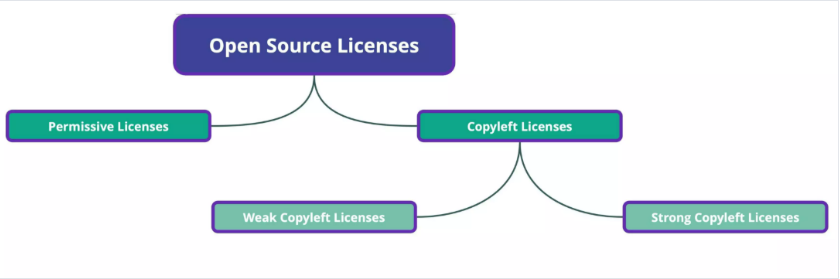

#### a. Copyleft

- **Copyright**: “quyền tác giả”, mặc định ai sáng tạo ra tác phẩm (phần mềm, sách, nhạc, hình ảnh, …) sẽ có toàn quyền kiểm soát việc sử dụng, sao chép, phân phối, chỉnh sửa. Người khác muốn dùng phải xin phép.

- **Copyleft**: Copyleft là một cách dùng copyright để trao quyền tự do: Cho phép mọi người tự do sử dụng, sửa đổi, phân phối tác phẩm. Nhưng có một điều kiện quan trọng: mọi bản chỉnh sửa hay sản phẩm phái sinh cũng phải được phát hành dưới cùng giấy phép Copyleft. Nhờ đó, tác phẩm luôn “mở” và các phiên bản sau này cũng tiếp tục mở.

**Cách hoạt động:**

- Nếu bạn sửa đổi hoặc mở rộng một phần mềm có giấy phép Copyleft, bạn phải công khai mã nguồn của phiên bản mới.
- Nếu bạn tích hợp phần mềm vào một sản phẩm lớn hơn, thì sản phẩm đó cũng phải tuân theo giấy phép Copyleft (tùy mức độ Copyleft mạnh hay yếu).

**Ví dụ về giấy phép Copyleft:**

- **GNU General Public License (GPL):** Phần mềm sửa đổi phải được công khai với cùng giấy phép.
- **GNU Lesser General Public License (LGPL):** Nhẹ hơn GPL, cho phép liên kết với phần mềm độc quyền.
- **AGPL (Affero GPL):** Bắt buộc công khai mã nguồn kể cả khi phần mềm chạy trên máy chủ.

**Các loại Copyleft**:

- **Strong copyleft**: Yêu cầu toàn bộ phần mềm phái sinh hoặc phần mềm liên kết với mã nguồn gốc phải tuân theo cùng một giấy phép. Hệ quả: bạn không thể kết hợp mã GPL với phần mềm “đóng” rồi giữ kín mã được.

- **Weak Copyleft**: Yêu cầu chỉ những phần mã được sửa đổi hoặc trực tiếp dùng lại mới phải mở. Các phần khác (ví dụ code độc lập, phần mềm thương mại liên kết) không bắt buộc phải mở.

**Ví dụ**:

- Copyright = “Đây là của tôi, muốn dùng thì phải xin phép.”
- Copyleft = “Đây là của tôi, tôi cho mọi người tự do dùng, nhưng nhớ rằng nếu bạn chỉnh sửa thì phải tiếp tục chia sẻ lại cho mọi người.”

#### b. Permissive

**Định nghĩa:**

Giấy phép Permissive không áp đặt yêu cầu khắt khe như Copyleft. Người dùng có thể sử dụng, sửa đổi và tích hợp phần mềm vào phần mềm độc quyền mà không cần công khai mã nguồn.

**Cách hoạt động:**

- Người dùng có thể sửa đổi mã nguồn mà không cần công khai thay đổi.
- Phần mềm có thể được tích hợp vào sản phẩm thương mại hoặc độc quyền.
- Chỉ yêu cầu giữ lại thông tin bản quyền khi phân phối.

**Ví dụ về giấy phép Permissive:**

- **MIT License:** Giấy phép đơn giản, chỉ yêu cầu giữ lại thông tin bản quyền.
- **Apache License 2.0:** Bổ sung điều khoản về bằng sáng chế.
- **BSD License (Berkeley Software Distribution):** Có nhiều biến thể, BSD 3-Clause và BSD 2-Clause là phổ biến nhất.

### 3. Một số giấy phép nguồn mở phổ biến

#### a. GNU General Public License (GPL)

Giấy phép GNU General Public License (GPL) là một loại giấy phép được phát hành vào năm 2007. Đây là một phiên bản sửa đổi của GPL, tuy nhiên giấy phép này thường hạn chế đối với các thư viện phần mềm. Nhưng điều này cho phép các chương trình không phải là Open source có thể truy cập hoặc liên kết tới các thư viện nguồn mở mà không phải công khai mã nguồn như giấy phép GPL.

#### b. Giấy phép Apache license 2.0

Apache License 2.0 được phát hành vào tháng 1 năm 2004 của Quỹ phần mềm Apache (Apache Software Foundation – ASF). Giấy phép này cho người dùng phần mềm nguồn mở, quyền tự do sử dụng phần mềm với bất kỳ mục đích nào, phân phối chỉnh sửa và phân sửa đổi theo các điều khoản của giấy phép mà không lo vấn đề bản quyền.

Các điều kiện của giấy phép Apache License 2.0:

- Apache License 2.0 cho phép người dùng tự do sử dụng phần mềm với bất kỳ mục đích nào, tự do phân phối, sửa đổi.
- Giấy phép không yêu cầu bản sửa đổi của phần mềm phải được phân phối dưới cùng giấy phép với bản gốc và không yêu cầu bản sửa đổi phải được phân phối dưới dạng mã nguồn mở.

#### c. Giấy phép MIT License

Giấy phép mã nguồn mở này được phát hành bởi Massachusetts Institute of Technology (MIT). Đây là một trong những giấy phép cho phép người dùng tự do nhất, nó có thể kết hợp với các mã nguồn khác và đảm bảo tương thích theo điều kiện của mọi loại giấy phép khác.

Với MIT License bạn có thể sử dụng , sao chép , sửa đổi , hợp nhất , xuất bản , phân phối và/hoặc bán các bản sao của phần mềm mà không vi phạm bản quyền. Chỉ cần tuân thủ điều kiện thông báo cho phép của phần mềm gốc sử dụng giấy phép MIT.

### d. Mozilla Public License 2.0 (MPL)

Mozilla Public License 2.0 (MPL) phát hành vào ngày 03-01-2012 bởi phần mềm tự do của Quỹ Mozilla. Giấy phép này là sự kết hợp giữa giữa giấy phép BSD có chỉnh sửa và giấy phép GNU. MPL cho phép người dùng hoạt động tự do và yêu cầu việc công bố mã nguồn của mọi thay đổi được đưa ra công chúng.

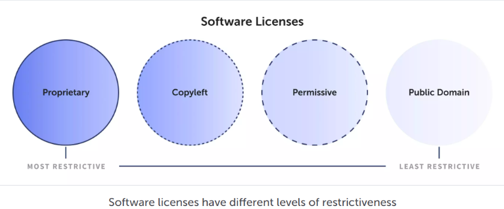
