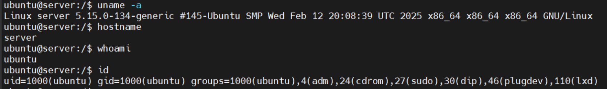
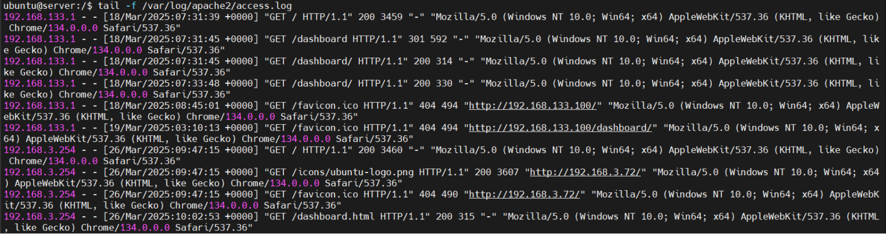
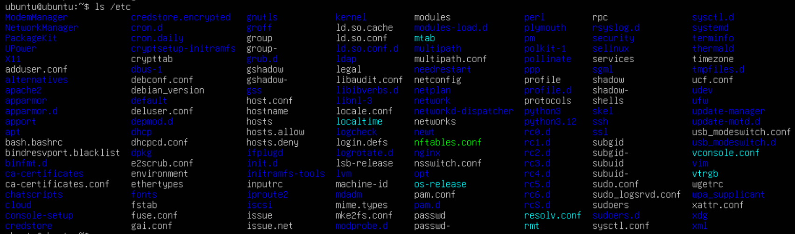
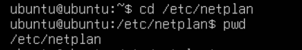
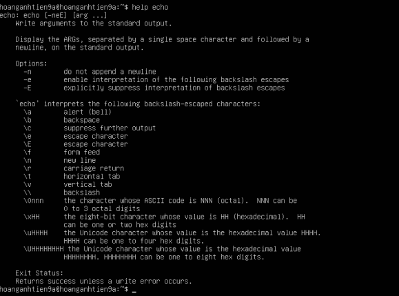
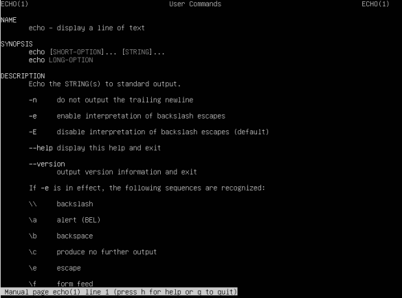

# COMMAND LINUX

## I. LINUX COMMAND LÀ GÌ ?

**Linux Command** (Lệnh Linux) là các lệnh được nhập vào Terminal (giao diện dòng lệnh - CLI) để tương tác với hệ thống Linux. Các lệnh này giúp người dùng quản lý tệp, thư mục, tiến trình, quyền truy cập, mạng, và nhiều chức năng khác của hệ điều hành.

## II. CÁC NHÓM LỆNH PHỔ BIẾN TRONG LINUX

### 1. Lệnh cơ bản trong hệ thống

| Lệnh | Chức năng| Ví dụ |
|-----------|-------------|---------|
| `uname -a` | Hiển thị thông tin hệ thống | `uname -a` |
| `hostname` | Hiển thị tên máy | `hostname` |
| `uptime` | Thời gian hệ thống đã chạy | `uptime` |
| `date` | Hiển thị ngày và giờ hiện tại | `date` |
| `cal` | Hiển thị lịch | `cal 2025` (Hiển thị lịch năm 2025) |
| `whoami` | Hiển thị tên người dùng hiện tại | `whoami` |
| `id` | Hiển thị ID người dùng và nhóm | `id` |
| `passwd` | Đổi mật khẩu người dùng | `passwd` |
| `echo` | In ra ký tự(viết sau chữ "echo") | `echo` |
| `file` | Hiển thị ra loại của file đó | `file` |
| `less` | Hiển thị nội dung của văn bản có output lớn | `less` |
| `history` | Hiển thị tất cả các lệnh đã sử dụng | `history` |
| `exit` or `logout` | dùng để thoát khỏi shell | `exit` |
Ví dụ trên command line:



### 2. Lệnh quản lý thư mục và tệp tin

| Lệnh | Chức năng| Ví dụ |
|-----------|-------------|---------|
| `ls` | Liệt kê tệp/thư mục | `ls -l` (Hiển thị danh sách chi tiết) |
| `cd` | Chuyển đổi thư mục | `cd /home/user/Documents` |
| `pwd` | Hiển thị thư mục hiện tại | `pwd` |
| `mkdir` | Tạo thư mục mới | `mkdir new_folder` |
| `rmdir` | Xóa thư mục trống | `rmdir old_folder` |
| `rm -r` | Xóa thư mục và tệp bên trong | `rm -r my_folder` |
| `touch` | Tạo tệp mới | `touch newfile.txt` |
| `cp` | Sao chép tệp hoặc thư mục | `cp document.txt /tmp/` |
| `mv` | Di chuyển hoặc đổi tên tệp/thư mục | `mv document.txt /tmp/` |
| `find` | Tìm kiếm tập tin hoặc thư mục | `find /home -name "*.txt"` |
| `locate` | Tìm kiếm tập tin nhanh | `locate example.txt` |

*ví dụ:*

Sao chép một file từ thư mục hiện tại vào thư mục `/tmp`:

- Giả sử đang ở trong thư mục `/home/user` và có một file tên là document.txt. Lệnh sau sẽ sao chép file này vào thư mục /tmp:

  ```plaintext
  cp document.txt /tmp/
  ```

Sao chép một file vào một thư mục khác và đổi tên file:

- Vẫn với file `document.txt` trong `/home/user/`, lệnh sau sẽ sao chép nó vào thư mục `/var/tmp` và đổi tên thành `backup.txt`:

  ```plaintext
  cp document.txt /var/tmp/backup.txt
  ```

Sao chép nhiều file vào một thư mục:

- Giả sử bạn có các file `image1.jpg` và `image2.png` trong thư mục hiện tại (`/home/user`). Lệnh sau sẽ sao chép cả hai file này vào thư mục `/opt`:

  ```plaintext
  cp image1.jpg image2.png /opt/
  ```

Sao chép một thư mục (bao gồm cả nội dung bên trong) vào một thư mục khác:

- Giả sử bạn có một thư mục tên là project trong `/home/user/` và bạn muốn sao chép nó (cùng với tất cả các file và thư mục bên trong) vào `/srv`. Bạn cần sử dụng tùy chọn `-r` (hoặc `-R`) để sao chép đệ quy (recursive):

  ```plaintext
  cp -r /home/user/project /srv/
  ```

### 3. Lệnh xem nội dung tập tin

| Lệnh | Chức năng| Ví dụ |
|-----------|-------------|---------|
| `cat` | Hiển thị nội dung tệp | `cat /etc/os-release` |
| `tac` | Hiển thị nội dung tệp theo thứ tự ngược | `tac file.txt` |
| `less` | Xem nội dung tệp theo trang | `less /var/log/syslog` |
| `more` | Xem nội dung tệp (giống less nhưng ít tính năng hơn) | `more file.txt` |
| `head` | Hiển thị 10 dòng đầu tiên của tệp | `head -n 5 file.txt` |
| `tail` | Hiển thị 10 dòng cuối cùng của tệp | `tail -n 5 file.txt` |
| `nano` | Mở trình soạn thảo văn bản Nano | `nano file.txt` |
| `vim` | Mở trình soạn thảo văn bản Vim | `vim file.txt` |
| `grep` | Tìm kiếm chuỗi trong tệp | `grep "error" /var/log/syslog` |

*Ví dụ:* xem nội dung 10 dòng cuối của file `access.log`



### 4. Lệnh quản lý tiến trình

| Lệnh | Chức năng| Ví dụ |
|-----------|-------------|---------|
| `ps aux` | Hiển thị danh sách tiến trình đang chạy | `ps aux` |
| `top` | Hiển thị tiến trình theo thời gian thực | `top` |
| `htop` | Công cụ thay thế `top` dễ đọc hơn | `htop` |
| `kill` | Dừng tiến trình theo PID | `kill -9 1234` |
| `pkill` | Dừng tiến trình theo tên | `pkill firefox` |
| `jobs` | Hiển thị tiến trình chạy nền | `jobs` |
| `bg` | Tiếp tục chạy tiến trình ở chế độ nền | `bg %1` |
| `fg` | Đưa tiến trình chạy nền ra foreground | `fg %1` |

### 5. Lệnh quản lý người dùng và quyền

| Lệnh | Chức năng| Ví dụ |
|-----------|-------------|---------|
| `who` | Xem danh sách người dùng đang đăng nhập | `who` |
| `adduser` | Tạo người dùng mới | `sudo adduser new_user` |
| `deluser` | Xóa người dùng | `sudo deluser old_user` |
| `passwd` | Thay đổi mật khẩu người dùng | `passwd user1` |
| `chmod` | Thay đổi quyền tệp/thư mục | `chmod 755 script.sh` |
| `chown` | Thay đổi chủ sở hữu tệp/thư mục | `chown user1 file.txt` |
| `chgrp` | Thay đổi nhóm của tệp/thư mục | `chgrp group1 file.txt` |

### 6. Lệnh quản lý phần mềm

| Lệnh | Chức năng| Ví dụ |
|-----------|-------------|---------|
| `apt install` | Cài đặt phần mềm trên Ubuntu/Debian | `sudo apt install vim` |
| `yum install` | Cài đặt phần mềm trên CentOS/RHEL | `sudo yum install nano` |
| `dnf install` | Cài đặt phần mềm trên Fedora | `sudo dnf install tree` |
| `pacman -S` | Cài đặt phần mềm trên Arch Linux | `sudo pacman -S htop` |
| `snap install` | Cài đặt ứng dụng từ Snap | `sudo snap install vlc` |
| `flatpak install` | Cài đặt ứng dụng từ Flatpak | `flatpak install flathub org.gimp.GIMP` |

### 7. Lệnh quản lý mạng

| Lệnh | Chức năng| Ví dụ |
|-----------|-------------|---------|
| `ifconfig` | Hiển thị thông tin mạng | `ifconfig` |
| `ip a` | Hiển thị địa chỉ IP | `ip a` |
| `ping` | Kiểm tra kết nối đến máy chủ | `ping google.com` |
| `netstat -tulnp` hoặc `ss -tulnp` | Hiển thị cổng mạng đang mở | `ss -tulnp` |
| `curl` | Lấy dữ liệu từ URL | `curl https://example.com` |
| `wget` | Tải tệp từ URL | `wget https://example.com/file.zip` |
| `scp` | Sao chép tệp qua SSH | `scp file.txt user@remote:/home/user/` |
| `rsync` | Đồng bộ tệp giữa hai máy | `rsync -avz /source/ user@remote:/destination/` |

## III. THỰC HIỆN MỘT SỐ THAO TÁC LỆNH CƠ BẢN

### 1. `ls` - liệt kê danh sách tệp và thư mục

Cách dùng cơ bản:

```plaintext
ls /home
```

-> Hiển thị danh sách các tệp, thư mục trong folder home.

Một số tùy chọn hữu ích:

- `ls -l`: Hiển thị danh sách chi tiết (quyền, chủ sở hữu, kích thước, ngày sửa đổi).
- `ls -a`: Hiển thị tất cả tệp, kể cả tệp ẩn (bắt đầu bằng .).
- `ls -lh`: Hiển thị kích thước tệp ở dạng dễ đọc (K, M, G thay vì byte).
- `ls -lt`: Sắp xếp theo thời gian chỉnh sửa gần nhất.

ví dụ:



### 2. `cd` - di chuyển giữa các mục

Cách dùng cơ bản:

```plaintext
cd /đường/dẫn/thư/mục
```

Các thao tác thường dùng:

- `cd ~` hoặc `cd`: Trở về thư mục home của người dùng.
- `cd ..`: Quay lại thư mục cha.
- `cd -`: Quay lại thư mục trước đó.

### 3. `pwd` - Hiển thị thư mục hiện tại (đường dẫn đầy đủ)

Cách dùng cơ bản:

```plaintext
pwd
```

ví dụ:



- Sử dụng `cd` để di chuyển vào thư mục /etc/netplan.
- Sử dụng `pwd` để biết thư mục hiện tại đang đứng gồm có đường dẫn đầy đủ.

### 4. `mkdir` - Tạo thư mục mới

Cách dùng cơ bản:

```plaintext
mkdir tên_thư_mục
```

Tùy chọn hưu ích:

- `mkdir -p /đường/dẫn/con`: Tạo cả thư mục cha nếu chưa tồn tại.

Ví dụ:

```plaintext
sudo mkdir -p /var/www/html/site.com
```

- Trong folder `/www` không có folder `/html`, mục đích câu lệnh trên nhằm tạo folder `/html` và có folder con `/site.com` nằm bên trong.

### 5.`pushd` - Lưu thư mục vô stack, chuyển đến thư mục khác

Đây là lệnh để làm việc với stack của các thư mục. Được sử dụng để đưa một thư mục vào stack diẻctory và di chuyển đến một thư mục khác.

### 6. `popd` - Xoá thư mục đầu trong stack directory và di chuyển dến thư mục đó

Được sử dụng để xóa thư mục đầu tiên trong stack và di chuyển đến thư mục đó.

## IV. MẸO

Ta có 3 lệnh thần kì giúp cho việc nhớ các lệnh trở nên dễ dàng hơn

### 1. `help` - Kiểm tra các tùy chọn (flags) khả dụng cho lệnh đó

- Lệnh help dùng để tìm hiểu cách sử dụng một lệnh hoặc kiểm tra các tùy chọn (flags) khả dụng cho lệnh đó:



### 2. `man` - Cung cấp cách sử dụng và một số ký tự phụ trợ đi kèm

- Lệnh man hiển thị ra một manual page cho một lệnh ở dạng less, cung cấp cách sử dụng và một số ký tự phụ trợ đi kèm:



### 3. `whatis` - Cung cấp description về một lệnh

- Lệnh whatis cung cấp description về một lệnh bất kỳ:


### 4. Phím `Tab`

- Bấm phím `Tab` trên màn hình nó sẽ hiện ra các trường chữ còn thiếu trong câu lệnh nhưng không có mô tả.
