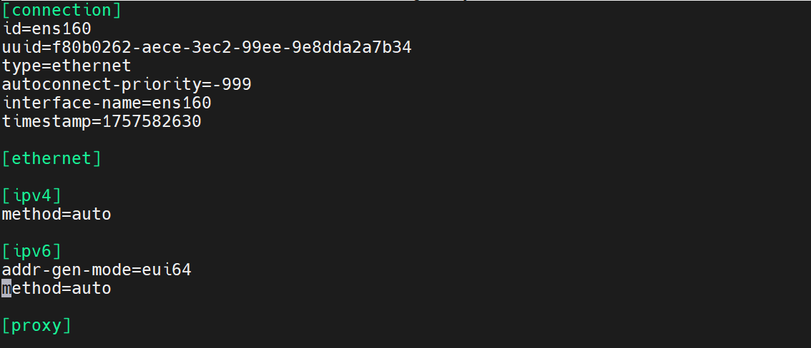
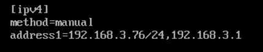
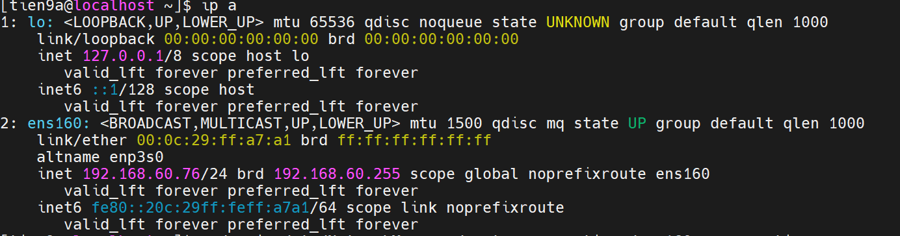
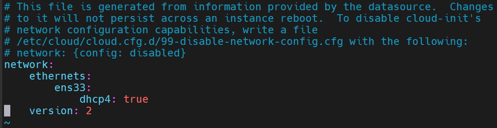

# CÀI ĐẶT IP TĨNH TRÊN LINUX

## I. TRÊN CENTOS 9

Để đặt IP tĩnh trên CentOS, ta có thể áp dụng theo 2 cách:

### 1. `Cách 1`

-Vào chế độ Root bằng câu lệnh:

```su -```

-Cài nano để có thể truy cập file cấu hình mạng:

```yum install nano -y```

Mở file cấu hình mạng (ens160):

```ruby
 nano /etc/NetworkManager/system-connections/ens160.nmconnection
```

Kết quả:



-Ấn để chỉnh sửa nội dung, chỉnh sửa nội dung trong [ipv4] thành:



- `method=manual`: Chỉ định địa chỉ IP tĩnh.
- `address1= 192.168.3.76/24,192.168.3.1`:
  - `192.168.3.76/24` địa chỉ IP và subnet mask.
  - `192.168.3.1` gateway

-Sau khi chỉnh sửa xong, `Ctrl + O` => Enter => `Ctrl + X` để lưu cấu hình.

-Sau khi thực hiện thay đổi, cần restart NetWorkManager để áp dụng thay đổi:

```ruby
systemctl restart NetworkManager
```

-Sau khi cấu hình xong kiểm tra IP tĩnh cài chưa ta đánh:

```ip addr show```



### 2. `Cách 2`: Dùng nmcli (NetworkManager CLI)

-Nếu không muốn chỉnh sửa file thủ công, dùng các lệnh sau:

```ruby
sudo nmcli connection modify ens33 ipv4.address 192.168.3.76/24

sudo nmcli connection modify ens33 ipv4.gateway 192.168.3.1

sudo nmcli connection modify ens33 ipv4.method manual

sudo nmcli connection up ens33
```

- `sudo nmcli connection modify ens33 ipv4.address 192.168.3.76/24`: đặt IP tĩnh.
- `sudo nmcli connection modify ens33 ipv4.gateway 192.168.3.1`: Đặt gateway.
- `sudo nmcli connection modify ens33 ipv4.method manual`: chuyển sang chế độ IP tĩnh.
- `nmcli connection up ens33`: Áp dụng thay đổi.

*lưu ý:*

- IP phải nằm trong cùng dải mạng với máy thật. Dải mạng ở đây là `192.168.60.x`.
- Không trùng với IP của máy khác.
- subnet mask phải khớp và gateway phải đúng.

## Trên Ubuntu 24.04

-Mở file cấu hình `netplan` (thường nằm trong `/etc/netplan/`):

```ruby
sudo vim /etc/netplan/50-cloud-init.yaml
```

-Kết quả:



-Ấn `i` để chỉnh sửa nội dung, chỉnh sửa nội dung trong [ipv4] thành:

- `ens33`: Tên card mạng.
- `dhcl3: no`: tắt DHCP để dùng IP tĩnh.
- `addresses: - 192.168.60.77/24` địa chỉ IP và subnet mask.
- `gateway4: 192.168.60.2` gateway vì máy thật là `.1` rồi

-Chỉnh sửa xong, ấn `Esc` để thoát khỏi chế độ `Insert`. Tiếp đó nhập `:wq` và `Enter` để lưu cấu hình.

-Sau khi thực hiện thay đổi, cần restart để áp dụng thay đổi:

```ruby
sudo netplan apply
```

-Sau đó, `ip a` để check xem đúng IP chưa.

-Sau đó check xem đã kết nối qua địa chỉ mạng `192.168.60.77` ra môi trường bên ngoài chưa bằng câu lệnh:`ping 8.8.8.8 -c 4` - ping 4 hop
